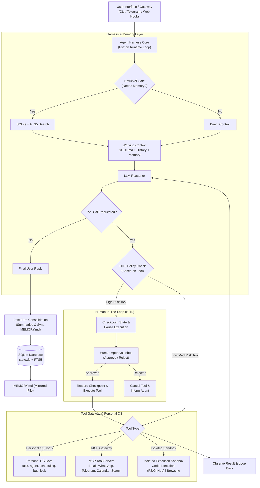

# Production Blueprint: 24x7 Personal AI Assistant (Backend Core & Agent Harness)

Status: Active Production Blueprint (Targeted Core Architecture).
Source Alignment & Insights: 
- `waku-agent` architecture (Lightweight harness, SQLite + FTS5 memory, MEMORY.md mirror, retrieval gate, post-turn consolidation).
- Deferred Scope: Frontend UI, Redis caching layer, and complex LLMOps platforms (LangSmith, OpenTelemetry) will be implemented in future stages.

---

## 1. Executive Direction & System Philosophy

The 24x7 Personal AI Assistant is built as a local-first, inspectable, and resilient agent harness running continuously on the host system. Rather than relying on heavyweight external vector databases or framework black-boxes, the core engine relies on standard **SQLite + FTS5** full-text search, raw Python loop orchestration, durable state checkpointing, and governed Tool Gateways.

### Core Principles
1. **Tool-Driven Risk Governance**: Risk levels are strictly determined by the *tools* invoked (e.g. sending email, bank transfers, database deletions), never by subjective LLM self-assessments.
2. **Transparent Memory Model**: Facts are stored in a queryable SQLite database (`state.db`) and auto-synced into a human-readable `MEMORY.md` file after consolidation.
3. **Selective Memory Retrieval (Retrieval Gate)**: A lightweight gate evaluates incoming user turns to determine if long-term memory retrieval is necessary, avoiding latency and context pollution on trivial queries.
4. **Isolated & Governed Action**: Heavy or untrusted operations (remote code execution, web browsing) run strictly inside isolated sandboxes (MCP / 3rd party execution environments).
5. **Durable State & Checkpointing**: Long-running tasks, multi-step sub-agent execution, and Human-In-The-Loop (HITL) pause points are backed by serialized checkpoints to survive crashes and restarts.

---

## 2. System Architecture Overview



---

## 3. Database & Memory Architecture

The storage and memory system is consolidated into a single SQLite database (`state.db`) featuring `fts5` full-text search tables.

```
.agent/
├── state.db          # Primary SQLite database (episodes, facts, tasks, checkpoints, skills)
├── SOUL.md           # System prompt, core identity, guidelines
├── MEMORY.md         # Auto-generated semantic memory mirror (human-readable)
└── SKILL.md          # Procedural memory catalog & executable skill procedures
```

### 3.1 System Prompt (`SOUL.md`)
- Serves as the master system prompt defining assistant persona, operational principles, tool usage guidelines, and default safety rules.
- Loaded directly into the LLM context window on every turn.

### 3.2 Short-Term Memory (Current Chat History / Thread)
- **Working Thread**: Maintains recent conversation messages.
- **Trimming & Summarization**: When context window threshold is reached (e.g. 80% token capacity), the harness automatically summarizes older turns into an episodic summary block while retaining key instructions and system prompt.

### 3.3 Long-Term Memory
#### 3.3.1 Episodic Memory: RAG + SQL (`sqlite + fts5`)
- Stores timestamped history of user messages, assistant responses, tool calls, and execution outcomes.
- Indexed via SQLite `fts5` full-text search tables for fast keyword retrieval over historical episodes without needing external vector databases.
- Schema table: `episodes(id, session_id, timestamp, content, tool_calls, outcome)`.

#### 3.3.2 Semantic Memory: Keyword Top-K (`MEMORY.md`)
- Stores stable facts, preferences, user profile details, and recurring facts.
- Indexed via SQLite `facts` table with `fts5` full-text search for top-k keyword matching.
- **Bi-directional Mirroring**: After post-turn consolidation, the contents of the `facts` table are auto-rendered and saved to `.agent/MEMORY.md`. The user or agent can open and read `MEMORY.md` at any time.

#### 3.3.3 Procedural Memory (`SKILL.md`)
- Catalogs repeatable multi-step workflows, agent skills, custom instructions, and domain scripts.
- Schema table: `skills(name, description, trigger_keywords, execution_steps)`.
- Auto-synced with `.agent/SKILL.md`.

### 3.4 Retrieval Gate & Consolidation
- **Retrieval Gate**: Lightweight classifier/heuristic run before RAG retrieval. If a query is pure math, coding, or trivial greeting, retrieval is skipped to maximize speed.
- **Post-Turn Consolidation**: After a conversation turn ends, an async background task analyzes the interaction, extracts new semantic facts into `facts`, logs the episode in `episodes`, and syncs `MEMORY.md`.

---

## 4. Agent Orchestration (`spawn_agent()`)

The engine supports multi-agent coordination where a primary agent harness can delegate complex or parallel workloads to specialized sub-agents.

- **`spawn_agent()` Tool**: Instantiates a new isolated sub-agent runtime with its own state thread, system prompt instructions, and restricted tool permissions.
- **Agent Lifecycle Operations**: Sub-agents can be managed directly via Personal OS tools (`terminate_agent()`, `pause_agent()`, `resume_agent()`, `get_agent_status()`).
- **Parent-Child Event Bus**: Parent and child agents communicate asynchronously using internal event subscriptions (`publish_event()`, `subscribe_event()`).

---

## 5. MCP Tool Gateway & Sandbox Environments

External interactions and external integrations are managed through an MCP (Model Context Protocol) gateway server.

### 5.1 Communication MCP
- **Email Server**: Send email (High Risk - HITL required), draft email, read inbox, search messages (SMTP/IMAP/Gmail API).
- **WhatsApp Server**: Send WhatsApp message, read incoming messages via gateway.
- **Telegram Server**: Telegram bot messaging, polling/webhook reception, channel updates.

### 5.2 Calendar MCP
- **Scheduling**: Inspect calendar availability, create/update/cancel events, invite attendees (iCal/Google Calendar API).

### 5.3 Search MCP
- **Web Search APIs**: Execute live web queries via web search providers (e.g. Tavily, DuckDuckGo API) returning structured results with citations.

### 5.4 Isolated Execution Environments (Sandboxes)
Heavy code execution and web browsing run inside third-party isolated sandboxes (e.g., containerized sandbox, E2B microVM, or isolated Playwright containers).

#### 5.4.1 Remote Code Execution Sandbox
- Sandboxed environment with host filesystem isolation and GitHub access.
- Executes Python/Bash code safely without host exposure.
- Allows reading/writing workspace files, managing git repositories, and generating downloadable artifacts.

#### 5.4.2 Web Browsing Sandbox
- Isolated Playwright/Chromium headless browser environment.
- Navigates web pages, renders DOM, extracts sanitized text/Markdown, and takes screenshots.
- Blocks raw HTML injection into LLM context and prevents malicious script execution on host.

---

## 6. Personal OS Tools (Native / Non-MCP Core)

The assistant features 22 native Personal OS system tools exposed directly to the agent harness logic:

| Tool | Category | Purpose | Risk Classification |
| --- | --- | --- | --- |
| `create_task()` | Task Mgmt | Create an internal task entry in SQLite | Low |
| `update_task()` | Task Mgmt | Update task progress, status, or notes | Low |
| `cancel_task()` | Task Mgmt | Cancel a pending or running internal task | Medium |
| `list_tasks()` | Task Mgmt | View pending, active, or completed tasks | Low |
| `spawn_agent()` | Orchestration | Launch a child sub-agent with specialized prompt/tools | Medium |
| `terminate_agent()` | Orchestration | Force stop a running sub-agent | Medium |
| `pause_agent()` | Orchestration | Pause execution of a sub-agent thread | Low |
| `resume_agent()` | Orchestration | Resume execution of a paused sub-agent | Low |
| `get_agent_status()` | Orchestration | Check current state, memory, and status of sub-agents | Low |
| `schedule_job()` | Scheduling | Execute a function or workflow later (cron / timer) | Medium |
| `cancel_job()` | Scheduling | Remove a scheduled background job | Low |
| `heartbeat()` | Health | Ping/verify the assistant core harness is responsive | Low |
| `lock_resource()` | Concurrency | Acquire a mutex lock on a shared resource/file | Low |
| `unlock_resource()` | Concurrency | Release a mutex lock on a shared resource/file | Low |
| `publish_event()` | Event Bus | Emit an asynchronous event to the internal bus | Low |
| `subscribe_event()`| Event Bus | Register a handler for specific event topics | Low |
| `acquire_context()` | Memory Context | Load specific context/memories into working memory | Low |
| `release_context()` | Memory Context | Free working memory context blocks | Low |
| `checkpoint()` | Persistence | Save full execution state & memory snapshot to SQLite | Low |
| `restore_checkpoint()`| Persistence | Restore and resume execution state after crash/restart | Low |
| `sleep()` | Runtime Control| Idle harness execution until time elapses or event fires | Low |
| `wake()` | Runtime Control| Immediately wake an idled or sleeping agent harness | Low |

---

## 7. Human-In-The-Loop (HITL) & Tool-Based Risk Classification

Safety is governed by deterministic tool classification. **Risk level is determined by the tool invoked and its payload parameters—NEVER by LLM output.**

### 7.1 Risk Level Classification

| Risk Level | Policy | Triggers / Actions |
| --- | --- | --- |
| **Low** | Auto-execute | Read-only operations (`list_tasks`, `get_agent_status`, `acquire_context`, web search, reading notes). |
| **Medium** | Auto-execute + Audit Log | Internal tasks, scheduling jobs, reading emails/calendars, spawning sub-agents. |
| **High** | **REQUIRES EXPLICIT HUMAN APPROVAL** | Any operation with irreversible external side-effects or sensitive data mutation. |

### 7.2 High Risk Tool Registry (Mandatory HITL Pause)
The following tool invocations **MUST** trigger a Human-In-The-Loop pause and require explicit user approval before execution:

1. **Bank Transfer / Spend Money**: Any financial transaction, payment API call, or paid service checkout.
2. **Production Deployment**: Triggering release builds, pushing code to production targets, or running deployment scripts.
3. **Delete Database**: Dropping SQLite tables, purging database state, or clearing historical stores.
4. **Send Email / External Messages**: Sending outbound emails, WhatsApp, or Telegram messages to external recipients.
5. **Delete Files**: Permanent file deletion or directory destruction on remote sandbox or local filesystem.
6. **GitHub Merge**: Merging pull requests or pushing directly to `main`/`master` branches on GitHub.

### 7.3 HITL Execution Workflow
1. **Tool Decision**: Agent selects a tool (e.g. `email_send` or `delete_database`).
2. **Policy Evaluation**: The harness identifies the tool as **High Risk**.
3. **Graph Interrupt & Checkpoint**: The harness calls `checkpoint()`, saves execution state to SQLite table `checkpoints`, and pauses execution.
4. **Approval Request**: An approval payload (tool name, parameters, human-readable diff, risk justification) is emitted to the user.
5. **User Decision**:
   - **Approve**: Harness calls `restore_checkpoint()`, executes the tool, and continues the loop.
   - **Reject**: Tool execution is aborted, and a cancellation response is fed back to the LLM.

---

## 8. Development & Implementation Roadmap

```
Stage 1: Core Harness & DB (SQLite + FTS5)  [CURRENT TARGET]
Stage 2: Tool Gateway, Personal OS & HITL   [CURRENT TARGET]
Stage 3: Frontend UI, LLMOps & Redis Cache   [FUTURE STAGES - DEFERRED]
```

### Stage 1: Core Harness & SQLite Memory Engine
- Set up SQLite database (`state.db`) with `fts5` tables for `episodes` and `facts`.
- Create default system files: `SOUL.md`, `MEMORY.md`, and `SKILL.md`.
- Implement Short-Term Memory context manager (Trimming & Summarization).
- Implement Retrieval Gate & Top-K FTS5 keyword retrieval.
- Implement Post-Turn Consolidation & `MEMORY.md` sync background worker.

### Stage 2: Personal OS Tools, MCP Gateway & HITL Policy
- Implement 22 Personal OS tools (`task`, `agent`, `scheduling`, `lock`, `event`, `checkpoint`, `context`).
- Build MCP Tool Gateway for Email, WhatsApp, Telegram, Calendar, and Web Search.
- Build Sandboxed Execution Environment connectors for Remote Code Execution & Web Browsing.
- Implement Tool-Based HITL Policy Checker with state checkpointing & approval inbox handler.
- Verify end-to-end multi-step agent loop (`reason -> tool check -> HITL gate -> execute -> observe -> reply`).
