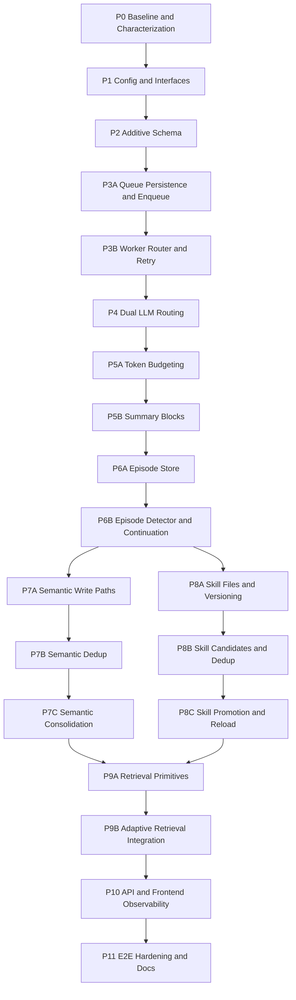

# Phase X Memory Architecture Implementation Roadmap

This roadmap is the finalized migration plan for moving ASTRA from the current memory scaffold to the approved Dual-LLM Memory Architecture described in `verify&implement.md`.

The plan is based on:

- The approved architecture specification.
- The Architecture Gap Analysis.
- The Migration Blueprint.

No implementation code is included in this document.

---

## 1. Executive Summary

The existing codebase has a strong application shell: FastAPI, LangGraph, provider factories, HITL approval support, SQLite migrations, Personal OS tools, MCP gateway tools, and a React cockpit. Those pieces should be preserved and evolved.

The current memory system is not yet architecturally compliant. It has memory tables and helper functions, but memory processing is still synchronous, secondary model routing is incomplete, short-term memory uses message-count chunking, episodic memory is logged too often, semantic memory lacks mandatory deduplication, procedural memory is a single mutable catalog, and retrieval is keyword-driven rather than adaptive.

The migration should therefore keep the assistant shell and tool ecosystem, but replace or heavily refactor the memory internals behind stable interfaces. The roadmap is split into small, reviewable phases. Earlier phases add contracts, config, schema, and queueing. Later phases migrate each memory type and finally integrate adaptive retrieval, API visibility, frontend support, and end-to-end hardening.

---

## 2. Roadmap Review Findings

The earlier roadmap was directionally correct, but several phases were too large for practical review:

- Background queue work should be split into queue persistence/enqueue APIs and worker execution/retry semantics.
- Short-term memory should be split into token budgeting and immutable summary block integration.
- Episodic memory should be split into structured storage and trigger/continuation behavior.
- Semantic memory should be split into write-path correction, deduplication, and consolidation.
- Procedural memory should be split into versioned skill files, candidates/deduplication, and promotion/approval/reload.
- Retrieval should be split into retrieval primitives and graph-level adaptive context assembly.

This finalized roadmap applies those splits. Each phase has an independently testable outcome and avoids intentionally introducing temporary behavior that violates the approved architecture.

---

## 3. Overall Migration Strategy

1. Preserve stable outer surfaces first: API request shape, LangGraph entry points, DB migration mechanism, HITL engine, and tool registries.
2. Add shared abstractions before changing behavior: typed config, memory interfaces, schemas, and durable job contracts.
3. Move all memory processing out of the user-response path before increasing memory sophistication.
4. Migrate one memory subsystem at a time behind explicit service boundaries.
5. Keep compatibility reads for existing `episodes`, `facts`, `skills`, `MEMORY.md`, and `SKILL.md` until replacement stores are populated and tested.
6. Use additive schema migrations first; perform removal or deprecation only after replacement behavior is complete.
7. Prefer deterministic logic for triggers, promotion, routing, and retrieval gates. Use the secondary LLM only where the architecture explicitly requires it.
8. Treat tests as part of each phase, not a final cleanup step.

---

## 4. Dependency Graph

---

## 5. Phase-by-Phase Implementation Plan

### Phase 0: Baseline and Characterization

Objective:

- Establish a reliable baseline before memory internals change.
- Capture current behavior and mark target-architecture expectations that currently fail.

Components/modules affected:

- Test suite.
- Documentation only.

Existing files to KEEP:

- All runtime modules.

Existing files to REFACTOR:

- Existing memory-related tests may be reorganized or renamed for clarity.

Existing files to REPLACE:

- None.

Existing files to REMOVE:

- None.

New files/modules to create:

- `tests/phase_x/test_architecture_contracts.py`
- `tests/phase_x/test_current_memory_characterization.py`

Public interfaces or APIs affected:

- None.

Database/schema changes:

- None.

Dependencies on previous phases:

- None.

Verification criteria:

- Existing tests pass.
- New characterization tests document current behavior.
- Target architecture tests are either passing where already supported or marked with a clear expected-failure reason.

Unit/integration tests to add:

- Chat response still works with memory disabled or secondary unavailable.
- Current inline memory processing is characterized.
- Current secondary provider propagation gap is characterized.
- Current direct semantic writes are characterized.

Risks and migration considerations:

- Avoid turning known architecture gaps into permanent acceptance tests.
- Keep expected failures explicitly tied to later phase names.

Estimated complexity:

- Low.

---

### Phase 1: Typed Configuration and Memory Interfaces

Objective:

- Create stable configuration and service contracts for all memory subsystems.
- Remove the need for memory modules to rely on scattered hardcoded thresholds.

Components/modules affected:

- `src/config.py`
- `src/harness/state.py`
- `src/harness/models.py`
- `src/memory/__init__.py`

Existing files to KEEP:

- `src/harness/models.py` provider catalog structure.

Existing files to REFACTOR:

- `src/config.py`
- `src/harness/state.py`
- `src/harness/models.py`
- `src/memory/__init__.py`

Existing files to REPLACE:

- None in this phase.

Existing files to REMOVE:

- None.

New files/modules to create:

- `src/memory/config.py`
- `src/memory/interfaces.py`
- `src/memory/types.py`

Public interfaces or APIs affected:

- `/api/models` may expose richer model and memory defaults.
- `/api/chat` request shape remains backward compatible.

Database/schema changes:

- None.

Dependencies on previous phases:

- Phase 0.

Verification criteria:

- All spec-required defaults are represented in typed config.
- Configuration includes primary LLM, secondary LLM, budget percentages, trigger thresholds, queue settings, retry settings, consolidation frequencies, promotion thresholds, and metrics toggles.
- Existing code can still load defaults when no environment overrides are provided.

Unit/integration tests to add:

- Default config values match approved architecture.
- Environment override parsing.
- Invalid numeric thresholds fail clearly.
- Model role config can represent different primary and secondary providers.

Risks and migration considerations:

- Avoid wiring every config value immediately. This phase is about contracts and defaults.
- Keep config source extensible for future YAML, JSON, and database-backed values.

Estimated complexity:

- Medium.

---

### Phase 2: Additive Database Schema Foundations

Objective:

- Add target architecture tables and indexes without switching production behavior yet.
- Preserve current data and compatibility reads.

Components/modules affected:

- `src/db.py`
- `src/db_migrations.py`
- `src/api/server.py` data inspector allow-list.

Existing files to KEEP:

- Existing table creation pattern.
- Existing `get_connection` entry point.

Existing files to REFACTOR:

- `src/db.py`
- `src/db_migrations.py`
- `src/api/server.py`

Existing files to REPLACE:

- None in this phase.

Existing files to REMOVE:

- None.

New files/modules to create:

- Optional: `src/memory/schema.py`

Public interfaces or APIs affected:

- `/api/data/tables` includes new memory architecture tables.

Database/schema changes:

- Add `memory_jobs`.
- Add `dead_letter_jobs`.
- Add `worker_heartbeats`.
- Add `summary_blocks`.
- Add structured `episodes_v2` or equivalent normalized episode table.
- Add `pending_facts_v2` or enriched candidate columns.
- Add semantic embedding storage.
- Add semantic deduplication audit table.
- Add consolidation run table.
- Add `skill_candidates`.
- Add `skill_versions`.
- Add `skill_usage_stats`.
- Add approval linkage for generated procedural skills.

Dependencies on previous phases:

- Phase 1.

Verification criteria:

- Migration from empty DB succeeds.
- Migration from existing DB succeeds.
- Re-running migrations is idempotent.
- Existing API and tests continue to operate against legacy tables.

Unit/integration tests to add:

- Schema version increments.
- All new tables and indexes exist.
- Existing rows in `episodes`, `facts`, `skills`, and `raw_turns` remain readable.
- Migration rerun does not duplicate schema records.

Risks and migration considerations:

- SQLite FTS virtual tables are awkward to alter. Prefer additive tables over destructive changes.
- Do not delete legacy tables in this phase.

Estimated complexity:

- Medium.

---

### Phase 3A: Memory Queue Persistence and Enqueue API

Objective:

- Introduce a durable memory job queue and enqueue-only API.
- Keep execution disabled or manually invoked until worker semantics are implemented in Phase 3B.

Components/modules affected:

- `src/harness/graph.py`
- `src/memory/async_workers.py`
- `src/background_worker.py`
- `src/db.py`

Existing files to KEEP:

- `src/background_worker.py` scheduled job polling logic.

Existing files to REFACTOR:

- `src/harness/graph.py`
- `src/background_worker.py`

Existing files to REPLACE:

- `src/memory/async_workers.py` begins replacement by queue-backed services.

Existing files to REMOVE:

- None yet.

New files/modules to create:

- `src/memory/jobs.py`
- `src/memory/job_repository.py`

Public interfaces or APIs affected:

- Optional internal debug endpoint for queue depth.
- Chat API behavior should remain user-compatible.

Database/schema changes:

- Use `memory_jobs` fields such as `id`, `job_type`, `payload_json`, `status`, `idempotency_key`, `attempt_count`, `available_at`, `created_at`, `updated_at`.

Dependencies on previous phases:

- Phase 2.

Verification criteria:

- Conversation flow enqueues memory jobs instead of executing memory LLM calls inline.
- Enqueue operation is fast and does not call secondary LLM.
- Duplicate idempotency keys do not enqueue duplicate jobs.

Unit/integration tests to add:

- Enqueue after successful chat.
- No enqueue when HITL approval is pending.
- Idempotent enqueue behavior.
- Queue payload includes session, message IDs, primary and secondary model selectors, and trigger metadata.

Risks and migration considerations:

- Do not remove old memory helper functions yet; worker execution still needs compatibility during transition.
- This phase may temporarily mean some memory jobs are queued but not processed unless Phase 3B worker is run.

Estimated complexity:

- Medium.

---

### Phase 3B: Worker Router, Retry, Dead Letter, and Heartbeat

Objective:

- Implement durable background execution for memory jobs.
- Make failures isolated from the conversation path.

Components/modules affected:

- `src/background_worker.py`
- `src/memory/async_workers.py`
- New queue modules.

Existing files to KEEP:

- Scheduled job worker entry point.

Existing files to REFACTOR:

- `src/background_worker.py`

Existing files to REPLACE:

- `src/memory/async_workers.py`

Existing files to REMOVE:

- Inline synchronous memory execution paths after compatibility is verified.

New files/modules to create:

- `src/memory/job_router.py`
- `src/memory/job_handlers.py`
- `src/memory/worker.py`

Public interfaces or APIs affected:

- `/api/system/health` reports actual worker heartbeat and queue state.

Database/schema changes:

- Use `dead_letter_jobs`.
- Use `worker_heartbeats`.
- Add status transitions for queued, running, succeeded, retrying, failed, and dead-lettered jobs.

Dependencies on previous phases:

- Phase 3A.

Verification criteria:

- Worker processes queued jobs independently of chat requests.
- Failed jobs retry with configured backoff.
- Jobs move to dead letter after retry limit.
- Worker heartbeat updates during loop execution.
- Chat still succeeds when worker is stopped.

Unit/integration tests to add:

- Successful job execution.
- Secondary LLM failure creates retry without user-facing failure.
- Retry limit sends job to dead letter.
- Worker crash simulation leaves running job recoverable.
- Real system health reports worker stale/running accurately.

Risks and migration considerations:

- Flaky timing tests are likely if the worker loop is tested directly. Provide deterministic single-step processing functions.

Estimated complexity:

- High.

---

### Phase 4: Correct Dual-LLM Role Routing

Objective:

- Guarantee that the primary LLM performs user-facing reasoning and the secondary LLM performs background memory tasks.

Components/modules affected:

- `src/harness/models.py`
- `src/harness/graph.py`
- `src/api/server.py`
- Memory worker/job payloads.

Existing files to KEEP:

- Provider catalog and fallback strategy in `src/harness/models.py`.

Existing files to REFACTOR:

- `src/harness/models.py`
- `src/harness/graph.py`
- `src/api/server.py`
- `src/harness/state.py`

Existing files to REPLACE:

- Any call path that infers secondary provider from primary provider.

Existing files to REMOVE:

- None.

New files/modules to create:

- `src/harness/llm_router.py` or `src/memory/llm_clients.py`

Public interfaces or APIs affected:

- `/api/chat` remains backward compatible.
- `/api/models` documents primary and secondary role capabilities.

Database/schema changes:

- Memory jobs record `secondary_provider` and `secondary_model_name`.

Dependencies on previous phases:

- Phase 3B.

Verification criteria:

- Primary route is used only in the agent response path.
- Secondary route is used only by memory jobs and title generation.
- Mixed-provider combinations are accepted and preserved.
- Missing secondary credentials do not interrupt chat.

Unit/integration tests to add:

- OpenAI primary plus Anthropic secondary mock.
- Anthropic primary plus Gemini secondary mock.
- Secondary unavailable: job fails/retries, chat returns normally.
- Worker uses job secondary model fields, not primary provider.

Risks and migration considerations:

- Some tests may rely on old provider fallback. Keep fallback explicit and role-aware.

Estimated complexity:

- Medium.

---

### Phase 5A: Token Budgeting Primitives

Objective:

- Implement provider-aware token budget calculation independently from trimming behavior.

Components/modules affected:

- `src/memory/short_term.py`
- `src/harness/models.py`
- `src/harness/graph.py`

Existing files to KEEP:

- Existing token estimate as fallback only.

Existing files to REFACTOR:

- `src/memory/short_term.py`
- `src/harness/graph.py`

Existing files to REPLACE:

- Hardcoded `75%` and context threshold calculations inside current short-term function.

Existing files to REMOVE:

- None.

New files/modules to create:

- `src/memory/token_budget.py`

Public interfaces or APIs affected:

- None required.

Database/schema changes:

- None.

Dependencies on previous phases:

- Phase 4.

Verification criteria:

- Conversation budget equals context window minus system prompt, tool schemas, retrieved memories, output reserve, and safety margin.
- Default conversation budget is 75 percent of context when reserve inputs match spec.
- Summarization trigger threshold is 90 percent of conversation budget.

Unit/integration tests to add:

- Budget excludes current user message.
- Budget excludes retrieved memories and tool schemas.
- Configurable output reserve and safety margin.
- Context window differences affect budget.

Risks and migration considerations:

- Exact token counting may vary by provider. Use provider-specific tokenizer when available and deterministic fallback when not.

Estimated complexity:

- Medium.

---

### Phase 5B: Immutable Short-Term Summary Blocks

Objective:

- Replace message-count compaction with token-based oldest-chunk summarization and immutable summary blocks.

Components/modules affected:

- `src/memory/short_term.py`
- `src/harness/graph.py`
- Memory worker job handlers.

Existing files to KEEP:

- `raw_turns` logging behavior.

Existing files to REFACTOR:

- `src/harness/graph.py`

Existing files to REPLACE:

- `src/memory/short_term.py`

Existing files to REMOVE:

- Deprecated fixed-message trimming path after tests pass.

New files/modules to create:

- `src/memory/summary_blocks.py`

Public interfaces or APIs affected:

- Optional history endpoint includes summary blocks for debugging.

Database/schema changes:

- Use `summary_blocks` with summary, covered message IDs, token count, sequence, model, and timestamp.

Dependencies on previous phases:

- Phase 5A.

Verification criteria:

- Oldest 30 percent, 25 percent, or 20 percent of conversation tokens are summarized based on model context size.
- Previous summary blocks are not regenerated.
- Removed messages are represented by immutable summary blocks.
- Trimming-triggered episodic generation can reuse the same secondary LLM output where applicable.

Unit/integration tests to add:

- Token-based chunk selection with uneven message sizes.
- Immutable summary block append behavior.
- Summary block context assembly.
- No summary when below 90 percent threshold.

Risks and migration considerations:

- Avoid injecting summary blocks as generic system prompts if a structured context assembler is available.

Estimated complexity:

- High.

---

### Phase 6A: Structured Episodic Store

Objective:

- Add structured episode storage and compatibility search without changing trigger behavior yet.

Components/modules affected:

- `src/memory/episodic.py`
- `src/db.py`
- `src/db_migrations.py`
- `src/api/server.py`

Existing files to KEEP:

- Current FTS episode search as compatibility fallback.

Existing files to REFACTOR:

- `src/memory/episodic.py`
- `src/api/server.py`

Existing files to REPLACE:

- None in this phase.

Existing files to REMOVE:

- None.

New files/modules to create:

- `src/memory/episode_store.py`

Public interfaces or APIs affected:

- `/api/memory/full` can return richer episode fields.

Database/schema changes:

- Use structured episode table from Phase 2.
- Maintain FTS index or derived searchable content for retrieval.

Dependencies on previous phases:

- Phase 5B.

Verification criteria:

- Episodes store title, summary, participants, goals, decisions, artifacts, topics, importance, start message ID, end message ID, created_at, and source.
- Legacy `episodes` search still works during transition.

Unit/integration tests to add:

- Store and retrieve full structured episode.
- FTS/search compatibility.
- JSON schema validation for generated episode payloads.

Risks and migration considerations:

- Migration should not reinterpret every legacy per-turn episode as a structured episode.

Estimated complexity:

- Medium.

---

### Phase 6B: Episode Detector and Continuation

Objective:

- Implement deterministic episode triggers and continuation actions.

Components/modules affected:

- `src/memory/episodic.py`
- `src/memory/job_handlers.py`
- `src/harness/graph.py`

Existing files to KEEP:

- `raw_turns` as source conversation history.

Existing files to REFACTOR:

- `src/memory/episodic.py`
- Memory job handlers.

Existing files to REPLACE:

- Per-turn episode logging as episodic memory behavior.

Existing files to REMOVE:

- Automatic `log_episode` call after every message in the memory pipeline.

New files/modules to create:

- `src/memory/episode_detector.py`
- `src/memory/episode_continuation.py`

Public interfaces or APIs affected:

- Optional episode action field in memory APIs.

Database/schema changes:

- Episode records store action metadata for `CREATE`, `UPDATE`, `MERGE`, `SPLIT`.

Dependencies on previous phases:

- Phase 6A.

Verification criteria:

- Episode generation occurs only on task completed, workflow completed, trimming occurred, idle timeout, explicit remember, or long session.
- Detector is deterministic and does not use the LLM to decide existence.
- Retrieved episodic context can cause update/merge/split behavior.

Unit/integration tests to add:

- Each trigger condition.
- No episode after ordinary turn.
- Explicit "remember this" trigger.
- Continuation `CREATE`, `UPDATE`, `MERGE`, `SPLIT` cases.
- Trimming summary reuse.

Risks and migration considerations:

- Continuation heuristics can become too complex. Keep rules explainable and data-driven.

Estimated complexity:

- High.

---

### Phase 7A: Semantic Write Paths and Candidate Queue

Objective:

- Correct semantic write routing before adding sophisticated deduplication.

Components/modules affected:

- `src/memory/semantic.py`
- Memory job handlers.
- `src/api/server.py`

Existing files to KEEP:

- `MEMORY.md` mirror concept.
- Keyword search fallback.

Existing files to REFACTOR:

- `src/api/server.py`

Existing files to REPLACE:

- `src/memory/semantic.py`

Existing files to REMOVE:

- Direct permanent writes for secondary LLM-extracted implicit facts.

New files/modules to create:

- `src/memory/semantic_candidates.py`
- `src/memory/semantic_store.py`

Public interfaces or APIs affected:

- `/api/memory/fact` routes explicit facts through the semantic store.
- Optional endpoint to inspect pending fact candidates.

Database/schema changes:

- Use enriched pending fact candidate table.

Dependencies on previous phases:

- Phase 6B.

Verification criteria:

- Deterministic explicit stable facts are stored immediately through the write pipeline.
- Secondary LLM candidates are stored only as pending candidates.
- No LLM candidate bypasses consolidation.

Unit/integration tests to add:

- Regex/rule extraction for stable facts.
- LLM candidate extraction writes pending facts.
- Pending fact statuses.
- Candidate batch retrieval.

Risks and migration considerations:

- Existing tests expecting high-confidence direct writes must be updated to the approved behavior.

Estimated complexity:

- Medium.

---

### Phase 7B: Semantic Deduplication and Embeddings

Objective:

- Add mandatory deduplication for all semantic memory writes.

Components/modules affected:

- Semantic store modules.
- Model routing.
- DB embedding storage.

Existing files to KEEP:

- FTS keyword search as fallback/retrieval companion.

Existing files to REFACTOR:

- Semantic search helpers.

Existing files to REPLACE:

- Simple insert-only fact behavior.

Existing files to REMOVE:

- None beyond deprecated insert-only internal calls.

New files/modules to create:

- `src/memory/embeddings.py`
- `src/memory/semantic_dedup.py`

Public interfaces or APIs affected:

- Fact write APIs may return dedup action metadata.

Database/schema changes:

- Store fact embeddings.
- Store dedup decisions and source context.

Dependencies on previous phases:

- Phase 7A.

Verification criteria:

- Every immediate fact write performs top 3-10 similar fact retrieval.
- Dedup classifier returns exactly one of `NEW`, `DUPLICATE`, `UPDATE`, `MERGE`.
- Update/merge regenerates embedding for final fact.

Unit/integration tests to add:

- New fact insertion.
- Duplicate suppression.
- Update existing fact.
- Merge related facts.
- Embedding regeneration after update/merge.
- Secondary LLM unavailable causes retry/failure isolation, not chat failure.

Risks and migration considerations:

- Vector dependency choice affects portability. Keep embedding provider behind an interface.

Estimated complexity:

- High.

---

### Phase 7C: Semantic Consolidation

Objective:

- Implement periodic semantic consolidation using episodes, pending facts, and current semantic memory.

Components/modules affected:

- Semantic modules.
- Episode store.
- Worker job router.

Existing files to KEEP:

- Existing memory mirror output as a final sync step.

Existing files to REFACTOR:

- Consolidation trigger logic.

Existing files to REPLACE:

- Current bullet-list consolidation implementation.

Existing files to REMOVE:

- Unconditional clearing of pending facts after failed or partial consolidation.

New files/modules to create:

- `src/memory/semantic_consolidation.py`

Public interfaces or APIs affected:

- Optional consolidation status endpoint.

Database/schema changes:

- Use consolidation run table.
- Pending candidates store processed/deferred/discarded status.

Dependencies on previous phases:

- Phase 7B.

Verification criteria:

- Consolidation triggers at 10 episodic memories, 100 pending fact candidates, or daily idle maintenance.
- Output is structured: new facts, updated facts, deleted facts, confidence, reason.
- Writes still pass through dedup.
- Partial failures preserve unprocessed pending facts.

Unit/integration tests to add:

- Each trigger.
- Consolidation batch processing.
- Discard temporary facts.
- Update changed preference.
- Partial failure recovery.

Risks and migration considerations:

- Avoid broad prompts containing all semantic memory when token budget is limited. Use top-k and batching.

Estimated complexity:

- High.

---

### Phase 8A: Versioned Procedural Skill Files

Objective:

- Establish procedural memory storage as versioned Markdown `SKILL.md` files.

Components/modules affected:

- `src/memory/procedural.py`
- Startup initialization.
- Skill API endpoints.

Existing files to KEEP:

- User-facing concept of skill management.

Existing files to REFACTOR:

- `src/startup.py`
- `src/api/server.py`

Existing files to REPLACE:

- `src/memory/procedural.py`

Existing files to REMOVE:

- Single auto-generated `.agent/SKILL.md` as source of truth.

New files/modules to create:

- `src/memory/skill_files.py`
- `src/memory/skill_store.py`

Public interfaces or APIs affected:

- `/api/skills` returns versioned skill metadata.

Database/schema changes:

- Use `skill_versions`.
- Use `skill_usage_stats`.

Dependencies on previous phases:

- Phase 6B.

Verification criteria:

- New procedural skills are stored as Markdown files with required YAML frontmatter.
- Existing user-authored skills are not overwritten.
- Updates create new versions.
- Rollback can mark an older approved version active.

Unit/integration tests to add:

- Frontmatter validation.
- Version creation.
- No overwrite of user-authored files.
- Rollback behavior.
- Disabled skill exclusion metadata.

Risks and migration considerations:

- Separate generated-skill directories from user-authored directories to avoid accidental overwrite.

Estimated complexity:

- High.

---

### Phase 8B: Procedural Skill Candidates and Deduplication

Objective:

- Implement episode-derived skill candidates and candidate deduplication.

Components/modules affected:

- Procedural memory modules.
- Episode worker handlers.

Existing files to KEEP:

- HITL modules for later approval.

Existing files to REFACTOR:

- Worker job router.

Existing files to REPLACE:

- Simple keyword-only skill creation path for generated skills.

Existing files to REMOVE:

- None.

New files/modules to create:

- `src/memory/procedural_candidates.py`
- `src/memory/procedural_dedup.py`

Public interfaces or APIs affected:

- Optional endpoint to list skill candidates.

Database/schema changes:

- Use `skill_candidates` with required statuses: `NEW`, `OBSERVING`, `READY_FOR_PROMOTION`, `WAITING_FOR_APPROVAL`, `PROMOTED`, `REJECTED`.

Dependencies on previous phases:

- Phase 8A.

Verification criteria:

- After every newly created episodic memory, worker can generate a structured skill candidate.
- Candidate retrieval for dedup is deterministic and does not use vector embeddings.
- LLM classifier returns exactly `NEW`, `DUPLICATE`, `UPDATE`, or `MERGE`.

Unit/integration tests to add:

- Candidate schema validation.
- Deterministic candidate retrieval by trigger, preferred tools, tags, and workflow category.
- Duplicate/update/merge candidate handling.
- Occurrence and confidence updates.

Risks and migration considerations:

- Candidate generation can create noise. Keep status progression conservative.

Estimated complexity:

- High.

---

### Phase 8C: Procedural Promotion, Approval, Reload, and Retrieval Stats

Objective:

- Complete procedural lifecycle from candidate to approved active skill.

Components/modules affected:

- Procedural modules.
- HITL approval engine.
- Skill API and frontend approval inbox.

Existing files to KEEP:

- `src/hitl/*` approval foundation.

Existing files to REFACTOR:

- `src/hitl/approval_engine.py`
- `src/api/server.py`
- `frontend/src/components/ApprovalInbox.jsx`
- `frontend/src/components/MemoryCockpit.jsx`

Existing files to REPLACE:

- Existing direct generated skill activation behavior.

Existing files to REMOVE:

- Any generated-skill activation path that bypasses approval.

New files/modules to create:

- `src/memory/skill_promotion.py`
- `src/memory/skill_reloader.py`

Public interfaces or APIs affected:

- Skill approval endpoints support approve, reject, and modify.
- Skill endpoints support enable, disable, rename, archive, and usage stats.

Database/schema changes:

- Approval linkage to skill candidate/version records.
- Store times loaded, times used, last loaded, last used, last updated.

Dependencies on previous phases:

- Phase 8B.

Verification criteria:

- Promotion is deterministic: occurrences >= threshold and confidence >= threshold.
- Candidates satisfying thresholds enter `WAITING_FOR_APPROVAL`.
- Approval creates final `SKILL.md`, activates skill, and marks candidate `PROMOTED`.
- Rejection marks candidate `REJECTED`.
- File changes are detected without restarting assistant.

Unit/integration tests to add:

- Promotion threshold checks.
- Approval/reject/modify flows.
- Hot reload detects manual file edit.
- Stats update on load/use.

Risks and migration considerations:

- Avoid using LLM to decide promotion. LLM may only shape candidate/workflow content.

Estimated complexity:

- High.

---

### Phase 9A: Retrieval Primitives and Ranking Signals

Objective:

- Implement retrieval services for semantic, episodic, procedural, and summary memories independently.

Components/modules affected:

- `src/memory/retrieval_gate.py`
- Memory stores.

Existing files to KEEP:

- Simple skip heuristics for greetings and pure math can remain as a prefilter.

Existing files to REFACTOR:

- `src/memory/retrieval_gate.py`

Existing files to REPLACE:

- Fixed top-k retrieval behavior.

Existing files to REMOVE:

- None.

New files/modules to create:

- `src/memory/retrievers.py`
- `src/memory/ranking.py`

Public interfaces or APIs affected:

- Optional retrieval diagnostics in API responses.

Database/schema changes:

- Use skill usage stats and memory metadata for ranking.

Dependencies on previous phases:

- Phase 7C.
- Phase 8C.
- Phase 5B.
- Phase 6B.

Verification criteria:

- Each memory type independently returns top-k relevant entries.
- Disabled procedural skills are never retrieved.
- Procedural ranking considers priority, confidence, embedding similarity where applicable, keyword similarity, recency, and usage frequency.

Unit/integration tests to add:

- Semantic top-k.
- Episodic top-k.
- Summary block top-k.
- Procedural top 1-3 with disabled exclusion.
- Ranking signal tests.

Risks and migration considerations:

- Keep retrievers independent so failures in one memory type do not block the others.

Estimated complexity:

- Medium.

---

### Phase 9B: Adaptive Retrieval Planner and Context Assembly

Objective:

- Integrate task-type detection and token-budgeted final context assembly into the graph.

Components/modules affected:

- `src/harness/graph.py`
- `src/memory/retrieval_gate.py`
- Retrieval primitives.

Existing files to KEEP:

- LangGraph node structure.

Existing files to REFACTOR:

- `src/harness/graph.py`
- `src/memory/retrieval_gate.py`

Existing files to REPLACE:

- Current direct memory injection node.

Existing files to REMOVE:

- Broad "inject everything matching keywords" behavior.

New files/modules to create:

- `src/memory/retrieval_planner.py`
- `src/memory/context_assembler.py`

Public interfaces or APIs affected:

- Chat response may include retrieval diagnostics when requested.

Database/schema changes:

- Optional retrieval audit table if needed for debugging.

Dependencies on previous phases:

- Phase 9A.

Verification criteria:

- Planner identifies task types: coding, research, project continuation, personal question, planning, and general conversation.
- Retrieval priority adapts by task type.
- Final context respects model token budget.
- Only required memories are injected.

Unit/integration tests to add:

- Task-type classification.
- Memory priority by task type.
- Token budget clipping.
- Context assembly order.
- Failure isolation when one retriever fails.

Risks and migration considerations:

- Retrieval can silently affect answer quality. Include diagnostics and golden scenario tests.

Estimated complexity:

- High.

---

### Phase 10: API, Frontend, and Observability

Objective:

- Expose new memory lifecycle, queue state, worker health, candidates, and skill approvals safely.

Components/modules affected:

- `src/api/server.py`
- Frontend cockpit modules.
- Documentation.

Existing files to KEEP:

- Current API server app and frontend shell.

Existing files to REFACTOR:

- `src/api/server.py`
- `frontend/src/App.jsx`
- `frontend/src/components/MemoryCockpit.jsx`
- `frontend/src/components/ApprovalInbox.jsx`
- `frontend/src/components/DataCockpit.jsx`
- `frontend/src/components/LoopCockpit.jsx`
- `frontend/src/styles/main.css`

Existing files to REPLACE:

- Static worker status.

Existing files to REMOVE:

- Misleading status fields not backed by runtime state.

New files/modules to create:

- Optional: `src/api/memory_routes.py`
- Optional: `src/api/worker_routes.py`

Public interfaces or APIs affected:

- Add or extend endpoints for queue depth, failed jobs, worker heartbeat, pending facts, consolidation runs, skill candidates, skill versions, and retrieval diagnostics.

Database/schema changes:

- None beyond earlier tables.

Dependencies on previous phases:

- Phase 9B.

Verification criteria:

- UI can inspect memory state without mutating it.
- Approval inbox can handle procedural skill approvals.
- System health reports real queue and worker status.
- Existing public endpoints remain backward compatible where practical.

Unit/integration tests to add:

- API contract tests.
- Frontend smoke tests.
- Worker health stopped/running/stale states.
- Candidate and version endpoint authorization/validation.

Risks and migration considerations:

- Avoid coupling UI directly to internal DB columns. API should return stable DTOs.

Estimated complexity:

- Medium.

---

### Phase 11: End-to-End Hardening, Backfill, and Documentation

Objective:

- Validate the full target architecture, migrate legacy data where appropriate, and update docs.

Components/modules affected:

- All memory modules.
- Tests.
- Docs.
- Backup/restore.

Existing files to KEEP:

- Final migrated modules.

Existing files to REFACTOR:

- `README.md`
- `docs/ARCHITECTURE.md`
- `src/personal_os/backup.py`

Existing files to REPLACE:

- Obsolete documentation claims.

Existing files to REMOVE:

- Deprecated compatibility code only after replacement behavior is fully verified.

New files/modules to create:

- `docs/memory-architecture.md`
- Optional backfill scripts under `scripts/`.

Public interfaces or APIs affected:

- Final documented API behavior.

Database/schema changes:

- Optional data backfill records.
- Optional indexes discovered during load testing.

Dependencies on previous phases:

- All previous phases.

Verification criteria:

- Full lifecycle works: conversation, queue, episode, semantic candidate, procedural candidate, consolidation, retrieval, planner.
- Assistant remains responsive when secondary LLM fails.
- Queue recovers from worker crash.
- Backup and restore include new memory stores and skill files.

Unit/integration tests to add:

- Full lifecycle E2E.
- Secondary LLM unavailable.
- Queue failure.
- Worker crash recovery.
- Database unavailable or locked.
- Partial consolidation failure.
- Backup/restore of new memory architecture.

Risks and migration considerations:

- Backfill should be optional and reversible.
- Legacy tables should be kept read-only until confidence is high.

Estimated complexity:

- High.

---

## 6. Module Classification

Each existing non-generated module is classified exactly once.

### Source Modules

| Module | Classification | Justification |
|---|---|---|
| `src/__init__.py` | KEEP | Package marker; no architecture impact. |
| `src/main.py` | KEEP | CLI entry can continue to invoke the graph after internal migration. |
| `src/config.py` | REFACTOR | Useful location, but current config is too small and hardcoded for Phase X. |
| `src/db.py` | REFACTOR | Connection and bootstrap are useful; schema must expand additively. |
| `src/db_migrations.py` | REFACTOR | Migration mechanism is useful; needs new migration versions. |
| `src/startup.py` | REFACTOR | Startup pattern is useful; must initialize new stores and avoid overwriting skills. |
| `src/background_worker.py` | REFACTOR | Worker process exists; must add memory queue processing, retry, and heartbeat. |
| `src/api/__init__.py` | KEEP | Package marker. |
| `src/api/server.py` | REFACTOR | REST shell is useful; memory, worker, skill, and observability APIs need extension. |
| `src/harness/__init__.py` | KEEP | Package marker. |
| `src/harness/models.py` | REFACTOR | Provider catalog is useful; needs role-aware primary/secondary routing. |
| `src/harness/state.py` | REFACTOR | State shape should carry memory job and model-role metadata cleanly. |
| `src/harness/graph.py` | REFACTOR | LangGraph structure is useful; inline memory processing and retrieval node must change. |
| `src/memory/__init__.py` | REFACTOR | Should expose new memory service boundaries. |
| `src/memory/soul_loader.py` | KEEP | System prompt loading is independent and aligned. |
| `src/memory/short_term.py` | REPLACE | Current implementation uses message-count chunking and lacks immutable summary blocks. |
| `src/memory/episodic.py` | REFACTOR | Existing detector/search helpers are useful seeds, but schema and behavior need redesign. |
| `src/memory/semantic.py` | REPLACE | Direct LLM writes and no mandatory dedup conflict with approved architecture. |
| `src/memory/procedural.py` | REPLACE | Single mutable skill catalog conflicts with versioned approved `SKILL.md` files. |
| `src/memory/retrieval_gate.py` | REFACTOR | Simple prefilter can remain; adaptive retrieval planner must replace core behavior. |
| `src/memory/async_workers.py` | REPLACE | Synchronous memory processing behind an async name is a flawed abstraction. |
| `src/hitl/__init__.py` | KEEP | Package marker. |
| `src/hitl/classifier.py` | KEEP | HITL risk classification remains valid. |
| `src/hitl/audit_logger.py` | KEEP | Audit logging remains useful. |
| `src/hitl/approval_engine.py` | REFACTOR | Approval foundation is useful; must support procedural skill approval linkage. |
| `src/hitl/high_risk_tools.py` | KEEP | Existing risk catalog remains useful. |
| `src/orchestration/__init__.py` | KEEP | Package marker. |
| `src/orchestration/registry.py` | KEEP | Orthogonal orchestration registry. |
| `src/orchestration/sub_agent.py` | KEEP | Orthogonal sub-agent support. |
| `src/orchestration/tools.py` | KEEP | Orthogonal tool definitions. |
| `src/personal_os/__init__.py` | KEEP | Package marker. |
| `src/personal_os/agent_lifecycle.py` | KEEP | Orthogonal lifecycle utilities. |
| `src/personal_os/backup.py` | REFACTOR | Backup must include new memory stores, jobs, and skill files. |
| `src/personal_os/checkpointing.py` | KEEP | HITL/checkpointing remains useful. |
| `src/personal_os/concurrency.py` | KEEP | Orthogonal concurrency helpers. |
| `src/personal_os/context.py` | KEEP | Orthogonal context helpers unless later integrated deliberately. |
| `src/personal_os/event_bus.py` | KEEP | Orthogonal event bus. |
| `src/personal_os/execution_control.py` | KEEP | Orthogonal execution controls. |
| `src/personal_os/registry.py` | KEEP | Tool registry remains useful. |
| `src/personal_os/scheduling.py` | KEEP | Scheduled jobs remain useful and separate from memory jobs. |
| `src/personal_os/tasks.py` | KEEP | Task board support is orthogonal. |
| `src/mcp_gateway/__init__.py` | KEEP | Package marker. |
| `src/mcp_gateway/calendar.py` | KEEP | Tool integration unrelated to memory migration. |
| `src/mcp_gateway/communication.py` | KEEP | Tool integration unrelated to memory migration. |
| `src/mcp_gateway/email_adapters.py` | KEEP | Tool integration unrelated to memory migration. |
| `src/mcp_gateway/google_calendar_sync.py` | KEEP | Tool integration unrelated to memory migration. |
| `src/mcp_gateway/mcp_bridge.py` | KEEP | MCP bridge unrelated to memory migration. |
| `src/mcp_gateway/registry.py` | KEEP | Tool registry remains useful. |
| `src/mcp_gateway/search.py` | KEEP | Search tool unrelated to memory migration. |
| `src/mcp_gateway/search_adapters.py` | KEEP | Search adapters unrelated to memory migration. |
| `src/mcp_gateway/sandboxes/__init__.py` | KEEP | Package marker. |
| `src/mcp_gateway/sandboxes/browser_sandbox.py` | KEEP | Tool sandbox unrelated to memory migration. |
| `src/mcp_gateway/sandboxes/code_sandbox.py` | KEEP | Tool sandbox unrelated to memory migration. |
| `src/mcp_gateway/protocol/__init__.py` | KEEP | Package marker. |
| `src/mcp_gateway/protocol/client.py` | KEEP | Protocol layer unrelated to memory migration. |
| `src/mcp_gateway/protocol/json_rpc.py` | KEEP | Protocol layer unrelated to memory migration. |
| `src/mcp_gateway/protocol/transports/__init__.py` | KEEP | Package marker. |
| `src/mcp_gateway/protocol/transports/sse.py` | KEEP | Protocol transport unrelated to memory migration. |
| `src/mcp_gateway/protocol/transports/stdio.py` | KEEP | Protocol transport unrelated to memory migration. |

### Frontend Modules

| Module | Classification | Justification |
|---|---|---|
| `frontend/src/main.jsx` | KEEP | Application entry point can remain. |
| `frontend/src/App.jsx` | REFACTOR | Shell can remain, but navigation/state must expose new memory views. |
| `frontend/src/styles/main.css` | REFACTOR | Needs styles for queue, candidates, skill versions, and approvals. |
| `frontend/src/components/ApprovalInbox.jsx` | REFACTOR | Must support procedural skill approval and modification. |
| `frontend/src/components/MemoryCockpit.jsx` | REFACTOR | Must show structured memories, candidates, queue, and consolidation status. |
| `frontend/src/components/DataCockpit.jsx` | REFACTOR | Must include new data tables safely. |
| `frontend/src/components/LoopCockpit.jsx` | REFACTOR | Should show retrieval and queue diagnostics. |
| `frontend/src/components/ChatCockpit.jsx` | REFACTOR | May expose retrieval diagnostics and secondary model selection state. |
| `frontend/src/components/OverviewCockpit.jsx` | KEEP | Mostly orthogonal status view; can consume new health data later. |
| `frontend/src/components/ScheduledCockpit.jsx` | KEEP | Scheduled jobs are orthogonal. |
| `frontend/src/components/TaskBoard.jsx` | KEEP | Task UI is orthogonal. |
| `frontend/src/components/ToolsCockpit.jsx` | KEEP | Tool UI is orthogonal. |

### Documentation and Tests

| Module | Classification | Justification |
|---|---|---|
| `docs/ARCHITECTURE.md` | REFACTOR | Must be updated to reflect Phase X architecture. |
| `README.md` | REFACTOR | Current memory claims need alignment after migration. |
| `tests/*` | REFACTOR | Preserve useful regression tests, but update scaffold assumptions and add architecture tests. |

### Generated or External Artifacts

| Path | Classification | Justification |
|---|---|---|
| `frontend/node_modules/*` | KEEP | External dependency tree; not a migration module. |
| `frontend/dist/*` | REMOVE | Generated build output should not be treated as source architecture. |
| `__pycache__/*` and `.pytest_cache/*` | REMOVE | Generated cache output. |

---

## 7. Risks and Mitigation

| Risk | Mitigation |
|---|---|
| Memory queue introduces timing flakiness | Provide deterministic single-step worker functions and test those directly. |
| SQLite migration damages existing state | Use additive migrations, backup before destructive changes, and keep compatibility reads. |
| Secondary LLM failure blocks chat | Enforce enqueue-only graph behavior and worker retry/dead-letter semantics. |
| Semantic dedup quality is inconsistent | Require strict structured classifier output and deterministic action validation. |
| Procedural skill generation overwrites user-authored skills | Separate generated and user-authored skill namespaces; never overwrite existing files. |
| Retrieval changes degrade response relevance | Add retrieval diagnostics and golden scenario tests. |
| Too much config creates complexity | Add spec-required config first; keep future config sources behind a simple loader interface. |
| Temporary dual stores create confusion | Clearly mark legacy tables as compatibility sources and define retirement criteria. |
| Worker status becomes misleading | Base health on heartbeat freshness and queue inspection, not static strings. |
| Large phases become hard to review | Keep the split phases above; each phase has one primary architectural outcome. |

---

## 8. Final Migration Sequence

1. Phase 0: Baseline and characterization.
2. Phase 1: Typed configuration and memory interfaces.
3. Phase 2: Additive database schema foundations.
4. Phase 3A: Memory queue persistence and enqueue API.
5. Phase 3B: Worker router, retry, dead letter, and heartbeat.
6. Phase 4: Correct dual-LLM role routing.
7. Phase 5A: Token budgeting primitives.
8. Phase 5B: Immutable short-term summary blocks.
9. Phase 6A: Structured episodic store.
10. Phase 6B: Episode detector and continuation.
11. Phase 7A: Semantic write paths and candidate queue.
12. Phase 7B: Semantic deduplication and embeddings.
13. Phase 7C: Semantic consolidation.
14. Phase 8A: Versioned procedural skill files.
15. Phase 8B: Procedural skill candidates and deduplication.
16. Phase 8C: Procedural promotion, approval, reload, and retrieval stats.
17. Phase 9A: Retrieval primitives and ranking signals.
18. Phase 9B: Adaptive retrieval planner and context assembly.
19. Phase 10: API, frontend, and observability.
20. Phase 11: End-to-end hardening, backfill, and documentation.

This sequence prioritizes correctness and conformance over minimizing code changes. It keeps reusable infrastructure, replaces memory abstractions that conflict with the approved architecture, and ensures each merge leaves the system in a testable, understandable state.
