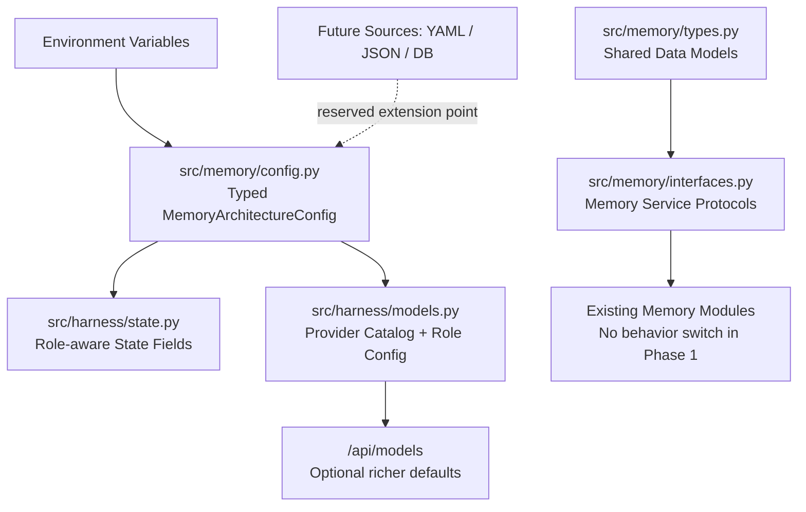
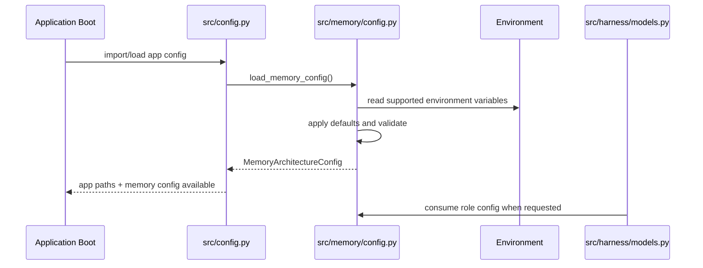
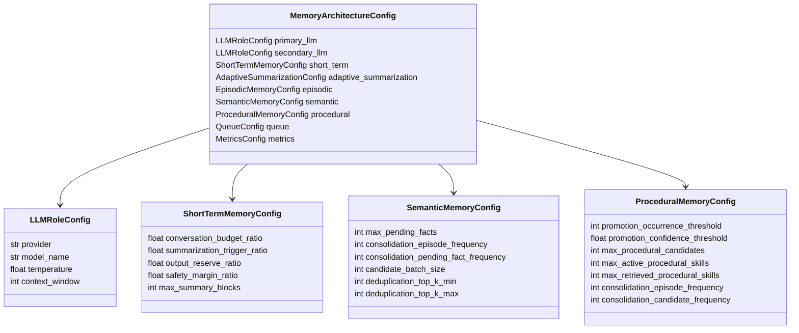

# Phase 1 Design: Typed Configuration and Memory Interfaces

## Objective

Phase 1 establishes stable configuration and service contracts for the approved Dual-LLM Memory Architecture.

The phase does not change runtime memory behavior, does not add database tables, and does not implement background queue processing. Its purpose is to create the typed foundations that later phases will use to replace synchronous memory processing, hardcoded thresholds, and loosely structured data exchange.

Phase 1 must:

- Represent all architecture-required memory defaults in typed configuration.
- Support distinct primary and secondary LLM role configuration.
- Define shared memory interfaces and data models.
- Preserve backward compatibility for existing API request shapes and current runtime behavior.
- Avoid wiring every new setting into every subsystem prematurely.

## High-Level Architecture

Phase 1 introduces a configuration and interface layer between the current assistant harness and future memory subsystem implementations.



Phase 1 creates contracts only. Existing modules may import the new config defaults, but they should not be refactored into full target behavior until their dedicated roadmap phases.

## Design Rationale

The current implementation has hardcoded values scattered across memory modules, such as short-term memory thresholds, model defaults, consolidation thresholds, and promotion thresholds. Later phases will require these values in queue handlers, retrievers, semantic stores, procedural stores, and API endpoints. Adding typed config first avoids duplicated constants and prevents each later phase from inventing incompatible data structures.

The memory interfaces also prevent later phases from coupling the LangGraph loop directly to concrete implementations. This matters because the approved architecture requires every memory component to be independently replaceable.

This phase intentionally avoids:

- Creating database tables. That belongs to Phase 2.
- Introducing a real background queue. That belongs to Phase 3A and Phase 3B.
- Rewriting short-term, semantic, episodic, procedural, or retrieval behavior. Those belong to Phases 5 through 9.
- Changing `/api/chat` request compatibility.

## Module Responsibilities

### `src/memory/config.py`

Owns typed configuration for the memory architecture.

Responsibilities:

- Define config data models and default values.
- Load values from environment variables.
- Validate numeric thresholds and percentage ranges.
- Preserve extension points for future YAML, JSON, and database-backed config sources.
- Provide a single `load_memory_config()` entry point.

Non-responsibilities:

- No database access.
- No LLM calls.
- No memory processing.
- No queue execution.

### `src/memory/types.py`

Defines shared data structures used by memory interfaces and future phases.

Responsibilities:

- Define enum-like values for memory kinds, job types, dedup actions, episode actions, skill candidate statuses, and model roles.
- Define dataclasses or Pydantic models for summary blocks, episodes, semantic facts, fact candidates, procedural skill candidates, skill metadata, retrieval requests, and retrieval results.
- Keep data models storage-neutral in Phase 1.

Non-responsibilities:

- No persistence.
- No validation that depends on database state.
- No behavior beyond simple field validation.

### `src/memory/interfaces.py`

Defines replaceable subsystem protocols.

Responsibilities:

- Define interfaces for short-term memory, episodic memory, semantic memory, procedural memory, retrieval planning, memory queue, token counting, embedding generation, and LLM role routing.
- Keep interfaces minimal and aligned with the approved architecture.
- Make later replacement of concrete implementations explicit and testable.

Non-responsibilities:

- No concrete implementations beyond optional no-op adapters if needed for typing.
- No background processing.

### `src/config.py`

Remains the application-level configuration entry point.

Responsibilities after Phase 1:

- Continue loading current app paths and existing environment values.
- Delegate memory-specific configuration to `src/memory/config.py`.
- Avoid duplicating memory defaults.

### `src/harness/models.py`

Keeps the provider catalog structure while preparing for role-aware model selection.

Responsibilities after Phase 1:

- Preserve current provider and model catalog behavior.
- Add role-aware config data structures or helper outputs where needed.
- Avoid changing actual invocation semantics until Phase 4.

### `src/harness/state.py`

Carries enough typed state metadata for future phases.

Responsibilities after Phase 1:

- Preserve existing `secondary_provider` and `secondary_model_name`.
- Add or clarify state fields needed for memory job metadata without changing graph behavior.

### `src/memory/__init__.py`

Becomes the package export boundary for config, interfaces, and shared types.

## Public Interfaces

### Configuration Loader

Design-level signature:

```python
def load_memory_config(environ: dict[str, str] | None = None) -> MemoryArchitectureConfig:
    """Load validated memory architecture configuration from supported sources.

    The optional environ argument is a Phase 1 test seam; runtime callers omit it.
    """
```

Phase 1 source priority:

1. Environment variables.
2. Built-in defaults.

Reserved future source priority:

1. Database runtime overrides.
2. JSON file.
3. YAML file.
4. Environment variables.
5. Built-in defaults.

Future sources are not implemented in Phase 1.

### Model Role Configuration

Design-level signature:

```python
def get_model_role_config(config: MemoryArchitectureConfig) -> ModelRoleConfig:
    """Return primary and secondary model selectors for current runtime config."""
```

This helper may be implemented in `src/harness/models.py` or delegated to a future `src/harness/llm_router.py` in Phase 4. Phase 1 should not change runtime LLM routing behavior.

### API Surface

`/api/chat` remains backward compatible.

Accepted request fields remain:

- `message`
- `session_id`
- `provider`
- `model_name`
- `secondary_provider`
- `secondary_model_name`

`/api/models` may include memory config defaults in an additive field:

```json
{
  "catalog": {},
  "memory_defaults": {}
}
```

Phase 1 implements this additive `memory_defaults` field. It is backward compatible because the existing `catalog` field remains unchanged.

## Class and Interface Definitions

The following definitions describe the target contracts for Phase 1. The Phase 1 implementation uses standard-library dataclasses for configuration and shared data models, plus `Protocol` for service interfaces. Field names and responsibilities should remain stable.

### Enums and Literals

```python
ModelRole = Literal["primary", "secondary"]

MemoryKind = Literal[
    "short_term",
    "episodic",
    "semantic",
    "procedural",
    "summary",
]

MemoryJobType = Literal[
    "episode_generation",
    "semantic_candidate_extraction",
    "procedural_candidate_generation",
    "semantic_consolidation",
    "procedural_consolidation",
    "skill_promotion",
    "summary_generation",
]

DedupAction = Literal["NEW", "DUPLICATE", "UPDATE", "MERGE"]

EpisodeAction = Literal["CREATE", "UPDATE", "MERGE", "SPLIT"]

SkillCandidateStatus = Literal[
    "NEW",
    "OBSERVING",
    "READY_FOR_PROMOTION",
    "WAITING_FOR_APPROVAL",
    "PROMOTED",
    "REJECTED",
]
```

### Configuration Classes

```python
class LLMRoleConfig:
    provider: str
    model_name: str
    temperature: float
    context_window: int
```

```python
class ShortTermMemoryConfig:
    conversation_budget_ratio: float
    summarization_trigger_ratio: float
    output_reserve_ratio: float
    safety_margin_ratio: float
    max_summary_blocks: int
```

```python
class AdaptiveSummarizationConfig:
    small_context_chunk_ratio: float
    medium_context_chunk_ratio: float
    large_context_chunk_ratio: float
    small_context_max_tokens: int
    medium_context_max_tokens: int
```

```python
class EpisodicMemoryConfig:
    conversation_idle_timeout_seconds: int
    episode_idle_timeout_seconds: int
    long_conversation_token_threshold: int
    max_episodic_memories: int
```

```python
class SemanticMemoryConfig:
    max_pending_facts: int
    consolidation_episode_frequency: int
    consolidation_pending_fact_frequency: int
    candidate_batch_size: int
    deduplication_top_k_min: int
    deduplication_top_k_max: int
```

```python
class ProceduralMemoryConfig:
    promotion_occurrence_threshold: int
    promotion_confidence_threshold: float
    max_procedural_candidates: int
    max_active_procedural_skills: int
    max_retrieved_procedural_skills: int
    consolidation_episode_frequency: int
    consolidation_candidate_frequency: int
```

```python
class QueueConfig:
    background_worker_count: int
    maximum_queue_size: int
    retry_limit: int
    retry_backoff_seconds: int
    job_timeout_seconds: int
    queue_persistence_enabled: bool
    idle_maintenance_interval_seconds: int
```

```python
class MetricsConfig:
    memory_metrics_enabled: bool
    queue_metrics_enabled: bool
    timing_metrics_enabled: bool
    cost_metrics_enabled: bool
```

```python
class MemoryArchitectureConfig:
    primary_llm: LLMRoleConfig
    secondary_llm: LLMRoleConfig
    short_term: ShortTermMemoryConfig
    adaptive_summarization: AdaptiveSummarizationConfig
    episodic: EpisodicMemoryConfig
    semantic: SemanticMemoryConfig
    procedural: ProceduralMemoryConfig
    queue: QueueConfig
    metrics: MetricsConfig
```

### Memory Data Models

```python
class SummaryBlock:
    id: str
    session_id: str
    summary: str
    covered_message_ids: list[str]
    token_count: int
    created_at: str
```

```python
class EpisodicMemory:
    id: str
    session_id: str
    title: str
    summary: str
    participants: list[str]
    goals: list[str]
    decisions: list[str]
    artifacts: list[str]
    topics: list[str]
    importance: float
    start_message_id: str
    end_message_id: str
    created_at: str
    source: str
```

```python
class SemanticFact:
    id: str
    category: str
    fact: str
    source: str
    confidence: float
    created_at: str
    updated_at: str | None
```

```python
class FactCandidate:
    id: str
    session_id: str
    fact: str
    category: str
    confidence: float
    explicit: bool
    source: str
    created_at: str
```

```python
class SkillWorkflowStep:
    step_number: int
    instruction: str
    optional_tools: list[str]
```

```python
class SkillCandidate:
    id: str
    title: str
    description: str
    trigger_description: str
    workflow: list[SkillWorkflowStep]
    preferred_tools: list[str]
    confidence: float
    occurrences: int
    source_episode_ids: list[str]
    created_at: str
    updated_at: str
    status: SkillCandidateStatus
```

```python
class RetrievalRequest:
    session_id: str
    query: str
    task_type: str | None
    token_budget: int
    memory_kinds: list[MemoryKind]
```

```python
class RetrievedMemory:
    id: str
    memory_kind: MemoryKind
    content: str
    score: float
    token_count: int
    metadata: dict[str, object]
```

### Service Protocols

```python
class TokenCounter(Protocol):
    def count_text(self, text: str, model_name: str) -> int: ...
    def count_messages(self, messages: Sequence[BaseMessage], model_name: str) -> int: ...
```

```python
class ShortTermMemoryManager(Protocol):
    def prepare_context(self, request: RetrievalRequest) -> list[SummaryBlock]: ...
```

```python
class EpisodicMemoryStore(Protocol):
    def retrieve(self, request: RetrievalRequest) -> list[RetrievedMemory]: ...
```

```python
class SemanticMemoryStore(Protocol):
    def retrieve(self, request: RetrievalRequest) -> list[RetrievedMemory]: ...
```

```python
class ProceduralMemoryStore(Protocol):
    def retrieve(self, request: RetrievalRequest) -> list[RetrievedMemory]: ...
```

```python
class MemoryQueue(Protocol):
    def enqueue(self, job_type: MemoryJobType, payload: dict[str, object], idempotency_key: str) -> str: ...
```

```python
class RetrievalPlanner(Protocol):
    def plan(self, request: RetrievalRequest) -> list[RetrievedMemory]: ...
```

Phase 1 defines these protocols. Concrete implementations arrive in later phases.

## Configuration Schema

### Default Values

The following defaults should be represented in Phase 1 typed config.

| Config path | Default | Source |
|---|---:|---|
| `short_term.conversation_budget_ratio` | `0.75` | Approved architecture |
| `short_term.summarization_trigger_ratio` | `0.90` | Approved architecture |
| `short_term.output_reserve_ratio` | Configurable, default included in reserved 25 percent | Approved architecture |
| `short_term.safety_margin_ratio` | Configurable, default included in reserved 25 percent | Approved architecture |
| `adaptive_summarization.small_context_chunk_ratio` | `0.30` | Models up to 200k |
| `adaptive_summarization.medium_context_chunk_ratio` | `0.25` | Models between 200k and 500k |
| `adaptive_summarization.large_context_chunk_ratio` | `0.20` | Models above 500k |
| `adaptive_summarization.small_context_max_tokens` | `200000` | Approved architecture |
| `adaptive_summarization.medium_context_max_tokens` | `500000` | Approved architecture |
| `episodic.conversation_idle_timeout_seconds` | configurable | Approved architecture |
| `episodic.episode_idle_timeout_seconds` | configurable | Approved architecture |
| `episodic.long_conversation_token_threshold` | configurable | Approved architecture |
| `semantic.consolidation_episode_frequency` | `10` | Approved architecture |
| `semantic.consolidation_pending_fact_frequency` | `100` | Approved architecture |
| `semantic.deduplication_top_k_min` | `3` | Approved architecture |
| `semantic.deduplication_top_k_max` | `10` | Approved architecture |
| `procedural.promotion_occurrence_threshold` | `3` | Approved architecture |
| `procedural.promotion_confidence_threshold` | `0.90` | Approved architecture |
| `procedural.consolidation_episode_frequency` | `10` | Approved architecture |
| `procedural.consolidation_candidate_frequency` | `20` | Approved architecture |
| `procedural.max_retrieved_procedural_skills` | `3` | Approved architecture |
| `queue.retry_limit` | configurable | Approved architecture |
| `queue.retry_backoff_seconds` | configurable | Approved architecture |
| `queue.job_timeout_seconds` | configurable | Approved architecture |
| `queue.queue_persistence_enabled` | configurable | Approved architecture |

### Environment Variable Naming

Phase 1 should use explicit names and preserve existing ones where practical.

Examples:

- `PRIMARY_PROVIDER`
- `PRIMARY_MODEL`
- `SECONDARY_PROVIDER`
- `SECONDARY_MODEL`
- `MEMORY_CONVERSATION_BUDGET_RATIO`
- `MEMORY_SUMMARIZATION_TRIGGER_RATIO`
- `MEMORY_SMALL_CONTEXT_CHUNK_RATIO`
- `MEMORY_MEDIUM_CONTEXT_CHUNK_RATIO`
- `MEMORY_LARGE_CONTEXT_CHUNK_RATIO`
- `MEMORY_SEMANTIC_DEDUP_TOP_K_MIN`
- `MEMORY_SEMANTIC_DEDUP_TOP_K_MAX`
- `MEMORY_PROCEDURAL_PROMOTION_OCCURRENCES`
- `MEMORY_PROCEDURAL_PROMOTION_CONFIDENCE`
- `MEMORY_QUEUE_WORKER_COUNT`
- `MEMORY_QUEUE_MAX_SIZE`
- `MEMORY_QUEUE_RETRY_LIMIT`
- `MEMORY_QUEUE_RETRY_BACKOFF_SECONDS`
- `MEMORY_QUEUE_JOB_TIMEOUT_SECONDS`

Existing `PRIMARY_MODEL` remains supported.

Existing `EMBEDDING_MODEL` remains supported.

Existing `MAX_MESSAGES_BEFORE_TRIM` and `TOKEN_TRIM_THRESHOLD` should be treated as legacy compatibility settings. They should not be part of the target Phase X short-term memory contract.

## Sequence Diagram

### Phase 1 Configuration Loading



## Class Diagram



## File-by-File Modifications

### New Files to Create

#### `src/memory/config.py`

Purpose:

- Define typed memory architecture configuration.
- Load config from environment variables and defaults.
- Validate ranges.

Expected contents:

- Config classes.
- Environment parsing helpers.
- `load_memory_config()`.
- Optional `get_default_memory_config()`.

Must not include:

- Concrete memory processing.
- Database access.
- LLM calls.

#### `src/memory/interfaces.py`

Purpose:

- Define service protocols for memory subsystems.

Expected contents:

- `TokenCounter`
- `ShortTermMemoryManager`
- `EpisodicMemoryStore`
- `SemanticMemoryStore`
- `ProceduralMemoryStore`
- `MemoryQueue`
- `RetrievalPlanner`
- Optional role-aware LLM client protocol.

Must not include:

- Concrete stores.
- Worker implementation.

#### `src/memory/types.py`

Purpose:

- Define shared memory data models and literal types.

Expected contents:

- Memory kind and action literals.
- Summary, episode, semantic fact, fact candidate, skill candidate, retrieval request, and retrieval result models.

Must not include:

- Persistence logic.
- Prompt logic.

### Existing Files to Modify

#### `src/config.py`

Planned changes:

- Import and expose `load_memory_config()`.
- Preserve existing app path constants.
- Preserve existing `PRIMARY_MODEL` and `EMBEDDING_MODEL`.
- Avoid duplicating memory-specific defaults.

Compatibility:

- Existing imports from `src.config` should continue to work.

#### `src/harness/state.py`

Planned changes:

- Preserve `secondary_provider` and `secondary_model_name`.
- Add or clarify optional fields for memory config version or memory job metadata if needed.

Compatibility:

- Existing `AgentState` keys remain optional where currently optional.

#### `src/harness/models.py`

Planned changes:

- Preserve `MODEL_PAIRS`, `SUPPORTED_PROVIDERS`, `get_primary_llm()`, and `get_secondary_llm()` behavior.
- Add role-aware helper types or return metadata needed by later phases.
- Avoid changing invocation semantics until Phase 4.

Compatibility:

- Existing model tests should continue to pass.

#### `src/memory/__init__.py`

Planned changes:

- Export config, interfaces, and types as package-level contracts if helpful.

Compatibility:

- Existing memory imports should continue to work.

### Existing Files Not Modified in Phase 1

The following files are intentionally not changed in Phase 1:

- `src/memory/short_term.py`
- `src/memory/episodic.py`
- `src/memory/semantic.py`
- `src/memory/procedural.py`
- `src/memory/retrieval_gate.py`
- `src/memory/async_workers.py`
- `src/background_worker.py`
- `src/db.py`
- `src/db_migrations.py`

These are modified in later phases according to the roadmap.

## API Changes

Required API changes:

- None.

Permitted additive API changes:

- `/api/models` may include memory configuration defaults in a new `memory_defaults` field.

Constraints:

- `/api/chat` must remain backward compatible.
- No existing response fields should be removed.
- No new required request fields should be introduced.

## Database Changes

None.

Phase 1 must not add, remove, or alter database tables. Schema foundations are Phase 2.

## Testing Strategy

### Unit Tests

Add tests for:

- Default `MemoryArchitectureConfig` values.
- Environment variable overrides.
- Validation of percentage ranges.
- Validation of positive integer thresholds.
- Primary and secondary model configs can differ.
- Existing config constants remain import-compatible.
- Existing model catalog behavior remains unchanged.

Suggested files:

- `tests/test_phase1_memory_config.py`
- `tests/test_phase1_memory_interfaces.py`

### Interface Contract Tests

Add lightweight tests for:

- Required protocol methods are defined.
- Required data model fields exist.
- Dedup, episode action, skill status, memory kind, and job type literals match approved architecture.

### Integration Tests

Add tests for:

- `/api/models` remains backward compatible.
- If `memory_defaults` is exposed, it contains expected default keys.
- `/api/chat` still accepts existing primary and secondary selector fields.

### Regression Tests

Run existing focused tests:

- `tests/test_dual_llm_selectors.py`
- `tests/test_tiered_models.py`
- `tests/test_short_term_budgeting.py`
- `tests/test_long_term_memory.py`

Phase 1 is acceptable if existing behavior remains stable while the new contracts are available.

## Migration Considerations

- This phase introduces contracts before implementations. Some interfaces will not have full concrete implementations until later phases.
- Keep old constants available during transition to avoid broad diffs.
- Mark legacy configuration values such as `MAX_MESSAGES_BEFORE_TRIM` as compatibility values, not target architecture values.
- Avoid importing heavy model or framework dependencies from `src/memory/types.py`; shared types should remain lightweight.
- Avoid circular imports between `src/config.py`, `src/harness/models.py`, and `src/memory/config.py`.
- Avoid binding future storage decisions into Phase 1 data models. IDs and fields should be stable, but persistence belongs to Phase 2 and later.
- Do not make memory processing depend on the new interfaces until the relevant implementation phases.

## Acceptance Criteria

Phase 1 is complete when:

- `src/memory/config.py` defines the approved architecture configuration schema and default values.
- `src/memory/types.py` defines shared data models and action/status literals for later memory phases.
- `src/memory/interfaces.py` defines replaceable subsystem protocols.
- `src/config.py` exposes memory config without breaking existing imports.
- `src/harness/models.py` preserves current provider catalog behavior while supporting role-aware config metadata.
- `src/harness/state.py` preserves existing chat/model fields and includes any Phase 1 metadata required by later phases.
- `/api/chat` remains backward compatible.
- `/api/models` remains backward compatible, with any memory-default output added only additively.
- No database schema changes are made.
- No memory behavior is switched to the target architecture prematurely.
- Unit tests validate defaults, environment overrides, validation failures, role-separated model config, and interface/data-model availability.
- Existing focused model/config/memory tests continue to pass.

## Out of Scope

The following work is explicitly out of scope for Phase 1:

- Database migrations.
- Durable memory queue.
- Worker retry or dead-letter handling.
- Actual asynchronous memory processing.
- Token-based trimming implementation.
- Immutable summary block persistence.
- Episodic continuation behavior.
- Semantic deduplication.
- Semantic consolidation.
- Procedural skill versioning.
- Skill candidate generation.
- Adaptive retrieval planner integration.
- Frontend changes.

