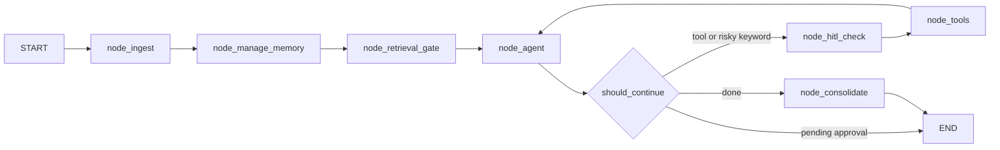
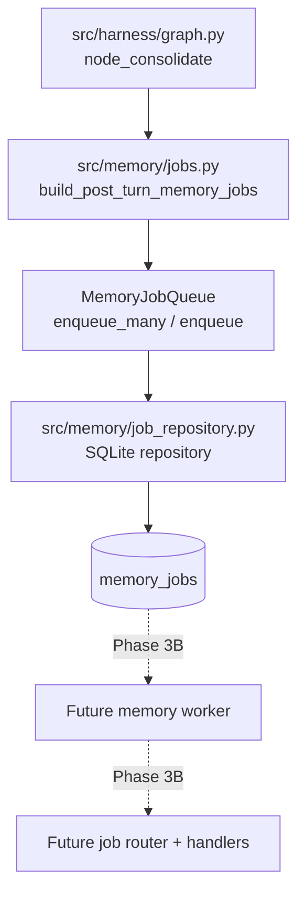
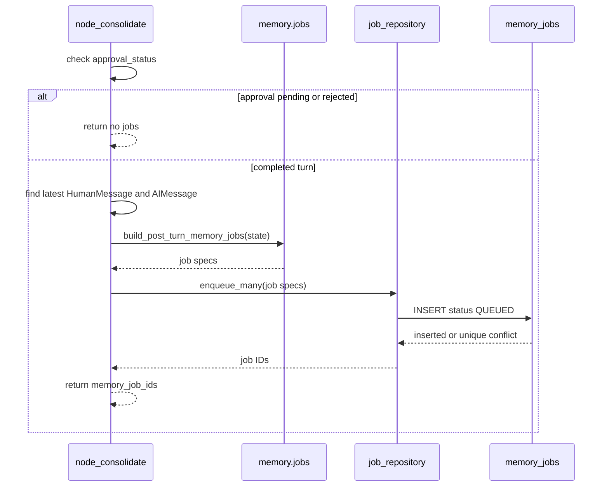

# Phase 3A Design: Memory Queue Persistence and Enqueue API

## 1. Executive Summary

Phase 3A introduces durable enqueue-only memory job persistence using the `memory_jobs` table created in Phase 2. The phase creates the application-level queue contract that later worker phases will consume, and changes the graph's post-turn memory path so successful chat turns enqueue memory work instead of executing secondary memory processing inline.

The primary outcome is that chat remains fast and user-facing behavior remains stable while memory work becomes durable, idempotent, and recoverable. Phase 3A must not process jobs, route jobs to handlers, call the secondary LLM for memory work, retry failed jobs, move records to `dead_letter_jobs`, write semantic facts, write structured episodes, write skills, perform semantic deduplication, or change retrieval behavior.

Current runtime memory behavior will intentionally become enqueue-only at the graph consolidation point. Existing legacy memory modules remain in the codebase for compatibility and for future worker handler extraction, but the chat graph must stop invoking `run_secondary_fact_extraction()` during the user response path.

## 2. Scope

In scope:

- Add memory job payload contracts for enqueue-only work.
- Add a durable repository for inserting `memory_jobs` rows.
- Add an enqueue service/API that implements the Phase 1 `MemoryQueue` protocol.
- Define deterministic job IDs and idempotency keys.
- Enqueue memory jobs after successful chat turns.
- Persist jobs with status `QUEUED` only.
- Preserve legacy DB tables and current API response shape.
- Add tests proving enqueueing is idempotent and does not perform memory LLM work.

Files in scope:

- `src/harness/graph.py`
- `src/memory/jobs.py` new
- `src/memory/job_repository.py` new
- `src/memory/interfaces.py` if a narrow return type clarification is needed
- `src/memory/types.py` if a storage-neutral enqueue result type is needed
- `src/db.py` only if a small helper import seam is needed; no schema changes
- Tests for graph, DB, and memory queue contracts

Outcomes in scope:

- New rows in `memory_jobs` after successful graph turns.
- No immediate writes to `facts`, `episodes`, `structured_episodes`, `pending_fact_candidates`, `skill_candidates`, or `consolidation_runs` from Phase 3A enqueueing.
- Chat still returns the same user-facing response fields.

## 3. Out of Scope

Phase 3A must not implement:

- Worker loop.
- Job router.
- Job handlers.
- Retry/backoff logic.
- Dead-letter movement.
- Worker heartbeat processing.
- Semantic extraction.
- Episode generation.
- Procedural candidate generation.
- Semantic deduplication.
- Consolidation execution.
- Skill writing or skill version creation.
- Retrieval behavior changes.
- Backfill from legacy tables.
- New public mutation endpoints for memory jobs.

Phase 3A should not refactor unrelated memory modules. `src/memory/async_workers.py` should remain present, but graph runtime should no longer call it for post-turn memory processing.

## 4. Current Code Assessment

### `src/harness/graph.py`

Current graph flow:



Important current behavior:

- `node_ingest()` logs the user raw turn and loop event.
- `node_agent()` invokes the primary LLM or offline fallback, logs final responses, and writes raw assistant turns.
- `node_hitl_check()` returns `approval_status = "PENDING"` for high-risk actions and prevents normal consolidation.
- `node_consolidate()` currently calls `run_secondary_fact_extraction()` from `src/memory/async_workers.py`.
- The current consolidation call can invoke `get_secondary_llm()`, extract semantic facts, log legacy episodes, generate structured episode summaries, and run periodic consolidation synchronously during the chat request.

Phase 3A integration point:

- Replace the body of `node_consolidate()` with enqueue-only logic.
- Keep the graph node and graph edges intact to minimize runtime behavior change.
- Return `memory_job_ids` in state so tests and future diagnostics can observe enqueue results without changing `/api/chat` response shape.

### `src/memory/async_workers.py`

Despite its name, this module performs synchronous memory processing:

- Calls `get_secondary_llm()`.
- Writes semantic facts through `add_semantic_fact()` and `extract_and_save_facts()`.
- Writes legacy episodes through `log_episode()`.
- May generate structured episodes.
- May run periodic consolidation.

Roadmap classification marks this module as `REPLACE`. Phase 3A should not delete it yet. Later phases can reuse logic selectively as worker handlers after it is corrected to follow the target architecture.

### `src/background_worker.py`

Currently owns scheduled job polling only:

- Processes `scheduled_jobs`.
- Does not know about `memory_jobs`.
- Has a worker-loop shape that Phase 3B may extend or parallel with a memory worker.

Phase 3A should not modify worker loops. At most, the Phase 3A design reserves compatibility with Phase 3B by keeping repository methods deterministic and worker-friendly.

### `src/memory/schema.py`

Phase 2 added `memory_jobs` with the fields Phase 3A needs:

- `id TEXT PRIMARY KEY`
- `job_type TEXT NOT NULL`
- `status TEXT NOT NULL DEFAULT 'QUEUED'`
- `priority INTEGER NOT NULL DEFAULT 100`
- `session_id TEXT`
- `idempotency_key TEXT NOT NULL`
- `payload_json TEXT NOT NULL DEFAULT '{}'`
- `result_json TEXT`
- `error_message TEXT`
- `attempt_count INTEGER NOT NULL DEFAULT 0`
- `max_attempts INTEGER NOT NULL DEFAULT 3`
- `available_at TEXT NOT NULL DEFAULT datetime('now')`
- lock/start/completion timestamps for later phases
- `created_at` and `updated_at`

Useful indexes:

- Unique `idx_memory_jobs_idempotency_key`.
- Claiming index on `(status, available_at, priority, created_at)`.
- Session and type/status indexes.

No schema change is required for Phase 3A.

### `src/memory/interfaces.py`

Phase 1 already defines:

```python
class MemoryQueue(Protocol):
    def enqueue(
        self,
        job_type: MemoryJobType,
        payload: Dict[str, Any],
        idempotency_key: str,
    ) -> str: ...
```

Phase 3A should implement this protocol in concrete code. If the implementation needs to report whether an existing job was reused, it should add an internal result type in `src/memory/jobs.py` rather than changing the public protocol unless tests prove the protocol is insufficient.

### `src/memory/types.py`

Existing `MemoryJobType` values:

- `episode_generation`
- `semantic_candidate_extraction`
- `procedural_candidate_generation`
- `semantic_consolidation`
- `procedural_consolidation`
- `skill_promotion`
- `summary_generation`

Phase 3A should use these exact lowercase values in `memory_jobs.job_type`.

### `src/db.py`

`get_connection()` initializes base tables and runs migrations. Phase 3A should use `get_connection(db_path=None)` from the repository layer and must not add schema creation to `src/db.py`.

### `/api/chat` and title generation note

`src/api/server.py` invokes the graph and returns the current chat response shape. It may also generate a first-turn thread title before graph invocation. That title path is not memory enqueueing and is not part of the Phase 3A module list. However, it can call a secondary model depending on the `generate_thread_title()` implementation.

To satisfy Phase 3A without creating broad behavioral churn:

- Phase 3A must eliminate secondary LLM calls from the memory consolidation path.
- Phase 3A must not introduce any new secondary LLM calls during chat.
- If the project interprets "avoid secondary LLM calls during chat" as a global rule, title generation should be split into a separate follow-up or converted to deterministic/offline behavior in a dedicated API phase. That change is outside the narrow Phase 3A memory queue objective unless explicitly approved.

## 5. Proposed Enqueue Architecture



Phase 3A adds two modules:

- `src/memory/jobs.py`: storage-neutral job models, payload builders, ID/idempotency helpers, and enqueue service facade.
- `src/memory/job_repository.py`: SQLite persistence for `memory_jobs` only.

The graph integration should be intentionally small:

1. Read the latest user and assistant messages from state.
2. Confirm the turn is eligible for enqueueing.
3. Build deterministic job specs.
4. Insert jobs with status `QUEUED` using the repository.
5. Return inserted or reused job IDs in `memory_job_ids`.
6. Swallow or isolate enqueue persistence errors so chat response remains successful.

The repository should be deterministic and synchronous. It only inserts rows; it never processes them.

## 6. Job Types and Payloads

### Phase 3A job set

Phase 3A should enqueue only job types that are directly implied by a completed chat turn and safe to queue before handler behavior exists.

Required default job:

| Job type | Enqueue rule | Purpose | Future handler phase |
|---|---|---|---|
| `semantic_candidate_extraction` | Enqueue once after every eligible successful chat turn with both user and assistant text. | Preserve post-turn interaction for later semantic candidate extraction. | Phase 7A after Phase 3B worker execution exists. |

Optional deterministic job:

| Job type | Enqueue rule | Purpose | Future handler phase |
|---|---|---|---|
| `episode_generation` | Enqueue only when deterministic trigger metadata is known without LLM calls, such as explicit remember request, trimming occurred, task/workflow completed flag, or long conversation threshold. | Preserve a future episodic generation request without generating the episode during chat. | Phase 6B. |

Not enqueued in Phase 3A:

| Job type | Reason |
|---|---|
| `procedural_candidate_generation` | Approved architecture generates procedural candidates after structured episodes exist; Phase 3A has no structured episode handler. |
| `semantic_consolidation` | Consolidation scheduling belongs to Phase 7C and worker execution belongs to Phase 3B. |
| `procedural_consolidation` | Procedural candidate lifecycle is not available yet. |
| `skill_promotion` | Approval, versioning, and skill writing are later phases. |
| `summary_generation` | Token-based summary block behavior belongs to Phase 5B. |

This conservative job set avoids accumulating jobs that later workers would misinterpret or process too broadly.

### Payload envelope

Every Phase 3A payload should be JSON-serializable and stored as `TEXT` in `memory_jobs.payload_json`. Do not require SQLite JSON1.

Common envelope:

```json
{
  "schema_version": 1,
  "source": "graph.post_turn",
  "session_id": "session identifier",
  "turn": {
    "user_message_id": null,
    "assistant_message_id": null,
    "user_text": "latest user message text",
    "assistant_text": "latest assistant response text",
    "message_count": 2,
    "token_count": 123
  },
  "models": {
    "primary_provider": "openai",
    "primary_model_name": "gpt-4o-mini",
    "secondary_provider": "openai",
    "secondary_model_name": "gpt-4o-mini"
  },
  "trigger_metadata": {
    "task_completed": false,
    "workflow_finished": false,
    "trimming_occurred": false,
    "explicit_memory_request": false,
    "retrieval_triggered": false,
    "tools_used": [],
    "loop_count": 1,
    "approval_status": "NONE"
  },
  "created_by": "phase_3a_enqueue"
}
```

Job-specific payload additions:

`semantic_candidate_extraction`:

```json
{
  "semantic": {
    "candidate_source": "post_turn",
    "extract_explicit_only": false,
    "legacy_pending_facts_backfill": false
  }
}
```

`episode_generation`:

```json
{
  "episodic": {
    "trigger_reason": "explicit_memory_request | trimming_occurred | task_completed | workflow_finished | long_conversation",
    "source": "post_turn",
    "legacy_episode_backfill": false
  }
}
```

Payload constraints:

- Include text needed by future workers so Phase 3B does not need to reconstruct the turn from mutable chat state.
- Include model selectors for later role-aware routing, but Phase 3A must not instantiate LLM clients.
- Keep payloads bounded to the latest completed turn. Do not serialize the full conversation history in Phase 3A.
- If text is empty or not serializable, do not enqueue the job.

### Raw turn IDs

Current `log_raw_turn()` does not return the inserted row ID. Phase 3A should not refactor raw turn logging broadly. Payload fields `user_message_id` and `assistant_message_id` may be `null` in Phase 3A.

A later phase can improve raw turn correlation by returning IDs from raw turn logging or adding deterministic turn IDs to graph state. The Phase 3A idempotency strategy must not depend on raw turn IDs.

## 7. Idempotency Strategy

### Goals

- Re-running graph consolidation for the same completed turn must not create duplicate memory jobs.
- API retries should not enqueue duplicates for the same session, message content, model selectors, and job type.
- Future workers can rely on one queued job per idempotency key.

### Canonical idempotency input

Compute an idempotency digest from a canonical JSON object:

```json
{
  "version": 1,
  "job_type": "semantic_candidate_extraction",
  "session_id": "...",
  "user_text_hash": "sha256(user_text)",
  "assistant_text_hash": "sha256(assistant_text)",
  "primary_provider": "...",
  "primary_model_name": "...",
  "secondary_provider": "...",
  "secondary_model_name": "..."
}
```

Recommended key format:

```text
memq:v1:{job_type}:{session_hash}:{digest16}
```

Where:

- `session_hash` is the first 12 hex characters of `sha256(session_id)`.
- `digest16` is the first 16 or 24 hex characters of the canonical object hash.
- Use JSON with sorted keys and compact separators before hashing.

This key avoids storing raw user text in the idempotency key while remaining deterministic.

### Job ID format

Recommended job ID format:

```text
memjob_{job_type_slug}_{digest16}
```

Examples:

- `memjob_semantic_candidate_extraction_0a12bc34de56fa78`
- `memjob_episode_generation_8b19a0037cc991aa`

The job ID can be derived from the idempotency digest, which makes duplicate insert handling simpler and deterministic. The unique `idempotency_key` index remains the authoritative duplicate guard.

### Duplicate handling

`MemoryJobRepository.enqueue()` should attempt to insert and handle uniqueness deterministically:

1. Insert row into `memory_jobs` with status `QUEUED`.
2. If insert succeeds, return `EnqueueResult(job_id=..., inserted=True)`.
3. If uniqueness fails for `idempotency_key`, fetch the existing row by `idempotency_key` and return `EnqueueResult(job_id=existing_id, inserted=False)`.
4. Do not update existing payloads in Phase 3A. The first successfully queued payload wins.

Do not use `INSERT OR IGNORE` unless the implementation immediately fetches and verifies the existing row. Silent ignores make tests and future diagnostics weaker.

## 8. Graph Integration Plan

### New graph behavior

Replace `node_consolidate()` implementation with enqueue-only behavior:



### Eligible successful turns

A turn is eligible when all conditions are true:

- `approval_status` is not `PENDING`.
- `approval_status` is not `REJECTED`.
- The state contains a latest `HumanMessage` with non-empty content.
- The state contains a latest `AIMessage` with non-empty content.
- The latest AI message is not the HITL pause message.
- The graph reached `node_consolidate()` normally.
- No explicit graph error flag is present in state.

For Phase 3A, `approval_status == "NONE"`, `None`, or `"APPROVED"` may be eligible if there is a normal final assistant response.

### Suppressed turns

Do not enqueue when:

- HITL approval is pending.
- HITL approval was rejected.
- The graph throws and `/api/chat` returns 500.
- The latest assistant message is missing or empty.
- The latest user message is missing or empty.
- The node is invoked on an intermediate tool-call AI message without a final response.
- Queue persistence is disabled in config, if `MEMORY_QUEUE_PERSISTENCE_ENABLED=false` is supported.

### Approved HITL resumes

When a HITL action is approved and graph execution resumes to a final assistant response, enqueueing is allowed. The payload should include:

```json
{
  "trigger_metadata": {
    "approval_status": "APPROVED",
    "tools_used": ["tool_name"]
  }
}
```

Rejected HITL resumes should not enqueue memory jobs in Phase 3A. They represent an interrupted or intentionally aborted action and are better handled by future audit/retrieval logic rather than memory consolidation.

### Error isolation

Queue persistence failure must not break chat in Phase 3A. Recommended behavior:

- Catch repository exceptions inside `node_consolidate()`.
- Log a `loop_events` row with `step_type = "MEMORY_ENQUEUE_FAILED"` if practical and non-recursive.
- Return `memory_job_ids = []` and optionally `memory_enqueue_error` only if the state type is extended.
- Do not raise from `node_consolidate()` for enqueue failures.

The user-facing response has already been generated before `node_consolidate()`, so queue persistence should be best-effort from the chat perspective. Tests should prove DB failures do not replace the assistant answer with a 500 after the response was produced.

## 9. Repository/API Design

### `src/memory/jobs.py`

Responsibilities:

- Define job status constants used by Phase 3A.
- Define storage-neutral job spec/result dataclasses.
- Build payload envelopes from graph state.
- Compute job IDs and idempotency keys.
- Provide a `MemoryJobQueue` implementation that satisfies the Phase 1 `MemoryQueue` protocol.
- Provide an `enqueue_post_turn_memory_jobs()` helper for graph use.

Non-responsibilities:

- No SQLite DDL.
- No job claiming.
- No worker loop.
- No LLM calls.
- No memory extraction or writes outside `memory_jobs`.

Design-level definitions:

```python
MEMORY_JOB_STATUS_QUEUED = "QUEUED"
PHASE_3A_PAYLOAD_SCHEMA_VERSION = 1

@dataclass(frozen=True)
class MemoryJobSpec:
    job_type: MemoryJobType
    payload: dict[str, Any]
    idempotency_key: str
    job_id: str
    session_id: str | None = None
    priority: int = 100
    available_at: str | None = None

@dataclass(frozen=True)
class EnqueueResult:
    job_id: str
    idempotency_key: str
    inserted: bool
    status: str

class SQLiteMemoryJobQueue:
    def __init__(self, repository: MemoryJobRepository | None = None, config: QueueConfig | None = None): ...

    def enqueue(self, job_type: MemoryJobType, payload: dict[str, Any], idempotency_key: str) -> str: ...

    def enqueue_spec(self, spec: MemoryJobSpec) -> EnqueueResult: ...

    def enqueue_many(self, specs: Sequence[MemoryJobSpec]) -> list[EnqueueResult]: ...
```

Recommended helper functions:

```python
def build_post_turn_memory_job_specs(state: AgentState) -> list[MemoryJobSpec]: ...
def enqueue_post_turn_memory_jobs(state: AgentState, queue: SQLiteMemoryJobQueue | None = None) -> list[EnqueueResult]: ...
def make_memory_job_id(job_type: str, idempotency_key: str) -> str: ...
def make_post_turn_idempotency_key(job_type: str, payload: dict[str, Any]) -> str: ...
def canonical_json(value: Mapping[str, Any]) -> str: ...
```

### `src/memory/job_repository.py`

Responsibilities:

- Own all direct `memory_jobs` SQL for Phase 3A.
- Insert queued jobs transactionally.
- Fetch by idempotency key after duplicate conflicts.
- Provide read helpers needed by tests.

Non-responsibilities:

- No worker claim/update state transitions.
- No retry/dead-letter logic.
- No queue polling.
- No joins to future memory tables.

Design-level definitions:

```python
class MemoryJobRepository:
    def __init__(self, db_path: Path | None = None): ...

    def enqueue(self, spec: MemoryJobSpec) -> EnqueueResult: ...

    def get_by_idempotency_key(self, idempotency_key: str) -> dict[str, Any] | None: ...

    def count_by_session(self, session_id: str) -> int: ...

    def list_jobs_for_session(self, session_id: str) -> list[dict[str, Any]]: ...
```

Insert SQL shape:

```sql
INSERT INTO memory_jobs (
    id,
    job_type,
    status,
    priority,
    session_id,
    idempotency_key,
    payload_json,
    attempt_count,
    max_attempts,
    available_at,
    created_at,
    updated_at
) VALUES (?, ?, 'QUEUED', ?, ?, ?, ?, 0, ?, COALESCE(?, datetime('now')), datetime('now'), datetime('now'))
```

The repository should use `json.dumps(..., sort_keys=True, separators=(",", ":"))` for payload persistence. JSON validation belongs here because SQLite stores `TEXT` only.

### Transaction behavior

For one job:

- Open connection using `get_connection(db_path)`.
- Insert row and commit.
- On duplicate idempotency key, rollback the failed insert, fetch existing row, and return `inserted=False`.
- Close connection in a `finally` block.

For many jobs:

- Prefer independent inserts per job in Phase 3A so one duplicate does not roll back unrelated new jobs.
- If a non-idempotency error occurs, fail that enqueue call and let graph-level error isolation decide whether to continue.
- Do not partially process jobs; insertion is the only side effect.

### Config use

Use Phase 1 queue config:

- `queue.retry_limit` maps to `memory_jobs.max_attempts`.
- `queue.queue_persistence_enabled` can suppress enqueueing entirely when false.
- `queue.maximum_queue_size` should not block Phase 3A enqueue unless a cheap count check already exists. Strict queue capacity enforcement can move to Phase 3B to avoid latency.

If config loading fails, graph enqueue should fail closed from the queue perspective and fail open from the chat perspective: no memory job is inserted, and chat still returns.

## 10. Failure Handling

### Repository failures

Failure types and behavior:

| Failure | Behavior |
|---|---|
| Duplicate `idempotency_key` | Return existing job ID with `inserted=False`. |
| Malformed/non-serializable payload | Do not insert; raise `ValueError` to caller. Graph catches and suppresses for chat. |
| SQLite locked/unavailable | Raise repository exception. Graph catches and suppresses for chat. |
| Missing `memory_jobs` table | Treat as migration/setup failure. Graph catches and suppresses; tests should catch in initialized DBs. |
| Constraint failure other than duplicate idempotency | Raise repository exception. |

### Graph failures

`node_consolidate()` should never call secondary LLMs and should not raise for enqueue failures. It should return:

```python
{
    "memory_job_ids": ["memjob_...", "memjob_..."]
}
```

If enqueueing fails:

```python
{
    "memory_job_ids": []
}
```

Optionally, if `AgentState` is extended later:

```python
{
    "memory_job_ids": [],
    "memory_enqueue_error": "short diagnostic"
}
```

Do not expose raw exception details to the user in `/api/chat`.

### Data safety

- Never delete from `memory_jobs` in Phase 3A.
- Never update existing `memory_jobs` rows on duplicate enqueue.
- Never mutate legacy memory tables from enqueue code.
- Never write result/error fields in Phase 3A; those are worker-owned in Phase 3B.

## 11. Test Plan

Suggested new test files:

- `tests/test_phase3a_memory_jobs.py`
- `tests/test_phase3a_graph_enqueue.py`

### Repository tests

Add tests for:

- Enqueue inserts one `memory_jobs` row with status `QUEUED`.
- Inserted row has `attempt_count = 0` and `max_attempts` from queue config.
- Payload is stored as canonical JSON text and can be decoded without SQLite JSON1.
- Duplicate idempotency key returns the original job ID and does not insert a second row.
- Invalid/non-serializable payload fails before insert.
- `list_jobs_for_session()` and `count_by_session()` work for tests and future diagnostics.

### Job contract tests

Add tests for:

- `build_post_turn_memory_job_specs()` returns `semantic_candidate_extraction` for an eligible completed turn.
- Job specs include `schema_version = 1`.
- Payload includes session ID, latest user text, latest assistant text, primary model selector, secondary model selector, trigger metadata, and source.
- Idempotency keys are deterministic for the same turn.
- Idempotency keys differ when assistant output differs.
- Job IDs are deterministic and use the approved prefix.
- `episode_generation` is only produced when deterministic trigger metadata requires it.
- Procedural/consolidation/skill/summary jobs are not produced in Phase 3A.

### Graph integration tests

Add tests for:

- `agent_app.invoke()` on a successful offline/simple chat inserts a queued memory job.
- `node_consolidate()` does not call `run_secondary_fact_extraction()`.
- `node_consolidate()` does not call `get_secondary_llm()`.
- Duplicate graph invocation with the same eligible state does not duplicate rows.
- HITL pending state enqueues no jobs.
- HITL rejected state enqueues no jobs.
- Approved HITL resumed final response may enqueue one semantic candidate extraction job.
- Enqueue repository failure does not prevent graph from returning the assistant response.

### API regression tests

Add or update tests for:

- `/api/chat` still returns `response`, `session_id`, `iterations`, `tools_used`, `loop_events`, `retrieval_triggered`, and `retrieved_memories`.
- A successful `/api/chat` request creates a `memory_jobs` row when queue persistence is enabled.
- `/api/chat` with high-risk pending approval does not enqueue memory jobs.
- `/api/data/table/memory_jobs` can read the queued job through existing data inspector.

### Negative behavior tests

Add tests proving Phase 3A does not implement forbidden behavior:

- No rows are inserted into `dead_letter_jobs`.
- No rows are inserted into `worker_heartbeats`.
- No rows are inserted into `pending_fact_candidates` by enqueueing.
- No rows are inserted into `structured_episodes` by enqueueing.
- Legacy `facts` and `episodes` are not written by `node_consolidate()` in Phase 3A.
- No semantic extraction functions are invoked during chat consolidation.

### Regression suite

Run focused tests:

- `tests/test_phase2_schema_foundations.py`
- `tests/test_phase2_data_inspector.py`
- `tests/test_agent_loop.py`
- `tests/test_harness.py`
- `tests/test_e2e.py`
- `tests/test_hitl.py`
- `tests/test_frontend_api.py`
- `tests/test_api_server.py`

Run the full suite if feasible.

## 12. Risks

| Risk | Impact | Mitigation |
|---|---|---|
| Removing inline memory writes changes current memory freshness | Facts/episodes may stop updating until Phase 3B+ handlers exist | Accept as roadmap-defined enqueue-only transition; keep raw turns and queued payloads durable. |
| Queue insert adds latency to chat | User-facing response slows under SQLite lock | Keep insert small, single-row, indexed, and fail open on persistence errors. |
| Idempotency key misses duplicates | Retried requests create duplicate jobs | Use canonical hashes of job type, session, user text, assistant text, and model selectors. |
| Idempotency key over-collapses distinct turns | Different turns with same text collapse | Include assistant output and model selectors; later phases can add raw turn IDs. |
| Accidental secondary LLM call remains in memory path | Violates approved architecture | Remove graph call to `run_secondary_fact_extraction()` and add tests that monkeypatch it to fail if called. |
| Too many future job types are queued early | Later workers process stale/broad jobs incorrectly | Enqueue only semantic candidate extraction by default; gate episode jobs with deterministic trigger metadata. |
| Queue failures produce chat 500s | User-facing behavior regresses | Catch enqueue exceptions in `node_consolidate()` and return the already-generated assistant response. |
| Existing title generation still uses secondary model | Strict interpretation of no secondary calls during chat may remain unmet | Document separately; do not add new secondary calls; handle title behavior in a dedicated follow-up if required. |

## 13. Acceptance Criteria

Phase 3A is complete when:

- `src/memory/jobs.py` defines storage-neutral job specs, payload builders, idempotency helpers, and enqueue facade.
- `src/memory/job_repository.py` persists queued jobs to `memory_jobs`.
- Successful completed chat turns enqueue at least one `semantic_candidate_extraction` job with status `QUEUED`.
- Duplicate enqueue attempts for the same completed turn reuse the existing job by `idempotency_key`.
- `node_consolidate()` no longer calls `run_secondary_fact_extraction()`.
- No secondary LLM is called for memory work during chat.
- HITL pending turns enqueue no memory jobs.
- HITL rejected turns enqueue no memory jobs.
- Enqueue failures do not break the already-generated chat response.
- Phase 3A writes only to `memory_jobs` among the new Phase 2 memory tables.
- Legacy tables are preserved and not altered.
- No worker, retry, dead-letter, heartbeat, extraction, deduplication, episode generation, skill writing, or retrieval behavior is implemented.
- Existing API response shapes remain backward compatible.
- New tests cover repository insertion, idempotency, payload shape, graph integration, HITL suppression, and forbidden side effects.
- Existing DB/API/graph tests continue to pass.

## 14. Implementation Checklist

1. Create `src/memory/jobs.py`.
2. Add `MemoryJobSpec` and `EnqueueResult` dataclasses.
3. Add canonical JSON and SHA-256 helper functions.
4. Add deterministic job ID and idempotency key helpers.
5. Add payload builder for completed post-turn state.
6. Add conservative job spec builder that always emits `semantic_candidate_extraction` for eligible successful turns.
7. Add deterministic trigger handling for optional `episode_generation` only when metadata is available without LLM calls.
8. Create `src/memory/job_repository.py`.
9. Implement `MemoryJobRepository.enqueue()` with duplicate idempotency handling.
10. Implement minimal repository read helpers for tests.
11. Implement `SQLiteMemoryJobQueue` facade in `src/memory/jobs.py`.
12. Refactor `src/harness/graph.py` imports to stop importing `run_secondary_fact_extraction` for chat consolidation.
13. Replace `node_consolidate()` body with enqueue-only logic.
14. Ensure `node_consolidate()` returns `memory_job_ids` and suppresses enqueue failures.
15. Add repository and payload contract tests.
16. Add graph integration tests proving successful enqueue and HITL suppression.
17. Add forbidden side-effect tests proving no worker/dead-letter/heartbeat/extraction writes occur.
18. Run focused DB/API/graph tests.
19. Run full test suite if feasible.

## File-by-File Design

### New: `src/memory/jobs.py`

Create this module as the enqueue service boundary.

Contents:

- Constants:
  - `PHASE_3A_PAYLOAD_SCHEMA_VERSION = 1`
  - `MEMORY_JOB_STATUS_QUEUED = "QUEUED"`
  - source string `graph.post_turn`
- Dataclasses:
  - `MemoryJobSpec`
  - `EnqueueResult`
- Helpers:
  - `canonical_json()`
  - `sha256_hex()`
  - `make_post_turn_idempotency_key()`
  - `make_memory_job_id()`
  - `extract_latest_turn()`
  - `is_turn_eligible_for_memory_enqueue()`
  - `build_post_turn_payload()`
  - `build_post_turn_memory_job_specs()`
  - `enqueue_post_turn_memory_jobs()`
- Queue implementation:
  - `SQLiteMemoryJobQueue`

This file must not import `get_secondary_llm`, semantic modules, episodic modules, procedural modules, or worker modules.

### New: `src/memory/job_repository.py`

Create this module for SQLite persistence.

Contents:

- `MemoryJobRepository`
- Internal JSON serialization helper, or reuse from `jobs.py` if import direction avoids cycles.
- Insert-only `enqueue()` method.
- Duplicate lookup by `idempotency_key`.
- Test read helpers.

Import direction should avoid cycles:

- `jobs.py` may import `MemoryJobRepository` inside methods or at module level if repository imports only dataclasses guarded cleanly.
- Prefer putting dataclasses in `jobs.py` and having repository import them. Keep repository free of graph imports.

### Modify: `src/harness/graph.py`

Planned changes:

- Remove the `run_secondary_fact_extraction` import from the graph runtime path.
- Import `enqueue_post_turn_memory_jobs` from `src.memory.jobs`.
- Replace `node_consolidate()` synchronous memory processing with enqueue-only logic.
- Preserve the graph node name `consolidate` and edge structure.
- Preserve existing state keys and add/use `memory_job_ids` already present in `AgentState`.

Design-level pseudocode:

```python
def node_consolidate(state: AgentState) -> dict:
    if state.get("approval_status") == "PENDING":
        return {"memory_job_ids": []}

    try:
        results = enqueue_post_turn_memory_jobs(state)
        return {"memory_job_ids": [result.job_id for result in results]}
    except Exception:
        return {"memory_job_ids": []}
```

The implementation should include finer eligibility checks in `jobs.py`, especially `REJECTED` suppression.

### Optional Modify: `src/memory/interfaces.py`

No change is required if `SQLiteMemoryJobQueue.enqueue()` returns `str` and additional methods are implementation-specific.

If tests need a richer contract, prefer using `EnqueueResult` through implementation-specific methods rather than changing the Phase 1 `MemoryQueue` protocol.

### Optional Modify: `src/memory/types.py`

No change is required if current `MemoryJobType` values are sufficient.

Do not add new job types in Phase 3A unless approved. In particular, do not add a broad `post_turn_memory` job type because it is not in the Phase 1 contract and would force Phase 3B to route a vague handler.

### Avoid Modify: `src/background_worker.py`

Do not modify in Phase 3A. Memory worker behavior is Phase 3B.

### Avoid Modify: `src/memory/async_workers.py`

Do not delete or rewrite in Phase 3A. Stop calling it from chat consolidation, and leave full replacement to Phase 3B and later memory subsystem phases.

### Avoid Modify: `src/db.py` and `src/db_migrations.py`

No schema changes are required. Use Phase 2 `memory_jobs` table as-is.

## Compatibility With Phase 3B

Phase 3B will need to claim jobs, transition statuses, retry failures, dead-letter exhausted attempts, update heartbeats, and route job types to handlers. Phase 3A should prepare for that by:

- Keeping status `QUEUED` only for new jobs.
- Filling `priority`, `available_at`, `attempt_count`, and `max_attempts` correctly.
- Storing payloads with explicit `schema_version`.
- Storing enough model selector metadata for secondary LLM routing.
- Avoiding vague job types.
- Avoiding payload fields that require legacy tables to remain unchanged forever.

Phase 3A should not pre-claim, lock, run, or mark jobs as succeeded. Those fields remain null/default until Phase 3B.
