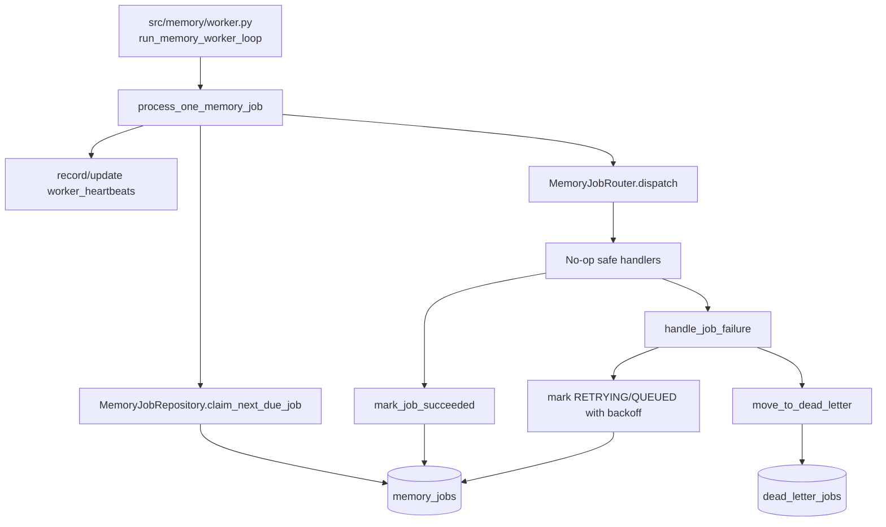

# Phase 3B Design: Worker Router, Retry, Dead Letter, and Heartbeat

## 1. Executive Summary

Phase 3B implements the background execution infrastructure for durable `memory_jobs` created in Phase 3A. It adds job claiming, status transitions, retry/backoff, dead-letter movement, worker heartbeats, a router skeleton, no-op/safe handlers, and a deterministic single-step worker function for tests.

This phase is infrastructure-only. It must not implement semantic extraction, episode generation, procedural candidate generation, consolidation logic, skill promotion, retrieval changes, or real memory LLM processing. Jobs may be claimed and completed by safe handlers, but those handlers must not create facts, episodes, candidates, summaries, embeddings, skills, or retrieval side effects.

The primary engineering constraint is that chat remains unaffected. The worker is independent from the graph and `/api/chat`; queued memory jobs can be processed when a worker is running, but chat must still succeed when no worker is running, when workers fail, or when secondary model credentials are unavailable.

## 2. Scope

In scope:

- Claim due `memory_jobs` records atomically enough for SQLite.
- Transition jobs through lifecycle states.
- Retry failed jobs with deterministic backoff.
- Move exhausted jobs to `dead_letter_jobs`.
- Record and update `worker_heartbeats`.
- Provide a memory job router skeleton.
- Provide no-op/safe handlers for all Phase 1 `MemoryJobType` values.
- Provide a deterministic `process_one_memory_job()` function for tests.
- Provide a worker loop that repeatedly calls the single-step function until stopped.
- Keep existing Phase 3A enqueue behavior unchanged.

Target files/modules for implementation:

- `src/memory/job_repository.py`
- `src/memory/job_router.py` new
- `src/memory/job_handlers.py` new
- `src/memory/worker.py` new
- `src/background_worker.py`
- Optional: `src/memory/jobs.py` for shared status constants only
- Optional: `src/api/server.py` only if the team chooses to satisfy the roadmap health endpoint in Phase 3B
- Tests only

Tables used:

- `memory_jobs`
- `dead_letter_jobs`
- `worker_heartbeats`

## 3. Out of Scope

Phase 3B must not implement:

- Semantic extraction.
- Episode generation.
- Procedural candidate generation.
- Semantic consolidation.
- Procedural consolidation.
- Skill promotion.
- Skill file writing.
- Retrieval planning or retrieval changes.
- Embedding generation.
- Deduplication logic.
- LLM memory processing beyond mocked/skeleton handler boundaries.
- Backfill from legacy tables.
- Schema migrations or table changes.
- Any change to chat response shape.

The no-op handlers may validate payload shape and return structured no-op results. They must not invoke `get_secondary_llm()`, semantic modules, episodic generation modules, procedural generation modules, retrievers, or skill writers.

## 4. Current Queue Assessment

Phase 3A introduced:

- `src/memory/jobs.py`
- `src/memory/job_repository.py`
- `node_consolidate()` enqueue-only behavior in `src/harness/graph.py`

Current Phase 3A behavior:

- Successful completed turns enqueue `semantic_candidate_extraction`.
- Optional `episode_generation` is enqueued only for deterministic triggers.
- Enqueued jobs are inserted with status `QUEUED`.
- Duplicate idempotency keys reuse existing rows.
- Queue persistence failures do not break chat.
- No worker processes jobs yet.

Current `memory_jobs` fields relevant to Phase 3B:

| Column | Phase 3B use |
|---|---|
| `id` | Stable job identity. |
| `job_type` | Router dispatch key. |
| `status` | Lifecycle state. |
| `priority` | Claim ordering; lower number wins. |
| `session_id` | Diagnostics and handler context. |
| `idempotency_key` | Duplicate guard from Phase 3A. |
| `payload_json` | Handler input. |
| `result_json` | Safe handler result or future real handler result. |
| `error_message` | Last failure summary. |
| `attempt_count` | Number of failed attempts. |
| `max_attempts` | Retry limit copied from queue config. |
| `available_at` | Backoff/due timestamp. |
| `locked_by` | Worker claim owner. |
| `locked_at` | Claim timestamp. |
| `started_at` | First/last processing start timestamp. |
| `completed_at` | Terminal completion timestamp. |
| `created_at` | Original enqueue timestamp. |
| `updated_at` | Last lifecycle update timestamp. |

Current `dead_letter_jobs` fields relevant to Phase 3B:

- Store terminal failed job snapshot after retry exhaustion.
- Preserve original `job_id`, `job_type`, `session_id`, `idempotency_key`, `payload_json`, final error, attempt count, and timestamps.

Current `worker_heartbeats` fields relevant to Phase 3B:

- Track `worker_id`, `worker_type`, `status`, `current_job_id`, `last_heartbeat_at`, `started_at`, `metadata_json`, `created_at`, and `updated_at`.

Current `src/background_worker.py`:

- Contains scheduled job polling only.
- Has a loop/stop-event shape that can be extended carefully.
- Should remain able to run scheduled jobs independently.

## 5. Worker Architecture



Primary modules:

- `src/memory/worker.py`: worker loop and deterministic single-step function.
- `src/memory/job_router.py`: dispatches a job row to a handler by `job_type`.
- `src/memory/job_handlers.py`: no-op/safe handler classes and registry.
- `src/memory/job_repository.py`: claim/update/dead-letter/heartbeat SQL.
- `src/background_worker.py`: optional integration point to run memory worker alongside scheduled worker.

The worker loop is deliberately thin. All important behavior must be available through a deterministic single-step function:

```python
def process_one_memory_job(
    worker_id: str,
    router: MemoryJobRouter | None = None,
    db_path: Path | None = None,
    now: datetime | None = None,
) -> MemoryWorkerStepResult:
    ...
```

Tests should primarily call `process_one_memory_job()` with explicit `now` values. The long-running loop should have only smoke tests with a stop event.

## 6. Job Claiming Strategy

### Claimable statuses

The worker may claim jobs where:

- `status IN ('QUEUED', 'RETRYING')`
- `available_at <= now`
- `locked_by IS NULL`

The worker must not claim:

- `RUNNING` jobs unless a stale-lock recovery path is explicitly invoked.
- `SUCCEEDED`
- `FAILED`
- `DEAD_LETTERED`
- `CANCELLED`

### Claim order

Claim order:

1. Lower `priority`.
2. Earlier `available_at`.
3. Earlier `created_at`.

SQL selection shape:

```sql
SELECT *
FROM memory_jobs
WHERE status IN ('QUEUED', 'RETRYING')
  AND available_at <= ?
  AND locked_by IS NULL
ORDER BY priority ASC, available_at ASC, created_at ASC
LIMIT 1
```

Then claim with a guarded update:

```sql
UPDATE memory_jobs
SET status = 'RUNNING',
    locked_by = ?,
    locked_at = ?,
    started_at = COALESCE(started_at, ?),
    updated_at = ?
WHERE id = ?
  AND status IN ('QUEUED', 'RETRYING')
  AND locked_by IS NULL
```

If `rowcount == 1`, the worker owns the job. If `rowcount == 0`, another worker claimed it or the job changed; return a no-job result and let the loop try again later.

### SQLite concurrency note

SQLite does not provide `SELECT ... FOR UPDATE`. The guarded update is the safety mechanism. Phase 3B should keep claims short and avoid holding transactions during handler execution.

Recommended sequence:

1. Select due candidate.
2. Guarded update to `RUNNING`.
3. Commit immediately.
4. Execute handler outside the claim transaction.
5. Open a new transaction for success/failure transition.

### Stale running jobs

Phase 3B should include deterministic stale-lock recovery, but it must not run automatically in chat paths.

Design:

- Config value: use `queue.job_timeout_seconds`.
- Function: `recover_stale_running_jobs(worker_id, now=None, db_path=None)`.
- Find `RUNNING` jobs where `locked_at < now - job_timeout_seconds`.
- Treat as failure with error message `Worker lock timed out`.
- Apply the same retry/dead-letter decision as normal failure.

This enables crash recovery without relying on real time in tests.

## 7. Status Transition Design

Allowed Phase 3B transitions:

| From | To | Trigger |
|---|---|---|
| `QUEUED` | `RUNNING` | Worker claims due job. |
| `RETRYING` | `RUNNING` | Worker claims due retry. |
| `RUNNING` | `SUCCEEDED` | Handler returns success. |
| `RUNNING` | `RETRYING` | Handler fails and attempts remain. |
| `RUNNING` | `DEAD_LETTERED` | Handler fails and attempts exhausted. |
| `RUNNING` | `FAILED` | Reserved only for non-retryable infrastructure failure if not dead-lettered. |
| `QUEUED`/`RETRYING` | `CANCELLED` | Reserved for future manual cancellation; not required in Phase 3B. |

Phase 3B should not transition jobs back to `QUEUED` after a failure. Use `RETRYING` with future `available_at`; the claim query includes both `QUEUED` and due `RETRYING`.

### Success transition

On handler success:

```sql
UPDATE memory_jobs
SET status = 'SUCCEEDED',
    result_json = ?,
    error_message = NULL,
    locked_by = NULL,
    locked_at = NULL,
    completed_at = ?,
    updated_at = ?
WHERE id = ?
  AND status = 'RUNNING'
  AND locked_by = ?
```

The result must be JSON text. No-op handlers should return a small result:

```json
{
  "handler": "noop",
  "job_type": "semantic_candidate_extraction",
  "processed": false,
  "message": "Phase 3B infrastructure handler only"
}
```

### Failure transition

On handler failure:

- Increment `attempt_count`.
- If `attempt_count < max_attempts`, set status `RETRYING` and future `available_at`.
- If `attempt_count >= max_attempts`, move to dead letter and set original job `DEAD_LETTERED`.

`FAILED` should be rare in Phase 3B. Prefer `RETRYING` or `DEAD_LETTERED` so terminal failures have durable diagnostics.

## 8. Retry and Dead Letter Design

### Retry policy

Use Phase 1 queue config:

- `queue.retry_limit` already copied into `memory_jobs.max_attempts` by Phase 3A.
- `queue.retry_backoff_seconds` determines the delay before the next claim.

Deterministic backoff formula for Phase 3B:

```text
delay_seconds = retry_backoff_seconds * attempt_count
```

Where `attempt_count` is the new count after the failure. This gives simple linear backoff and deterministic tests.

Example with `retry_backoff_seconds = 30`:

- First failure: `attempt_count = 1`, delay `30s`.
- Second failure: `attempt_count = 2`, delay `60s`.
- Third failure with `max_attempts = 3`: dead-letter.

Phase 3B should not implement jitter. Jitter complicates deterministic testing and can be added later if needed.

### Retry update

```sql
UPDATE memory_jobs
SET status = 'RETRYING',
    attempt_count = ?,
    available_at = ?,
    error_message = ?,
    locked_by = NULL,
    locked_at = NULL,
    updated_at = ?
WHERE id = ?
  AND status = 'RUNNING'
  AND locked_by = ?
```

Do not clear `started_at`; it records that processing has begun historically.

### Dead-letter movement

Dead-letter movement should be one transaction:

1. Insert snapshot into `dead_letter_jobs`.
2. Update original `memory_jobs` row to `DEAD_LETTERED`.
3. Clear lock fields.
4. Set `completed_at`.
5. Commit.

Dead-letter ID format:

```text
dlj_{job_id}_{attempt_count}
```

If that conflicts, append a short hash of the failure timestamp. Tests should assert one row per exhausted job.

Dead-letter insert shape:

```sql
INSERT INTO dead_letter_jobs (
    id,
    job_id,
    job_type,
    session_id,
    idempotency_key,
    payload_json,
    last_error,
    error_details_json,
    attempt_count,
    failed_at,
    created_at
) VALUES (?, ?, ?, ?, ?, ?, ?, ?, ?, ?, ?)
```

`error_details_json` should contain deterministic structured context:

```json
{
  "worker_id": "memory-worker-1",
  "job_status_before_dead_letter": "RUNNING",
  "max_attempts": 3,
  "handler": "noop",
  "error_type": "RuntimeError"
}
```

### Non-retryable failures

Phase 3B skeleton handlers should not need non-retryable failures. The router may define a `retryable` flag in handler results or exceptions for future phases, but default behavior should treat exceptions as retryable until `max_attempts` is reached.

## 9. Heartbeat Design

Worker heartbeat is stored in `worker_heartbeats`.

Worker statuses:

- `STARTING`
- `RUNNING`
- `IDLE`
- `STOPPING`
- `STOPPED`
- `ERROR`
- `STALE`

Phase 3B should implement repository methods:

```python
def upsert_worker_heartbeat(
    worker_id: str,
    status: str,
    current_job_id: str | None = None,
    metadata: dict[str, Any] | None = None,
    now: datetime | None = None,
) -> None: ...
```

Heartbeat behavior:

- On loop startup: `STARTING`, then `IDLE`.
- Before/while processing a job: `RUNNING` with `current_job_id`.
- After no job found: `IDLE` with `current_job_id = NULL`.
- On graceful stop: `STOPPING`, then `STOPPED`.
- On unhandled loop-level error: `ERROR`.

`process_one_memory_job()` should update heartbeat deterministically:

1. `RUNNING` with `current_job_id` after successful claim.
2. `IDLE` after success/failure transition.
3. `IDLE` when no due job is found.

Metadata JSON:

```json
{
  "worker_type": "memory",
  "phase": "3B",
  "pid": 12345,
  "hostname": "optional",
  "worker_version": 1
}
```

No API behavior is required for heartbeat in this design unless the implementation explicitly includes the roadmap's `/api/system/health` enhancement. If health is enhanced in Phase 3B, it must be read-only and additive: no existing response fields removed, and chat response shape unchanged. Rich frontend observability still belongs to Phase 10.

## 10. Router and Handler Skeleton Design

### Router

New file: `src/memory/job_router.py`.

Responsibilities:

- Decode `payload_json`.
- Validate job type is registered.
- Dispatch to a handler.
- Return a structured `JobHandlerResult`.
- Avoid importing LLM clients or concrete memory writer modules.

Design-level classes:

```python
@dataclass(frozen=True)
class JobHandlerResult:
    success: bool
    result: dict[str, Any]
    retryable: bool = True

class MemoryJobRouter:
    def __init__(self, handlers: Mapping[str, MemoryJobHandler] | None = None): ...
    def dispatch(self, job: Mapping[str, Any]) -> JobHandlerResult: ...
```

Unknown job type behavior:

- Treat as retryable failure initially.
- After retry exhaustion, move to dead letter.
- Do not mark unknown jobs succeeded, because future typoed job types should not silently disappear.

Payload decode failure:

- Treat as retryable failure until exhausted.
- Dead-letter record preserves raw payload and decode error.

### Handler protocol

New file: `src/memory/job_handlers.py`.

Design-level protocol:

```python
class MemoryJobHandler(Protocol):
    job_type: str
    def handle(self, job: Mapping[str, Any], payload: Mapping[str, Any]) -> JobHandlerResult: ...
```

### No-op safe handlers

Register safe handlers for every existing `MemoryJobType`:

- `semantic_candidate_extraction`
- `episode_generation`
- `procedural_candidate_generation`
- `semantic_consolidation`
- `procedural_consolidation`
- `skill_promotion`
- `summary_generation`

The handlers must:

- Validate payload has `schema_version`.
- Validate payload is a mapping.
- Return `success=True`.
- Return a no-op `result_json`.
- Not write any memory tables other than updating the current `memory_jobs` row through worker completion.
- Not call LLMs.
- Not call semantic, episodic, procedural, consolidation, skill, or retrieval implementation modules.

No-op result shape:

```json
{
  "handler": "noop",
  "job_type": "semantic_candidate_extraction",
  "processed": false,
  "phase": "3B",
  "message": "Infrastructure-only handler; real behavior is implemented in later phases"
}
```

This lets Phase 3B verify worker infrastructure without accidentally introducing memory behavior. Later phases replace individual handlers behind the same router.

## 11. Failure Handling

### Chat isolation

The worker must never run in the chat request path. `node_consolidate()` remains enqueue-only from Phase 3A. If the worker is stopped or broken:

- Chat still returns normally.
- Jobs remain in `QUEUED` or `RETRYING`.
- No user-facing exception is raised from worker state.

### Handler exceptions

If handler dispatch raises:

1. Catch in `process_one_memory_job()`.
2. Convert to error summary and details.
3. Apply retry or dead-letter policy.
4. Update heartbeat back to `IDLE` or `ERROR` depending on severity.

### Repository exceptions

Repository transition failures should be raised to the worker step result and not swallowed silently. Tests should assert deterministic failure results. The loop can catch, mark heartbeat `ERROR`, wait, and continue until stopped.

### Worker crash simulation

If a process crashes after claim but before completion:

- Job remains `RUNNING`.
- `locked_by` and `locked_at` remain set.
- `recover_stale_running_jobs()` later converts it into retry/dead-letter based on `job_timeout_seconds`.

### Cancellation

`CANCELLED` exists in the schema but does not need a public API in Phase 3B. Worker should skip cancelled jobs.

## 12. Test Plan

Suggested new test files:

- `tests/test_phase3b_worker_repository.py`
- `tests/test_phase3b_worker_step.py`
- `tests/test_phase3b_router_handlers.py`
- `tests/test_phase3b_heartbeat.py`

### Repository tests

Add tests for:

- Claiming the highest-priority due `QUEUED` job.
- Claiming due `RETRYING` jobs.
- Not claiming future `available_at` jobs.
- Not claiming `RUNNING`, `SUCCEEDED`, `FAILED`, `DEAD_LETTERED`, or `CANCELLED` jobs.
- Guarded claim prevents double-claim when status/lock changed.
- Mark success sets `SUCCEEDED`, `result_json`, `completed_at`, clears lock fields.
- Failure with attempts remaining sets `RETRYING`, increments `attempt_count`, sets future `available_at`, clears lock fields.
- Failure at max attempts inserts `dead_letter_jobs` row and marks original `DEAD_LETTERED`.
- Stale running recovery retries or dead-letters timed-out jobs.

### Router/handler tests

Add tests for:

- Every current `MemoryJobType` has a registered safe handler.
- No-op handlers return success with `processed=false`.
- No-op handlers do not write facts, episodes, pending fact candidates, structured episodes, skills, summary blocks, embeddings, dedup events, consolidation runs, skill candidates, skill versions, or skill usage stats.
- Unknown job type returns failure and is dead-lettered after retry exhaustion.
- Invalid JSON payload returns failure and is retried/dead-lettered.
- Monkeypatch `get_secondary_llm()` to raise; worker still processes no-op handler without calling it.

### Worker step tests

Add tests for:

- `process_one_memory_job()` returns no-job result when queue empty.
- One queued job transitions to `SUCCEEDED` with no-op result.
- Handler exception transitions to `RETRYING`.
- Handler exception at max attempts transitions to `DEAD_LETTERED`.
- `process_one_memory_job()` updates heartbeat to `RUNNING` then `IDLE`.
- Worker stopped/unavailable does not affect Phase 3A enqueue tests or chat tests.

### Heartbeat tests

Add tests for:

- Upsert creates heartbeat row.
- Repeated heartbeat updates same worker row.
- Current job ID is set while running and cleared when idle.
- Graceful loop stop records `STOPPED`.
- Stale heartbeat detection can mark/report `STALE` deterministically using injected `now`.

### Integration/regression tests

Run:

- Phase 2 schema tests.
- Phase 3A queue tests.
- New Phase 3B worker tests.
- Graph/chat tests proving chat works when worker is not running.
- Full suite if feasible.

Avoid sleep-based tests. Use explicit `now` injection and direct single-step calls.

## 13. Risks

| Risk | Impact | Mitigation |
|---|---|---|
| Worker runs in chat path | Chat latency and failures leak to users | Keep graph enqueue-only; worker called only from worker loop/tests. |
| Flaky timing tests | Unstable CI | Use injected `now`; test single-step functions. |
| SQLite double-claim race | Duplicate processing | Guarded update with status and lock predicates. |
| Jobs stuck in `RUNNING` after crash | Queue stalls | Add stale running recovery with deterministic timeout. |
| Skeleton handlers accidentally call LLMs | Violates architecture boundary | No handler imports LLM/model modules; add monkeypatch tests. |
| No-op handlers hide future implementation gaps | Jobs appear succeeded without real memory writes | Result JSON must say `processed=false`; later phases replace handlers explicitly. |
| Dead-letter movement partially completes | Diagnostics lost or duplicate terminal state | Insert dead-letter and update original job in one transaction. |
| Health endpoint scope expands too early | API churn | Keep health additive/read-only if implemented; detailed UI belongs to Phase 10. |

## 14. Acceptance Criteria

Phase 3B is complete when:

- A deterministic single-step worker can claim one due job and process it.
- Worker loop exists but is thin and stoppable.
- Claiming uses status, availability, priority, and lock guards.
- Jobs transition through `QUEUED`/`RETRYING` -> `RUNNING` -> `SUCCEEDED` for safe handlers.
- Handler failures retry with configured deterministic backoff.
- Exhausted failures move to `dead_letter_jobs` and mark the original job `DEAD_LETTERED`.
- Worker heartbeat rows are created and updated.
- Stale running jobs can be recovered deterministically.
- Router skeleton dispatches all current `MemoryJobType` values.
- Handlers are no-op/safe and do not call LLMs or memory behavior modules.
- Chat remains unaffected when the worker is stopped.
- No semantic extraction, episode generation, procedural generation, consolidation, skill promotion, retrieval, or memory LLM behavior is implemented.
- Tests cover claim, success, retry, dead-letter, heartbeat, no-op handlers, stale recovery, and chat isolation.

## 15. Implementation Checklist

1. Add status constants for `RUNNING`, `RETRYING`, `SUCCEEDED`, `FAILED`, `DEAD_LETTERED`, and `CANCELLED` in an appropriate queue module.
2. Extend `MemoryJobRepository` with claim, success, failure, retry, dead-letter, stale recovery, and heartbeat methods.
3. Add `src/memory/job_handlers.py`.
4. Define `JobHandlerResult` and `MemoryJobHandler` protocol.
5. Implement no-op safe handlers for all current `MemoryJobType` values.
6. Add `src/memory/job_router.py`.
7. Implement dispatch, payload decode, unknown type behavior, and handler exception propagation.
8. Add `src/memory/worker.py`.
9. Implement `MemoryWorkerStepResult`.
10. Implement deterministic `process_one_memory_job()`.
11. Implement stoppable `run_memory_worker_loop()`.
12. Add stale running recovery function using injected `now`.
13. Optionally refactor `src/background_worker.py` to expose a memory worker entry point without breaking scheduled job polling.
14. Optionally add read-only `/api/system/health` heartbeat/queue fields if Phase 3B API scope is approved.
15. Add repository tests.
16. Add router/handler tests.
17. Add worker step tests.
18. Add heartbeat tests.
19. Run Phase 2, Phase 3A, Phase 3B, graph/chat, and full regression tests.

## File-by-File Design

### Modify: `src/memory/job_repository.py`

Add methods:

- `claim_next_due_job(worker_id, now=None) -> dict | None`
- `mark_job_succeeded(job_id, worker_id, result, now=None) -> None`
- `handle_job_failure(job, worker_id, error, error_details=None, now=None, retry_backoff_seconds=None) -> FailureTransitionResult`
- `move_to_dead_letter(job, worker_id, error, error_details=None, now=None) -> None`
- `recover_stale_running_jobs(worker_id, timeout_seconds, now=None) -> list[FailureTransitionResult]`
- `upsert_worker_heartbeat(worker_id, status, current_job_id=None, metadata=None, now=None) -> None`

Keep existing enqueue and read helpers intact for Phase 3A tests.

### New: `src/memory/job_handlers.py`

Add safe handler definitions:

- `JobHandlerResult`
- `MemoryJobHandler`
- `NoOpMemoryJobHandler`
- `build_default_handler_registry()`

No imports from semantic, episodic generation, procedural, retrieval, LLM, or skill-writing modules.

### New: `src/memory/job_router.py`

Add:

- `MemoryJobRouter`
- Payload decoding.
- Handler lookup.
- Unknown job failure.
- Structured result/failure boundaries.

### New: `src/memory/worker.py`

Add:

- `MemoryWorkerStepResult`
- `process_one_memory_job()`
- `run_memory_worker_loop()`
- `recover_stale_running_jobs()` wrapper if not repository-only.

This module may import router and repository, but must not import real memory behavior modules.

### Modify: `src/background_worker.py`

Keep scheduled worker behavior unchanged. If integrated in Phase 3B, add separate memory worker entry points rather than mixing scheduled and memory job semantics in the same function.

Acceptable additions:

- `run_memory_worker_loop` import guarded under function scope.
- `run_combined_worker_loop()` that calls scheduled processing and memory single-step processing independently.

Do not make scheduled job processing depend on memory worker success.

### Avoid Modify: `src/harness/graph.py`

No Phase 3B graph changes are required. It must remain enqueue-only and chat-safe from Phase 3A.

### Avoid Modify: `src/memory/async_workers.py`

Do not wire old synchronous memory behavior into worker handlers. Later phases may replace this module or extract corrected behavior, but Phase 3B skeleton handlers must stay safe.

## Compatibility With Future Phases

Phase 4 will add correct dual-LLM role routing. Phase 7 and Phase 8 will replace no-op handlers with real semantic and procedural handlers. Phase 3B should support that by:

- Passing payload and job metadata through the router without lossy transformations.
- Keeping handler interfaces explicit and narrow.
- Storing handler results in `result_json`.
- Preserving failure diagnostics in `error_message` and `dead_letter_jobs.error_details_json`.
- Avoiding hardcoded assumptions that only Phase 3A job types will exist.
- Keeping all time and retry behavior deterministic under tests.

