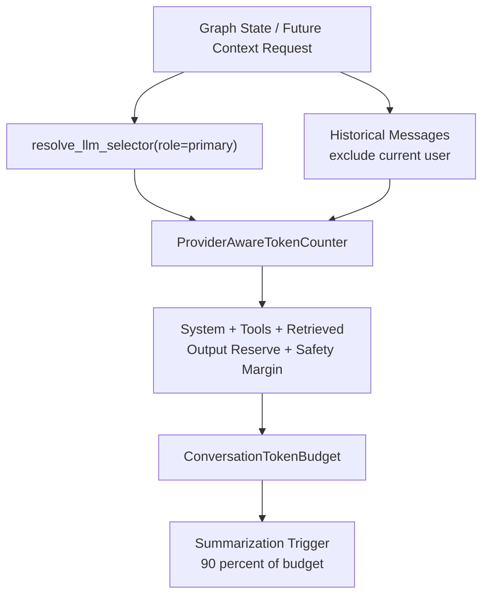

# Phase 5A Design: Token Budgeting Primitives

## 1. Executive Summary

Phase 5A introduces provider-aware token budgeting primitives for short-term memory without changing runtime trimming, summarization, retrieval, queue, worker, or database behavior.

The current code estimates tokens with a simple character heuristic inside `src/memory/short_term.py` and immediately uses that estimate to decide whether to compact message history. That combines measurement, budget math, model-context lookup, and trimming behavior in one module. Phase 5A separates the measurement and budget-calculation concerns into a new pure module, `src/memory/token_budget.py`, so Phase 5B can later replace message-count compaction with architecture-compliant token-based summary blocks.

Phase 5A must be behavior-preserving. It may add tests and pure calculation helpers, but it must not trim messages, create summary blocks, call the secondary LLM, enqueue jobs, alter retrieval, or write to the database.

## 2. Scope

In scope:

- Add token budgeting primitives in `src/memory/token_budget.py`.
- Define a provider-aware token counter abstraction aligned with the Phase 1 `TokenCounter` protocol.
- Provide a deterministic fallback token estimator.
- Resolve context windows through Phase 4 primary model selection metadata.
- Calculate available historical conversation budget from context window, system prompt, tool schemas, retrieved memories, output reserve, and safety margin.
- Calculate summarization trigger thresholds as 90 percent of conversation budget by default.
- Exclude the current user message from historical conversation budget calculations.
- Add deterministic unit tests for the new primitives.
- Preserve existing short-term memory behavior and existing public API shapes.

Likely implementation files:

- `src/memory/token_budget.py` new
- `tests/test_phase5a_token_budget.py` new
- Optional minimal compatibility update in `src/memory/short_term.py` only if `estimate_tokens()` can delegate to the new fallback counter without changing outputs.

## 3. Out of Scope

Phase 5A must not implement:

- Summarization.
- Summary block creation or persistence.
- Message trimming or context assembly changes.
- Secondary LLM calls.
- Episode generation.
- Semantic extraction.
- Retrieval changes.
- Database writes.
- Worker behavior changes.
- Memory job schema changes.
- Runtime behavior changes in `/api/chat`.

The existing `manage_short_term_memory_with_budget()` behavior remains legacy behavior until Phase 5B.

## 4. Current Short-Term Memory Assessment

### `src/memory/short_term.py`

Current strengths:

- Provides a centralized place for raw turn logging and history retrieval.
- Has a simple deterministic `estimate_tokens()` helper.
- Existing tests cover compaction ratio selection, raw turn logging, and current compaction behavior.

Current gaps:

- Token estimation is fixed at `len(content) // 4` and is not provider-aware.
- Budget math is embedded inside `manage_short_term_memory_with_budget()`.
- `system_reservation = int(context_window_limit * 0.25)` is calculated but not actually used to reserve system/tool/retrieval space.
- Historical conversation budgeting counts all non-system messages together and does not explicitly exclude the current user message.
- Compaction decisions are coupled to immediate secondary LLM summarization.
- `manage_short_term_memory()` still supports fixed message-count trimming through `max_messages`.
- `generate_thread_title()` still has a secondary LLM compatibility path, although Phase 4 removed its use from `/api/chat`.

Phase 5A does not repair these behavioral gaps directly. It creates the correct calculation layer so Phase 5B can replace the legacy compaction path cleanly.

### `src/harness/graph.py`

Current strengths:

- `node_manage_memory()` already resolves the primary selector via `resolve_llm_selector(role="primary", ...)` before choosing a context window.
- `node_agent()` uses `resolve_primary_llm()` for user-facing generation.
- `node_consolidate()` is enqueue-only and does not perform memory LLM work.

Current gaps:

- `node_manage_memory()` still calls `manage_short_term_memory_with_budget()`, which may call `get_secondary_llm()` and compact during chat.
- Token counting in graph state still uses legacy `estimate_tokens()`.
- Retrieved-memory context is appended later by `node_retrieval_gate()`, so current budget math does not account for retrieved memories.
- Tool schema token cost is not included in any budget calculation.

Phase 5A should define graph integration points but should not change graph execution behavior.

### `src/harness/llm_router.py`

Current strengths:

- Provides `LLMSelector` with normalized provider, model name, role, temperature, and context window.
- Provides `resolve_llm_selector()` without requiring LLM invocation.
- Provides primary and secondary route boundaries required by Phase 4.

Phase 5A should use `resolve_llm_selector(role="primary", ...)` for context-window lookup because budgeting should not instantiate an LLM client.

### `src/harness/models.py`

Current strengths:

- Owns `CONTEXT_WINDOW_CAPACITIES`, `MODEL_PAIRS`, and `get_context_window()`.
- The catalog already includes OpenAI, Anthropic, Gemini, and Grok/xAI capacity defaults.

Phase 5A should not duplicate model capacity tables. Context windows should flow through `llm_router.resolve_llm_selector()` and ultimately `models.get_context_window()`.

### `src/memory/config.py`

Current strengths:

- `ShortTermMemoryConfig` already defines:
  - `conversation_budget_ratio = 0.75`
  - `summarization_trigger_ratio = 0.90`
  - `output_reserve_ratio = 0.10`
  - `safety_margin_ratio = 0.05`
  - `max_summary_blocks = 20`
- Ratio validation already exists.

Phase 5A should consume these values rather than introducing new constants.

### Existing Tests

Relevant current tests:

- `tests/test_short_term_budgeting.py`
- `tests/test_harness.py`
- `tests/test_phase4_llm_router.py`

The new tests should verify token budget primitives while keeping the existing short-term behavior tests unchanged.

## 5. Proposed Token Budget Architecture

Create `src/memory/token_budget.py` as a pure calculation module.

Responsibilities:

- Count text and message tokens through a provider-aware abstraction.
- Provide deterministic fallback token counting when provider tokenizers are unavailable.
- Resolve primary context windows without creating LLM clients.
- Split historical conversation messages from the current user message.
- Calculate reserved token categories.
- Calculate historical conversation budget.
- Calculate summarization trigger thresholds.
- Return structured budget and token-breakdown dataclasses for later phases.

Non-responsibilities:

- No message mutation.
- No trimming.
- No summarization.
- No summary block persistence.
- No LLM calls.
- No database access.
- No retrieval execution.
- No worker changes.

High-level flow:



## 6. Token Counting Strategy

### Token Counter Abstraction

Phase 1 already defines `TokenCounter` in `src/memory/interfaces.py`:

```python
class TokenCounter(Protocol):
    def count_text(self, text: str, model_name: str) -> int: ...
    def count_messages(self, messages: Sequence[BaseMessage], model_name: str) -> int: ...
```

Phase 5A should provide concrete implementations compatible with this protocol.

### Proposed Classes

```python
@dataclass(frozen=True)
class TokenCounterSelector:
    provider: str
    model_name: str
    tokenizer_name: str
    uses_fallback: bool
```

```python
class FallbackTokenCounter:
    def count_text(self, text: str, model_name: str) -> int: ...
    def count_messages(self, messages: Sequence[BaseMessage], model_name: str) -> int: ...
```

```python
class ProviderAwareTokenCounter:
    def __init__(self, fallback: TokenCounter | None = None): ...
    def selector_for(self, provider: str, model_name: str) -> TokenCounterSelector: ...
    def count_text(self, text: str, model_name: str, provider: str = "openai") -> int: ...
    def count_messages(
        self,
        messages: Sequence[BaseMessage],
        model_name: str,
        provider: str = "openai",
    ) -> int: ...
```

Implementation guidance:

- The fallback estimator should be deterministic and dependency-free.
- To preserve existing behavior when used as a compatibility wrapper, fallback message counting should use the same message-content heuristic as `short_term.estimate_tokens()`: total content characters divided by 4, with an integer floor.
- Empty text and empty message lists should return `0`.
- Non-string message content should be converted with `str()`, matching current behavior.
- Provider-specific tokenizers may be added later behind the same abstraction, but Phase 5A should not add heavy required dependencies.
- If optional tokenizer dependencies are unavailable, the counter must fall back without raising.
- Token counting must never instantiate an LLM client.

### Message Classification

Phase 5A should expose pure helpers that classify message groups for budget calculation:

```python
@dataclass(frozen=True)
class MessageTokenBreakdown:
    system_tokens: int
    historical_conversation_tokens: int
    current_user_message_tokens: int
    tool_message_tokens: int
    total_counted_tokens: int
    historical_message_count: int
    current_user_message_present: bool
```

Rules:

- System messages count toward system prompt or retrieved-memory reserve, not historical conversation budget.
- The latest `HumanMessage` is treated as the current user message by default and excluded from historical conversation budget.
- Prior `HumanMessage`, `AIMessage`, and `ToolMessage` instances count as historical conversation.
- `ToolMessage` content counts as historical conversation unless the caller separately passes tool schema text. Tool schema definitions are not the same as tool results.
- Retrieved memories should be passed explicitly as strings or precomputed token counts. Phase 5A should not depend on marker text such as `[Retrieved Long-Term Memory]` for correctness.

## 7. Budget Formula

### Inputs

```python
@dataclass(frozen=True)
class TokenBudgetInputs:
    provider: str | None
    model_name: str | None
    messages: Sequence[BaseMessage]
    system_prompt_text: str = ""
    tool_schema_texts: Sequence[str] = ()
    retrieved_memory_texts: Sequence[str] = ()
    output_reserve_tokens: int | None = None
    safety_margin_tokens: int | None = None
    exclude_current_user_message: bool = True
```

The implementation may also support precomputed reserve values for future integration:

```python
system_prompt_tokens: int | None = None
tool_schema_tokens: int | None = None
retrieved_memory_tokens: int | None = None
```

### Output

```python
@dataclass(frozen=True)
class ConversationTokenBudget:
    provider: str
    model_name: str
    context_window: int
    conversation_budget_tokens: int
    summarization_trigger_tokens: int
    historical_conversation_tokens: int
    current_user_message_tokens: int
    system_prompt_tokens: int
    tool_schema_tokens: int
    retrieved_memory_tokens: int
    output_reserve_tokens: int
    safety_margin_tokens: int
    reserved_tokens: int
    available_input_tokens: int
    budget_usage_ratio: float
    trigger_usage_ratio: float
    should_trigger_summarization: bool
    counter_uses_fallback: bool
```

`should_trigger_summarization` is a decision primitive only. Phase 5A must not act on it.

### Formula

Use the Phase 1 short-term configuration:

- `conversation_budget_ratio`, default `0.75`
- `summarization_trigger_ratio`, default `0.90`
- `output_reserve_ratio`, default `0.10`
- `safety_margin_ratio`, default `0.05`

Definitions:

```text
context_window = primary_selector.context_window

output_reserve_tokens =
  explicit_output_reserve_tokens
  or floor(context_window * output_reserve_ratio)

safety_margin_tokens =
  explicit_safety_margin_tokens
  or floor(context_window * safety_margin_ratio)

explicit_context_reserve_tokens =
  system_prompt_tokens + tool_schema_tokens + retrieved_memory_tokens

reserved_tokens =
  explicit_context_reserve_tokens
  + output_reserve_tokens
  + safety_margin_tokens

target_conversation_ceiling =
  floor(context_window * conversation_budget_ratio)

absolute_available_for_conversation =
  max(0, context_window - reserved_tokens)

conversation_budget_tokens =
  max(0, min(target_conversation_ceiling, absolute_available_for_conversation))

summarization_trigger_tokens =
  floor(conversation_budget_tokens * summarization_trigger_ratio)

budget_usage_ratio =
  historical_conversation_tokens / conversation_budget_tokens
  if conversation_budget_tokens > 0 else 1.0

trigger_usage_ratio =
  historical_conversation_tokens / summarization_trigger_tokens
  if summarization_trigger_tokens > 0 else 1.0

should_trigger_summarization =
  historical_conversation_tokens >= summarization_trigger_tokens
  and summarization_trigger_tokens > 0
```

Rationale:

- The conversation budget is capped at 75 percent of the context by default.
- The budget is reduced if system prompt, tool schema, retrieved memory, output reserve, or safety margin requirements consume more than the reserved 25 percent.
- When reserve inputs match the approved architecture, the default usable historical conversation budget aligns with 75 percent of context.
- The summarization trigger is 90 percent of the calculated conversation budget.
- The current user message is excluded from `historical_conversation_tokens` so trimming decisions in Phase 5B will not summarize or evict the prompt currently being answered.

Example with a 128,000-token context:

```text
context_window = 128000
target_conversation_ceiling = 96000
output_reserve = 12800
safety_margin = 6400
system + tools + retrieved = 12800
reserved_tokens = 32000
absolute_available_for_conversation = 96000
conversation_budget_tokens = 96000
summarization_trigger_tokens = 86400
```

## 8. Graph Integration Plan

Phase 5A should not switch graph behavior.

Planned Phase 5A graph-facing API:

```python
def calculate_budget_for_primary_route(
    provider: str | None,
    model_name: str | None,
    messages: Sequence[BaseMessage],
    *,
    system_prompt_text: str = "",
    tool_schema_texts: Sequence[str] = (),
    retrieved_memory_texts: Sequence[str] = (),
    config: ShortTermMemoryConfig | None = None,
    counter: ProviderAwareTokenCounter | None = None,
) -> ConversationTokenBudget: ...
```

This helper should:

- Call `resolve_llm_selector(role="primary", ...)`.
- Use the resolved provider, model name, and context window.
- Count historical conversation messages excluding the latest user message.
- Count reserves from explicit system/tool/retrieved inputs.
- Return budget diagnostics without modifying messages.

Recommended graph integration boundaries:

- Phase 5A: do not change `node_manage_memory()` behavior.
- Phase 5A optional compatibility refactor: `short_term.estimate_tokens()` may delegate to `FallbackTokenCounter` if exact existing results are preserved.
- Phase 5B: replace `manage_short_term_memory_with_budget()` with token-budget driven summary block logic using `ConversationTokenBudget`.
- Phase 9B: reuse the same budget object during final adaptive context assembly after retrieval primitives exist.

Reasoning:

- `node_manage_memory()` currently runs before `node_retrieval_gate()`, so it cannot account for retrieved memories correctly yet.
- Moving budget enforcement now would create a temporary architecture where the calculation is correct but the context assembly order is not.
- Keeping Phase 5A pure avoids introducing technical debt between Phase 5A and Phase 5B.

## 9. Compatibility Strategy

Runtime compatibility:

- `/api/chat` request and response shapes remain unchanged.
- `node_manage_memory()`, `node_retrieval_gate()`, `node_agent()`, and `node_consolidate()` behavior remains unchanged in Phase 5A.
- No database tables are added or written.
- No memory jobs are created beyond existing Phase 3A behavior.
- No worker behavior changes.
- No secondary LLM calls are added.

Short-term compatibility:

- Existing `estimate_tokens()` should continue to return the same values.
- Existing `manage_short_term_memory_with_budget()` tests should remain valid.
- Existing fixed-message `manage_short_term_memory(max_messages=...)` behavior should remain unchanged until Phase 5B removes or deprecates it explicitly.

Import compatibility:

- `src/memory/token_budget.py` may import:
  - `langchain_core.messages`
  - `src.harness.llm_router.resolve_llm_selector`
  - `src.memory.config.ShortTermMemoryConfig`
  - `src.memory.config.load_memory_config`
  - `src.memory.interfaces.TokenCounter`
- It must not import `src.memory.short_term`, `src.harness.graph`, or runtime API modules, to avoid circular dependencies.

Configuration compatibility:

- Use `load_memory_config().short_term` by default.
- Allow tests to inject a `ShortTermMemoryConfig` directly.
- Do not introduce new environment variables in Phase 5A unless the existing Phase 1 config cannot represent a required value.

## 10. Test Plan

New test file:

- `tests/test_phase5a_token_budget.py`

Unit tests to add:

- Fallback counter returns `0` for empty text and empty message lists.
- Fallback counter preserves the legacy `len(content) // 4` message-content heuristic.
- Provider-aware counter returns deterministic counts without requiring provider credentials.
- Context window is resolved through the primary route for OpenAI, Anthropic, Gemini, and Grok.
- Unknown provider falls back to OpenAI selector behavior.
- Provided model names are preserved for budget calculation.
- Historical conversation token calculation excludes the latest `HumanMessage`.
- Current user message tokens are reported separately.
- System prompt tokens are reported separately from historical conversation tokens.
- Tool schema tokens reduce conversation budget.
- Retrieved memory tokens reduce conversation budget.
- Output reserve and safety margin reduce conversation budget.
- Default budget equals 75 percent of context when explicit reserve inputs consume the architecture-reserved 25 percent.
- Summarization trigger threshold equals 90 percent of conversation budget.
- `should_trigger_summarization` becomes true only when historical conversation tokens meet or exceed the trigger threshold.
- Extremely large reserve values clamp conversation budget to `0` without raising.
- No helper mutates the input message list.
- Budget calculation does not call `resolve_primary_llm()`, `resolve_secondary_llm()`, `get_primary_llm()`, `get_secondary_llm()`, or any LLM `.invoke()`.

Regression tests to run:

- `python -m pytest tests/test_phase5a_token_budget.py -q`
- `python -m pytest tests/test_short_term_budgeting.py tests/test_harness.py tests/test_phase4_llm_router.py -q`

Full suite:

- Run the full test suite if focused tests pass and runtime permits.

## 11. Risks

| Risk | Impact | Mitigation |
|---|---|---|
| Fallback token estimates differ from real provider tokenizers | Budget may be conservative or imprecise | Keep the abstraction provider-aware and record `counter_uses_fallback` so later tokenizer adapters can be added without changing callers. |
| Current user message is accidentally counted in historical budget | Phase 5B could summarize or trim the active prompt | Add explicit tests for latest-user exclusion and separate current-user reporting. |
| Phase 5A accidentally changes compaction behavior | User-facing regression and hidden secondary LLM calls during chat | Keep graph and compaction behavior unchanged; test the new module independently. |
| Budget formula double-counts system prompt or retrieved memory | Premature summarization in later phases | Accept explicit reserve inputs and keep message classification separate from caller-provided reserve text. |
| New module imports graph or API code | Circular import risk | Keep `token_budget.py` pure and route context lookup through `llm_router.resolve_llm_selector()` only. |
| Optional tokenizer libraries introduce nondeterminism | Flaky tests | Phase 5A should not require new tokenizer dependencies; tests should validate fallback behavior. |

## 12. Acceptance Criteria

Phase 5A is complete when:

- `src/memory/token_budget.py` exists and contains pure token-budgeting primitives.
- Token counting is available through a provider-aware abstraction with deterministic fallback behavior.
- Context windows are resolved through the Phase 4 primary selector path without LLM instantiation.
- Historical conversation budget calculations exclude the current user message.
- Conversation budget accounts for context window, system prompt, tool schemas, retrieved memories, output reserve, and safety margin.
- Default conversation budget aligns with 75 percent of context when reserve values match the approved architecture.
- Summarization trigger threshold is 90 percent of the calculated conversation budget.
- Budget helpers return structured diagnostics and do not mutate messages.
- No summarization, trimming, summary block writes, retrieval changes, database writes, worker changes, or secondary LLM calls are introduced.
- Existing `/api/chat` request/response shapes remain unchanged.
- Existing short-term memory tests continue to pass.
- New Phase 5A token-budget tests pass.

## 13. Implementation Checklist

1. Create `src/memory/token_budget.py`.
2. Define `TokenCounterSelector`.
3. Define `MessageTokenBreakdown`.
4. Define `TokenBudgetInputs`.
5. Define `ConversationTokenBudget`.
6. Implement `FallbackTokenCounter` with the legacy-compatible character heuristic.
7. Implement `ProviderAwareTokenCounter` with provider/model selector metadata and fallback behavior.
8. Implement helper to identify the latest current user message.
9. Implement helper to count historical conversation tokens excluding the latest user message.
10. Implement helper to count system prompt, tool schema, and retrieved memory reserve tokens from explicit inputs.
11. Implement budget calculation using Phase 1 `ShortTermMemoryConfig`.
12. Implement primary-route budget calculation using `resolve_llm_selector(role="primary", ...)`.
13. Ensure no helper calls an LLM factory or `.invoke()`.
14. Add `tests/test_phase5a_token_budget.py`.
15. Keep current `src/harness/graph.py` runtime behavior unchanged.
16. Keep current `src/memory/short_term.py` compaction behavior unchanged, except for an optional exact-output compatibility delegation of `estimate_tokens()`.
17. Run focused Phase 5A tests.
18. Run existing short-term, harness, and Phase 4 router regression tests.

## File-by-File Modifications

### New: `src/memory/token_budget.py`

Purpose:

- Provide provider-aware token counting and budget calculation primitives.

Expected contents:

- `TokenCounterSelector`
- `MessageTokenBreakdown`
- `TokenBudgetInputs`
- `ConversationTokenBudget`
- `FallbackTokenCounter`
- `ProviderAwareTokenCounter`
- `get_token_counter()`
- `split_historical_and_current_user_messages()`
- `count_message_tokens()`
- `calculate_message_token_breakdown()`
- `calculate_conversation_token_budget()`
- `calculate_budget_for_primary_route()`

Constraints:

- Pure functions/classes only.
- No DB access.
- No LLM instantiation.
- No message mutation.
- No runtime graph behavior change.

### Optional Modify: `src/memory/short_term.py`

Allowed only if exact compatibility is preserved:

- Update `estimate_tokens()` to delegate to `FallbackTokenCounter.count_messages()`.

Must not change:

- `log_raw_turn()`
- `get_raw_turns()`
- `get_compaction_ratio()`
- `manage_short_term_memory_with_budget()`
- `manage_short_term_memory()`
- `generate_thread_title()`

Rationale:

- Keeping existing behavior intact makes Phase 5A independently reviewable and avoids a partial behavior migration.

### Do Not Modify: `src/harness/graph.py`

Phase 5A should not modify graph execution.

Future Phase 5B will update:

- `node_manage_memory()` to use `calculate_budget_for_primary_route()`.
- Context trimming/summarization decisions to use token thresholds rather than fixed message counts.
- Summary block creation to use the Phase 2 `summary_blocks` table.

### Do Not Modify: `src/harness/llm_router.py`

No router changes are required. Phase 5A should consume `resolve_llm_selector()` as designed in Phase 4.

### Do Not Modify: `src/harness/models.py`

No provider catalog changes are required. Context window data is already available through `llm_router`.

### Do Not Modify: `src/memory/config.py`

No config schema changes are required. Phase 1 already added the needed short-term budget ratios.

### New: `tests/test_phase5a_token_budget.py`

Purpose:

- Verify deterministic token counting, budget math, primary context-window routing, current-user exclusion, reserve accounting, and no-LLM behavior.

## API Changes

None.

Phase 5A must not change `/api/chat`, `/api/models`, `/api/history`, data inspector endpoints, or response payload shapes.

## Database Changes

None.

Phase 5A must not create, alter, read for budget decisions, or write any database tables. Summary block persistence begins in Phase 5B.

## Migration Considerations

- Phase 5A creates a new calculation layer while legacy short-term behavior remains active.
- Phase 5B should be the first phase to enforce these budget calculations in runtime context management.
- The design intentionally avoids a temporary hybrid where budget diagnostics are calculated but only partially enforced.
- The new dataclasses should be stable enough for Phase 5B summary blocks and Phase 9B adaptive retrieval context assembly.
- The fallback counter should make no claims of exact provider tokenization accuracy; it is a deterministic safety layer until provider-specific adapters are added.
- Provider-aware context-window lookup should use the primary role because user-facing chat owns the active prompt budget.

