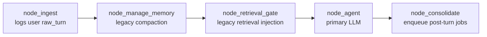
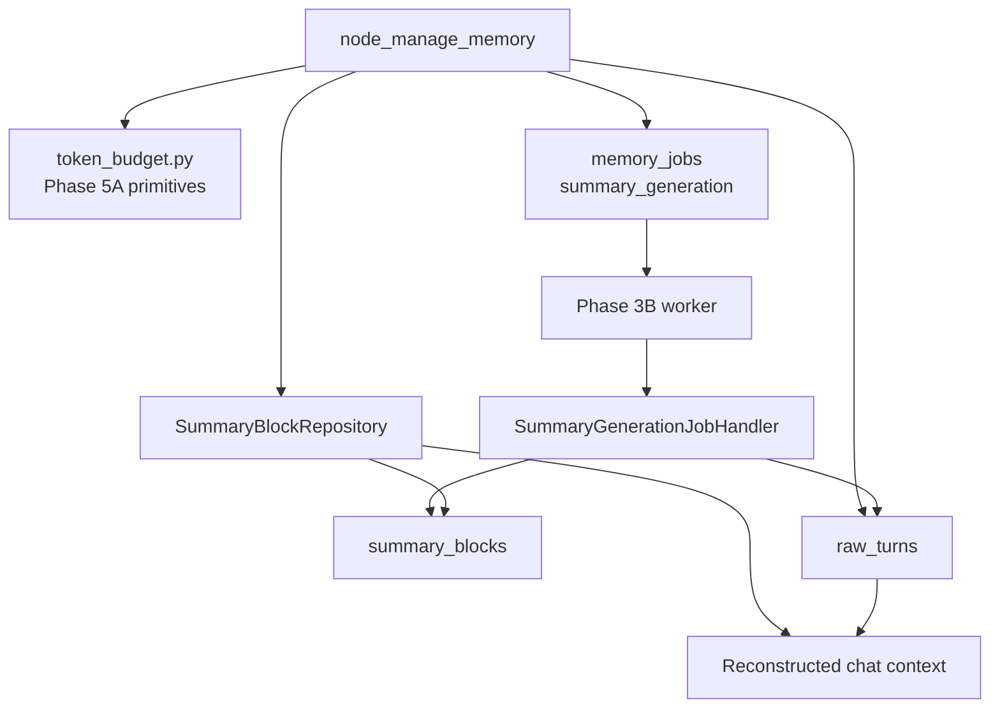

# Phase 5B Design: Immutable Short-Term Summary Blocks

## 1. Executive Summary

Phase 5B replaces legacy synchronous short-term memory compaction with token-based oldest-chunk summarization and immutable summary blocks.

After Phase 5A, ASTRA has pure provider-aware token budgeting primitives in `src/memory/token_budget.py`, but the runtime graph still calls `manage_short_term_memory_with_budget()` in `src/memory/short_term.py`. That legacy function uses message-count chunking and may call the secondary LLM inside the chat path. Phase 5B moves summary generation out of chat and into the existing Phase 3B memory worker infrastructure.

The target behavior is:

- `node_manage_memory()` uses Phase 5A token budget diagnostics.
- When historical conversation tokens exceed the summarization trigger, chat enqueues a durable `summary_generation` job and continues.
- The worker processes `summary_generation` jobs using the secondary LLM.
- Completed summaries are appended to the Phase 2 `summary_blocks` table as immutable records.
- Chat reconstructs short-term context from the system prompt, completed summary blocks, and recent raw turns selected by token budget.
- Raw turns are retained and are not deleted.
- If summary generation is pending, delayed, or failed, chat remains responsive through an explicit token-bounded recent-history fallback.

The important transition decision is explicit: Phase 5B must not block chat waiting for a summary. If a conversation is over budget and no completed summary block exists yet, ASTRA should enqueue or reuse a pending summary job, omit the oldest unsummarized raw turns from the immediate prompt using token-based selection, and include a small internal system notice that older unsummarized context is temporarily unavailable until background summarization completes. This is safer than silently overfilling the model context or reintroducing synchronous secondary LLM calls.

## 2. Scope

In scope:

- Add `src/memory/summary_blocks.py`.
- Add `SummaryBlockRepository`.
- Add append/read APIs for immutable summary blocks.
- Add token-based oldest-chunk selection.
- Add adaptive chunk ratios:
  - `<= 200000` context tokens: summarize oldest `30%` of eligible historical tokens.
  - `> 200000` and `<= 500000` context tokens: summarize oldest `25%`.
  - `> 500000` context tokens: summarize oldest `20%`.
- Add `summary_generation` job spec/payload construction.
- Add idempotent summary job enqueueing.
- Replace the `summary_generation` no-op handler with a real worker handler.
- Use secondary LLM routing only inside the worker handler.
- Persist generated summary blocks immutably.
- Reconstruct graph context from summary blocks plus recent raw turns.
- Replace graph usage of legacy synchronous compaction in `node_manage_memory()`.
- Add tests for repository behavior, chunk selection, enqueueing, worker handler behavior, and graph integration.

Likely implementation files:

- `src/memory/summary_blocks.py` new
- `src/memory/jobs.py` refactor for `summary_generation` payload helpers
- `src/memory/job_handlers.py` refactor for real summary handler registration
- `src/memory/short_term.py` replace legacy compaction behavior with compatibility wrappers over summary-block services
- `src/harness/graph.py` refactor `node_manage_memory()` only
- Tests only

## 3. Out of Scope

Phase 5B must not implement:

- Retrieval planner changes.
- Semantic extraction.
- Semantic deduplication.
- Episodic generation or episode continuation.
- Procedural candidate generation.
- Skill writing or skill promotion.
- New database migrations.
- Deletion of `raw_turns`.
- Worker loop redesign.
- Worker auto-start behavior changes.
- Secondary LLM calls in the chat path.
- Summary block regeneration or in-place updates.

Phase 5B may enqueue `summary_generation` jobs from the chat path, but the actual summarization LLM call must run only in the worker path.

## 4. Current Short-Term Memory Assessment

### `src/memory/short_term.py`

Current behavior:

- `estimate_tokens()` uses `sum(len(str(m.content)) for m in messages) // 4`.
- `log_raw_turn()` appends every user and assistant turn to `raw_turns`.
- `get_raw_turns()` reads persisted turns ordered by `created_at`.
- `get_compaction_ratio()` returns capacity-dependent ratios but with `>= 400000` and `>= 1000000` thresholds.
- `manage_short_term_memory_with_budget()`:
  - Uses a hardcoded 75 percent chat budget.
  - Computes but does not use a 25 percent system reservation.
  - Summarizes by message count, not token count.
  - Calls `get_secondary_llm()` directly in the chat path.
  - Returns a transient summary message instead of persisting immutable summary blocks.
- `manage_short_term_memory(max_messages=...)` still supports message-count trimming.

Phase 5B should replace runtime use of `manage_short_term_memory_with_budget()` and deprecate message-count compaction behavior. Existing raw-turn logging and history retrieval remain useful.

### `src/memory/token_budget.py`

Current Phase 5A primitives:

- `FallbackTokenCounter`
- `ProviderAwareTokenCounter`
- `TokenBudgetInputs`
- `ConversationTokenBudget`
- `calculate_budget_for_primary_route()`
- `calculate_conversation_token_budget()`
- `calculate_message_token_breakdown()`
- `split_historical_and_current_user_messages()`

These are the calculation foundation for Phase 5B. Phase 5B should reuse them rather than duplicating budget math.

### `src/harness/graph.py`

Current relevant flow:



Current gaps:

- `node_manage_memory()` still calls legacy compaction.
- Existing chat context is mostly rebuilt from the current state, not from durable `summary_blocks` plus `raw_turns`.
- `node_manage_memory()` may indirectly call the secondary LLM through `short_term.py`.

Phase 5B should refactor only `node_manage_memory()` and imports needed by that node.

### Queue and Worker Modules

Current strengths:

- `memory_jobs` already supports durable enqueueing, idempotency, retry, dead-letter, locks, and results.
- `MemoryJobRepository.enqueue()` already handles duplicate `idempotency_key`.
- `MemoryJobRouter` dispatches by `job_type`.
- `ALL_MEMORY_JOB_TYPES` already includes `summary_generation`.
- The default registry currently maps `summary_generation` to `NoOpMemoryJobHandler`.
- `resolve_memory_job_secondary_route()` exists for future worker handlers.

Phase 5B should replace only the `summary_generation` handler while keeping the worker loop and status transitions unchanged.

### Phase 2 `summary_blocks` Schema

Existing table:

| Column | Type | Notes |
|---|---|---|
| `id` | `TEXT PRIMARY KEY` | Deterministic or generated summary block id |
| `session_id` | `TEXT NOT NULL` | Owning session |
| `sequence_number` | `INTEGER NOT NULL CHECK > 0` | Monotonic per session |
| `summary` | `TEXT NOT NULL` | Summary text |
| `covered_message_ids_json` | `TEXT NOT NULL` | JSON list of covered `raw_turns.id` values |
| `start_message_id` | `TEXT` | First covered raw turn id |
| `end_message_id` | `TEXT` | Last covered raw turn id |
| `source_job_id` | `TEXT` | Originating `memory_jobs.id` |
| `token_count` | `INTEGER NOT NULL CHECK >= 0` | Token count of summary text |
| `original_token_count` | `INTEGER CHECK NULL OR >= 0` | Token count of covered raw turns |
| `model_provider` | `TEXT` | Secondary provider used |
| `model_name` | `TEXT` | Secondary model used |
| `created_at` | `TEXT` | Creation timestamp |

Existing indexes:

- Unique `(session_id, sequence_number)`.
- `(session_id, created_at)`.
- `(source_job_id)`.

No migration is required in Phase 5B.

## 5. Proposed Summary Block Architecture

Create `src/memory/summary_blocks.py`.

Responsibilities:

- Represent raw turns and summary block records.
- Read and append immutable summary blocks.
- Identify already summarized raw turn IDs.
- Select oldest eligible raw turns by token ratio.
- Build `summary_generation` job specs.
- Reconstruct prompt context from summary blocks plus recent raw turns.
- Provide graph-facing functions that perform no LLM calls.
- Provide worker-facing summary generation helpers that run only inside `summary_generation` handlers.

Non-responsibilities:

- No schema creation.
- No retrieval planning.
- No semantic, episodic, or procedural writes.
- No worker loop changes.
- No chat-path LLM calls.

High-level architecture:



## 6. Token-Based Chunk Selection

### Eligible Raw Turns

Eligible turns for summarization:

- Belong to the current `session_id`.
- Exist in `raw_turns`.
- Are not already listed in any existing `summary_blocks.covered_message_ids_json`.
- Are historical turns, not the latest current user turn.
- Have non-empty content.

Raw turns should be ordered by durable insertion order. Because `raw_turns.created_at` can have second-level timestamp collisions, implementation should order by `created_at ASC, rowid ASC` where direct SQL is used.

### Adaptive Chunk Ratio

Design-level helper:

```python
def get_adaptive_summary_chunk_ratio(context_window: int) -> float:
    if context_window <= 200000:
        return 0.30
    if context_window <= 500000:
        return 0.25
    return 0.20
```

This intentionally differs from the legacy `get_compaction_ratio()` boundary where `200000` was treated as `0.30` by fallthrough. Phase 5B makes the approved thresholds explicit.

### Selection Algorithm

Design-level types:

```python
@dataclass(frozen=True)
class RawTurnRecord:
    id: str
    session_id: str
    sender: str
    content: str
    token_count: int
    created_at: str
```

```python
@dataclass(frozen=True)
class SummaryChunkSelection:
    session_id: str
    selected_turns: list[RawTurnRecord]
    selected_turn_ids: list[str]
    start_message_id: str | None
    end_message_id: str | None
    selected_token_count: int
    eligible_token_count: int
    chunk_ratio: float
    context_window: int
```

Algorithm:

1. Load all raw turns for the session.
2. Load all existing summary blocks for the session.
3. Build `covered_turn_ids` from all summary blocks.
4. Exclude covered turns.
5. Exclude the latest current user raw turn.
6. Compute `eligible_token_count` from stored `raw_turns.tokens`, falling back to Phase 5A counting if tokens are missing or zero for non-empty content.
7. Compute `target_chunk_tokens = ceil(eligible_token_count * chunk_ratio)`.
8. Walk eligible turns from oldest to newest and select whole turns until selected tokens are greater than or equal to `target_chunk_tokens`.
9. Return no selection if there are no eligible turns or selected token count is zero.

The algorithm selects by token mass, not by message count. It never deletes or mutates raw turns.

### Uneven Message Sizes

If one old turn is larger than the target chunk size, select that entire turn. The summary handler should summarize complete raw turns rather than slicing message content in Phase 5B. Token-level slicing inside one message is deferred unless later load tests prove it is necessary.

## 7. Summary Generation Job Design

### Job Type

Use existing job type:

```python
"summary_generation"
```

### Enqueue Timing

`node_manage_memory()` should enqueue a `summary_generation` job when all are true:

- The session has historical raw turns.
- Phase 5A budget diagnostics indicate `should_trigger_summarization`.
- A token-based oldest chunk can be selected.
- No existing summary block already covers the exact selected turn IDs.
- No active `QUEUED`, `RUNNING`, or `RETRYING` summary job exists with the same idempotency key.

Enqueue failure must not fail chat.

### Idempotency Key

Design-level helper:

```python
def make_summary_generation_idempotency_key(
    session_id: str,
    selected_turn_ids: Sequence[str],
    secondary_provider: str,
    secondary_model_name: str,
    payload_schema_version: int,
) -> str: ...
```

Canonical input:

```json
{
  "schema_version": 1,
  "job_type": "summary_generation",
  "session_id": "session-id",
  "selected_turn_ids": ["turn_1", "turn_2"],
  "secondary_provider": "openai",
  "secondary_model_name": "gpt-4o-mini"
}
```

Output format:

```text
memq:v1:summary_generation:{session_hash}:{coverage_hash}
```

`MemoryJobRepository.enqueue()` handles duplicate keys by returning the existing row.

### Payload Shape

Payload should remain JSON and not require SQLite JSON1.

```json
{
  "schema_version": 1,
  "source": "graph.short_term_budget",
  "session_id": "session-id",
  "models": {
    "primary_provider": "openai",
    "primary_model_name": "gpt-4o",
    "secondary_provider": "openai",
    "secondary_model_name": "gpt-4o-mini"
  },
  "summary_generation": {
    "reason": "token_budget_exceeded",
    "chunk_ratio": 0.30,
    "context_window": 128000,
    "conversation_budget_tokens": 96000,
    "summarization_trigger_tokens": 86400,
    "historical_conversation_tokens": 90000,
    "selected_turn_ids": ["turn_a", "turn_b"],
    "start_message_id": "turn_a",
    "end_message_id": "turn_b",
    "selected_token_count": 27000,
    "eligible_token_count": 90000,
    "already_summarized_turn_ids_hash": "sha256..."
  },
  "created_by": "phase_5b_summary_enqueue"
}
```

Payload should not include semantic, episodic, procedural, retrieval, or skill fields.

### Job Priority

Suggested priority:

- `50` for `summary_generation`, higher than default post-turn memory jobs at `100`.

Rationale:

- Summary jobs protect prompt fit and chat continuity.
- They should still run through the normal worker queue and never block chat.

## 8. Worker Handler Design

Replace the default no-op handler for `summary_generation` only.

Design-level class:

```python
@dataclass
class SummaryGenerationJobHandler:
    repository: SummaryBlockRepository
    counter: ProviderAwareTokenCounter | None = None

    job_type: str = "summary_generation"

    def handle(self, job: Mapping[str, Any], payload: Mapping[str, Any]) -> JobHandlerResult: ...
```

Handler flow:

1. Validate payload is a mapping.
2. Validate `payload.schema_version`.
3. Validate `summary_generation.selected_turn_ids` is a non-empty list.
4. Check `SummaryBlockRepository.get_by_source_job_id(job["id"])`.
5. If a block already exists for `source_job_id`, return success with `processed=False` and existing block metadata.
6. Resolve secondary route using `resolve_memory_job_secondary_route(payload)`.
7. If unavailable, return `JobHandlerResult(success=False, retryable=True, ...)`.
8. Load selected raw turns by ID from `raw_turns`.
9. Verify loaded IDs match payload IDs.
10. Build a bounded summary prompt from raw-turn sender/content pairs.
11. Invoke the secondary LLM.
12. Validate non-empty summary text.
13. Count summary tokens with Phase 5A token counter.
14. Append a new immutable summary block.
15. Return success with `processed=True`, `summary_block_id`, `covered_turn_count`, and token metrics.

Prompt constraints:

- The prompt should ask for a concise factual conversation summary that preserves user preferences, decisions, open tasks, constraints, and important context.
- It should not ask for semantic fact extraction, episode generation, skill creation, or retrieval ranking.
- It should not mutate or rewrite prior summary blocks.

Failure behavior:

- Invalid payload: retryable `False` if the payload cannot ever succeed.
- Missing raw turns: retryable `True` for transient DB/read issues, `False` if confirmed IDs do not exist.
- Secondary unavailable: retryable `True`.
- Empty LLM output: retryable `True`.
- Repository append failure: retryable `True`.

No-op handlers for all other job types remain unchanged.

## 9. SummaryBlockRepository Design

Create in `src/memory/summary_blocks.py`.

### Data Types

```python
@dataclass(frozen=True)
class SummaryBlockRecord:
    id: str
    session_id: str
    sequence_number: int
    summary: str
    covered_message_ids: list[str]
    start_message_id: str | None
    end_message_id: str | None
    source_job_id: str | None
    token_count: int
    original_token_count: int | None
    model_provider: str | None
    model_name: str | None
    created_at: str
```

```python
@dataclass(frozen=True)
class ReconstructedShortTermContext:
    messages: list[BaseMessage]
    summary_blocks: list[SummaryBlockRecord]
    recent_turns: list[RawTurnRecord]
    omitted_unsummarized_turn_ids: list[str]
    pending_summary_job_id: str | None
    budget: ConversationTokenBudget
    status: Literal["WITHIN_BUDGET", "SUMMARY_PENDING", "SUMMARY_AVAILABLE", "ENQUEUE_FAILED"]
```

### Repository API

```python
class SummaryBlockRepository:
    def __init__(self, db_path: Path | None = None): ...

    def append_summary_block(
        self,
        *,
        session_id: str,
        summary: str,
        covered_message_ids: Sequence[str],
        start_message_id: str | None,
        end_message_id: str | None,
        source_job_id: str | None,
        token_count: int,
        original_token_count: int | None,
        model_provider: str | None,
        model_name: str | None,
    ) -> SummaryBlockRecord: ...

    def list_summary_blocks(
        self,
        session_id: str,
        limit: int | None = None,
        newest_first: bool = False,
    ) -> list[SummaryBlockRecord]: ...

    def get_by_source_job_id(self, source_job_id: str) -> SummaryBlockRecord | None: ...

    def get_covered_message_ids(self, session_id: str) -> set[str]: ...

    def list_raw_turns(self, session_id: str) -> list[RawTurnRecord]: ...

    def list_raw_turns_by_ids(self, session_id: str, turn_ids: Sequence[str]) -> list[RawTurnRecord]: ...
```

### Immutability Rules

- `append_summary_block()` is the only write API.
- No update or delete API should be added in Phase 5B.
- Existing rows must not be regenerated or rewritten.
- If `source_job_id` already has a block, the worker handler returns the existing block instead of appending a new one.
- `sequence_number` is assigned as `max(sequence_number) + 1` for the session.
- `covered_message_ids_json` is serialized with canonical JSON.

Because the current schema does not enforce unique `source_job_id`, the repository should enforce idempotency at the application layer. A future migration may add a partial unique index if needed, but Phase 5B should not add schema changes.

## 10. Graph Integration Plan

### Replace `node_manage_memory()` Behavior

Current behavior:

```python
trimmed_messages, updated_summary = manage_short_term_memory_with_budget(...)
```

Phase 5B target behavior:

```python
context = prepare_short_term_context_for_chat(
    session_id=session_id,
    current_messages=messages,
    provider=state.get("provider"),
    model_name=state.get("model_name"),
    secondary_provider=state.get("secondary_provider"),
    secondary_model_name=state.get("secondary_model_name"),
)
return {
    "messages": context.messages,
    "summary": "",
    "token_count": context.budget.historical_conversation_tokens
        + context.budget.current_user_message_tokens
        + context.budget.system_prompt_tokens
        + context.budget.retrieved_memory_tokens,
    "trimming_occurred": bool(context.omitted_unsummarized_turn_ids),
    "summary_status": context.status,
    "pending_summary_job_id": context.pending_summary_job_id,
}
```

The exact state keys may remain optional. `/api/chat` response shape must not change unless later API observability work explicitly adds fields.

### Context Reconstruction Rules

`prepare_short_term_context_for_chat()` should:

1. Preserve the existing SOUL `SystemMessage` already inserted by `node_ingest()`.
2. Load completed summary blocks for the session.
3. Load raw turns for the session.
4. Exclude raw turns already covered by summary blocks.
5. Convert completed summary blocks to compact `SystemMessage` entries with stable labels such as:

```text
[Short-Term Summary Block #3]
...
```

6. Select recent uncovered raw turns by token budget, newest first for fit calculation, then restore chronological order for the prompt.
7. Always include the current user message once.
8. If older uncovered raw turns are omitted because a summary is pending or unavailable, add one explicit internal `SystemMessage`:

```text
[Short-Term Memory Notice]
Earlier unsummarized turns are temporarily omitted while background summarization is pending.
```

9. Never call a secondary LLM.
10. Never delete raw turns.

### Pending Summary Transition

When budget exceeds the trigger but no completed summary block exists yet:

- Enqueue or reuse a `summary_generation` job.
- Continue chat with:
  - System prompt.
  - Existing completed summary blocks.
  - Token-bounded recent raw turns.
  - Current user message.
  - A small internal pending-summary notice if unsummarized turns were omitted.
- Set diagnostic state such as `summary_status = "SUMMARY_PENDING"`.
- Do not fail the request.
- Do not wait for the worker.

When the worker later completes:

- The next chat turn reads the new summary block.
- Covered raw turns are represented by that immutable summary block.
- Recent uncovered raw turns remain available verbatim.

### Relation to `node_consolidate()`

`node_consolidate()` should continue to enqueue post-turn semantic and optional episode jobs from Phase 3A. Phase 5B should not route summary generation through `node_consolidate()` because the budget pressure is known before the agent call and should be queued as soon as detected.

## 11. Failure Handling

### Chat Path

Summary enqueue failure:

- Catch and record diagnostic state.
- Continue with token-bounded recent raw turns.
- Do not fail chat.

Summary job pending:

- Continue with token-bounded recent raw turns and explicit pending notice.
- Do not block.

No eligible chunk:

- Do not enqueue a job.
- Continue with token-bounded context.

Completed summary blocks exceed budget:

- Include newest summary blocks that fit within the summary/system budget.
- Omit older summary blocks with diagnostic state only.
- Do not delete or rewrite blocks.

Raw-turn read failure:

- Fall back to current in-memory graph messages.
- Do not fail chat unless the existing graph path would fail for unrelated reasons.

### Worker Path

Secondary model unavailable:

- Handler returns retryable failure.
- Phase 3B retry/dead-letter behavior applies.
- Chat remains unaffected.

LLM returns empty text:

- Handler returns retryable failure.

Invalid payload:

- Handler returns nonretryable failure for permanently invalid shape.

Duplicate job processing:

- If `source_job_id` already has a summary block, handler returns success without appending another block.

Repository append failure:

- Handler returns retryable failure.

## 12. Compatibility Strategy

Runtime compatibility:

- `/api/chat` request and response shapes remain unchanged.
- Worker loop and job claiming semantics remain unchanged.
- Existing `memory_jobs`, `dead_letter_jobs`, and `worker_heartbeats` behavior remains unchanged.
- Existing `raw_turns` data remains readable.
- `raw_turns` are not deleted.
- Retrieval remains legacy and unchanged.

Short-term compatibility:

- Keep `estimate_tokens()`, `log_raw_turn()`, and `get_raw_turns()` import-compatible.
- `manage_short_term_memory_with_budget()` may remain as a compatibility wrapper, but it must no longer call `get_secondary_llm()` or summarize by message count when used by runtime.
- Existing tests that assert synchronous compaction should be updated to assert Phase 5B behavior instead: summary job enqueued, no secondary LLM call in chat, and context reconstructed from completed blocks plus recent turns.

Data compatibility:

- Existing databases already have `summary_blocks` from Phase 2.
- Empty databases continue to work through existing migrations.
- Existing sessions with raw turns but no summary blocks will begin creating summary jobs only when they cross the token trigger.
- Legacy transient summary strings in graph state are not backfilled.

API/data inspector compatibility:

- `summary_blocks` is already on the data inspector allow-list from Phase 2.
- No new endpoints are required.
- Optional debug state fields must not be added to `/api/chat` response in Phase 5B.

## 13. Test Plan

Suggested new test files:

- `tests/test_phase5b_summary_blocks_repository.py`
- `tests/test_phase5b_chunk_selection.py`
- `tests/test_phase5b_summary_job_handler.py`
- `tests/test_phase5b_graph_short_term.py`

Repository tests:

- Append a summary block with canonical `covered_message_ids_json`.
- Sequence numbers increment per session.
- Sequence numbers are independent across sessions.
- Listing returns blocks in chronological order by default.
- `get_covered_message_ids()` combines all block coverage.
- `get_by_source_job_id()` returns existing block.
- Append rejects empty summary text.
- Append rejects empty covered message IDs.
- No update/delete API exists.

Chunk selection tests:

- `<= 200000` context uses `0.30`.
- `300000` context uses `0.25`.
- `1000000` context uses `0.20`.
- Oldest chunk is selected by token count, not message count.
- Uneven message sizes select enough whole old turns to meet the target token mass.
- Already summarized raw turns are excluded.
- Latest current user turn is excluded.
- No eligible turns returns no selection.

Job enqueue tests:

- Budget threshold crossing enqueues `summary_generation`.
- Below threshold enqueues no summary job.
- Duplicate selected turn IDs reuse existing job via idempotency key.
- Summary job priority is higher than default post-turn memory jobs.
- Enqueue failure does not break context preparation.
- Summary job payload contains only short-term summary fields plus model selectors.

Worker handler tests:

- `summary_generation` handler replaces no-op handler in the default registry.
- Handler validates payload shape.
- Handler resolves secondary route from job payload only.
- Handler invokes secondary LLM only in worker tests.
- Secondary unavailable returns retryable failure.
- Successful handler appends one immutable summary block.
- Reprocessing the same job does not append a duplicate block.
- Handler writes only `summary_blocks` among memory data tables.
- Handler does not write facts, episodes, candidates, skills, embeddings, or retrieval state.

Graph integration tests:

- `node_manage_memory()` does not call `get_secondary_llm()`.
- `node_manage_memory()` does not call `resolve_secondary_llm()`.
- Over-budget session enqueues `summary_generation`.
- Over-budget pending summary uses token-bounded recent-turn context and an explicit pending notice.
- Completed summary blocks are included in reconstructed context.
- Raw turns covered by summary blocks are omitted from verbatim context.
- Recent uncovered raw turns remain chronological.
- Current user message appears exactly once.
- No message-count trimming is used.
- Chat response shape remains unchanged.
- HITL pending/rejected behavior remains compatible with Phase 3A no-enqueue rules where applicable.

Regression tests to run:

- `python -m pytest tests/test_phase5a_token_budget.py tests/test_phase5b_summary_blocks_repository.py tests/test_phase5b_chunk_selection.py tests/test_phase5b_summary_job_handler.py tests/test_phase5b_graph_short_term.py -q`
- `python -m pytest tests/test_phase3a_memory_jobs.py tests/test_phase3a_graph_enqueue.py tests/test_phase3b_worker_repository.py tests/test_phase3b_worker_step.py tests/test_phase3b_router_handlers.py tests/test_phase3b_heartbeat.py -q`
- `python -m pytest tests/test_short_term_budgeting.py tests/test_harness.py tests/test_phase4_llm_router.py -q`

Run the full suite if focused tests pass.

## 14. Risks

| Risk | Impact | Mitigation |
|---|---|---|
| Pending summaries cause temporary loss of older context | User-facing answers may miss old details for one or more turns | Add explicit pending-summary notice and preserve raw turns so completed summaries restore coverage later. |
| Reintroducing secondary LLM calls in chat | Violates Phase 4 role separation and hurts latency | Enforce tests that monkeypatch secondary routes to fail during `node_manage_memory()` and `/api/chat`. |
| Summary blocks duplicate coverage | Repeated or contradictory prompt context | Use covered-turn exclusion, idempotency keys, and `source_job_id` lookup before append. |
| Message-count logic sneaks into selection | Violates approved architecture | Tests must use uneven token sizes where message-count selection would fail. |
| Summary block table lacks unique `source_job_id` | Duplicate append possible under unusual races | Enforce app-level idempotency; worker claim model limits concurrent processing of one job. Defer schema hardening to a later additive migration if needed. |
| Existing tests expect synchronous compaction | Test failures during migration | Update those tests to assert new async summary behavior and keep raw-turn tests intact. |
| Summary prompt too large for secondary model | Worker failure or poor summaries | Select chunks by token ratio and use secondary route context metadata; later phases can add subchunking if load tests require it. |
| Reconstructed context still exceeds budget | LLM provider may reject request | Context reconstruction must token-fit completed blocks and recent raw turns, always preserving current user message. |

## 15. Acceptance Criteria

Phase 5B is complete when:

- `src/memory/summary_blocks.py` exists.
- `SummaryBlockRepository` can append and read immutable summary blocks.
- Existing Phase 2 `summary_blocks` schema is used without migration changes.
- Oldest summarization chunks are selected by token count, never by message count.
- Adaptive chunk ratios match:
  - `<= 200000`: `0.30`
  - `> 200000` and `<= 500000`: `0.25`
  - `> 500000`: `0.20`
- `summary_generation` jobs are enqueued idempotently when budget thresholds are crossed.
- `summary_generation` worker handler uses secondary route from job payload.
- Chat path never calls the secondary LLM for short-term memory.
- Summary blocks are appended once and never regenerated in place.
- Raw turns are not deleted.
- `node_manage_memory()` reconstructs context from completed summary blocks plus recent raw turns.
- If summary generation is pending or fails, chat remains responsive with explicit token-bounded fallback behavior.
- Retrieval, semantic, episodic, procedural, and skill behavior remain unchanged.
- `/api/chat` request and response shapes remain unchanged.
- Phase 5A, Phase 3A, Phase 3B, Phase 4, and updated short-term tests pass.

## 16. Implementation Checklist

1. Create `src/memory/summary_blocks.py`.
2. Define `RawTurnRecord`.
3. Define `SummaryBlockRecord`.
4. Define `SummaryChunkSelection`.
5. Define `ReconstructedShortTermContext`.
6. Implement `SummaryBlockRepository`.
7. Implement canonical JSON parsing/serialization for `covered_message_ids_json`.
8. Implement `get_adaptive_summary_chunk_ratio()`.
9. Implement covered-turn detection from existing summary blocks.
10. Implement token-based oldest-chunk selection.
11. Implement recent raw-turn selection by token budget for prompt reconstruction.
12. Implement summary block to `SystemMessage` conversion.
13. Implement `prepare_short_term_context_for_chat()`.
14. Add summary job idempotency-key helper in `src/memory/jobs.py`.
15. Add summary job payload builder in `src/memory/jobs.py`.
16. Add `enqueue_summary_generation_job()` in `src/memory/jobs.py`.
17. Register a real `SummaryGenerationJobHandler` for `summary_generation`.
18. Keep all other job handlers no-op.
19. Ensure the summary handler resolves secondary route only from job payload.
20. Ensure the summary handler appends immutable summary blocks and writes no unrelated memory tables.
21. Refactor `node_manage_memory()` to call `prepare_short_term_context_for_chat()`.
22. Remove runtime dependency on `manage_short_term_memory_with_budget()` from graph.
23. Keep `estimate_tokens()`, `log_raw_turn()`, and `get_raw_turns()` import-compatible.
24. Update existing short-term tests away from synchronous compaction expectations.
25. Add repository, chunk selection, worker handler, and graph integration tests.
26. Run focused Phase 5B and regression tests.

## File-by-File Design

### New: `src/memory/summary_blocks.py`

Purpose:

- Own immutable summary block repository access.
- Own token-based summary chunk selection.
- Own short-term context reconstruction.
- Provide graph-safe enqueue/context helpers that do not call LLMs.
- Provide worker-safe helper functions used by the summary handler.

Must not include:

- Schema migrations.
- Retrieval behavior.
- Semantic, episodic, procedural, or skill writes.
- Chat-path LLM calls.

### Modify: `src/memory/jobs.py`

Add:

- `SUMMARY_GENERATION_SOURCE = "graph.short_term_budget"`
- `PHASE_5B_SUMMARY_PAYLOAD_SCHEMA_VERSION = 1`
- `make_summary_generation_idempotency_key()`
- `build_summary_generation_payload()`
- `build_summary_generation_job_spec()`
- `enqueue_summary_generation_job()`

Preserve:

- Existing post-turn semantic enqueue behavior.
- Existing episode enqueue behavior.
- Existing `MemoryJobSpec`, `EnqueueResult`, and queue persistence behavior.

### Modify: `src/memory/job_handlers.py`

Add:

- `SummaryGenerationJobHandler`.

Change:

- `build_default_handler_registry()` should register `SummaryGenerationJobHandler` for `summary_generation`.
- Other job types should remain `NoOpMemoryJobHandler`.

Must not change:

- Worker loop semantics.
- Retry/dead-letter semantics.
- No-op behavior for semantic, episodic, procedural, consolidation, and skill jobs.

### Modify: `src/memory/short_term.py`

Keep:

- `estimate_tokens()`
- `log_raw_turn()`
- `get_raw_turns()`

Replace or deprecate:

- Runtime use of `manage_short_term_memory_with_budget()`.
- Message-count compaction in `manage_short_term_memory(max_messages=...)`.

Compatibility approach:

- Existing functions may remain for import compatibility, but runtime graph should no longer call the legacy synchronous compaction path.
- Any retained compatibility function must not be used to call secondary LLMs during chat.

### Modify: `src/harness/graph.py`

Only modify:

- Imports related to short-term memory.
- `node_manage_memory()`.

Do not modify:

- `node_agent()` routing.
- `node_retrieval_gate()` retrieval behavior.
- `node_consolidate()` post-turn memory enqueue behavior.
- Graph edges.
- `/api/chat` response shape.

### Do Not Modify: `src/memory/worker.py`

The Phase 3B worker loop already supports explicit job execution. Phase 5B should plug into the handler registry only.

### Do Not Modify: `src/memory/job_router.py`

No router changes are required unless implementation needs a small import-safe helper. `resolve_memory_job_secondary_route()` already exists.

### Do Not Modify: `src/memory/schema.py`, `src/db.py`, `src/db_migrations.py`

No schema changes are required. Use the existing Phase 2 `summary_blocks` table.

### Tests

Add:

- `tests/test_phase5b_summary_blocks_repository.py`
- `tests/test_phase5b_chunk_selection.py`
- `tests/test_phase5b_summary_job_handler.py`
- `tests/test_phase5b_graph_short_term.py`

Update:

- `tests/test_short_term_budgeting.py` to remove synchronous LLM compaction expectations and assert Phase 5B behavior.

