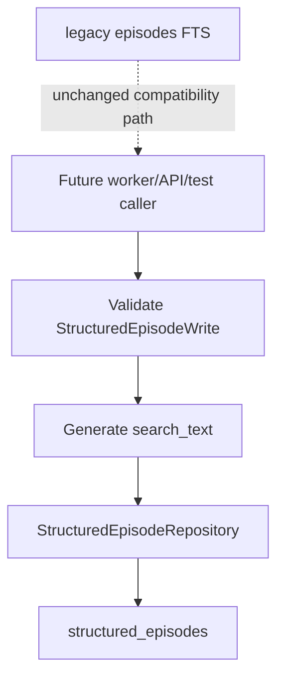
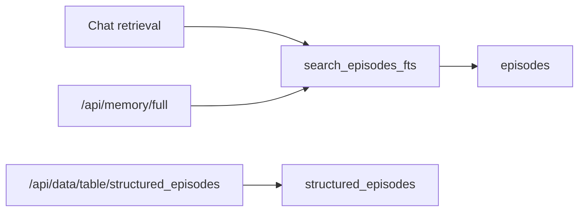
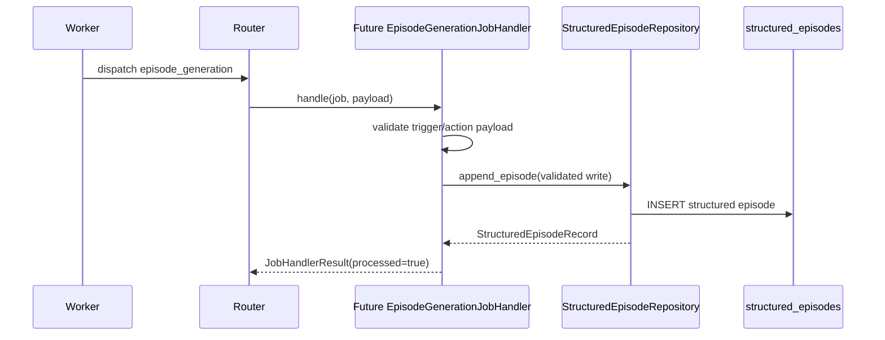

# Phase 6A Design: Structured Episodic Store

## 1. Executive Summary

Phase 6A adds a structured episodic memory storage boundary using the existing Phase 2 `structured_episodes` table. It does not change when episodes are created, how episodes are detected, how chat retrieves episodic context, or how the worker processes `episode_generation` jobs.

The current episodic memory implementation in `src/memory/episodic.py` stores searchable episode text in the legacy `episodes` FTS table and includes a legacy helper that can call the secondary LLM synchronously. That legacy path remains available for compatibility during this phase, but Phase 6A introduces a new repository module, `src/memory/episode_store.py`, as the only approved write/read boundary for structured episodes going forward.

The target Phase 6A outcome is:

- `structured_episodes` is used as the structured episodic store.
- Legacy `episodes` and `search_episodes_fts()` remain unchanged and readable.
- No new episode triggers are introduced.
- `episode_generation` worker behavior remains no-op/safe.
- No LLM calls are added to chat or worker paths for episodic memory.
- Structured episode validation, canonical JSON storage, deterministic search text generation, and repository reads are covered by tests.

Phase 6A is primarily a data access and contract phase. Phase 6B will build on it to implement deterministic episode triggers and continuation behavior.

## 2. Scope

In scope:

- Create `src/memory/episode_store.py`.
- Add `StructuredEpisodeRepository`.
- Add typed dataclasses for structured episode writes and records.
- Add validation for structured episode payloads before database writes.
- Store structured episodes into the existing `structured_episodes` table.
- Read structured episodes by id, session, source job, and simple text query.
- Generate deterministic `search_text` from structured episode fields.
- Preserve compatibility with the legacy `episodes` FTS table.
- Confirm API data inspector can list and read `structured_episodes`.
- Confirm `episode_generation` remains a no-op handler in the default worker registry.
- Add deterministic repository, validation, compatibility, worker-boundary, and API inspector tests.

Likely implementation files:

- New: `src/memory/episode_store.py`
- Tests only:
  - `tests/test_phase6a_episode_store_repository.py`
  - `tests/test_phase6a_episode_store_validation.py`
  - `tests/test_phase6a_episode_worker_boundary.py`
  - `tests/test_phase6a_episode_api_compatibility.py`

No runtime graph, retrieval, worker loop, schema, or API response-shape changes are required.

## 3. Out of Scope

Phase 6A must not implement:

- Episode detector changes.
- Episode continuation logic.
- `CREATE`, `UPDATE`, `MERGE`, or `SPLIT` decision heuristics.
- New episode trigger behavior.
- Chat-path episode generation.
- Worker-path LLM episode generation.
- Secondary LLM calls for episodic memory.
- Semantic extraction.
- Procedural candidate generation.
- Retrieval planner or retrieval behavior changes.
- Database migrations or schema changes.
- Backfill from legacy `episodes` into `structured_episodes`.
- Dual writes from legacy `log_episode()` or `create_structured_episode()` into `structured_episodes`.
- `/api/memory/full` behavior changes.

## 4. Current Episodic Memory Assessment

### `src/memory/episodic.py`

Current useful pieces:

- `should_trigger_episode()` contains deterministic trigger seeds:
  - task completed
  - workflow finished
  - trimming occurred
  - conversation idle for at least 45 minutes
  - conversation token count at least 50,000
- `log_episode()` writes legacy text episodes.
- `search_episodes_fts()` searches legacy `episodes` and has a `LIKE` fallback when FTS is unavailable.

Current gaps:

- `generate_structured_episode_summary()` calls `get_secondary_llm()` directly. This is not acceptable for chat-path use under the approved dual-LLM architecture.
- `create_structured_episode()` does not write to `structured_episodes`; it serializes structured data into the legacy `episodes.tool_calls` field and writes derived text into `episodes.content`.
- The legacy `episodes` table does not preserve normalized participants, goals, decisions, artifacts, topics, action, parent id, or source job id.
- Trigger behavior is still separate from durable job handling and should not be expanded in Phase 6A.

Phase 6A stance:

- Keep `src/memory/episodic.py` import-compatible.
- Do not route legacy helpers into the new table yet.
- Treat `episode_store.py` as the new structured storage boundary.
- Defer trigger and LLM generation behavior to Phase 6B.

### `src/memory/schema.py`

The Phase 2 schema already creates `structured_episodes`:

| Column | Type | Notes |
|---|---|---|
| `id` | `TEXT PRIMARY KEY` | Structured episode id |
| `session_id` | `TEXT NOT NULL` | Owning chat/session |
| `title` | `TEXT NOT NULL CHECK (title <> '')` | Human-readable title |
| `summary` | `TEXT NOT NULL CHECK (summary <> '')` | Concise episode summary |
| `participants_json` | `TEXT NOT NULL` | Canonical JSON array |
| `goals_json` | `TEXT NOT NULL` | Canonical JSON array |
| `decisions_json` | `TEXT NOT NULL` | Canonical JSON array |
| `artifacts_json` | `TEXT NOT NULL` | Canonical JSON array |
| `topics_json` | `TEXT NOT NULL` | Canonical JSON array |
| `importance` | `REAL NOT NULL CHECK (importance >= 0 AND importance <= 1)` | Bounded importance score |
| `start_message_id` | `TEXT NOT NULL` | First covered raw turn/message id |
| `end_message_id` | `TEXT NOT NULL` | Last covered raw turn/message id |
| `source` | `TEXT NOT NULL` | Origin source, such as worker or migration |
| `action` | `TEXT NOT NULL CHECK (action IN ('CREATE','UPDATE','MERGE','SPLIT'))` | Episode lifecycle action |
| `parent_episode_id` | `TEXT` | Optional predecessor/parent episode |
| `source_job_id` | `TEXT` | Optional originating `memory_jobs.id` |
| `search_text` | `TEXT` | Derived deterministic searchable text |
| `created_at` | `TEXT NOT NULL DEFAULT (datetime('now'))` | Insert timestamp |
| `updated_at` | `TEXT` | Reserved for future update/merge semantics |

Existing indexes:

- `idx_structured_episodes_session_created`
- `idx_structured_episodes_importance`
- `idx_structured_episodes_source`
- `idx_structured_episodes_action`
- `idx_structured_episodes_parent`
- `idx_structured_episodes_source_job`

No migration is required in Phase 6A.

### Worker and Router

Current worker infrastructure:

- `MemoryJobRouter` decodes `payload_json` and dispatches by `job_type`.
- `process_one_memory_job()` claims a job, dispatches it, and applies success/retry/dead-letter transitions.
- The default handler registry includes every memory job type.
- `summary_generation` has a real Phase 5B handler.
- `episode_generation` currently uses `NoOpMemoryJobHandler`.

Phase 6A should keep `episode_generation` no-op. This prevents queued episode jobs from suddenly writing structured episodes before Phase 6B defines trigger and continuation correctness.

### API Server

Current API behavior:

- `ALLOWED_DATA_TABLES` already includes `structured_episodes`.
- `/api/data/tables` can list allowed existing tables.
- `/api/data/table/{table_name}` can read allowed tables.
- `/api/memory/full` uses legacy `search_episodes_fts()` for episodic results.

Phase 6A should not change `/api/memory/full`. Data inspector compatibility is enough for this phase.

## 5. Structured Episode Store Design

Create `src/memory/episode_store.py`.

Responsibilities:

- Own all structured episode persistence.
- Validate structured episode writes before database insertion.
- Serialize JSON fields canonically as `TEXT`.
- Parse JSON fields when returning records.
- Generate deterministic `search_text`.
- Provide read APIs for later worker, retrieval, and API phases.
- Provide legacy compatibility adapters without writing to legacy tables.

Non-responsibilities:

- No schema creation.
- No LLM invocation.
- No trigger detection.
- No continuation action decisioning.
- No retrieval integration.
- No semantic, procedural, or skill writes.
- No raw turn mutation.
- No legacy episode backfill.

High-level flow:



### Data Types

```python
EpisodeAction = Literal["CREATE", "UPDATE", "MERGE", "SPLIT"]
```

```python
@dataclass(frozen=True)
class StructuredEpisodeWrite:
    session_id: str
    title: str
    summary: str
    participants: list[str]
    goals: list[str]
    decisions: list[str]
    artifacts: list[str]
    topics: list[str]
    importance: float
    start_message_id: str
    end_message_id: str
    source: str
    action: EpisodeAction = "CREATE"
    id: str | None = None
    parent_episode_id: str | None = None
    source_job_id: str | None = None
    search_text: str | None = None
```

```python
@dataclass(frozen=True)
class StructuredEpisodeRecord:
    id: str
    session_id: str
    title: str
    summary: str
    participants: list[str]
    goals: list[str]
    decisions: list[str]
    artifacts: list[str]
    topics: list[str]
    importance: float
    start_message_id: str
    end_message_id: str
    source: str
    action: EpisodeAction
    parent_episode_id: str | None
    source_job_id: str | None
    search_text: str
    created_at: str
    updated_at: str | None
```

```python
@dataclass(frozen=True)
class StructuredEpisodeValidationError(ValueError):
    field: str
    message: str
```

Use a normal exception class if dataclass exception ergonomics are awkward during implementation:

```python
class StructuredEpisodeValidationError(ValueError):
    def __init__(self, field: str, message: str): ...
```

### Validation Rules

Before insert:

- `session_id`, `title`, `summary`, `start_message_id`, `end_message_id`, and `source` must be non-empty strings after stripping.
- `action` must be one of `CREATE`, `UPDATE`, `MERGE`, or `SPLIT`.
- `importance` must be numeric and between `0.0` and `1.0`, inclusive.
- `participants`, `goals`, `decisions`, `artifacts`, and `topics` must be lists of strings.
- Empty lists are allowed except `participants` and `topics`, which should contain at least one value for useful future retrieval.
- JSON list values are normalized by stripping whitespace and dropping empty strings.
- `parent_episode_id` is required for future `UPDATE`, `MERGE`, and `SPLIT` actions only when those actions become active in Phase 6B. In Phase 6A, the repository accepts those actions because the table supports them, but no heuristics should create them.
- `source_job_id`, when present, must be non-empty after stripping.

Database `CHECK` constraints remain a second line of defense. Repository validation should fail earlier with clearer deterministic errors.

### Canonical JSON

JSON fields must be stored as `TEXT` without requiring SQLite JSON1:

```python
def canonical_json_array(values: Sequence[str]) -> str:
    return json.dumps(list(values), ensure_ascii=False, sort_keys=True, separators=(",", ":"))
```

Because arrays do not have object keys, `sort_keys=True` mainly keeps the helper consistent with existing canonical JSON practices. The original caller-provided order should be preserved.

### Searchable Episode Text

`search_text` is derived deterministically when not supplied:

```text
Title: {title}
Summary: {summary}
Participants: {participants joined by ", "}
Goals: {goals joined by "; "}
Decisions: {decisions joined by "; "}
Artifacts: {artifacts joined by "; "}
Topics: {topics joined by ", "}
Action: {action}
Source: {source}
```

Rules:

- No LLM calls.
- No timestamps in generated search text.
- Stable field order.
- Whitespace collapsed to single spaces inside each field.
- Include empty optional list labels only if useful for predictable tests. Recommended: omit empty list lines to keep `search_text` compact.

This is not SQLite FTS in Phase 6A. It is a derived text field used by simple repository search and future retrieval phases.

## 6. Repository API

```python
class StructuredEpisodeRepository:
    def __init__(self, db_path: Path | None = None): ...

    def append_episode(self, episode: StructuredEpisodeWrite) -> StructuredEpisodeRecord: ...

    def get_by_id(self, episode_id: str) -> StructuredEpisodeRecord | None: ...

    def get_by_source_job_id(self, source_job_id: str) -> StructuredEpisodeRecord | None: ...

    def list_by_session(
        self,
        session_id: str,
        *,
        limit: int | None = None,
        newest_first: bool = False,
    ) -> list[StructuredEpisodeRecord]: ...

    def search_text(
        self,
        query: str,
        *,
        session_id: str | None = None,
        limit: int = 10,
    ) -> list[StructuredEpisodeRecord]: ...

    def count_by_session(self, session_id: str) -> int: ...

    def to_legacy_episode_dict(self, episode: StructuredEpisodeRecord) -> dict[str, Any]: ...
```

### `append_episode()`

Behavior:

1. Validate `StructuredEpisodeWrite`.
2. If `source_job_id` is present and an existing record with that source job exists, return the existing record.
3. Use caller-provided `id` when supplied.
4. Otherwise generate an id with a stable prefix and UUID:

```text
structured_episode_{uuid4_hex}
```

5. Generate `search_text` if missing.
6. Insert into `structured_episodes`.
7. Return the inserted record.

Idempotency:

- The current schema does not enforce unique `source_job_id`.
- Phase 6A should enforce source-job idempotency at the repository level by checking before insert.
- If a future concurrent race inserts two rows for the same `source_job_id`, Phase 6B or a later additive schema-hardening phase can add a unique index. Phase 6A should not add migrations.

Transaction behavior:

- Each repository write should use one connection and one transaction.
- Roll back and re-raise validation/database errors.
- Do not write to legacy `episodes`.
- Do not write to raw turns, facts, candidates, summaries, embeddings, skills, or retrieval state.

### `get_by_id()`

Returns one parsed `StructuredEpisodeRecord` or `None`.

### `get_by_source_job_id()`

Returns the oldest matching record for a source job if present. This supports idempotent future worker handlers.

### `list_by_session()`

Ordering:

- Default: chronological by `created_at ASC, id ASC`.
- `newest_first=True`: `created_at DESC, id DESC`.

Limit:

- `None` means no explicit limit.
- Non-positive limits should return an empty list or raise `ValueError`; recommended: raise `ValueError` for clearer caller bugs.

### `search_text()`

Phase 6A search is simple and intentionally not retrieval integration:

- Return `[]` for blank query.
- Search `search_text LIKE ? OR title LIKE ? OR summary LIKE ?`.
- Optional `session_id` filter.
- Order by `importance DESC, created_at DESC, id DESC`.
- Cap `limit` to a conservative maximum such as `100`.

This method exists for compatibility tests and future Phase 9 retrieval primitives. It must not replace `search_episodes_fts()` in chat.

### `to_legacy_episode_dict()`

Compatibility adapter for future API phases:

```python
{
    "id": episode.id,
    "session_id": episode.session_id,
    "timestamp": episode.created_at,
    "content": episode.search_text,
    "tool_calls": canonical_json_of_structured_fields,
    "outcome": "success",
}
```

This helper does not insert into the legacy table.

## 7. Legacy Compatibility Strategy

Legacy compatibility rules:

- Keep the legacy `episodes` table unchanged.
- Keep `log_episode()` unchanged.
- Keep `create_structured_episode()` unchanged in Phase 6A unless only documentation/deprecation comments are added.
- Keep `search_episodes_fts()` unchanged.
- Do not backfill legacy rows into `structured_episodes`.
- Do not dual-write structured repository writes into `episodes`.
- Do not dual-write legacy episode writes into `structured_episodes`.
- Do not change `node_retrieval_gate()` episodic retrieval.
- Do not change `/api/memory/full` episodic retrieval.

Rationale:

- Existing legacy episode rows are per-turn or text summaries, not guaranteed to satisfy the structured episode schema.
- Automatic reinterpretation would create low-quality structured data and make later continuation logic unreliable.
- Dual-write would blur ownership before Phase 6B defines generation and continuation semantics.

Compatibility read path:



Phase 6A introduces structured reads, but no runtime caller should consume them for answer generation yet.

## 8. Worker Handler Boundary

Current registry behavior should remain:

```python
registry["episode_generation"].__class__.__name__ == "NoOpMemoryJobHandler"
```

Phase 6A worker boundary:

- `episode_generation` jobs may already be enqueued by Phase 3A when deterministic trigger metadata exists.
- In Phase 6A, those jobs must still process through the Phase 3B no-op handler.
- The no-op result should remain `processed=False`.
- No structured episode rows should be written by `episode_generation` in this phase.
- No secondary LLM route should be resolved for `episode_generation`.
- No `get_secondary_llm()` or LLM `.invoke()` should be called.

Future Phase 6B handler boundary:



Phase 6A should provide the repository and validation APIs that this future handler will use, but should not register that future handler yet.

## 9. API Impact

Public API behavior:

- `/api/chat` request shape: unchanged.
- `/api/chat` response shape: unchanged.
- `/api/memory/full`: unchanged; continues to return legacy episode search results.
- `/api/data/tables`: already supports `structured_episodes` through `ALLOWED_DATA_TABLES`.
- `/api/data/table/structured_episodes`: should read structured episode rows through the existing inspector endpoint.

No new endpoint is required in Phase 6A.

Why not update `/api/memory/full` now:

- It is currently part of runtime/inspection behavior around legacy memories.
- Returning structured episodes there may look like retrieval integration.
- Phase 9 and Phase 10 are better places to expose stable structured memory DTOs and diagnostics.

Phase 6A API tests should therefore verify compatibility rather than expand the API surface.

## 10. Test Plan

Suggested new tests:

- `tests/test_phase6a_episode_store_repository.py`
- `tests/test_phase6a_episode_store_validation.py`
- `tests/test_phase6a_episode_worker_boundary.py`
- `tests/test_phase6a_episode_api_compatibility.py`

Repository tests:

- `append_episode()` inserts one row into `structured_episodes`.
- `append_episode()` returns a parsed `StructuredEpisodeRecord`.
- `get_by_id()` returns the inserted record.
- `list_by_session()` returns chronological records.
- `list_by_session(newest_first=True)` returns newest first.
- `count_by_session()` counts only the requested session.
- `get_by_source_job_id()` returns an existing record.
- Re-appending with the same `source_job_id` returns the existing record and does not duplicate rows.
- Caller-provided episode id is preserved.
- Generated ids use the `structured_episode_` prefix.
- JSON fields are canonical, decodable arrays.
- `search_text` is generated when omitted.
- Supplied `search_text` is normalized and preserved.
- `search_text()` returns relevant records for title, summary, topics, and generated text.
- Blank `search_text()` query returns `[]`.
- Repository writes do not insert into legacy `episodes`.

Validation tests:

- Empty `session_id` fails.
- Empty `title` fails.
- Empty `summary` fails.
- Empty `start_message_id` fails.
- Empty `end_message_id` fails.
- Empty `source` fails.
- Invalid `action` fails.
- `importance < 0` fails.
- `importance > 1` fails.
- Non-list JSON fields fail.
- Non-string list items fail or are normalized according to the implementation decision; recommended: fail.
- Empty `participants` fails.
- Empty `topics` fails.
- Whitespace-only list values are removed before storage.
- Validation errors include the field name.

Legacy compatibility tests:

- `log_episode()` still writes to legacy `episodes`.
- `create_structured_episode()` still writes to legacy `episodes` as before.
- `search_episodes_fts()` still finds legacy episodes.
- Structured repository writes are not returned by `search_episodes_fts()`.
- Legacy episode writes do not create `structured_episodes` rows.
- Existing `tests/test_episodic_detector.py` and `tests/test_long_term_memory.py` continue to pass unless later phases deliberately update behavior.

Worker-boundary tests:

- `build_default_handler_registry()["episode_generation"]` remains `NoOpMemoryJobHandler`.
- Dispatching an `episode_generation` job with a valid payload returns success with `processed=False`.
- Dispatching an `episode_generation` job writes no `structured_episodes` rows.
- Dispatching an `episode_generation` job writes no legacy `episodes` rows.
- Dispatching an `episode_generation` job does not call `get_secondary_llm()`.
- Dispatching an `episode_generation` job does not call `resolve_secondary_llm()`.
- `summary_generation` handler remains the Phase 5B real handler.
- Other non-summary handlers remain no-op.

API compatibility tests:

- `/api/data/tables` includes `structured_episodes` after DB initialization.
- `/api/data/table/structured_episodes` returns inserted structured rows.
- `/api/data/table/episodes` still returns legacy rows.
- `/api/memory/full` response shape is unchanged.
- `/api/memory/full` continues to use legacy episodic search results only.

Regression tests to run:

```bash
python -m pytest tests/test_phase6a_episode_store_repository.py tests/test_phase6a_episode_store_validation.py tests/test_phase6a_episode_worker_boundary.py tests/test_phase6a_episode_api_compatibility.py -q
python -m pytest tests/test_episodic_detector.py tests/test_long_term_memory.py tests/test_phase3a_memory_jobs.py tests/test_phase3b_router_handlers.py tests/test_phase5b_summary_job_handler.py -q
python -m pytest tests/test_api_server.py tests/test_harness.py -q
```

Run the full suite if focused tests pass.

## 11. Risks

| Risk | Impact | Mitigation |
|---|---|---|
| Accidentally changing episode triggers | Ordinary turns may begin creating structured episodes too early | Keep graph and `episode_generation` handler behavior unchanged in Phase 6A. |
| Reintroducing secondary LLM calls outside worker memory handlers | Violates Phase 4 routing and can increase chat latency | `episode_store.py` must contain no LLM imports or invocations; tests should monkeypatch LLM routes to fail. |
| Treating legacy per-turn rows as structured episodes | Low-quality or misleading episodic data | Do not backfill or reinterpret legacy `episodes` in Phase 6A. |
| Dual-write confusion | Two stores drift or appear inconsistent | Keep stores independent until Phase 6B defines generation ownership. |
| Missing uniqueness on `source_job_id` | Rare duplicate structured episodes under concurrent writes | Enforce application-level idempotency in repository; consider additive unique index in a later hardening phase if needed. |
| Simple `LIKE` search mistaken for retrieval | Premature retrieval behavior change | Keep repository search internal/test-facing; do not wire it into chat retrieval. |
| Validation too loose | Bad structured rows impair future retrieval and continuation | Validate all required fields and JSON arrays before insert. |
| Validation too strict for future LLM output | Future handler may fail often | Keep normalized arrays and bounded fields simple; Phase 6B can add repair logic inside worker handler. |

## 12. Acceptance Criteria

Phase 6A is complete when:

- `src/memory/episode_store.py` exists.
- `StructuredEpisodeRepository` can append and read structured episodes from `structured_episodes`.
- The existing Phase 2 `structured_episodes` schema is used without migrations.
- Structured episode writes validate required fields, actions, importance, and JSON arrays.
- JSON fields are stored as canonical `TEXT` and parsed back into lists.
- `search_text` is generated deterministically without LLM calls.
- Repository source-job idempotency prevents duplicate rows for the same `source_job_id`.
- Legacy `episodes` table remains unchanged and readable.
- `search_episodes_fts()` behavior remains unchanged.
- `/api/memory/full` behavior and response shape remain unchanged.
- `/api/data/tables` and `/api/data/table/structured_episodes` remain compatible.
- `episode_generation` remains no-op in the default worker registry.
- No structured episodes are written by worker dispatch in Phase 6A.
- No chat, retrieval, semantic, procedural, skill, worker loop, or schema behavior changes are introduced.
- Focused Phase 6A and relevant legacy episodic/API/worker regression tests pass.

## 13. Implementation Checklist

1. Create `src/memory/episode_store.py`.
2. Define `EpisodeAction` literal or equivalent constant set.
3. Define `StructuredEpisodeWrite`.
4. Define `StructuredEpisodeRecord`.
5. Define `StructuredEpisodeValidationError`.
6. Implement canonical JSON array serialization.
7. Implement JSON array parsing with validation.
8. Implement whitespace normalization helpers.
9. Implement deterministic `build_structured_episode_search_text()`.
10. Implement `validate_structured_episode_write()`.
11. Implement `StructuredEpisodeRepository.__init__()`.
12. Implement `append_episode()`.
13. Implement source-job idempotency lookup before insert.
14. Implement `get_by_id()`.
15. Implement `get_by_source_job_id()`.
16. Implement `list_by_session()`.
17. Implement `search_text()`.
18. Implement `count_by_session()`.
19. Implement `to_legacy_episode_dict()`.
20. Add repository tests.
21. Add validation tests.
22. Add legacy compatibility tests.
23. Add worker-boundary tests proving `episode_generation` remains no-op.
24. Add API data inspector compatibility tests.
25. Do not modify `src/db.py`, `src/db_migrations.py`, or `src/memory/schema.py`.
26. Do not modify `src/harness/graph.py`.
27. Do not modify retrieval modules.
28. Do not modify `src/memory/worker.py` or `src/memory/job_router.py`.
29. Modify `src/memory/job_handlers.py` only if tests require a small assertion-safe export; do not register a real `episode_generation` handler.
30. Keep `src/memory/episodic.py` import-compatible; avoid changing legacy runtime behavior.
31. Run focused Phase 6A tests.
32. Run episodic, long-term memory, API, worker-boundary, and harness regressions.

## File-by-File Design

### New: `src/memory/episode_store.py`

Purpose:

- Own structured episodic persistence into `structured_episodes`.
- Own structured episode validation.
- Own deterministic searchable text generation.
- Provide read APIs for future Phase 6B episode generation and Phase 9 retrieval.

Must not include:

- LLM imports.
- Worker loop logic.
- Trigger detection.
- Continuation heuristics.
- Schema DDL.
- Legacy table writes.

### Keep: `src/memory/episodic.py`

Phase 6A should keep this module's existing public behavior:

- `should_trigger_episode()`
- `generate_structured_episode_summary()`
- `create_structured_episode()`
- `log_episode()`
- `search_episodes_fts()`

Important note:

- `generate_structured_episode_summary()` is legacy and chat-unsafe because it can call the secondary LLM directly. Phase 6A should not add new callers to it. Phase 6B should decide whether to replace or quarantine it behind worker-only routing.

### Keep: `src/memory/job_handlers.py`

Expected Phase 6A behavior:

- `summary_generation` remains handled by `SummaryGenerationJobHandler`.
- `episode_generation` remains `NoOpMemoryJobHandler`.
- All semantic, procedural, consolidation, and skill handlers remain no-op unless already changed by earlier phases.

No real episodic handler should be registered in Phase 6A.

### Keep: `src/memory/job_router.py`

No router changes are required. It already validates JSON payload shape and dispatches by job type.

### Keep: `src/memory/worker.py`

No worker changes are required. The Phase 3B worker loop remains an explicit callable infrastructure component.

### Keep: `src/api/server.py`

No endpoint changes are required.

Existing compatibility to verify:

- `structured_episodes` is present in `ALLOWED_DATA_TABLES`.
- Data inspector can list and read structured episode rows.
- `/api/memory/full` remains legacy-compatible.

### Keep: `src/memory/schema.py`, `src/db.py`, `src/db_migrations.py`

No schema or migration changes are required. Phase 6A uses the existing Phase 2 table.

