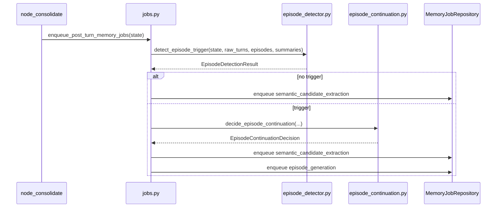

# Phase 6B Design: Episode Detector and Continuation

## 1. Executive Summary

Phase 6B completes the episodic-memory write path by adding deterministic episode triggers, deterministic continuation/action routing, and a real background `episode_generation` worker handler that writes structured episodes through `StructuredEpisodeRepository`.

Phase 6A created the structured episodic store in `src/memory/episode_store.py`, while intentionally leaving `episode_generation` as a no-op. Phase 6B is the point where queued episode jobs become meaningful, but the architecture boundary is strict:

- The chat path may decide whether to enqueue an episode job.
- The chat path may decide deterministic action metadata such as `CREATE`, `UPDATE`, `MERGE`, or `SPLIT`.
- The chat path must not call the secondary LLM.
- The worker handler may call the secondary LLM only to generate structured episode content.
- The worker handler must not let the LLM decide whether an episode exists, why it exists, or what continuation action applies.
- Structured writes must go through `StructuredEpisodeRepository`.

The result should be an asynchronous, deterministic episodic pipeline:

```mermaid
flowchart LR
  Chat["Chat graph"]
  Detector["Deterministic episode detector"]
  Continuation["Deterministic continuation router"]
  Queue["memory_jobs episode_generation"]
  Worker["Explicit memory worker"]
  Handler["EpisodeGenerationJobHandler"]
  Store["StructuredEpisodeRepository"]
  Table["structured_episodes"]

  Chat --> Detector --> Continuation --> Queue
  Queue --> Worker --> Handler --> Store --> Table
```



No schema migration, retrieval change, semantic change, procedural change, legacy backfill, or `/api/memory/full` behavior change is included in this phase.

## 2. Scope

In scope:

- Add a deterministic episode detector.
- Add deterministic continuation/action routing.
- Add `episode_generation` payload helpers.
- Add durable idempotency for episode-generation jobs.
- Enqueue `episode_generation` jobs after successful eligible turns when deterministic triggers fire.
- Support trigger reasons:
  - explicit remember request
  - trimming occurred
  - idle timeout
  - long conversation
  - task completed
  - workflow completed
- Add a real worker handler for `episode_generation`.
- Use secondary LLM only inside the worker handler to generate structured content.
- Parse/validate worker LLM output.
- Write exactly through `StructuredEpisodeRepository`.
- Preserve legacy `episodes` compatibility.
- Add deterministic tests for detector, continuation, enqueue payloads, worker handler, graph behavior, and regressions.

Likely implementation files:

- New: `src/memory/episode_detector.py`
- New: `src/memory/episode_continuation.py`
- Modify: `src/memory/jobs.py`
- Modify: `src/memory/job_handlers.py`
- Modify: `src/harness/graph.py`
- Optional modify: `src/harness/state.py` for internal state keys only
- Optional modify: `src/memory/episodic.py` to keep legacy wrapper behavior aligned
- Tests only

## 3. Out of Scope

Phase 6B must not implement:

- LLM-based trigger decisions.
- LLM-based action routing.
- Semantic extraction.
- Procedural generation.
- Skill writing.
- Retrieval planner changes.
- Chat retrieval changes.
- Schema migrations.
- Legacy `episodes` backfill.
- Dual writes to legacy `episodes`.
- `/api/memory/full` behavior changes.
- API response shape changes.
- Worker auto-start changes.
- Episode deletion or in-place mutation of previous structured episodes.

The structured episode table has an `updated_at` column, but Phase 6B should still use append-only writes. `UPDATE`, `MERGE`, and `SPLIT` are lifecycle actions stored on a newly appended row, not mutations of existing rows.

## 4. Current Episodic Assessment

### `src/memory/episodic.py`

Current behavior:

- `should_trigger_episode()` already has simple deterministic trigger seeds.
- `generate_structured_episode_summary()` calls `get_secondary_llm()` directly and returns generated JSON-like data.
- `create_structured_episode()` writes structured-looking content into the legacy `episodes` FTS table.
- `log_episode()` writes legacy episode rows.
- `search_episodes_fts()` searches legacy rows.

Phase 6B should avoid adding new runtime callers to `generate_structured_episode_summary()` and `create_structured_episode()`. These helpers remain legacy compatibility functions until a later cleanup phase.

### `src/memory/episode_store.py`

Phase 6A provides:

- `EpisodeAction`
- `StructuredEpisodeWrite`
- `StructuredEpisodeRecord`
- `StructuredEpisodeValidationError`
- `StructuredEpisodeRepository`
- canonical JSON storage
- deterministic `search_text`
- source-job idempotency
- simple structured text search
- legacy dict adapter

Phase 6B should reuse this module without changing its ownership boundary. If small read helpers are needed, they should be additive and still avoid schema changes.

### `src/memory/jobs.py`

Current behavior:

- Post-turn memory enqueueing always emits `semantic_candidate_extraction` for eligible completed turns.
- It emits `episode_generation` only for explicit remember, trimming, task-completed, or workflow-finished metadata.
- Existing episode payload is minimal:

```json
{
  "episodic": {
    "trigger_reason": "explicit_memory_request",
    "source": "post_turn",
    "legacy_episode_backfill": false
  }
}
```

Gaps:

- Idle timeout and long-conversation triggers are not represented.
- Episode source windows are not explicit.
- Continuation action is not encoded.
- Payload does not include raw turn IDs for worker-side context loading.
- Idempotency is based on latest user/assistant text hashes, not the selected episodic source window.

### `src/memory/job_handlers.py`

Current behavior:

- `summary_generation` is the only real memory handler.
- `episode_generation` remains `NoOpMemoryJobHandler`.

Phase 6B should replace only `episode_generation` with a real handler. All semantic/procedural/consolidation/skill handlers remain no-op until later phases.

### `src/harness/graph.py`

Current behavior:

- `node_ingest()` logs the latest user turn to `raw_turns`.
- `node_agent()` logs assistant output to `raw_turns`.
- `node_manage_memory()` uses Phase 5B summary block reconstruction and sets `trimming_occurred`.
- `node_consolidate()` calls `enqueue_post_turn_memory_jobs(state)` after successful turns.
- HITL pending/rejected states skip memory enqueueing.
- `node_retrieval_gate()` still reads legacy `search_episodes_fts()`.

Phase 6B should keep this graph shape and continue to enqueue from `node_consolidate()`. It may add internal state keys from `node_manage_memory()` to help trimming-triggered episode jobs select precise source turns, but must not change `/api/chat` response fields.

### `src/memory/summary_blocks.py`

Phase 5B provides:

- immutable `summary_blocks`
- raw turn read helpers
- token-based chunk selection
- `prepare_short_term_context_for_chat()`

Phase 6B should reuse `raw_turns` as the source of episode context. For trimming-triggered episodes, it may reuse completed summary blocks when available to reduce worker prompt size, but should not depend on summary generation completing.

## 5. Deterministic Episode Detector Design

Create `src/memory/episode_detector.py`.

Responsibilities:

- Decide whether an episode job should be enqueued.
- Identify trigger reason(s).
- Select the source raw-turn window for the episode.
- Produce deterministic diagnostics for payloads and tests.
- Never call LLMs.
- Never write the database.

Non-responsibilities:

- No episode content generation.
- No semantic/procedural extraction.
- No worker execution.
- No retrieval integration.

### Data Types

```python
EpisodeTriggerReason = Literal[
    "explicit_memory_request",
    "trimming_occurred",
    "idle_timeout",
    "long_conversation",
    "task_completed",
    "workflow_finished",
]
```

```python
@dataclass(frozen=True)
class EpisodeDetectorConfig:
    idle_timeout_seconds: int = 2700
    long_conversation_tokens: int = 50000
    max_source_turns: int = 40
    explicit_remember_patterns: tuple[str, ...] = (
        "remember this",
        "remember that",
        "please remember",
        "don't forget",
        "do not forget",
    )
```

```python
@dataclass(frozen=True)
class EpisodeSourceWindow:
    session_id: str
    turn_ids: list[str]
    start_message_id: str
    end_message_id: str
    token_count: int
    user_text_hash: str | None
    assistant_text_hash: str | None
    summary_block_ids: list[str]
    source_text_mode: Literal["raw_turns", "summary_blocks", "mixed"]
```

```python
@dataclass(frozen=True)
class EpisodeDetectionResult:
    should_enqueue: bool
    primary_reason: EpisodeTriggerReason | None
    reasons: list[EpisodeTriggerReason]
    source_window: EpisodeSourceWindow | None
    diagnostics: dict[str, Any]
```

### Detector Entry Point

```python
def detect_episode_trigger(
    *,
    state: Mapping[str, Any],
    raw_turns: Sequence[RawTurnRecord],
    existing_episodes: Sequence[StructuredEpisodeRecord],
    summary_blocks: Sequence[SummaryBlockRecord] = (),
    now: datetime | None = None,
    config: EpisodeDetectorConfig | None = None,
) -> EpisodeDetectionResult: ...
```

The detector should be pure with respect to external systems. The caller loads raw turns and structured episodes, then passes them in.

### Source Window Selection

Use raw turns ordered by `created_at ASC, rowid ASC`.

Default source window:

- Start after the latest structured episode's `end_message_id`, when that id exists in `raw_turns`.
- End at the latest assistant turn for the completed chat turn.
- Include at most `max_source_turns`, preferring the newest contiguous window.
- Exclude empty-content turns.

Reason-specific window behavior:

- `explicit_memory_request`: latest user/assistant pair, plus immediately preceding assistant/user turn if needed for context.
- `task_completed`: unsummarized span since latest structured episode, capped by `max_source_turns`.
- `workflow_finished`: same as task completed.
- `long_conversation`: oldest uncovered contiguous span since latest structured episode up to `max_source_turns`.
- `idle_timeout`: latest resumed turn pair plus the previous turn that establishes the idle gap.
- `trimming_occurred`: use `state["summary_omitted_turn_ids"]` if Phase 6B adds it; otherwise oldest uncovered contiguous span since latest structured episode. If a completed summary block covers the omitted ids, include its id in `summary_block_ids`.

If no valid source window can be selected, `should_enqueue=False` even if a trigger flag exists.

### No Duplicate Episode Guard

The detector should not enqueue when:

- Source window has no turns.
- Source window's `end_message_id` is already at or before the latest structured episode's `end_message_id`.
- An active or completed `episode_generation` job already exists with the same idempotency key.

The last check can be implemented by `MemoryJobRepository.enqueue()` returning the existing row. The detector itself does not need to query jobs.

## 6. Trigger Rules

The trigger decision is deterministic and may collect multiple reasons. One job is enqueued per selected source window, not one job per reason.

Priority order for `primary_reason`:

1. `explicit_memory_request`
2. `trimming_occurred`
3. `task_completed`
4. `workflow_finished`
5. `idle_timeout`
6. `long_conversation`

The full `reasons` array should preserve all true reasons in that order.

### Explicit Remember Trigger

Trigger when the latest user message contains one of the approved explicit memory markers after case-folding:

- `remember this`
- `remember that`
- `please remember`
- `don't forget`
- `do not forget`

This preserves Phase 3A behavior and avoids broad interpretation of vague phrases like "note" or "keep in mind".

### Trimming Trigger

Trigger when `state["trimming_occurred"]` is true.

Expected Phase 6B graph support:

- `node_manage_memory()` may add internal `summary_omitted_turn_ids` to state.
- This state key must not be exposed in `/api/chat` responses.
- If omitted turn ids are unavailable, the detector falls back to oldest uncovered raw turns.

The worker may use summary block text if completed summary blocks cover the source window. It must still be able to generate an episode from raw turns if summary generation is pending.

### Idle Timeout Trigger

Trigger when the elapsed time between the current user turn and the previous turn in the same session is at least `2700` seconds.

Because the graph only runs on a new turn, idle detection is performed opportunistically during the next completed chat turn.

Implementation detail:

- Load raw turns ordered by durable order.
- Identify the latest user turn for the current request.
- Compare its `created_at` to the immediately preceding raw turn in that session.
- If timestamps cannot be parsed or the previous turn is missing, do not trigger idle timeout.
- Use injected `now` only in tests where raw-turn timestamps need deterministic construction; do not rely on wall-clock reads when DB timestamps are available.

### Long Conversation Trigger

Trigger when uncovered raw-turn token count since the latest structured episode is at least `50000`.

Rules:

- Use stored `raw_turns.tokens` when positive.
- Fall back to Phase 5A deterministic token counting when missing or zero for non-empty content.
- Count only turns not already covered by a structured episode window.
- Do not use a fixed message count.

### Task Completed Trigger

Trigger when `state["task_completed"]` is true.

This is currently an optional state flag. Phase 6B should preserve that optionality and avoid requiring all callers to supply it.

### Workflow Finished Trigger

Trigger when `state["workflow_finished"]` is true.

This is also an optional state flag. It should be handled identically to task completion but recorded as a distinct reason for diagnostics.

## 7. Continuation / CREATE / UPDATE / MERGE / SPLIT Design

Create `src/memory/episode_continuation.py`.

Responsibilities:

- Select deterministic episode lifecycle action.
- Identify parent/related structured episodes.
- Produce explainable scoring diagnostics.
- Never call LLMs.
- Never mutate existing episodes.

### Data Types

```python
EpisodeContinuationAction = Literal["CREATE", "UPDATE", "MERGE", "SPLIT"]
```

```python
@dataclass(frozen=True)
class EpisodeContinuationDecision:
    action: EpisodeContinuationAction
    parent_episode_id: str | None
    related_episode_ids: list[str]
    score: float
    rationale_code: str
    diagnostics: dict[str, Any]
```

### Candidate Text and Tokens

Build deterministic candidate text from:

- selected raw turn sender/content pairs
- completed summary block text when the trigger is trimming and the block covers selected turns
- explicit trigger metadata

Extract lexical tokens using a simple deterministic tokenizer:

- lowercase
- alphanumeric words only
- drop common stopwords
- keep tokens with length at least 3

No embeddings are required in Phase 6B.

### Similarity Signals

For each recent structured episode in the same session:

- Compare candidate tokens against episode title, summary, topics, goals, decisions, and artifacts.
- Compute weighted Jaccard-like overlap:
  - topics/artifacts exact token overlap has highest weight
  - title/summary overlap has medium weight
  - goals/decisions overlap has medium-high weight
- Apply a small recency bonus for the newest episodes.
- Apply a parent continuity bonus when the latest structured episode is similar.

Suggested thresholds:

- `UPDATE`: best score `>= 0.45` and only one strong related episode.
- `MERGE`: at least two related episodes score `>= 0.35` and combined coverage score `>= 0.55`.
- `SPLIT`: deterministic split markers exist and best related episode score `>= 0.40`.
- `CREATE`: default when thresholds are not met.

### Action Semantics

`CREATE`:

- No parent episode is required.
- Used for new topics, first structured episode in a session, or weak similarity.

`UPDATE`:

- Append a new structured episode row with `action="UPDATE"`.
- `parent_episode_id` points to the best matching prior episode.
- Old episode row is not modified.
- Used when the new source window continues one existing episode.

`MERGE`:

- Append a new structured episode row with `action="MERGE"`.
- `parent_episode_id` points to the best matching prior episode.
- Additional related ids are carried in the job payload/result diagnostics.
- Old episode rows are not modified.
- Used when the source window deterministically bridges two or more prior episodes.

`SPLIT`:

- Append a new structured episode row with `action="SPLIT"`.
- `parent_episode_id` points to the prior episode being split or clarified.
- Old episode row is not modified.
- Phase 6B should not create multiple child rows for one job because the current store idempotency is source-job based and the schema has no split-group table.
- Used only when deterministic split markers are present, such as:
  - `separate topic`
  - `new topic:`
  - `actually split this`
  - `this is unrelated to`

This conservative SPLIT rule avoids pretending to solve topical segmentation without a stronger representation.

### Continuation Entry Point

```python
def decide_episode_continuation(
    *,
    source_window: EpisodeSourceWindow,
    raw_turns: Sequence[RawTurnRecord],
    existing_episodes: Sequence[StructuredEpisodeRecord],
    summary_blocks: Sequence[SummaryBlockRecord] = (),
    config: EpisodeContinuationConfig | None = None,
) -> EpisodeContinuationDecision: ...
```

The detector and continuation decision should run before enqueueing so the payload is fully deterministic.

## 8. `episode_generation` Job Payload Design

Add Phase 6B helpers to `src/memory/jobs.py`.

### Constants

```python
PHASE_6B_EPISODE_PAYLOAD_SCHEMA_VERSION = 1
EPISODE_GENERATION_SOURCE = "graph.episode_detector"
PHASE_6B_CREATED_BY = "phase_6b_episode_enqueue"
```

Keep the top-level `schema_version` backward-compatible with existing memory job payloads. Add the Phase 6B version inside the nested `episodic` object.

### Payload Shape

```json
{
  "schema_version": 1,
  "source": "graph.episode_detector",
  "session_id": "session-id",
  "models": {
    "primary_provider": "openai",
    "primary_model_name": "gpt-4o",
    "secondary_provider": "anthropic",
    "secondary_model_name": "claude-3-5-haiku"
  },
  "turn": {
    "user_message_id": null,
    "assistant_message_id": null,
    "user_text": "Please remember that deployment requires approval.",
    "assistant_text": "Got it.",
    "message_count": 2,
    "token_count": 34
  },
  "trigger_metadata": {
    "task_completed": false,
    "workflow_finished": false,
    "trimming_occurred": false,
    "explicit_memory_request": true,
    "idle_timeout": false,
    "long_conversation": false,
    "retrieval_triggered": false,
    "tools_used": [],
    "loop_count": 1,
    "approval_status": "NONE"
  },
  "episodic": {
    "schema_version": 1,
    "trigger_reason": "explicit_memory_request",
    "trigger_reasons": ["explicit_memory_request"],
    "source": "post_turn",
    "legacy_episode_backfill": false,
    "source_window": {
      "turn_ids": ["turn_a", "turn_b"],
      "start_message_id": "turn_a",
      "end_message_id": "turn_b",
      "token_count": 34,
      "source_text_mode": "raw_turns",
      "summary_block_ids": [],
      "user_text_hash": "sha256...",
      "assistant_text_hash": "sha256..."
    },
    "continuation": {
      "action": "CREATE",
      "parent_episode_id": null,
      "related_episode_ids": [],
      "score": 0.0,
      "rationale_code": "no_related_episode"
    }
  },
  "created_by": "phase_6b_episode_enqueue"
}
```

### Idempotency Key

Add:

```python
def make_episode_generation_idempotency_key(
    *,
    session_id: str,
    turn_ids: Sequence[str],
    trigger_reasons: Sequence[str],
    action: str,
    parent_episode_id: str | None,
    secondary_provider: str,
    secondary_model_name: str,
    payload_schema_version: int = PHASE_6B_EPISODE_PAYLOAD_SCHEMA_VERSION,
) -> str: ...
```

Canonical input:

```json
{
  "schema_version": 1,
  "job_type": "episode_generation",
  "session_id": "session-id",
  "turn_ids": ["turn_a", "turn_b"],
  "trigger_reasons": ["explicit_memory_request"],
  "action": "CREATE",
  "parent_episode_id": null,
  "secondary_provider": "anthropic",
  "secondary_model_name": "claude-3-5-haiku"
}
```

Output:

```text
memq:v1:episode_generation:{session_hash}:{window_hash}
```

The idempotency key should not include generated title/summary content because content is produced later in the worker.

### Job Spec

Add:

```python
def build_episode_generation_job_spec(
    *,
    state: Mapping[str, Any],
    detection: EpisodeDetectionResult,
    continuation: EpisodeContinuationDecision,
) -> MemoryJobSpec | None: ...
```

Behavior:

- Return `None` when `detection.should_enqueue` is false.
- Use normalized primary/secondary selectors from Phase 4.
- Set `job_type="episode_generation"`.
- Set priority `60`.
- Set `session_id`.
- Use deterministic idempotency key.
- Preserve existing payload keys where safe.

Priority rationale:

- `summary_generation`: `50`, because it protects prompt fit.
- `episode_generation`: `60`, because it feeds semantic/procedural future phases but does not need to block chat.
- default semantic candidate extraction: `100`.

## 9. Worker Handler Design

Modify `src/memory/job_handlers.py` to add and register:

```python
@dataclass(frozen=True)
class EpisodeGenerationJobHandler:
    job_type: str = "episode_generation"

    def handle(self, job: Mapping[str, Any], payload: Mapping[str, Any]) -> JobHandlerResult: ...
```

### Handler Flow

1. Validate top-level payload is a mapping.
2. Validate `schema_version`.
3. Validate `payload["episodic"]` exists and has nested `schema_version`.
4. Validate deterministic `source_window.turn_ids` is a non-empty list.
5. Validate deterministic continuation action is one of `CREATE`, `UPDATE`, `MERGE`, `SPLIT`.
6. Check `StructuredEpisodeRepository.get_by_source_job_id(job["id"])`.
7. If existing record is found, return success with `processed=False`.
8. Load selected raw turns by id using a repository/helper that preserves payload order.
9. If turn ids are missing, return nonretryable failure unless the database read itself failed.
10. Resolve secondary route using the existing worker-side helper.
11. If secondary route is unavailable, return retryable failure.
12. Build an episode-content prompt from deterministic source context and action metadata.
13. Invoke secondary LLM.
14. Parse JSON output.
15. Normalize generated fields.
16. Build `StructuredEpisodeWrite` using:
    - generated title/summary/participants/goals/decisions/artifacts/topics/importance
    - deterministic action from payload
    - deterministic parent id from payload
    - deterministic start/end ids from source window
    - `source="worker.episode_generation"`
    - `source_job_id=job["id"]`
17. Append through `StructuredEpisodeRepository.append_episode()`.
18. Return success with `processed=True` and structured episode metadata.

### LLM Prompt Boundary

The prompt may ask the secondary LLM to produce only:

- `title`
- `summary`
- `participants`
- `goals`
- `decisions`
- `artifacts`
- `topics`
- `importance`

The prompt must explicitly state:

- Do not decide whether to create an episode.
- Do not decide the lifecycle action.
- Do not include semantic facts or skills.
- Return only JSON.

The handler must ignore any generated `action`, `trigger_reason`, `parent_episode_id`, or related ids if the LLM includes them anyway.

### JSON Parsing and Repair

The handler should accept JSON returned directly or wrapped in markdown fences.

Recommended normalization:

- `title` and `summary` must be non-empty; missing or empty values are retryable failures.
- `participants` defaults to `["User", "Assistant"]` when missing or empty.
- `topics` defaults to `["General"]` when missing or empty.
- `goals`, `decisions`, and `artifacts` default to `[]`.
- `importance` defaults to `0.5` if missing, nonnumeric, or out of range.

This repair is allowed because it shapes generated content for storage. It does not decide trigger/action behavior.

### Writes

The handler may write only to:

- `structured_episodes`
- `memory_jobs.result_json` and normal worker status fields through Phase 3B repository transitions
- `dead_letter_jobs` through existing worker failure behavior if retries are exhausted
- `worker_heartbeats` through existing worker behavior

The handler must not write to:

- legacy `episodes`
- `facts`
- `pending_facts`
- `pending_fact_candidates`
- `summary_blocks`
- `semantic_embeddings`
- `semantic_dedup_events`
- `consolidation_runs`
- `skill_candidates`
- `skill_versions`
- `skill_usage_stats`
- retrieval state

## 10. StructuredEpisodeRepository Integration

Phase 6B should use Phase 6A repository APIs directly.

Required usage:

```python
repository = StructuredEpisodeRepository()
existing = repository.get_by_source_job_id(job_id)
record = repository.append_episode(
    StructuredEpisodeWrite(
        session_id=session_id,
        title=generated["title"],
        summary=generated["summary"],
        participants=generated["participants"],
        goals=generated["goals"],
        decisions=generated["decisions"],
        artifacts=generated["artifacts"],
        topics=generated["topics"],
        importance=generated["importance"],
        start_message_id=source_window["start_message_id"],
        end_message_id=source_window["end_message_id"],
        source="worker.episode_generation",
        action=continuation["action"],
        parent_episode_id=continuation["parent_episode_id"],
        source_job_id=job_id,
    )
)
```

Optional additive repository helpers:

- `list_recent_by_session(session_id, limit=20)`
- `list_raw_turns_by_ids(session_id, turn_ids)`

If raw-turn loading is added elsewhere, keep it read-only and deterministic. Do not move retrieval behavior into `episode_store.py`.

## 11. Graph Integration Plan

### `node_manage_memory()`

Allowed internal additions:

- Return `summary_omitted_turn_ids` for downstream detector use.
- Return `summary_status` and `pending_summary_job_id` as already done.

Requirements:

- Do not call secondary LLM.
- Do not enqueue `episode_generation` directly.
- Do not change `/api/chat` response shape.
- Do not change retrieval behavior.

### `node_consolidate()`

Keep the existing enqueue point:

```python
results = enqueue_post_turn_memory_jobs(state)
```

The implementation detail moves into `src/memory/jobs.py`, where `build_post_turn_memory_job_specs()` uses the Phase 6B detector and continuation decision.

Requirements:

- HITL `PENDING` and `REJECTED` still enqueue no memory jobs.
- Queue persistence failures still do not break chat.
- Semantic candidate enqueue behavior remains unchanged.
- Episode enqueue happens only when deterministic detector says yes.
- No secondary LLM calls.

### `src/memory/jobs.py`

Replace the narrow `_should_enqueue_episode_generation()` logic with:

1. Build the existing post-turn base payload.
2. Load read-only context:
   - raw turns for the session
   - structured episodes for the session
   - summary blocks for the session
3. Run `detect_episode_trigger()`.
4. If no trigger, emit only semantic candidate extraction.
5. If trigger, run `decide_episode_continuation()`.
6. Build and append an `episode_generation` job spec with Phase 6B payload.

This means `jobs.py` becomes a thin orchestration layer over pure detector/continuation helpers.

### Sequence



## 12. Failure Handling

### Chat Path

Detector read failure:

- Catch in `enqueue_post_turn_memory_jobs()`.
- Continue with semantic enqueue if possible.
- Do not fail chat.
- Do not enqueue episode job without enough deterministic context.

Continuation decision failure:

- Treat as no episode enqueue.
- Continue chat and semantic enqueue.

Queue insert failure:

- Existing `node_consolidate()` behavior catches and returns no job ids.
- Chat response remains already generated.

Invalid state fields:

- Treat missing optional flags as false.
- Treat missing token counts as zero.
- Do not raise into chat.

### Worker Path

Invalid episode payload:

- Return `JobHandlerResult(success=False, retryable=False, ...)`.
- Worker marks failure/dead-letter according to Phase 3B semantics.

Secondary unavailable:

- Return retryable failure.
- Do not write a structured episode.

LLM invocation exception:

- Return retryable failure.

Invalid/empty JSON output:

- Return retryable failure.

Missing selected raw turns:

- Return nonretryable failure if ids are confirmed absent.
- Return retryable failure if DB read fails.

Duplicate job reprocessing:

- `StructuredEpisodeRepository.get_by_source_job_id(job["id"])` returns existing episode.
- Handler returns success with `processed=False`.

Repository validation failure:

- Return nonretryable failure if generated content cannot satisfy required structured fields after allowed repair.

## 13. Compatibility Strategy

Preserve:

- `episodes`
- `search_episodes_fts()`
- `log_episode()`
- `create_structured_episode()`
- `/api/memory/full`
- `/api/data/table/episodes`
- `/api/data/table/structured_episodes`
- semantic/procedural/retrieval modules

Do not backfill legacy episodes.

Do not change runtime retrieval:

- `node_retrieval_gate()` continues to use legacy `search_episodes_fts()`.
- Structured episodes remain visible through the data inspector and repository tests.
- Phase 9 will decide how structured episodic retrieval is integrated.

Compatibility wrapper recommendation:

- Keep `should_trigger_episode()` import-compatible.
- Optionally refactor it to delegate to a small pure helper in `episode_detector.py` for the same signature.
- Do not make it call LLMs or enqueue jobs.

Existing Phase 3A tests may need updates because `episode_generation` payload becomes richer, but the high-level expectation remains: ordinary turns enqueue only semantic jobs; explicit remember turns enqueue semantic plus episode jobs.

## 14. Test Plan

Suggested new test files:

- `tests/test_phase6b_episode_detector.py`
- `tests/test_phase6b_episode_continuation.py`
- `tests/test_phase6b_episode_jobs.py`
- `tests/test_phase6b_episode_handler.py`
- `tests/test_phase6b_graph_enqueue.py`

Detector tests:

- Explicit remember trigger fires.
- Ordinary turn does not trigger.
- `task_completed` trigger fires.
- `workflow_finished` trigger fires.
- `trimming_occurred` trigger fires.
- Idle timeout fires at `2700` seconds.
- Idle timeout does not fire below `2700` seconds.
- Long conversation fires at `50000` uncovered tokens.
- Long conversation does not use fixed message counts.
- Multiple reasons are collected in deterministic priority order.
- Source window excludes turns already covered by latest structured episode.
- Source window caps at `max_source_turns`.
- No valid source window returns no enqueue.
- Detector does not call LLM routes or `.invoke()`.

Continuation tests:

- No existing episodes chooses `CREATE`.
- Weak similarity chooses `CREATE`.
- Strong similarity to one episode chooses `UPDATE`.
- Strong similarity to two episodes chooses `MERGE`.
- Split marker plus parent similarity chooses `SPLIT`.
- No split marker never chooses `SPLIT`.
- `UPDATE`, `MERGE`, and `SPLIT` set `parent_episode_id`.
- Decisions are deterministic for identical inputs.
- Continuation does not call LLMs.

Job payload/idempotency tests:

- Explicit remember payload includes source window turn ids.
- Trimming payload includes omitted turn ids when available.
- Idle payload includes `idle_timeout=true`.
- Long conversation payload includes `long_conversation=true`.
- Payload includes deterministic continuation action.
- Payload preserves normalized model selectors.
- Episode idempotency key is deterministic.
- Duplicate episode enqueue reuses existing `memory_jobs` row.
- Ordinary successful turn still enqueues only semantic candidate extraction.
- HITL pending and rejected enqueue no episode job.
- Queue failure does not break chat.

Worker handler tests:

- Default registry registers `EpisodeGenerationJobHandler` for `episode_generation`.
- Summary handler remains registered for `summary_generation`.
- Other handlers remain no-op.
- Handler validates payload shape.
- Secondary unavailable returns retryable failure.
- Handler calls secondary only inside worker path.
- Handler parses direct JSON output.
- Handler parses fenced JSON output.
- Handler ignores LLM-supplied action and uses deterministic payload action.
- Successful handler appends exactly one structured episode.
- Reprocessing same job does not append duplicate episode.
- `UPDATE` writes parent id and action.
- `MERGE` writes parent id and action.
- `SPLIT` writes parent id and action.
- Handler writes no legacy `episodes` rows.
- Handler writes no semantic/procedural/retrieval tables.
- Invalid LLM JSON returns retryable failure.
- Missing raw turns returns nonretryable failure.

Graph tests:

- `node_consolidate()` enqueues episode job for explicit remember.
- `node_consolidate()` enqueues episode job for task completed.
- `node_consolidate()` enqueues episode job for workflow finished.
- `node_consolidate()` enqueues episode job for trimming occurred.
- Idle timeout trigger can be produced from raw-turn timestamps.
- Long conversation trigger can be produced from raw-turn tokens.
- `node_consolidate()` does not call secondary LLM.
- `node_manage_memory()` does not call secondary LLM.
- `/api/chat` response shape remains unchanged.
- Chat remains successful when episode enqueue fails.

Compatibility tests:

- `search_episodes_fts()` still finds legacy episodes.
- Structured episode writes do not appear in legacy FTS search.
- `/api/memory/full` remains legacy-only for episodes.
- Phase 6A repository tests still pass.
- Phase 5B summary tests still pass.
- Phase 3A/3B queue tests still pass, updated only where episode payload details changed.

Suggested commands:

```bash
python -m pytest tests/test_phase6b_episode_detector.py tests/test_phase6b_episode_continuation.py tests/test_phase6b_episode_jobs.py tests/test_phase6b_episode_handler.py tests/test_phase6b_graph_enqueue.py -q
python -m pytest tests/test_phase6a_episode_store_repository.py tests/test_phase6a_episode_store_validation.py tests/test_phase6a_episode_worker_boundary.py tests/test_phase6a_episode_api_compatibility.py -q
python -m pytest tests/test_episodic_detector.py tests/test_long_term_memory.py tests/test_phase3a_memory_jobs.py tests/test_phase3b_router_handlers.py tests/test_phase5b_summary_job_handler.py -q
python -m pytest tests/test_api_server.py tests/test_harness.py tests/test_phase5b_graph_short_term.py -q
```

Run the full suite if focused tests pass.

## 15. Risks

| Risk | Impact | Mitigation |
|---|---|---|
| Trigger logic becomes too broad | Too many low-value episode jobs | Keep explicit trigger list narrow and threshold-based. |
| Continuation logic overfits lexical overlap | Wrong `UPDATE`/`MERGE` actions | Use conservative thresholds and default to `CREATE`. |
| SPLIT semantics are under-modeled | Confusing lifecycle rows | Only allow SPLIT with explicit deterministic markers and append one row. |
| Chat path accidentally calls secondary LLM | Latency and architecture violation | Detector and continuation modules must have no LLM imports; tests monkeypatch LLM routes to fail. |
| Duplicate episodes from repeated turns | Cluttered structured store | Idempotency key uses selected turn IDs plus deterministic action and model selector; repository also checks `source_job_id`. |
| Missing raw turn IDs in current state | Worker cannot load context | Detector selects source windows from persisted `raw_turns`; graph may add omitted ids for trimming only. |
| Summary generation pending during trimming trigger | Episode prompt may be larger | Worker falls back to raw turns when completed summary blocks are unavailable. |
| Legacy tests expect old no-op handler | Test failures | Update tests to assert real `episode_generation` handler while preserving no-op status for later-phase job types. |
| LLM returns malformed JSON | Dead-letter churn | Prompt for strict JSON, parse fenced JSON, repair safe defaults, retry invalid title/summary. |
| Structured episodes not yet retrieved in chat | User may not see immediate effect | This is intentional; Phase 9 integrates retrieval. |

## 16. Acceptance Criteria

Phase 6B is complete when:

- `src/memory/episode_detector.py` exists with deterministic trigger logic.
- `src/memory/episode_continuation.py` exists with deterministic action routing.
- Episode triggers cover explicit remember, trimming, idle timeout, long conversation, task completed, and workflow finished.
- LLMs do not decide trigger reasons.
- LLMs do not decide `CREATE`, `UPDATE`, `MERGE`, or `SPLIT`.
- `episode_generation` jobs include source raw-turn IDs, trigger reasons, model selectors, and deterministic continuation metadata.
- Episode job idempotency prevents duplicates for the same source window/action.
- `EpisodeGenerationJobHandler` is registered for `episode_generation`.
- The handler calls secondary LLM only inside the worker path.
- The handler writes structured rows through `StructuredEpisodeRepository`.
- The handler writes no legacy episode rows and no semantic/procedural/retrieval rows.
- `summary_generation` behavior remains unchanged.
- Other later-phase handlers remain no-op.
- HITL pending/rejected turns enqueue no episode jobs.
- Chat response shape remains unchanged.
- `/api/memory/full` remains unchanged.
- Legacy `episodes` compatibility remains intact.
- No schema migration is added.
- Focused Phase 6B tests and relevant Phase 3A/3B/5B/6A/API/harness regressions pass.

## 17. Implementation Checklist

1. Create `src/memory/episode_detector.py`.
2. Define `EpisodeTriggerReason`.
3. Define `EpisodeDetectorConfig`.
4. Define `EpisodeSourceWindow`.
5. Define `EpisodeDetectionResult`.
6. Implement explicit remember detection.
7. Implement trimming trigger detection.
8. Implement idle timeout detection from raw-turn timestamps.
9. Implement long-conversation token trigger.
10. Implement task/workflow trigger detection.
11. Implement source window selection.
12. Implement covered-window exclusion using existing structured episodes.
13. Create `src/memory/episode_continuation.py`.
14. Define `EpisodeContinuationDecision`.
15. Implement deterministic tokenization.
16. Implement structured episode similarity scoring.
17. Implement `CREATE` default routing.
18. Implement conservative `UPDATE` routing.
19. Implement conservative `MERGE` routing.
20. Implement conservative explicit-marker `SPLIT` routing.
21. Add Phase 6B episode payload constants in `src/memory/jobs.py`.
22. Add episode idempotency-key helper.
23. Add episode payload builder.
24. Add episode job spec builder.
25. Refactor post-turn job spec building to use detector and continuation helpers.
26. Preserve semantic candidate enqueue behavior.
27. Preserve HITL pending/rejected no-enqueue behavior.
28. Optionally add `summary_omitted_turn_ids` to graph state from `node_manage_memory()`.
29. Do not expose new graph diagnostic keys in `/api/chat` response.
30. Add `EpisodeGenerationJobHandler`.
31. Register it only for `episode_generation`.
32. Keep `summary_generation` handler unchanged.
33. Keep semantic/procedural/consolidation/skill handlers no-op.
34. Implement worker-side payload validation.
35. Implement worker-side secondary route resolution.
36. Implement strict episode JSON prompt and parsing.
37. Implement safe generated-field normalization.
38. Append via `StructuredEpisodeRepository`.
39. Ensure handler idempotency by `source_job_id`.
40. Add detector tests.
41. Add continuation tests.
42. Add job payload/idempotency tests.
43. Add worker handler tests.
44. Add graph enqueue tests.
45. Update existing Phase 3A/3B tests only where their expected `episode_generation` no-op status conflicts with Phase 6B.
46. Run focused Phase 6B tests.
47. Run Phase 6A, episodic, queue, summary, API, and harness regressions.
48. Run the full suite if focused tests pass.

## File-by-File Design

### New: `src/memory/episode_detector.py`

Purpose:

- Pure deterministic episode trigger detection.
- Source raw-turn window selection.
- Trigger diagnostics.

Must not include:

- LLM imports.
- Database writes.
- Queue writes.
- Retrieval behavior.

### New: `src/memory/episode_continuation.py`

Purpose:

- Pure deterministic `CREATE`/`UPDATE`/`MERGE`/`SPLIT` action routing.
- Related episode scoring.
- Explainable continuation diagnostics.

Must not include:

- LLM imports.
- Database writes.
- Schema changes.

### Modify: `src/memory/jobs.py`

Add:

- Phase 6B constants.
- Episode payload builder.
- Episode idempotency helper.
- Episode job spec builder.
- Detector/continuation orchestration from post-turn state.

Preserve:

- existing semantic job enqueue behavior
- summary generation helpers
- canonical JSON helpers
- duplicate enqueue behavior

### Modify: `src/memory/job_handlers.py`

Add:

- `EpisodeGenerationJobHandler`.

Change:

- Register `EpisodeGenerationJobHandler` for `episode_generation`.

Preserve:

- `SummaryGenerationJobHandler` for `summary_generation`.
- No-op handlers for semantic/procedural/consolidation/skill job types.

### Modify: `src/harness/graph.py`

Allowed:

- Add internal `summary_omitted_turn_ids` state from `node_manage_memory()` if needed.
- Keep `node_consolidate()` as the single post-turn enqueue call.

Must not change:

- `node_agent()` LLM routing.
- `node_retrieval_gate()` retrieval behavior.
- graph edges.
- `/api/chat` response shape.
- worker startup behavior.

### Optional Modify: `src/harness/state.py`

Add optional internal fields only if needed:

- `summary_omitted_turn_ids: Optional[List[str]]`
- `episode_trigger_reasons: Optional[List[str]]`

These fields are graph-internal diagnostics and must not become public API response fields.

### Optional Modify: `src/memory/episodic.py`

Allowed:

- Keep `should_trigger_episode()` import-compatible.
- Delegate the legacy trigger helper to deterministic Phase 6B logic if this can be done without DB reads and without changing test behavior.

Avoid:

- Adding any new calls to `generate_structured_episode_summary()`.
- Rewriting `create_structured_episode()`.
- Changing legacy FTS behavior.

### Keep: `src/memory/episode_store.py`

Use existing repository APIs for structured writes. Add only small read helpers if necessary.

### Keep: `src/memory/job_router.py`

No router changes are expected.

### Keep: `src/memory/worker.py`

No worker loop changes are expected.

### Keep: `src/api/server.py`

No API changes are expected.

### Keep: `src/db.py`, `src/db_migrations.py`, `src/memory/schema.py`

No schema or migration changes are allowed in Phase 6B.

