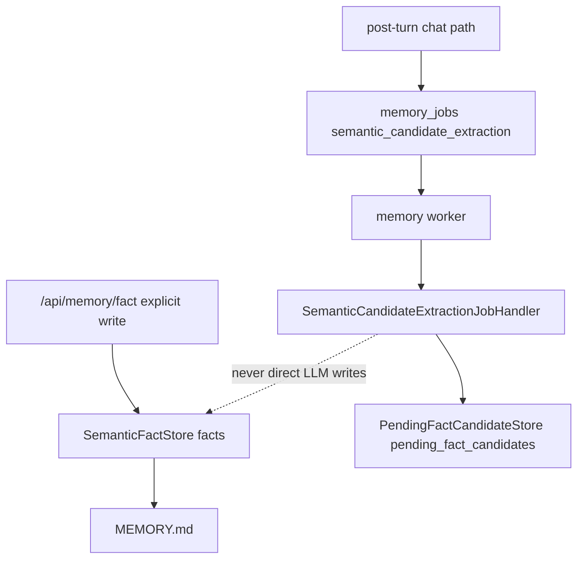

# Phase 7A Design: Semantic Write Paths and Candidate Queue

## 1. Executive Summary

Phase 7A corrects semantic memory write routing before semantic deduplication, embeddings, and consolidation are introduced.

The current semantic memory system allows direct permanent writes into the legacy `facts` FTS table from multiple paths, including legacy secondary-LLM helpers. This violates the approved architecture because implicit LLM-extracted facts can bypass candidate review, deduplication, and future consolidation. Phase 7A establishes a clean split:

- Explicit stable facts may be stored immediately in permanent semantic memory.
- LLM-extracted implicit facts must be stored only as pending candidates.
- No LLM candidate may directly write to `facts`.
- Candidate extraction happens only in the background worker through `semantic_candidate_extraction`.
- Retrieval remains unchanged and continues to read legacy `facts`.
- `MEMORY.md` remains a mirror of permanent facts only.

Phase 7A does not implement semantic deduplication. It prepares the write paths and candidate queue so Phase 7B can add deduplication and embeddings without first untangling where facts are written.

Target flow:



## 2. Scope

In scope:

- Add `src/memory/semantic_store.py`.
- Add `src/memory/semantic_candidates.py`.
- Add deterministic explicit fact extraction helpers.
- Add repository APIs for permanent semantic facts.
- Add repository APIs for Phase 2 `pending_fact_candidates`.
- Replace only `semantic_candidate_extraction` no-op with a real worker handler.
- Ensure worker-side LLM extraction writes pending candidates only.
- Preserve `/api/memory/fact` explicit fact write compatibility.
- Preserve `/api/memory` and `/api/memory/full` response shapes.
- Preserve `MEMORY.md` mirroring for permanent facts.
- Keep retrieval behavior unchanged.
- Add focused tests for explicit write routing, candidate queueing, worker handler behavior, API compatibility, and regression safety.

Likely implementation files:

- New: `src/memory/semantic_store.py`
- New: `src/memory/semantic_candidates.py`
- Modify: `src/memory/semantic.py`
- Modify: `src/memory/job_handlers.py`
- Modify: `src/api/server.py`
- Tests only

Optional implementation files:

- `src/memory/jobs.py` only if the existing semantic payload needs small metadata additions.
- `src/memory/types.py` only if small dataclass alignment is useful.

## 3. Out of Scope

Phase 7A must not implement:

- Semantic deduplication.
- Embeddings.
- Vector search.
- Semantic consolidation.
- Promotion of pending candidates to permanent facts.
- Retrieval changes.
- Schema migrations.
- Chat-path secondary LLM calls.
- Worker auto-start changes.
- Procedural generation.
- Skill writing.
- API response shape changes.
- Legacy episode backfill or semantic backfill.

Existing legacy `pending_facts` remains for compatibility but is not the new architecture candidate queue. Phase 7A uses Phase 2 `pending_fact_candidates`.

## 4. Current Semantic Memory Assessment

### `src/memory/semantic.py`

Current useful behavior:

- `add_semantic_fact()` writes to legacy `facts` and syncs `MEMORY.md`.
- `get_all_semantic_facts()` reads `facts`.
- `search_facts_top_k()` uses existing FTS search and is still the runtime retrieval path.
- `sync_memory_md()` mirrors permanent facts into `MEMORY.md`.

Current architecture gaps:

- `process_fact_candidates()` promotes any candidate with confidence above `0.90` directly into `facts`, regardless of whether it came from deterministic explicit extraction or LLM inference.
- Low-confidence candidates go into legacy `pending_facts`, not Phase 2 `pending_fact_candidates`.
- `run_periodic_consolidation()` can call the secondary LLM and directly write promoted facts, then clears `pending_facts` wholesale.
- `extract_and_save_facts()` writes candidates through the legacy confidence gate and is used in older tests and monkeypatches.
- The module imports `get_secondary_llm()`, making semantic responsibilities mixed with model routing.

Phase 7A stance:

- Keep legacy public functions import-compatible.
- Route explicit permanent writes through `SemanticFactStore`.
- Add new candidate queue APIs using `pending_fact_candidates`.
- Avoid using legacy `run_periodic_consolidation()` in the approved worker path.
- Do not remove legacy functions in this phase because older tests and modules still import them.

### `src/memory/jobs.py`

Current semantic enqueue behavior:

- Eligible completed turns enqueue `semantic_candidate_extraction`.
- Payload contains:

```json
{
  "semantic": {
    "candidate_source": "post_turn",
    "extract_explicit_only": false,
    "legacy_pending_facts_backfill": false
  }
}
```

This is mostly sufficient for Phase 7A. The payload already contains user/assistant text and model selectors.

Recommended additive metadata:

- `semantic.schema_version = 1`
- `semantic.write_policy = "pending_candidates_only_for_llm"`
- `semantic.explicit_fact_policy = "api_or_deterministic_only"`

These additions are backward-compatible and make handler validation easier.

### `src/memory/job_handlers.py`

Current behavior:

- `episode_generation` is real after Phase 6B.
- `summary_generation` is real after Phase 5B.
- `semantic_candidate_extraction` remains `NoOpMemoryJobHandler`.

Phase 7A should replace only `semantic_candidate_extraction` with a real worker handler. Procedural, consolidation, skill, and future semantic dedup handlers remain no-op.

### `src/memory/schema.py`

Phase 2 already created `pending_fact_candidates`:

| Column | Type | Notes |
|---|---|---|
| `id` | `TEXT PRIMARY KEY` | Candidate id |
| `session_id` | `TEXT NOT NULL` | Owning session |
| `source_message_id` | `TEXT` | Optional source raw turn/message id |
| `source_episode_id` | `TEXT` | Optional structured episode source |
| `fact` | `TEXT NOT NULL CHECK (fact <> '')` | Candidate fact text |
| `category` | `TEXT NOT NULL` | Candidate category |
| `confidence` | `REAL NOT NULL CHECK (confidence >= 0 AND confidence <= 1)` | Model/rule confidence |
| `explicit` | `INTEGER NOT NULL DEFAULT 0 CHECK (explicit IN (0, 1))` | Boolean flag |
| `source` | `TEXT NOT NULL` | Source label |
| `status` | `TEXT NOT NULL DEFAULT 'PENDING'` | `PENDING`, `IN_CONSOLIDATION`, `PROMOTED`, `DISCARDED`, `DEFERRED`, `FAILED` |
| `batch_id` | `TEXT` | Worker batch id |
| `metadata_json` | `TEXT` | Canonical JSON metadata |
| `created_at` | `TEXT NOT NULL DEFAULT (datetime('now'))` | Insert timestamp |
| `updated_at` | `TEXT NOT NULL DEFAULT (datetime('now'))` | Update timestamp |
| `processed_at` | `TEXT` | Future processing timestamp |

Existing indexes support status/time, session, episode, batch, and category. No migration is required.

### `src/api/server.py`

Current endpoints:

- `/api/memory/fact` calls `add_semantic_fact(..., source="user_api")`.
- `/api/memory` returns permanent `facts`.
- `/api/memory/full` returns permanent facts plus legacy episodes and markdown content.
- Data inspector already allows `pending_fact_candidates`.

Phase 7A should preserve public response shapes.

## 5. Semantic Store Design

Create `src/memory/semantic_store.py`.

Responsibilities:

- Own permanent semantic fact writes to legacy `facts`.
- Own permanent fact reads needed by existing API compatibility.
- Own `MEMORY.md` sync from permanent facts.
- Validate explicit fact writes.
- Provide an explicit write API that future dedup Phase 7B can wrap.

Non-responsibilities:

- No LLM calls.
- No deduplication.
- No embeddings.
- No consolidation.
- No retrieval planner changes.
- No pending candidate writes.

### Data Types

```python
@dataclass(frozen=True)
class SemanticFactWrite:
    category: str
    fact_text: str
    source: str = "user"
    confidence: float = 1.0
    explicit: bool = True
```

```python
@dataclass(frozen=True)
class SemanticFactRecord:
    id: str
    category: str
    fact_text: str
    source: str
    confidence: float
    created_at: str
```

```python
class SemanticFactValidationError(ValueError):
    field: str
    message: str
```

### Repository API

```python
class SemanticFactStore:
    def __init__(self, db_path: Path | None = None, memory_path: Path | None = None): ...

    def add_explicit_fact(self, fact: SemanticFactWrite) -> SemanticFactRecord: ...

    def list_facts(self) -> list[SemanticFactRecord]: ...

    def search_facts(self, query: str, limit: int = 10) -> list[dict[str, Any]]: ...

    def sync_memory_md(self) -> str: ...
```

### Validation

Permanent explicit writes:

- `fact_text` must be non-empty after whitespace normalization.
- `category` must be non-empty after whitespace normalization.
- `source` must be non-empty after whitespace normalization.
- `confidence` must be between `0` and `1`.
- `explicit` must be true for immediate permanent writes in Phase 7A, unless source is a trusted legacy compatibility source.

Recommended categories are not enforced yet because existing APIs accept arbitrary category strings.

### Permanent Write Rule

`add_explicit_fact()` writes directly to `facts` only when the fact is explicit/stable. Phase 7B will insert deduplication before permanent write. Phase 7A intentionally preserves insert-only behavior for explicit facts to avoid broad migration blast radius.

### Compatibility Wrappers in `semantic.py`

`src/memory/semantic.py` should become a compatibility facade:

- `add_semantic_fact()` delegates to `SemanticFactStore.add_explicit_fact()` and `sync_memory_md()`.
- `get_all_semantic_facts()` delegates to `SemanticFactStore.list_facts()` and returns legacy dict shape.
- `search_facts_top_k()` remains unchanged or delegates to store search while still using FTS.
- `sync_memory_md()` delegates to store mirror logic.

Keep function signatures compatible with existing tests.

## 6. Pending Candidate Store Design

Create `src/memory/semantic_candidates.py`.

Responsibilities:

- Own writes to Phase 2 `pending_fact_candidates`.
- Validate candidate facts.
- Provide idempotent app-level duplicate prevention for the same source/job/fact.
- List pending candidates for tests and future APIs.
- Provide status update helpers for future Phase 7C only if needed as no-op-safe additions.

Non-responsibilities:

- No permanent fact writes.
- No deduplication decisions.
- No embeddings.
- No consolidation.
- No retrieval integration.

### Data Types

```python
CandidateStatus = Literal[
    "PENDING",
    "IN_CONSOLIDATION",
    "PROMOTED",
    "DISCARDED",
    "DEFERRED",
    "FAILED",
]
```

```python
@dataclass(frozen=True)
class PendingFactCandidateWrite:
    session_id: str
    fact: str
    category: str
    confidence: float
    explicit: bool
    source: str
    source_message_id: str | None = None
    source_episode_id: str | None = None
    batch_id: str | None = None
    metadata: dict[str, Any] = field(default_factory=dict)
    id: str | None = None
```

```python
@dataclass(frozen=True)
class PendingFactCandidateRecord:
    id: str
    session_id: str
    source_message_id: str | None
    source_episode_id: str | None
    fact: str
    category: str
    confidence: float
    explicit: bool
    source: str
    status: CandidateStatus
    batch_id: str | None
    metadata: dict[str, Any]
    created_at: str
    updated_at: str
    processed_at: str | None
```

### Repository API

```python
class PendingFactCandidateStore:
    def __init__(self, db_path: Path | None = None): ...

    def add_candidate(self, candidate: PendingFactCandidateWrite) -> PendingFactCandidateRecord: ...

    def add_candidates(self, candidates: Sequence[PendingFactCandidateWrite]) -> list[PendingFactCandidateRecord]: ...

    def get_by_id(self, candidate_id: str) -> PendingFactCandidateRecord | None: ...

    def list_by_session(self, session_id: str, status: CandidateStatus | None = None, limit: int = 100) -> list[PendingFactCandidateRecord]: ...

    def list_pending(self, limit: int = 100) -> list[PendingFactCandidateRecord]: ...

    def count_by_session(self, session_id: str, status: CandidateStatus | None = None) -> int: ...
```

### Candidate Idempotency

The schema has no unique idempotency column. Phase 7A should enforce app-level idempotency by computing a deterministic candidate id:

```text
fact_candidate_{short_hash(session_id|source|source_message_id|source_episode_id|normalized_fact|category)}
```

If `id` is provided, use it after validation. If insertion hits primary-key conflict, return the existing row.

This avoids duplicate candidates on job retry while avoiding schema changes.

### JSON Metadata

`metadata_json` should be canonical JSON text:

- Include `source_job_id`.
- Include `job_type`.
- Include `model_provider`.
- Include `model_name`.
- Include `extraction_method`: `deterministic` or `secondary_llm`.
- Include raw confidence/rationale if returned by the LLM.

Do not require SQLite JSON1.

## 7. Deterministic Explicit Fact Extraction

Phase 7A should separate deterministic explicit facts from implicit LLM candidates.

### Explicit Extraction Helper

Place in `src/memory/semantic_candidates.py` or `src/memory/semantic_store.py`:

```python
def extract_explicit_facts_from_user_text(user_text: str) -> list[SemanticFactWrite]: ...
```

Rules:

- Deterministic regex/pattern matching only.
- No LLM calls.
- Only stable explicit forms should be immediate facts.

Suggested initial explicit patterns:

- `remember that <fact>`
- `please remember <fact>`
- `do not forget <fact>`
- `don't forget <fact>`
- `my name is <name>`
- `my email is <email>`

Do not immediately store vague preferences such as `I like...` or `I prefer...` from chat in Phase 7A unless the wording includes an explicit remember marker. Those may become pending candidates through the worker.

### API Explicit Writes

`/api/memory/fact` remains an explicit trusted user/API write. It may store immediately through `SemanticFactStore.add_explicit_fact()`.

### Chat Explicit Writes

Important design choice:

- Phase 7A should not add direct chat-path permanent fact writes.
- The chat path already enqueues `semantic_candidate_extraction`.
- Deterministic explicit facts found in chat can be included as `explicit=True` pending candidates by the worker or a pure helper, but should not become permanent facts until the explicit chat-write policy is approved.

Rationale:

- This avoids adding a second chat-path write side effect while Phase 7B dedup is not ready.
- The user-facing explicit API remains the safe immediate permanent path.

## 8. `semantic_candidate_extraction` Handler Design

Modify `src/memory/job_handlers.py`.

Add:

```python
@dataclass(frozen=True)
class SemanticCandidateExtractionJobHandler:
    job_type: str = "semantic_candidate_extraction"

    def handle(self, job: Mapping[str, Any], payload: Mapping[str, Any]) -> JobHandlerResult: ...
```

Register:

```python
registry["semantic_candidate_extraction"] = SemanticCandidateExtractionJobHandler()
registry["episode_generation"] = EpisodeGenerationJobHandler()
registry["summary_generation"] = SummaryGenerationJobHandler()
```

All procedural/consolidation/skill handlers remain no-op.

### Handler Flow

1. Validate top-level payload and `schema_version`.
2. Validate `payload["semantic"]` exists or tolerate old Phase 3A payload shape with defaults.
3. Extract `session_id`, user text, assistant text, source message ids, and model selectors.
4. Create a deterministic `batch_id` from `job["id"]`.
5. Run deterministic explicit extraction on the user text.
6. Add deterministic explicit extractions to `pending_fact_candidates` as `explicit=True`, source `deterministic_explicit_chat`, status `PENDING`.
7. Resolve secondary route from job payload.
8. If secondary unavailable:
   - If deterministic candidates were written, return success with `processed=True`, `llm_available=False`.
   - If no deterministic candidates were written, return retryable failure.
9. If secondary available, invoke it with a strict candidate-extraction prompt.
10. Parse JSON output into candidate objects.
11. Normalize and validate candidates.
12. Write all LLM candidates to `pending_fact_candidates` as `explicit=False` unless the handler can prove a deterministic explicit pattern produced them.
13. Return success with candidate counts.

### LLM Prompt Boundary

The prompt may ask for candidate facts only:

```json
{
  "candidates": [
    {
      "fact": "User prefers compact technical plans.",
      "category": "user_preference",
      "confidence": 0.82,
      "rationale": "User stated preference in this turn."
    }
  ]
}
```

Prompt constraints:

- Do not write permanent memory.
- Do not deduplicate.
- Do not consolidate.
- Return only JSON.
- If no candidate facts, return `{"candidates":[]}`.

The handler must not accept or execute LLM instructions to promote/write facts.

### Parsing and Repair

Allowed:

- Parse direct JSON and fenced JSON.
- Accept either `{"candidates": [...]}` or a bare list of objects.
- Drop invalid candidate entries.
- Clamp confidence into `0..1` only if the value is numeric but slightly out of range? Recommended: reject invalid confidence to keep candidate quality deterministic.
- Default category to `general` only when fact text is valid and category is absent.

Not allowed:

- Direct permanent `facts` write.
- Embedding generation.
- Deduplication classification.

### Retry Behavior

- Invalid permanent payload shape: nonretryable failure.
- Secondary unavailable with no deterministic candidates: retryable failure.
- Secondary unavailable with deterministic candidates written: success with partial processing.
- LLM invocation failure after deterministic candidates written: success with partial result or retryable failure? Recommended: retryable failure only if idempotent candidate IDs make retry safe. Phase 7A can choose retryable failure so later retry can add LLM candidates without duplicating deterministic ones.
- Candidate store write failure: retryable failure.

## 9. API Compatibility

### `/api/memory/fact`

Keep request shape:

```json
{
  "category": "user_pref",
  "fact_text": "Prefers FastAPI"
}
```

Keep response shape:

```json
{
  "status": "success",
  "message": "Fact saved and MEMORY.md synced."
}
```

Implementation should route to:

```python
SemanticFactStore().add_explicit_fact(...)
```

through the compatibility wrapper `add_semantic_fact()`.

### `/api/memory`

Keep returning permanent facts only:

```json
{
  "facts": [...],
  "total_facts": 1
}
```

### `/api/memory/full`

Keep behavior unchanged:

- Permanent facts from `facts`.
- Legacy episodes from `search_episodes_fts()`.
- Markdown content.

Do not include pending candidates in `/api/memory/full` during Phase 7A.

### Data Inspector

`pending_fact_candidates` is already allow-listed. Phase 7A tests should verify that inserted pending candidates can be read through:

```text
/api/data/table/pending_fact_candidates
```

No new endpoint is required in Phase 7A.

## 10. `MEMORY.md` Compatibility

Phase 7A rule:

- `MEMORY.md` mirrors permanent semantic facts only.
- Pending candidates are not written to `MEMORY.md`.

Explicit API writes:

- Store in `facts`.
- Sync `MEMORY.md`.

Worker candidate extraction:

- Store in `pending_fact_candidates`.
- Do not sync or modify `MEMORY.md`.

Legacy compatibility:

- `sync_memory_md()` should keep the same text format where possible.
- Existing tests that assert permanent facts appear in `MEMORY.md` should still pass.
- Add tests that LLM pending candidates do not appear in `MEMORY.md`.

## 11. Failure Handling

### Explicit API/Store Path

Invalid fact text:

- API still returns `400`.
- Store raises validation error.

DB write failure:

- API returns existing `500` style behavior unless current server catches it differently.
- Do not partially write `MEMORY.md` if DB write fails.

`MEMORY.md` write failure:

- Preferred behavior: surface failure for explicit API writes because the existing contract says saved and synced.
- Do not roll back already committed FTS row unless implementation can safely transactionally coordinate file writes, which SQLite/file cannot guarantee.

### Worker Candidate Path

Invalid payload:

- Nonretryable failure.

Secondary unavailable:

- Retryable if no deterministic candidates were written.
- If deterministic candidates were written, result should include `llm_available=False`; retry policy should be chosen explicitly and tested. Recommended: retryable failure with idempotent deterministic candidate ids, so LLM extraction can be retried.

Invalid LLM JSON:

- Retryable failure.

No candidates:

- Success with `candidate_count=0`.

Duplicate candidates:

- Candidate store returns existing rows using deterministic ids.
- Handler result reports inserted vs reused counts if practical.

Candidate write failure:

- Retryable failure.

## 12. Test Plan

Suggested new tests:

- `tests/test_phase7a_semantic_store.py`
- `tests/test_phase7a_semantic_candidates.py`
- `tests/test_phase7a_explicit_extraction.py`
- `tests/test_phase7a_semantic_handler.py`
- `tests/test_phase7a_api_memory_fact.py`

Semantic store tests:

- Explicit fact writes to `facts`.
- Explicit fact syncs `MEMORY.md`.
- Empty fact text fails validation.
- Empty category fails validation.
- Confidence outside `0..1` fails.
- `get_all_semantic_facts()` legacy wrapper still returns expected dict shape.
- `search_facts_top_k()` still searches permanent facts.

Candidate store tests:

- Add candidate writes to `pending_fact_candidates`.
- JSON metadata is canonical and decodable.
- Boolean `explicit` stored as `0` or `1`.
- Status defaults to `PENDING`.
- Source job metadata is preserved.
- Deterministic candidate id prevents duplicates.
- `list_pending()` returns pending candidates only.
- Candidate writes do not write `facts`.
- Candidate writes do not modify `MEMORY.md`.

Explicit extraction tests:

- `remember that ...` extracts explicit fact.
- `please remember ...` extracts explicit fact.
- `don't forget ...` extracts explicit fact.
- `my name is ...` extracts profile fact.
- `my email is ...` extracts contact fact.
- Vague `I like...` without explicit remember does not become immediate explicit fact.
- Extraction uses no LLM calls.

Worker handler tests:

- Default registry uses `SemanticCandidateExtractionJobHandler`.
- Episode and summary handlers remain registered.
- Procedural/consolidation/skill handlers remain no-op.
- Valid payload with secondary unavailable and no deterministic facts returns retryable failure.
- Valid payload with deterministic explicit fact writes pending explicit candidate.
- Handler resolves secondary route only inside handler.
- Handler parses direct JSON candidates.
- Handler parses fenced JSON candidates.
- Handler accepts empty candidate list.
- LLM candidates write only to `pending_fact_candidates`.
- LLM candidates never write `facts`.
- Handler does not modify `MEMORY.md`.
- Duplicate job retry does not duplicate candidates.
- Invalid payload is nonretryable.
- Invalid LLM JSON is retryable.

API compatibility tests:

- `/api/memory/fact` still stores permanent fact.
- `/api/memory/fact` still syncs `MEMORY.md`.
- `/api/memory` response shape unchanged.
- `/api/memory/full` response shape unchanged.
- `/api/data/table/pending_fact_candidates` reads worker candidates.

Regression tests:

- Phase 3A queue tests still pass.
- Phase 3B router/worker tests updated for semantic handler now real.
- Phase 5B/6B handler tests still pass.
- Existing semantic confidence gate tests either remain legacy-characterization tests or are updated to assert new Phase 7A routing.

Suggested commands:

```bash
python -m pytest tests/test_phase7a_semantic_store.py tests/test_phase7a_semantic_candidates.py tests/test_phase7a_explicit_extraction.py tests/test_phase7a_semantic_handler.py tests/test_phase7a_api_memory_fact.py -q
python -m pytest tests/test_semantic_confidence_gate.py tests/test_long_term_memory.py tests/test_api_server.py tests/test_phase3a_memory_jobs.py tests/test_phase3b_router_handlers.py tests/test_phase5b_summary_job_handler.py tests/test_phase6b_episode_handler.py -q
python -m pytest tests/test_phase6b_episode_detector.py tests/test_phase6b_episode_continuation.py tests/test_phase6b_episode_jobs.py tests/test_phase6b_graph_enqueue.py -q
```

Run the full suite if focused tests pass.

## 13. Risks

| Risk | Impact | Mitigation |
|---|---|---|
| Legacy LLM helper still writes permanent facts | Architecture remains leaky | Keep approved worker path off `async_workers.py`; update tests to cover `semantic_candidate_extraction` handler. |
| Explicit vs implicit line is ambiguous | Facts may bypass candidate queue | Only API writes and deterministic explicit patterns are immediate/explicit; LLM outputs always pending. |
| Candidate duplicates on retry | Pending queue noise | Deterministic candidate ids based on source and normalized fact. |
| Pending candidates never reach permanent memory in Phase 7A | User may not see LLM-inferred facts in retrieval yet | This is intentional until Phase 7B/7C dedup and consolidation. |
| Existing tests expect confidence gate promotion | Regression churn | Treat old confidence gate tests as legacy compatibility or update them to Phase 7A contracts. |
| `MEMORY.md` gets noisy with pending candidates | User-visible memory pollution | Only sync permanent `facts`. |
| Handler JSON parsing is too permissive | Bad candidate quality | Drop invalid entries and require non-empty fact plus bounded confidence. |
| No schema uniqueness for candidates | Duplicate rows under races | Deterministic primary key prevents normal retry duplicates. |

## 14. Acceptance Criteria

Phase 7A is complete when:

- `src/memory/semantic_store.py` exists.
- `src/memory/semantic_candidates.py` exists.
- Explicit API facts are written through the semantic store to permanent `facts`.
- `MEMORY.md` syncs permanent facts only.
- Deterministic explicit extraction exists and uses no LLM.
- `semantic_candidate_extraction` has a real worker handler.
- Worker-side LLM candidates are written only to `pending_fact_candidates`.
- No LLM candidate writes directly to permanent `facts`.
- Candidate queue writes are idempotent across retries.
- Semantic deduplication is not implemented.
- Embeddings are not implemented.
- Semantic consolidation is not implemented.
- Retrieval behavior is unchanged.
- No schema migrations are added.
- No chat-path secondary LLM call is added.
- API response shapes remain unchanged.
- Focused Phase 7A and relevant regression tests pass.

## 15. Implementation Checklist

1. Create `src/memory/semantic_store.py`.
2. Define `SemanticFactWrite`.
3. Define `SemanticFactRecord`.
4. Define semantic fact validation error.
5. Implement `SemanticFactStore.add_explicit_fact()`.
6. Implement `SemanticFactStore.list_facts()`.
7. Implement `SemanticFactStore.search_facts()`.
8. Implement `SemanticFactStore.sync_memory_md()`.
9. Create `src/memory/semantic_candidates.py`.
10. Define `PendingFactCandidateWrite`.
11. Define `PendingFactCandidateRecord`.
12. Define candidate validation error.
13. Implement canonical metadata JSON.
14. Implement deterministic candidate id generation.
15. Implement `PendingFactCandidateStore.add_candidate()`.
16. Implement `add_candidates()`.
17. Implement candidate list/count helpers.
18. Implement deterministic explicit fact extraction.
19. Refactor `src/memory/semantic.py` into compatibility wrappers.
20. Preserve `add_semantic_fact()` signature.
21. Preserve `get_all_semantic_facts()` dict shape.
22. Preserve `search_facts_top_k()` retrieval behavior.
23. Preserve `sync_memory_md()` output format where possible.
24. Update `/api/memory/fact` only if needed to route via wrapper/store.
25. Add `SemanticCandidateExtractionJobHandler`.
26. Register it for `semantic_candidate_extraction`.
27. Keep episode and summary handlers unchanged.
28. Keep procedural/consolidation/skill handlers no-op.
29. Add worker handler payload validation.
30. Add worker-side secondary route resolution.
31. Add candidate extraction prompt and JSON parser.
32. Ensure LLM candidates write only pending candidates.
33. Ensure handler writes no `facts` or `MEMORY.md`.
34. Add Phase 7A tests.
35. Update older tests whose no-op/confidence-gate assumptions are superseded.
36. Run focused tests.
37. Run semantic/API/queue/worker/episode/summary regressions.
38. Run full suite if focused tests pass.

## File-by-File Design

### New: `src/memory/semantic_store.py`

Owns permanent semantic fact storage and `MEMORY.md` mirroring. Contains no LLM calls, no candidate queue logic, and no deduplication.

### New: `src/memory/semantic_candidates.py`

Owns pending candidate storage in `pending_fact_candidates`, deterministic candidate ids, explicit extraction helpers, and candidate validation. Contains no permanent fact writes.

### Modify: `src/memory/semantic.py`

Convert to compatibility facade over the new store/candidate modules while preserving public function signatures. Do not add approved worker-path LLM writes here.

### Modify: `src/memory/job_handlers.py`

Add and register `SemanticCandidateExtractionJobHandler`. Preserve existing `EpisodeGenerationJobHandler` and `SummaryGenerationJobHandler`. Keep procedural/consolidation/skill handlers no-op.

### Optional Modify: `src/memory/jobs.py`

Add small semantic payload metadata only if useful. Preserve post-turn enqueue behavior and idempotency.

### Modify: `src/api/server.py`

Prefer no response-shape changes. If touched, only route `/api/memory/fact` through the explicit semantic store wrapper.

### Keep: `src/memory/job_router.py`, `src/memory/worker.py`

No router or worker loop changes are expected.

### Keep: `src/db.py`, `src/db_migrations.py`, `src/memory/schema.py`

No schema or migration changes are allowed.

### Keep Retrieval Modules

No retrieval changes. `search_facts_top_k()` remains compatible with current FTS behavior.

