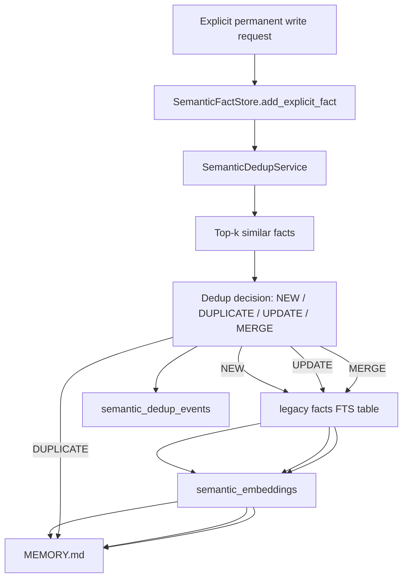

# Phase 7B Design: Semantic Deduplication and Embeddings

## 1. Executive Summary

Phase 7B adds mandatory semantic deduplication and embedding support for permanent semantic fact writes. It builds directly on Phase 7A's corrected write routing:

- Phase 7A separated explicit permanent writes from pending LLM candidates.
- Phase 7B makes every permanent fact write pass through a deduplication decision before touching the legacy `facts` table.
- Phase 7B stores embeddings for permanent semantic facts in the existing `semantic_embeddings` table.
- Phase 7B records every dedup decision in the existing `semantic_dedup_events` table.
- Phase 7B does not promote pending candidates in bulk. Phase 7C will own consolidation and candidate promotion.

Target flow:



This phase prepares semantic memory for future consolidation by establishing a strict action contract and audit trail. It must not change retrieval behavior, promote all pending candidates, add schema migrations, or introduce chat-path secondary LLM calls.

## 2. Scope

In scope:

- Add `src/memory/embeddings.py`.
- Add `src/memory/semantic_dedup.py`.
- Add an embedding provider abstraction.
- Add deterministic fallback embeddings and similarity scoring for tests and unavailable providers.
- Use the existing `semantic_embeddings` table.
- Use the existing `semantic_dedup_events` table.
- Add top-k similar permanent fact lookup for dedup only.
- Add a strict dedup decision contract with actions `NEW`, `DUPLICATE`, `UPDATE`, and `MERGE`.
- Refactor permanent semantic fact writes in `SemanticFactStore` so dedup is mandatory.
- Add update/merge behavior for legacy `facts` rows.
- Regenerate or upsert embeddings after `NEW`, `UPDATE`, and `MERGE`.
- Preserve Phase 7A pending candidate behavior.
- Preserve API request/response shapes.
- Preserve current retrieval behavior.
- Add focused deterministic tests and compatibility regression tests.

Likely implementation files:

- New: `src/memory/embeddings.py`
- New: `src/memory/semantic_dedup.py`
- Modify: `src/memory/semantic_store.py`
- Modify: `src/memory/semantic.py`
- Optional modify: `src/memory/job_handlers.py` only for assertion-safe imports or future helper boundaries. The semantic candidate handler must remain pending-only.
- Tests only.

Optional implementation files:

- `src/memory/semantic_candidates.py` only for small read/status helpers needed to pass `candidate_id` into dedup-aware writes.
- `src/api/server.py` only if explicit API validation errors need clearer 400 mapping without changing success response shape.

## 3. Out of Scope

Phase 7B must not implement:

- Semantic consolidation.
- Periodic promotion of all pending candidates.
- Automatic promotion of Phase 7A LLM candidates.
- Retrieval planner changes.
- Vector search in chat retrieval.
- Procedural memory changes.
- Skill writing.
- Schema migrations unless an implementation audit proves an existing table is unusable.
- Chat-path secondary LLM calls.
- Direct LLM candidate writes to permanent facts.
- Worker auto-start changes.
- New public API response fields.

Important boundary:

- Phase 7A pending candidates remain `PENDING` unless explicitly processed through a dedup-aware permanent write path.
- Phase 7C will own scheduled/periodic consolidation and candidate status transitions such as `PROMOTED`, `DISCARDED`, and `DEFERRED`.

## 4. Current Semantic Write Assessment

### `src/memory/semantic_store.py`

Current Phase 7A behavior:

- `SemanticFactStore.add_explicit_fact()` validates explicit facts and inserts directly into legacy `facts`.
- `SemanticFactStore.list_facts()` returns legacy facts ordered by rowid.
- `SemanticFactStore.search_facts()` delegates to existing FTS keyword search.
- `SemanticFactStore.sync_memory_md()` mirrors all permanent facts.
- The module contains no LLM calls, deduplication, embeddings, or consolidation.

Phase 7B gap:

- Duplicate explicit facts can still be inserted.
- Permanent facts have no embedding rows.
- No audit trail explains why a permanent write was inserted, skipped, updated, or merged.
- `facts` is an FTS virtual table with only `rowid` as a stable identifier. Phase 7B must treat `facts.rowid` as the semantic fact id when storing embeddings and dedup events.

### `src/memory/semantic_candidates.py`

Current Phase 7A behavior:

- Candidate writes are idempotent using deterministic candidate ids.
- Candidate rows use `pending_fact_candidates` and do not modify `facts` or `MEMORY.md`.
- Deterministic explicit extraction writes pending candidates when run from the worker path.

Phase 7B stance:

- Leave candidate queue behavior unchanged.
- Do not promote candidates automatically.
- Allow future Phase 7C to call the same dedup-aware permanent write path for individual candidates.

### `src/memory/semantic.py`

Current Phase 7A behavior:

- Compatibility facade preserves `add_semantic_fact()`, `get_all_semantic_facts()`, `search_facts_top_k()`, and `sync_memory_md()`.
- `process_fact_candidates()` routes to pending candidates instead of direct promotion.
- `run_periodic_consolidation()` is a compatibility shim and does not perform real semantic consolidation.

Phase 7B stance:

- `add_semantic_fact()` remains the public compatibility entry point for explicit permanent writes.
- The wrapper delegates to dedup-aware `SemanticFactStore.add_explicit_fact()`.
- `search_facts_top_k()` remains keyword/FTS based. Embeddings are not used for runtime retrieval in Phase 7B.

### `src/memory/job_handlers.py`

Current Phase 7A behavior:

- `SemanticCandidateExtractionJobHandler` writes deterministic explicit candidates and LLM candidates to `pending_fact_candidates` only.
- It does not write permanent facts.
- It resolves and calls the secondary LLM only inside the worker handler.

Phase 7B stance:

- Keep semantic candidate extraction pending-only.
- Do not add promotion inside this handler.
- Procedural, consolidation, and skill handlers remain no-op.

### `src/memory/schema.py`

Existing Phase 2 tables are sufficient:

- `semantic_embeddings`
- `semantic_dedup_events`
- legacy `facts`
- `pending_fact_candidates`

No schema migration is expected.

### `src/harness/llm_router.py`

Current behavior:

- Provides role-aware primary/secondary LLM routing.
- Provides `resolve_secondary_from_job_payload()` for worker-side LLM role resolution.
- Does not provide embedding-specific routing.

Phase 7B stance:

- Do not modify runtime chat routing.
- Embedding provider abstraction must not require chat or secondary LLM factory calls.
- If a secondary LLM classifier is used for dedup, it must be outside the chat path and injected or explicitly resolved through secondary-role routing.

### `src/memory/worker.py`

Current behavior:

- Deterministic single-step worker dispatches handlers and marks success/failure.
- No automatic worker startup in chat path.

Phase 7B stance:

- Worker loop should remain unchanged.
- Dedup can be called by explicit permanent write paths and later by Phase 7C worker handlers.
- Phase 7B does not add new worker job types.

## 5. Embedding Architecture

Create `src/memory/embeddings.py`.

Responsibilities:

- Normalize text for embedding input.
- Provide an embedding provider abstraction.
- Provide deterministic fallback embeddings for tests and local/offline operation.
- Store and retrieve embedding rows from `semantic_embeddings`.
- Compute cosine similarity.
- Retrieve top-k similar permanent semantic facts for dedup decisions.
- Upsert embeddings for `owner_type='semantic_fact'` after permanent fact creation/update/merge.

Non-responsibilities:

- No chat retrieval changes.
- No vector indexes.
- No schema migrations.
- No semantic consolidation.
- No LLM dedup classifier.

### Data Types

```python
@dataclass(frozen=True)
class EmbeddingInput:
    owner_type: str
    owner_id: str
    text: str
    embedding_model: str = "deterministic-fallback-v1"
    metadata: dict[str, Any] = field(default_factory=dict)
```

```python
@dataclass(frozen=True)
class EmbeddingVector:
    model: str
    dimensions: int
    values: list[float]
    provider: str
    fallback_used: bool
```

```python
@dataclass(frozen=True)
class SemanticEmbeddingRecord:
    id: str
    owner_type: str
    owner_id: str
    embedding_model: str
    embedding_dim: int
    embedding: list[float]
    content_hash: str
    metadata: dict[str, Any]
    created_at: str
    updated_at: str
```

```python
class EmbeddingProvider(Protocol):
    model: str
    dimensions: int

    def embed_text(self, text: str) -> EmbeddingVector: ...
```

```python
@dataclass(frozen=True)
class SimilarFactMatch:
    fact: SemanticFactRecord
    embedding: SemanticEmbeddingRecord | None
    similarity: float
    strategy: Literal["embedding", "lexical_fallback"]
```

### Provider Implementations

`DeterministicFallbackEmbeddingProvider`:

- Always available.
- No network calls.
- No LLM calls.
- Produces fixed-size vectors from normalized text using hashing/token buckets.
- Designed for deterministic tests and degraded local behavior.
- Recommended default dimensions: `64` or `128`.

Future provider-specific implementation:

- Optional in Phase 7B.
- Should be injectable and mockable.
- Must not be required for tests.
- If unavailable, the write path falls back to deterministic embeddings unless strict mode is explicitly enabled.

### Provider Selection

Add:

```python
@dataclass(frozen=True)
class EmbeddingProviderConfig:
    provider: str = "deterministic"
    model: str = "deterministic-fallback-v1"
    dimensions: int = 64
    allow_fallback: bool = True
```

Add:

```python
def get_embedding_provider(config: EmbeddingProviderConfig | None = None) -> EmbeddingProvider: ...
```

Selection rules:

- Default to deterministic fallback for tests and local compatibility.
- Unknown providers fall back to deterministic when `allow_fallback=True`.
- Provider failures return deterministic embeddings when fallback is allowed.
- No embedding helper may call `resolve_primary_llm()`, `resolve_secondary_llm()`, `get_primary_llm()`, `get_secondary_llm()`, or any chat model `.invoke()`.

### Embedding Repository API

```python
class SemanticEmbeddingStore:
    def __init__(self, db_path: Path | None = None): ...

    def upsert_embedding(self, input: EmbeddingInput, provider: EmbeddingProvider | None = None) -> SemanticEmbeddingRecord: ...

    def get_embedding(self, owner_type: str, owner_id: str, embedding_model: str) -> SemanticEmbeddingRecord | None: ...

    def list_embeddings_for_owner(self, owner_type: str, owner_id: str) -> list[SemanticEmbeddingRecord]: ...

    def delete_embeddings_for_owner(self, owner_type: str, owner_id: str) -> int: ...

    def top_k_similar_facts(self, text: str, facts: Sequence[SemanticFactRecord], k: int = 5, provider: EmbeddingProvider | None = None) -> list[SimilarFactMatch]: ...
```

`delete_embeddings_for_owner()` is allowed because embeddings are derived data, not user-authored memory. It must delete only rows in `semantic_embeddings`, never facts.

### Text to Embed

Use deterministic canonical text for stored facts:

```text
Category: {category}
Fact: {fact_text}
Source: {source}
```

Use deterministic canonical text for incoming candidate similarity:

```text
Category: {candidate_category}
Fact: {candidate_fact_text}
```

Candidate similarity excludes source so identical facts from different sources compare strongly.

## 6. Semantic Dedup Architecture

Create `src/memory/semantic_dedup.py`.

Responsibilities:

- Own dedup decision data types.
- Fetch similar permanent facts.
- Build dedup classifier prompt/context if a secondary LLM classifier is available.
- Provide deterministic fallback classification.
- Validate classifier outputs.
- Record dedup audit events.
- Return an executable decision to `SemanticFactStore`.

Non-responsibilities:

- No pending candidate consolidation loop.
- No chat retrieval integration.
- No embedding schema changes.
- No procedural writes.

### Data Types

```python
DedupAction = Literal["NEW", "DUPLICATE", "UPDATE", "MERGE"]
```

```python
@dataclass(frozen=True)
class SemanticDedupInput:
    fact: SemanticFactWrite
    candidate_id: str | None = None
    source_job_id: str | None = None
    llm_route_payload: Mapping[str, Any] | None = None
```

```python
@dataclass(frozen=True)
class SimilarSemanticFact:
    fact_id: str
    category: str
    fact_text: str
    source: str
    confidence: float
    similarity: float
    strategy: str
```

```python
@dataclass(frozen=True)
class SemanticDedupDecision:
    action: DedupAction
    new_fact_text: str
    category: str
    confidence: float
    target_fact_id: str | None = None
    merged_fact_ids: list[str] = field(default_factory=list)
    similar_fact_ids: list[str] = field(default_factory=list)
    reason: str = ""
    classifier_provider: str | None = None
    classifier_model: str | None = None
    classifier_used: bool = False
    fallback_used: bool = False
```

```python
@dataclass(frozen=True)
class SemanticDedupEventRecord:
    id: str
    candidate_id: str | None
    new_fact_text: str
    action: DedupAction
    target_fact_id: str | None
    merged_fact_ids: list[str]
    similar_fact_ids: list[str]
    llm_provider: str | None
    llm_model: str | None
    reason: str | None
    confidence: float | None
    context: dict[str, Any]
    source_job_id: str | None
    created_at: str
```

### Service API

```python
class SemanticDedupService:
    def __init__(
        self,
        db_path: Path | None = None,
        embedding_store: SemanticEmbeddingStore | None = None,
        embedding_provider: EmbeddingProvider | None = None,
        classifier: SemanticDedupClassifier | None = None,
    ): ...

    def decide(self, input: SemanticDedupInput) -> SemanticDedupDecision: ...

    def record_event(self, input: SemanticDedupInput, decision: SemanticDedupDecision, context: dict[str, Any]) -> SemanticDedupEventRecord: ...

    def decide_and_record(self, input: SemanticDedupInput) -> tuple[SemanticDedupDecision, SemanticDedupEventRecord]: ...
```

### Classifier Boundary

```python
class SemanticDedupClassifier(Protocol):
    def classify(
        self,
        input: SemanticDedupInput,
        similar_facts: Sequence[SimilarSemanticFact],
    ) -> SemanticDedupDecision: ...
```

Implementations:

- `DeterministicSemanticDedupClassifier`
- `SecondaryLLMSemanticDedupClassifier`

Phase 7B must make deterministic behavior sufficient for tests. The secondary LLM classifier is allowed only outside the chat path, such as explicit API writes or future worker consolidation, and must be injected or resolved through secondary-role routing. It must never be called by `node_agent()`, `node_manage_memory()`, or `node_consolidate()`.

## 7. Similar Fact Retrieval Design

Dedup needs a local top-k similar fact search that is independent from chat retrieval.

Source facts:

- Use `SemanticFactStore.list_facts()` to load permanent facts from legacy `facts`.
- Exclude the incoming unsaved fact from comparison.
- For update/merge operations, target ids must be current `facts.rowid` values.

Primary strategy:

1. Embed the incoming text with the configured embedding provider.
2. Load existing permanent fact embeddings for the same embedding model.
3. Opportunistically generate missing embeddings for permanent facts using fallback-capable provider logic.
4. Compute cosine similarity.
5. Return top-k matches.

Fallback strategy:

1. Normalize tokens with lowercase, punctuation stripping, stop-word removal, and simple suffix trimming.
2. Compute a combined score from token Jaccard and containment overlap.
3. Return top-k lexical matches.

The fallback must be deterministic and require no external dependencies.

Recommended thresholds:

| Threshold | Meaning |
|---|---|
| `>= 0.96` | Strong duplicate candidate |
| `0.88 - 0.96` | Potential update/merge candidate |
| `< 0.88` | Likely new fact |

Recommended default `top_k`: `5`.

## 8. Dedup Decision Contract

Actions must be exactly one of:

- `NEW`
- `DUPLICATE`
- `UPDATE`
- `MERGE`

Any classifier output outside this set must fail closed into deterministic fallback or a write failure before fact mutation.

### `NEW`

Meaning:

- No existing permanent fact represents the same memory.

Effect:

- Insert a new row into `facts`.
- Upsert embedding for the new row.
- Record a dedup event with `action='NEW'`.
- Sync `MEMORY.md`.

### `DUPLICATE`

Meaning:

- Existing fact already captures the same memory.

Effect:

- Do not insert or update `facts`.
- Record a dedup event with `action='DUPLICATE'` and `target_fact_id`.
- Return the existing target fact record.
- Do not add a duplicate line to `MEMORY.md`.

### `UPDATE`

Meaning:

- One existing fact should be replaced with a clearer or more current fact.

Effect:

- Update exactly one existing `facts` row by `rowid`.
- Preserve `created_at` if practical.
- Upsert embedding for the updated row.
- Record a dedup event with `action='UPDATE'` and `target_fact_id`.
- Sync `MEMORY.md`.

### `MERGE`

Meaning:

- Multiple existing facts and the incoming fact should be combined into one canonical fact.

Effect:

- Update the primary `target_fact_id` row with the merged fact text.
- Remove merged duplicate rows from `facts` by rowid.
- Delete embeddings for removed fact rows.
- Upsert embedding for the target fact row.
- Record a dedup event with `action='MERGE'`, `target_fact_id`, and `merged_fact_ids_json`.
- Sync `MEMORY.md`.

### Deterministic Fallback Rules

When no secondary classifier is available:

- If top match similarity is `>= 0.96`, return `DUPLICATE`.
- If top match similarity is `0.88` to `< 0.96` and the incoming fact contains strictly more specific information than the target, return `UPDATE`.
- If two or more matches are above `0.88` and share category/topic tokens, return `MERGE` only when the merged text can be formed deterministically without contradiction.
- Otherwise return `NEW`.

Conservative rule:

- Prefer `NEW` over uncertain `UPDATE` or `MERGE`.
- Prefer `DUPLICATE` over `UPDATE` when normalized facts are identical.
- Never delete existing rows unless `MERGE` has an explicit target and merged ids.

## 9. Permanent Fact Write Flow

`SemanticFactStore.add_explicit_fact()` becomes dedup-aware and mandatory.

Recommended signature:

```python
def add_explicit_fact(
    self,
    fact: SemanticFactWrite,
    *,
    dedup_service: SemanticDedupService | None = None,
    candidate_id: str | None = None,
    source_job_id: str | None = None,
    llm_route_payload: Mapping[str, Any] | None = None,
) -> SemanticFactRecord: ...
```

Compatibility rules:

- Existing callers may still call `add_explicit_fact(fact)` with no new keyword arguments.
- Existing `add_semantic_fact()` signature remains unchanged.
- Dedup is mandatory because the store creates a default `SemanticDedupService` when none is provided.

Flow:

1. Validate `SemanticFactWrite`.
2. Build `SemanticDedupInput`.
3. Call `SemanticDedupService.decide_and_record()` or equivalent flow that guarantees one event for every successful write attempt.
4. Execute exactly one action:
   - `NEW`: insert row.
   - `DUPLICATE`: read and return target row.
   - `UPDATE`: update target row.
   - `MERGE`: update target row and remove merged rows.
5. Upsert embeddings after `NEW`, `UPDATE`, or `MERGE`.
6. Optionally fill a missing target embedding after `DUPLICATE`.
7. Sync `MEMORY.md` after successful completion.
8. Return the inserted, updated, merged, or existing fact record.

Transaction guidance:

- DB changes for facts, embeddings, and dedup events should happen in a clear order and roll back where practical.
- SQLite/file sync cannot be a single transaction with `MEMORY.md`; write DB first, then render `MEMORY.md` from committed permanent facts.
- If `MEMORY.md` sync fails after DB commit, surface the failure for explicit API writes and leave DB as source of truth.

## 10. UPDATE and MERGE Semantics

Legacy `facts` is an FTS5 table:

```sql
facts(category UNINDEXED, fact_text, source UNINDEXED, confidence UNINDEXED, created_at UNINDEXED)
```

The row identifier is `rowid`.

### Updating One Fact

Preferred implementation:

```sql
UPDATE facts
SET category = ?, fact_text = ?, source = ?, confidence = ?
WHERE rowid = ?
```

If SQLite FTS behavior rejects direct update in any environment, use a tested delete/insert fallback only if the implementation can preserve observable behavior. Because embeddings and dedup events reference `rowid`, direct update by rowid is strongly preferred.

Update fields:

- `category`: from dedup decision or incoming fact.
- `fact_text`: dedup decision canonical `new_fact_text`.
- `source`: preserve existing source unless the incoming source is more explicit.
- `confidence`: max of existing confidence and incoming confidence.
- `created_at`: preserve existing value.

### Merging Multiple Facts

MERGE should be rare and conservative.

Rules:

- `target_fact_id` is the row to keep.
- `merged_fact_ids` are rows to remove, excluding target.
- `new_fact_text` is the canonical merged statement.
- `category` is preserved from target unless decision explicitly provides category.
- Confidence is max of target, merged rows, and incoming fact confidence.
- Delete only rows listed in `merged_fact_ids`.
- Delete embeddings for removed rows.
- Upsert target embedding after update.

Contradictions:

- If facts appear contradictory, deterministic fallback must not MERGE.
- Secondary classifier may propose `UPDATE` or `MERGE` only with a reason and bounded confidence.
- Invalid or low-confidence classifier output falls back to deterministic behavior.

## 11. `semantic_embeddings` Usage

Use the existing Phase 2 table:

| Column | Phase 7B usage |
|---|---|
| `id` | Deterministic id such as `embedding_{owner_type}_{owner_id}_{hash(model)}` |
| `owner_type` | `semantic_fact` for permanent facts |
| `owner_id` | Legacy `facts.rowid` as string |
| `embedding_model` | Provider/model id, default `deterministic-fallback-v1` |
| `embedding_dim` | Vector length |
| `embedding_json` | Canonical JSON array of floats |
| `content_hash` | SHA-256 of canonical embedded text |
| `metadata_json` | Provider, fallback flag, source module, content hash |
| `created_at` | DB timestamp |
| `updated_at` | Updated on upsert |

Existing indexes already support:

- Unique owner/model rows.
- Owner lookup.
- Content hash lookup.

Embedding serialization:

- Store JSON arrays as TEXT.
- Validate parsed embeddings are non-empty lists of numbers.
- Do not require SQLite JSON1.

Regeneration policy:

- `NEW`: insert fact, then upsert embedding for new `rowid`.
- `UPDATE`: update fact row, then upsert embedding for same `rowid`.
- `MERGE`: update target row, delete embeddings for removed rows, then upsert target embedding.
- `DUPLICATE`: do not regenerate unless the target has no embedding and fallback generation is available.

## 12. `semantic_dedup_events` Usage

Use the existing Phase 2 table:

| Column | Phase 7B usage |
|---|---|
| `id` | `dedup_event_{short_hash(...)}` or UUID |
| `candidate_id` | Pending candidate id if this write came from a candidate, otherwise null |
| `new_fact_text` | Incoming or canonical final fact text |
| `action` | `NEW`, `DUPLICATE`, `UPDATE`, or `MERGE` |
| `target_fact_id` | Target legacy `facts.rowid` for duplicate/update/merge |
| `merged_fact_ids_json` | Canonical JSON array of merged rowids for MERGE |
| `similar_fact_ids_json` | Canonical JSON array of top-k similar rowids inspected |
| `llm_provider` | Secondary provider if classifier used |
| `llm_model` | Secondary model if classifier used |
| `reason` | Short decision rationale |
| `confidence` | Dedup decision confidence, nullable |
| `context_json` | Canonical JSON with thresholds, similarities, fallback flags, content hashes |
| `source_job_id` | Memory job id if invoked from worker path |
| `created_at` | DB timestamp |

Record one event for every successful permanent write attempt after validation:

- `NEW`: final inserted fact text.
- `DUPLICATE`: skipped write and target fact id.
- `UPDATE`: target row and replacement text.
- `MERGE`: target row and removed fact ids.

If dedup fails before producing a valid decision, do not write an event because the table has no `FAILED` action. Surface the failure instead.

Recommended `context_json` fields:

```json
{
  "phase": "7B",
  "thresholds": {"duplicate": 0.96, "update": 0.88},
  "similar_facts": [
    {"fact_id": "1", "similarity": 0.98, "strategy": "embedding"}
  ],
  "embedding_model": "deterministic-fallback-v1",
  "embedding_fallback_used": true,
  "classifier_used": false,
  "classifier_fallback_used": true,
  "incoming_content_hash": "..."
}
```

## 13. Failure Handling

### Embedding Provider Unavailable

Default behavior:

- Fall back to `DeterministicFallbackEmbeddingProvider`.
- Continue dedup.
- Record `embedding_fallback_used=true` in event context and embedding metadata.

Strict mode, if added:

- If fallback is disabled, permanent write fails before modifying `facts`.
- Do not write a dedup event unless a valid decision was made.

### Secondary LLM Classifier Unavailable

Default behavior:

- Use `DeterministicSemanticDedupClassifier`.
- Continue permanent write.
- Record `classifier_used=false`, `fallback_used=true`, and reason.

Reasoning:

- Explicit API writes should remain available offline.
- Chat remains unaffected because no secondary classifier runs in chat path.

### Invalid Secondary LLM Classifier Output

Behavior:

- Reject invalid action values.
- Reject missing target ids for `DUPLICATE`, `UPDATE`, or `MERGE`.
- Reject `MERGE` if merged ids are empty or include unknown rows.
- Fall back to deterministic classifier where possible.
- If fallback cannot produce a safe decision, fail the write before modifying facts.

### Similarity Search Failure

Behavior:

- If embedding search fails, retry with lexical fallback.
- If both embedding and lexical fallback fail, fail the permanent write before modifying facts.

### Fact Mutation Failure

Behavior:

- Roll back DB changes where possible.
- Do not sync `MEMORY.md` after failed DB mutations.
- Surface error to caller.

### `MEMORY.md` Sync Failure

Behavior:

- DB remains source of truth.
- Surface failure for explicit API writes because the existing success message promises sync.
- Do not retry inside chat path.

## 14. API Compatibility

### `/api/memory/fact`

Request shape remains unchanged:

```json
{
  "category": "user_pref",
  "fact_text": "Prefers FastAPI"
}
```

Response shape remains unchanged on success:

```json
{
  "status": "success",
  "message": "Fact saved and MEMORY.md synced."
}
```

Internal behavior changes:

- The explicit fact passes through mandatory dedup.
- `DUPLICATE` still returns success because the requested memory is already represented.
- `UPDATE` or `MERGE` still returns success because permanent memory has been updated safely.

Validation failures:

- Preserve existing `400` for empty fact text.
- Store validation errors may map to `400` if `src/api/server.py` is touched, but success response shape must remain unchanged.

### `/api/memory`

Response shape remains unchanged:

```json
{
  "facts": [...],
  "total_facts": 1
}
```

The returned facts may contain fewer duplicates because Phase 7B prevents new duplicate writes.

### `/api/memory/full`

Response shape remains unchanged:

```json
{
  "facts": [...],
  "episodes": [...],
  "soul_md": "...",
  "skill_md": "...",
  "memory_md": "..."
}
```

Do not add dedup events or embeddings to this endpoint in Phase 7B.

### Data Inspector

No API allow-list changes are expected because Phase 2 already allow-listed:

- `semantic_embeddings`
- `semantic_dedup_events`

Add tests that the data inspector can list/read rows written by Phase 7B.

## 15. `MEMORY.md` Compatibility

Rules:

- `MEMORY.md` continues to mirror permanent `facts` only.
- Pending candidates are not mirrored.
- Embeddings are not mirrored.
- Dedup events are not mirrored.

After actions:

- `NEW`: includes newly inserted fact.
- `DUPLICATE`: no duplicate line appears.
- `UPDATE`: old text is replaced by updated text.
- `MERGE`: merged duplicates disappear and canonical merged text appears once.

Existing format should remain stable:

```markdown
# Semantic Memory (MEMORY.md Mirror)

*Auto-synced from SQLite `facts` table.*

## Category
- Fact text
```

## 16. Test Plan

Suggested new tests:

- `tests/test_phase7b_embeddings.py`
- `tests/test_phase7b_semantic_dedup.py`
- `tests/test_phase7b_semantic_store_dedup.py`
- `tests/test_phase7b_api_memory_fact.py`
- `tests/test_phase7b_data_inspector.py`

Embedding tests:

- Deterministic fallback embeddings are stable for same text.
- Different text produces different vectors.
- Empty text validation fails.
- Embedding JSON is canonical and decodable.
- `semantic_embeddings` row is inserted for `owner_type='semantic_fact'`.
- Upsert updates existing owner/model row instead of duplicating.
- Cosine similarity returns expected values.
- Missing provider falls back deterministically without LLM calls.

Dedup service tests:

- No existing facts returns `NEW`.
- Exact normalized duplicate returns `DUPLICATE`.
- Near duplicate with more specific incoming text returns `UPDATE` under deterministic fallback.
- Multiple compatible near duplicates can return conservative `MERGE` only when deterministic merge is safe.
- Ambiguous or contradictory facts return `NEW` rather than destructive merge.
- Invalid classifier action is rejected or falls back.
- Missing target id for `DUPLICATE`, `UPDATE`, or `MERGE` fails validation.
- `semantic_dedup_events` records action, target ids, similar ids, context JSON, and classifier/fallback metadata.

Semantic store tests:

- `add_explicit_fact()` creates a fact, embedding, dedup event, and `MEMORY.md` entry for `NEW`.
- Duplicate `add_explicit_fact()` does not create a second permanent fact.
- Duplicate write records a `DUPLICATE` event.
- `UPDATE` modifies exactly one row and regenerates that row's embedding.
- `MERGE` updates target, removes merged rows, deletes removed embeddings, and records merged ids.
- Embedding provider failure falls back and still writes safely.
- If fallback disabled, write fails before fact mutation.
- LLM classifier unavailable falls back to deterministic decision.
- No helper calls primary LLM or chat-path secondary LLM.

API compatibility tests:

- `/api/memory/fact` success response unchanged for `NEW`.
- `/api/memory/fact` success response unchanged for `DUPLICATE`.
- `/api/memory` shape unchanged and duplicate count does not increase.
- `/api/memory/full` shape unchanged and `MEMORY.md` has no duplicate line.

Data inspector tests:

- `/api/data/table/semantic_embeddings` reads generated embeddings.
- `/api/data/table/semantic_dedup_events` reads generated dedup events.

Regression tests:

- Phase 7A semantic store/candidate/handler/API tests still pass.
- Phase 3A/3B queue and router tests still pass.
- Phase 5B summary handler tests still pass.
- Phase 6B episode handler/jobs tests still pass.
- Existing `tests/test_long_term_memory.py` still passes with dedup-aware explicit writes.

Suggested commands:

```bash
python -m pytest tests/test_phase7b_embeddings.py tests/test_phase7b_semantic_dedup.py tests/test_phase7b_semantic_store_dedup.py tests/test_phase7b_api_memory_fact.py tests/test_phase7b_data_inspector.py -q
python -m pytest tests/test_phase7a_semantic_store.py tests/test_phase7a_semantic_candidates.py tests/test_phase7a_explicit_extraction.py tests/test_phase7a_semantic_handler.py tests/test_phase7a_api_memory_fact.py -q
python -m pytest tests/test_semantic_confidence_gate.py tests/test_long_term_memory.py tests/test_api_server.py tests/test_phase3a_memory_jobs.py tests/test_phase3b_router_handlers.py tests/test_phase5b_summary_job_handler.py tests/test_phase6b_episode_handler.py -q
```

Run the full suite if focused tests pass.

## 17. Risks

| Risk | Impact | Mitigation |
|---|---|---|
| FTS `rowid` updates behave differently across SQLite builds | UPDATE/MERGE may lose stable ids | Test direct update. If fallback is needed, document rowid-changing behavior and adjust embedding/event references carefully. |
| Deterministic embeddings are weaker than provider embeddings | Dedup may miss semantic duplicates | Use lexical fallback and conservative classifier behavior; Phase 7C can improve promotion quality. |
| Over-aggressive merge deletes useful facts | Data loss | Conservative thresholds, require explicit target/merged ids, prefer NEW on ambiguity. |
| Secondary classifier unavailable | Writes could block if required | Default to deterministic classifier; never block chat. |
| Embedding provider unavailable | Writes could fail | Default fallback embeddings unless strict mode is explicitly enabled. |
| Existing tests expect duplicate inserts | Regression churn | Update tests to assert mandatory dedup contract for permanent writes. |
| Dedup event table has no FAILED action | Failed attempts may lack audit rows | Surface failures and avoid invalid event actions. |
| `MEMORY.md` sync after DB commit can fail | API could report failure after DB mutation | Keep DB source of truth and surface sync failure clearly. |
| No schema unique constraint on canonical fact | Race duplicates possible | Dedup reduces duplicates; if concurrent writes remain a problem, Phase 7C or Phase 11 may add a migration or lock strategy. |

## 18. Acceptance Criteria

Phase 7B is complete when:

- `src/memory/embeddings.py` exists.
- `src/memory/semantic_dedup.py` exists.
- Permanent semantic fact writes always call dedup before mutating `facts`.
- Dedup actions are exactly `NEW`, `DUPLICATE`, `UPDATE`, and `MERGE`.
- Duplicate permanent writes do not create duplicate `facts` rows.
- `NEW`, `UPDATE`, and `MERGE` generate or regenerate semantic fact embeddings.
- `semantic_embeddings` is used without schema migration.
- Every successful permanent write attempt records a `semantic_dedup_events` row.
- Embedding provider failures fall back deterministically by default.
- Secondary LLM classifier failures fall back deterministically by default.
- Phase 7A pending candidates remain pending unless explicitly processed through the dedup-aware write path.
- LLM candidates are not written directly to permanent facts.
- Retrieval behavior remains unchanged.
- `/api/memory`, `/api/memory/fact`, and `/api/memory/full` response shapes remain unchanged.
- `MEMORY.md` mirrors deduped permanent facts only.
- No schema migrations are added unless an implementation audit proves existing Phase 2 tables are unusable.
- No chat-path secondary LLM calls are added.
- Focused Phase 7B tests and Phase 7A/regression tests pass.

## 19. Implementation Checklist

1. Create `src/memory/embeddings.py`.
2. Define embedding dataclasses and protocol.
3. Implement text normalization and content hashing.
4. Implement deterministic fallback embedding provider.
5. Implement cosine similarity.
6. Implement canonical embedding JSON serialization/parsing.
7. Implement `SemanticEmbeddingStore.upsert_embedding()`.
8. Implement embedding reads and owner cleanup helpers.
9. Implement top-k similar fact lookup for dedup only.
10. Create `src/memory/semantic_dedup.py`.
11. Define `DedupAction` literal.
12. Define dedup input, similar fact, decision, and event records.
13. Implement deterministic fallback dedup classifier.
14. Implement optional secondary LLM classifier boundary with strict JSON validation.
15. Implement dedup decision validation.
16. Implement dedup event recording in `semantic_dedup_events`.
17. Refactor `SemanticFactStore.add_explicit_fact()` to call dedup service before mutation.
18. Implement fact insert for `NEW`.
19. Implement duplicate no-op for `DUPLICATE`.
20. Implement rowid-preserving fact update for `UPDATE`.
21. Implement conservative target update and duplicate row removal for `MERGE`.
22. Upsert embeddings after `NEW`, `UPDATE`, and `MERGE`.
23. Delete embeddings for removed rows during `MERGE`.
24. Keep `sync_memory_md()` rendering permanent facts only.
25. Keep `semantic.py` compatibility signatures unchanged.
26. Keep `SemanticCandidateExtractionJobHandler` writing only pending candidates.
27. Add Phase 7B embedding tests.
28. Add Phase 7B dedup service tests.
29. Add Phase 7B semantic store integration tests.
30. Add API compatibility tests.
31. Add data inspector tests for embeddings and dedup events.
32. Run focused Phase 7B tests.
33. Run Phase 7A regression tests.
34. Run queue/worker/summary/episode regression tests.
35. Run full suite if focused tests pass.

## File-by-File Design

### New: `src/memory/embeddings.py`

Owns embedding provider abstraction, deterministic fallback embeddings, embedding table serialization, embedding upsert/read/delete helpers, cosine similarity, and top-k similar fact retrieval for dedup.

Must not call chat LLMs, retrieval modules, worker loop code, or schema migrations.

### New: `src/memory/semantic_dedup.py`

Owns dedup action contract, deterministic fallback classifier, optional secondary classifier boundary, similar fact context assembly, decision validation, and dedup event writes.

Must not promote pending candidates in bulk or change chat retrieval.

### Modify: `src/memory/semantic_store.py`

Refactor permanent write path so `add_explicit_fact()` is dedup-aware by default. Add private helpers for inserting, updating, merging, and reading facts by rowid. Keep list/search/sync behavior compatible.

### Modify: `src/memory/semantic.py`

Keep compatibility facade signatures. `add_semantic_fact()` continues to call `SemanticFactStore.add_explicit_fact()` and returns `None`, but the underlying store now dedups.

### Keep/Optional: `src/memory/semantic_candidates.py`

Keep Phase 7A pending candidate behavior unchanged. Add only small read/status helpers if future Phase 7B tests need to pass `candidate_id` into dedup-aware writes.

### Keep/Optional: `src/memory/job_handlers.py`

Keep `SemanticCandidateExtractionJobHandler` pending-only. Do not add candidate promotion here. Touch only if imports or assertion-safe exports are needed.

### Keep: `src/memory/job_router.py` and `src/memory/worker.py`

No worker/router behavior changes are expected.

### Keep: `src/memory/schema.py`, `src/db.py`, `src/db_migrations.py`

Use existing tables. Do not add migrations unless implementation proves an existing table cannot support required behavior.

### Keep: Retrieval Modules

`search_facts_top_k()` remains FTS/keyword based. Embeddings are used only for dedup in Phase 7B.

## Filesystem Wiring Check Required After Implementation

After implementing Phase 7B, the implementer must verify actual filesystem state, not rely only on the UI edited-files list.

Required checks:

1. Run a filesystem status command such as `git status --short` when inside a Git worktree, or list the expected files directly if the workspace is not a Git repository.
2. Confirm `src/memory/embeddings.py` exists on disk.
3. Confirm `src/memory/semantic_dedup.py` exists on disk.
4. Confirm `src/memory/semantic_store.py` was actually modified and permanent writes are dedup-aware.
5. Confirm `src/memory/semantic.py` compatibility wrappers still import and call the store correctly.
6. Confirm `src/memory/job_handlers.py` was not accidentally changed to promote semantic candidates.
7. Confirm no files outside the allowed Phase 7B scope were modified.
8. Run focused Phase 7B tests and required regressions from a clean terminal command.
9. Report actual files present/modified from the filesystem check in the implementation summary.
