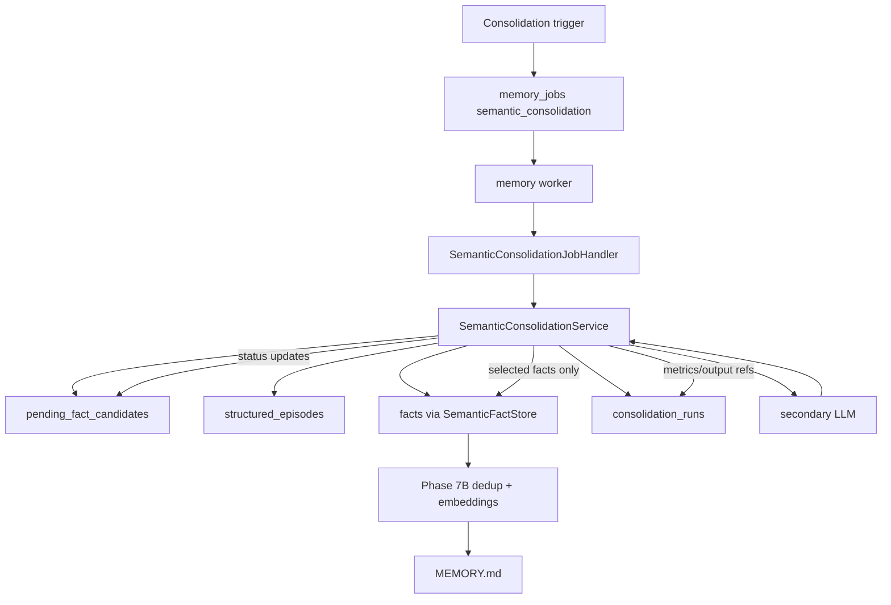

# Phase 7C Design: Semantic Consolidation

## 1. Executive Summary

Phase 7C completes the semantic memory write lifecycle by adding periodic semantic consolidation. Phase 7A created the pending candidate queue and prevented LLM candidate extraction from writing permanent facts. Phase 7B made permanent semantic writes dedup-aware and embedding-backed. Phase 7C now provides the worker-only process that reviews pending candidates, recent structured episodes, and current semantic memory, then promotes only selected facts through the Phase 7B `SemanticFactStore.add_explicit_fact()` path.

The key guarantee is simple: the consolidation LLM may propose facts, but it never writes facts. Every promoted fact must pass through the dedup-aware permanent store.

Target flow:



Phase 7C must remain a background memory-worker behavior. It does not change chat retrieval, public API response shapes, procedural memory, schema, or worker startup behavior.

## 2. Scope

In scope:

- Add `src/memory/semantic_consolidation.py`.
- Add semantic consolidation job payload builders in `src/memory/jobs.py`.
- Replace the `semantic_consolidation` no-op handler with a real worker-only handler in `src/memory/job_handlers.py`.
- Add deterministic trigger evaluation helpers for:
  - every 10 structured episodes,
  - every 100 pending fact candidates,
  - daily idle or maintenance trigger.
- Add idempotent `semantic_consolidation` enqueue helpers.
- Select bounded batches of `PENDING` candidates.
- Select recent structured episodes for context.
- Select current permanent semantic memory for context.
- Invoke the secondary LLM only inside the worker handler.
- Parse structured consolidation output.
- Promote selected facts through `SemanticFactStore.add_explicit_fact()`.
- Transition candidate statuses safely.
- Track lifecycle and metrics in `consolidation_runs`.
- Support partial failure recovery without clearing all pending candidates.
- Add deterministic tests around trigger, batch selection, handler behavior, dedup routing, candidate statuses, and run records.

Likely implementation files:

- New: `src/memory/semantic_consolidation.py`
- Modify: `src/memory/jobs.py`
- Modify: `src/memory/job_handlers.py`
- Optional modify: `src/memory/semantic_candidates.py` for status update and claim helpers.
- Optional modify: `src/memory/semantic_store.py` only if small metadata passthrough is needed for `candidate_id` or `source_job_id`.
- Tests only.

## 3. Out of Scope

Phase 7C must not implement:

- Bypassing Phase 7B dedup.
- Direct LLM writes to permanent facts.
- Automatic processing of every candidate outside bounded consolidation batches.
- Retrieval changes.
- Vector retrieval in chat.
- Procedural memory changes.
- Skill writing.
- Schema migrations unless the existing Phase 2 schema proves unusable.
- Chat-path secondary LLM calls.
- Worker auto-start changes.
- New public API response fields.
- Frontend/UI changes.
- Bulk legacy `pending_facts` backfill.

## 4. Current Semantic Pipeline Assessment

### `src/memory/semantic_candidates.py`

Current behavior:

- Owns `pending_fact_candidates` writes.
- Uses deterministic ids for retry idempotency.
- Supports status values `PENDING`, `IN_CONSOLIDATION`, `PROMOTED`, `DISCARDED`, `DEFERRED`, and `FAILED`.
- Has list/count helpers but no claim/status transition APIs yet.

Phase 7C needs additive helpers:

- claim a bounded candidate batch by status,
- mark selected candidates `IN_CONSOLIDATION`,
- transition individual candidates to terminal or retryable statuses,
- preserve candidates not selected by a failed run,
- avoid clearing all pending candidates.

### `src/memory/semantic_store.py`

Current behavior after Phase 7B:

- Every explicit permanent write passes through `SemanticDedupService`.
- `NEW`, `DUPLICATE`, `UPDATE`, and `MERGE` write dedup events and embeddings.
- `MEMORY.md` mirrors permanent facts only.

Phase 7C stance:

- All promoted consolidation facts must call `SemanticFactStore.add_explicit_fact()`.
- Consolidation must pass `candidate_id` and `source_job_id` where practical so Phase 7B dedup events are attributable.
- Consolidation must never insert into `facts` directly.

### `src/memory/semantic_dedup.py` and `src/memory/embeddings.py`

Current behavior:

- Provide deterministic fallback similarity and dedup classification.
- Store semantic embeddings for permanent facts.
- Record dedup events for permanent write attempts.

Phase 7C stance:

- Reuse these modules through `SemanticFactStore`.
- Do not add retrieval behavior.
- Do not let consolidation write embeddings directly except through the store's dedup-aware write flow.

### `src/memory/episode_store.py`

Current behavior:

- Provides `StructuredEpisodeRepository`.
- Stores and lists structured episodes.
- Does not drive semantic memory directly.

Phase 7C stance:

- Use recent structured episodes as LLM context only.
- Do not mutate episodes.
- Do not create new episodes.

### `src/memory/jobs.py`

Current behavior:

- Builds post-turn `semantic_candidate_extraction` jobs.
- Builds `summary_generation` and `episode_generation` jobs.
- Does not enqueue semantic consolidation jobs yet.

Phase 7C needs:

- `PHASE_7C_SEMANTIC_CONSOLIDATION_PAYLOAD_SCHEMA_VERSION = 1`.
- job type constant for `semantic_consolidation`.
- idempotency helper.
- payload builder.
- job spec builder.
- enqueue helper.
- trigger helper that can be called by maintenance code or tests.

### `src/memory/job_handlers.py`

Current behavior:

- `semantic_candidate_extraction`, `summary_generation`, and `episode_generation` are real handlers.
- `semantic_consolidation` remains a no-op.

Phase 7C needs:

- `SemanticConsolidationJobHandler`.
- Registry update for `semantic_consolidation`.
- Existing semantic candidate extraction must remain pending-only.
- Procedural consolidation and skill handlers remain no-op.

### `src/memory/worker.py`

Current behavior:

- Processes one memory job deterministically.
- Retries/dead-letters failures.
- Does not auto-start in chat path.

Phase 7C stance:

- No worker loop behavior changes expected.
- Handler failures use existing retry/dead-letter behavior.

## 5. Consolidation Architecture

Create `src/memory/semantic_consolidation.py`.

Responsibilities:

- Evaluate consolidation triggers.
- Build deterministic consolidation windows.
- Claim candidate batches safely.
- Load recent structured episode context.
- Load current permanent semantic memory context.
- Build secondary LLM prompt input.
- Parse and validate structured consolidation output.
- Promote selected facts through `SemanticFactStore.add_explicit_fact()`.
- Transition candidates based on outcome.
- Create/update `consolidation_runs`.
- Recover safely after partial failure.

Non-responsibilities:

- No chat retrieval changes.
- No procedural writes.
- No schema migrations.
- No direct writes to `facts`.
- No direct writes to `semantic_embeddings`.
- No episode creation.

### Core Data Types

```python
ConsolidationTriggerType = Literal[
    "structured_episode_threshold",
    "pending_candidate_threshold",
    "daily_idle",
    "manual",
]
```

```python
@dataclass(frozen=True)
class SemanticConsolidationConfig:
    episode_threshold: int = 10
    pending_candidate_threshold: int = 100
    candidate_batch_size: int = 100
    recent_episode_limit: int = 10
    current_memory_limit: int = 50
    min_llm_fact_confidence: float = 0.6
```

```python
@dataclass(frozen=True)
class SemanticConsolidationTrigger:
    should_enqueue: bool
    trigger_type: ConsolidationTriggerType
    session_id: str
    reason: str
    pending_candidate_count: int
    structured_episode_count: int
    window_key: str
```

```python
@dataclass(frozen=True)
class SemanticConsolidationBatch:
    session_id: str
    candidate_ids: list[str]
    episode_ids: list[str]
    semantic_fact_ids: list[str]
    batch_key: str
```

```python
@dataclass(frozen=True)
class ProposedSemanticFact:
    fact: str
    category: str
    confidence: float
    source_candidate_ids: list[str]
    source_episode_ids: list[str]
    rationale: str
```

```python
@dataclass(frozen=True)
class ConsolidationOutcome:
    run_id: str
    promoted_fact_ids: list[str]
    promoted_candidate_ids: list[str]
    discarded_candidate_ids: list[str]
    deferred_candidate_ids: list[str]
    failed_candidate_ids: list[str]
    status: Literal["SUCCEEDED", "PARTIAL", "FAILED"]
    metrics: dict[str, Any]
```

### Service API

```python
class SemanticConsolidationService:
    def __init__(
        self,
        db_path: Path | None = None,
        candidate_store: PendingFactCandidateStore | None = None,
        fact_store: SemanticFactStore | None = None,
        episode_repository: StructuredEpisodeRepository | None = None,
        config: SemanticConsolidationConfig | None = None,
    ): ...

    def evaluate_triggers(self, session_id: str, now: datetime | None = None) -> list[SemanticConsolidationTrigger]: ...

    def build_batch(self, payload: Mapping[str, Any]) -> SemanticConsolidationBatch: ...

    def create_run(self, payload: Mapping[str, Any], batch: SemanticConsolidationBatch) -> ConsolidationRunRecord: ...

    def mark_candidates_in_consolidation(self, candidate_ids: Sequence[str], run_id: str) -> list[PendingFactCandidateRecord]: ...

    def consolidate_with_llm(self, route: LLMRouteResult, payload: Mapping[str, Any], batch: SemanticConsolidationBatch) -> list[ProposedSemanticFact]: ...

    def apply_proposals(self, run_id: str, proposals: Sequence[ProposedSemanticFact], payload: Mapping[str, Any]) -> ConsolidationOutcome: ...
```

## 6. Trigger Design

Triggers should enqueue `semantic_consolidation` jobs idempotently. Trigger evaluation must be deterministic and must not call an LLM.

### Structured Episode Threshold

Rule:

- Enqueue when there are at least 10 structured episodes for a session since the last successful or partial semantic consolidation run that included episode context.

Implementation approach:

- Count `structured_episodes` by `session_id`.
- Inspect latest `consolidation_runs` rows with `consolidation_type='semantic'` and status in `SUCCEEDED`, `PARTIAL`.
- Use `input_refs_json` or `output_refs_json` to determine last covered episode ids/count.
- If at least 10 new structured episodes are uncovered, trigger `structured_episode_threshold`.

### Pending Candidate Threshold

Rule:

- Enqueue when at least 100 `pending_fact_candidates` rows are `PENDING` for a session.

Implementation approach:

- Use `PendingFactCandidateStore.count_by_session(session_id, status="PENDING")`.
- Trigger `pending_candidate_threshold` when count >= 100.

### Daily Idle/Maintenance

Rule:

- Enqueue at most one daily idle semantic consolidation job per session when pending candidates exist or there are new structured episodes since the last run.

Implementation approach:

- Use a deterministic `maintenance_date` in payload, e.g. `YYYY-MM-DD`.
- Idempotency key includes `session_id`, `trigger_type`, and `maintenance_date`.
- Do not require chat traffic.
- Implementation may expose an explicit helper that tests or a future maintenance scheduler can call. Do not auto-start a scheduler in Phase 7C.

### Manual Trigger

Rule:

- Optional internal helper for tests and future APIs.
- Must use the same payload and worker handler path.
- Must not process inline in chat.

## 7. Job Payload Design

Add Phase 7C helpers in `src/memory/jobs.py`.

Constants:

```python
PHASE_7C_SEMANTIC_CONSOLIDATION_PAYLOAD_SCHEMA_VERSION = 1
SEMANTIC_CONSOLIDATION_SOURCE = "memory.semantic_consolidation_trigger"
PHASE_7C_CREATED_BY = "phase_7c_semantic_consolidation_enqueue"
_SEMANTIC_CONSOLIDATION_JOB_TYPE: MemoryJobType = "semantic_consolidation"
```

Payload shape:

```json
{
  "schema_version": 1,
  "source": "memory.semantic_consolidation_trigger",
  "session_id": "sess",
  "models": {
    "primary_provider": "openai",
    "primary_model_name": "gpt-4o-mini",
    "secondary_provider": "openai",
    "secondary_model_name": "gpt-4o-mini"
  },
  "semantic_consolidation": {
    "schema_version": 1,
    "trigger_type": "pending_candidate_threshold",
    "window_key": "pending_candidate_threshold:sess:100:abcd",
    "candidate_statuses": ["PENDING"],
    "candidate_batch_size": 100,
    "recent_episode_limit": 10,
    "current_memory_limit": 50,
    "candidate_ids": null,
    "episode_ids": null,
    "maintenance_date": null,
    "dedup_required": true,
    "legacy_pending_facts_backfill": false
  },
  "created_by": "phase_7c_semantic_consolidation_enqueue"
}
```

Idempotency key:

```text
memq:v1:semantic_consolidation:{session_hash}:{trigger_type}:{window_hash}:{secondary_selector_hash}
```

Idempotency inputs:

- schema version,
- session id,
- trigger type,
- window key,
- explicit candidate ids if provided,
- explicit episode ids if provided,
- maintenance date for daily jobs,
- secondary provider/model.

Priority:

- `70` by default.
- Lower numerical priority than summary generation if the queue treats lower as more urgent? Use existing repository semantics. If higher numerical value means lower priority, preserve current convention and test ordering.

## 8. Candidate Batch Selection

Phase 7C should add small status helpers to `PendingFactCandidateStore`.

Recommended APIs:

```python
def claim_pending_batch(
    self,
    session_id: str,
    batch_id: str,
    limit: int,
    now: str | None = None,
) -> list[PendingFactCandidateRecord]: ...
```

```python
def update_status(
    self,
    candidate_id: str,
    status: CandidateStatus,
    *,
    metadata_update: dict[str, Any] | None = None,
    processed: bool = False,
) -> PendingFactCandidateRecord: ...
```

```python
def update_status_many(
    self,
    candidate_ids: Sequence[str],
    status: CandidateStatus,
    *,
    metadata_update: dict[str, Any] | None = None,
    processed: bool = False,
) -> list[PendingFactCandidateRecord]: ...
```

Selection rules:

- Only select candidates with `status='PENDING'` unless payload explicitly lists candidate ids for retry/recovery.
- Default batch size: 100.
- Order by `created_at ASC, id ASC` for deterministic behavior.
- Set selected rows to `IN_CONSOLIDATION` before invoking the LLM.
- Set `batch_id` to the job id or consolidation run id.
- Preserve existing metadata and add:
  - `consolidation_run_id`,
  - `semantic_consolidation_job_id`,
  - `claimed_at`,
  - `previous_status`.

Do not:

- select `PROMOTED`, `DISCARDED`, `FAILED`, or `DEFERRED` candidates by default,
- delete candidates,
- clear the whole pending queue.

## 9. Episode and Memory Context Selection

### Recent Episode Selection

Use `StructuredEpisodeRepository.list_by_session()`.

Rules:

- Select newest structured episodes up to `recent_episode_limit`.
- Default limit: 10.
- If payload provides `episode_ids`, load exactly those ids.
- Do not mutate episode rows.
- Do not use legacy `episodes` FTS table in Phase 7C except as optional read-only fallback if no structured episodes exist and tests require compatibility. Preferred: structured episodes only.

Context fields:

- id,
- title,
- summary,
- participants,
- topics,
- importance,
- start/end message ids,
- action,
- created_at.

### Current Semantic Memory Selection

Use `SemanticFactStore.list_facts()`.

Rules:

- Select newest/current permanent facts up to `current_memory_limit`.
- Default limit: 50.
- Include id, category, fact_text, confidence, source, created_at.
- Do not use embeddings for chat retrieval.
- Embedding/similarity use remains internal to Phase 7B dedup.

### Candidate Context

For each selected candidate include:

- id,
- fact,
- category,
- confidence,
- explicit flag,
- source,
- source_message_id,
- source_episode_id,
- metadata summary,
- created_at.

Avoid sending unbounded raw metadata. Include source-job/model metadata only when useful.

## 10. Worker Handler Design

Modify `src/memory/job_handlers.py`.

Add:

```python
@dataclass(frozen=True)
class SemanticConsolidationJobHandler:
    job_type: str = "semantic_consolidation"

    def handle(self, job: Mapping[str, Any], payload: Mapping[str, Any]) -> JobHandlerResult: ...
```

Register:

```python
registry["semantic_candidate_extraction"] = SemanticCandidateExtractionJobHandler()
registry["semantic_consolidation"] = SemanticConsolidationJobHandler()
registry["episode_generation"] = EpisodeGenerationJobHandler()
registry["summary_generation"] = SummaryGenerationJobHandler()
```

All procedural/skill handlers remain no-op.

Handler flow:

1. Validate top-level payload and `semantic_consolidation.schema_version`.
2. Build deterministic batch.
3. Create `consolidation_runs` row with status `RUNNING`.
4. Claim selected pending candidates as `IN_CONSOLIDATION`.
5. If no candidates and no episode context, mark run `SUCCEEDED` with zero counts and return success.
6. Resolve secondary route from payload inside the handler.
7. If secondary unavailable:
   - mark claimed candidates back to `PENDING` or `DEFERRED` depending retry policy,
   - mark run `FAILED`,
   - return retryable failure.
8. Invoke secondary LLM with bounded context and strict output schema.
9. Parse structured output.
10. For each proposed fact:
    - validate fact/category/confidence/source references,
    - call `SemanticFactStore.add_explicit_fact(..., candidate_id=..., source_job_id=job_id, llm_route_payload=payload)`.
11. Transition referenced source candidates:
    - `PROMOTED` if promotion write succeeds,
    - `DISCARDED` if LLM explicitly rejects candidate as not worth keeping,
    - `DEFERRED` if LLM says insufficient evidence or candidate is unresolved,
    - `FAILED` only if candidate-specific processing fails.
12. For candidates claimed but not referenced:
    - default `DEFERRED`, not `DISCARDED`, unless output explicitly rejects them.
13. Mark run `SUCCEEDED`, `PARTIAL`, or `FAILED`.
14. Return handler result with counts and run id.

Handler must not:

- insert into `facts` directly,
- update embeddings directly,
- bypass `SemanticFactStore`,
- change retrieval state,
- mutate episodes,
- process procedural memory,
- run in chat path.

## 11. LLM Output Schema

The secondary LLM prompt asks for structured consolidation decisions only.

Required output:

```json
{
  "promote": [
    {
      "fact": "User prefers FastAPI for backend services.",
      "category": "user_preference",
      "confidence": 0.87,
      "source_candidate_ids": ["fact_candidate_abc"],
      "source_episode_ids": ["structured_episode_xyz"],
      "rationale": "Candidate is explicit and reinforced by recent episode."
    }
  ],
  "discard": [
    {
      "candidate_id": "fact_candidate_noise",
      "reason": "Speculative or not stable."
    }
  ],
  "defer": [
    {
      "candidate_id": "fact_candidate_weak",
      "reason": "Insufficient support."
    }
  ]
}
```

Validation rules:

- Top-level output must be a JSON object.
- Accept direct JSON and fenced JSON.
- `promote`, `discard`, and `defer` default to empty lists if omitted.
- Promoted facts require non-empty `fact`, non-empty `category`, bounded confidence `0..1`.
- `source_candidate_ids` must refer to selected candidates if present.
- `source_episode_ids` must refer to selected episodes if present.
- Unknown candidate ids in discard/defer are ignored or treated as output validation failure depending strictness. Recommended: ignore unknown ids and count as invalid output entries.
- LLM-supplied permanent fact ids, dedup actions, embeddings, or retrieval instructions are ignored.
- LLM cannot choose `NEW`, `DUPLICATE`, `UPDATE`, or `MERGE`; Phase 7B dedup decides that.

Prompt constraints:

- Return only JSON.
- Do not decide dedup action.
- Do not write memory.
- Do not create embeddings.
- Do not generate skills.
- Prefer no promotion when evidence is weak.
- Use provided candidate ids exactly.

## 12. Dedup-Aware Write Flow

For each valid promoted fact:

1. Build `SemanticFactWrite`:
   - `category`: LLM output category,
   - `fact_text`: LLM output fact,
   - `source`: `semantic_consolidation`,
   - `confidence`: LLM output confidence,
   - `explicit`: `True` because this is an approved consolidation proposal, not a raw candidate.
2. Determine primary `candidate_id`:
   - If exactly one `source_candidate_id`, use it.
   - If multiple source candidates, pass the first as `candidate_id` and include all candidates in metadata/run refs.
3. Call:

```python
SemanticFactStore(db_path=db_path, memory_path=memory_path).add_explicit_fact(
    SemanticFactWrite(...),
    candidate_id=primary_candidate_id,
    source_job_id=job_id,
    llm_route_payload=payload,
)
```

4. Let Phase 7B dedup decide `NEW`, `DUPLICATE`, `UPDATE`, or `MERGE`.
5. Treat `DUPLICATE` as a successful promotion for candidate lifecycle purposes because the memory is already represented.
6. Store resulting fact ids and dedup event refs in `consolidation_runs.output_refs_json`.

This is the central safety rule for Phase 7C: the consolidation LLM produces proposals, not permanent writes.

## 13. Candidate Status Transition Design

Allowed statuses:

- `PENDING`
- `IN_CONSOLIDATION`
- `PROMOTED`
- `DISCARDED`
- `DEFERRED`
- `FAILED`

### Transition Table

| From | To | When |
|---|---|---|
| `PENDING` | `IN_CONSOLIDATION` | Candidate selected for a run |
| `IN_CONSOLIDATION` | `PROMOTED` | Referenced by a promoted fact whose dedup-aware write succeeds |
| `IN_CONSOLIDATION` | `DISCARDED` | LLM explicitly rejects as unstable/noisy |
| `IN_CONSOLIDATION` | `DEFERRED` | LLM asks for more evidence or candidate is unreferenced |
| `IN_CONSOLIDATION` | `FAILED` | Candidate-specific processing fails after retry-safe handling |
| `IN_CONSOLIDATION` | `PENDING` | Whole run fails before LLM output or before any candidate-specific decision |
| `DEFERRED` | `PENDING` | Future phase/manual maintenance may requeue; not required in Phase 7C |

Metadata updates:

- `consolidation_run_id`,
- `semantic_consolidation_job_id`,
- `status_reason`,
- `promoted_fact_id`,
- `dedup_action` if available from dedup event,
- `processed_at` for terminal statuses `PROMOTED`, `DISCARDED`, `FAILED`.

Important:

- Do not delete candidates.
- Do not clear all pending candidates after failure.
- Do not mark unrelated pending candidates.
- Batch updates should be deterministic and idempotent by candidate id.

## 14. `consolidation_runs` Usage

Use the existing Phase 2 table:

| Column | Phase 7C usage |
|---|---|
| `id` | `semantic_consolidation_{short_hash(job_id or window_key)}` or UUID |
| `consolidation_type` | Always `semantic` |
| `trigger_type` | `structured_episode_threshold`, `pending_candidate_threshold`, `daily_idle`, or `manual` |
| `status` | `PENDING`, `RUNNING`, `SUCCEEDED`, `FAILED`, `PARTIAL`, `CANCELLED` |
| `input_refs_json` | Candidate ids, episode ids, semantic fact ids, trigger metadata, model selector |
| `output_refs_json` | Promoted fact ids, dedup event ids if available, promoted/discarded/deferred/failed candidate ids |
| `metrics_json` | Counts, durations, parse error counts, validation drop counts |
| `error_message` | Failure summary |
| `source_job_id` | `memory_jobs.id` |
| `started_at` | Run start timestamp |
| `completed_at` | Terminal timestamp |
| `created_at` | DB timestamp |
| `updated_at` | Updated on status changes |

Recommended repository APIs inside `semantic_consolidation.py`:

```python
class ConsolidationRunRepository:
    def create_run(...) -> ConsolidationRunRecord: ...
    def mark_running(run_id: str, ...) -> ConsolidationRunRecord: ...
    def mark_succeeded(run_id: str, output_refs: dict[str, Any], metrics: dict[str, Any]) -> ConsolidationRunRecord: ...
    def mark_partial(run_id: str, output_refs: dict[str, Any], metrics: dict[str, Any], error_message: str | None) -> ConsolidationRunRecord: ...
    def mark_failed(run_id: str, metrics: dict[str, Any], error_message: str) -> ConsolidationRunRecord: ...
    def latest_successful_or_partial(session_id: str, trigger_type: str | None = None) -> ConsolidationRunRecord | None: ...
```

Run idempotency:

- If a run with the same `source_job_id` exists and is terminal, handler should return the existing outcome where possible.
- If a run with the same `source_job_id` is `RUNNING` from a previous failed process, handler may resume or mark it `FAILED` before creating/reusing a run. Preferred: reuse and recover selected candidates deterministically.

## 15. Failure Handling

### Secondary LLM Unavailable

Behavior:

- Mark run `FAILED`.
- Return claimed candidates to `PENDING` or set `DEFERRED` with reason `secondary_unavailable`. Recommended default: return to `PENDING` so worker retry can process the same batch.
- Return retryable handler failure so the worker retry/dead-letter policy applies.
- Do not promote any facts.

### Invalid Payload

Behavior:

- Nonretryable handler failure.
- No candidates should be claimed.
- No run should be created unless enough metadata exists to audit the invalid job. If a run is created, mark `FAILED`.

### Candidate Claim Failure

Behavior:

- Mark run `FAILED` if already created.
- Return retryable failure.
- Do not call LLM.

### LLM Invocation Failure

Behavior:

- Mark run `FAILED`.
- Return claimed candidates to `PENDING`.
- Return retryable handler failure.
- Do not clear the candidate queue.

### Invalid LLM JSON

Behavior:

- Mark run `FAILED`.
- Return claimed candidates to `PENDING` or `DEFERRED`; preferred default is `PENDING` for retry.
- Return retryable handler failure.

### Partial Promotion Failure

Behavior:

- Continue processing remaining valid proposals when safe.
- Mark successful candidate promotions as `PROMOTED`.
- Mark candidate-specific failures as `FAILED`.
- Mark unprocessed claimed candidates as `DEFERRED` or return them to `PENDING` depending where the failure happened.
- Mark run `PARTIAL`.
- Return handler success only if at least one candidate reached a deterministic terminal status and no global retry is needed. Otherwise return retryable failure.

### Dedup Failure

Behavior:

- Do not write fact directly.
- Candidate linked to failed proposal becomes `FAILED` with metadata reason.
- Continue with other proposals if safe.
- Mark run `PARTIAL` or `FAILED`.

### Worker Crash During Run

Recovery strategy:

- Existing worker stale-job recovery handles job status.
- Phase 7C should make candidate claims recoverable:
  - `IN_CONSOLIDATION` candidates with a stale `batch_id` or stale run can be returned to `PENDING` by a recovery helper.
  - Recovery helper should be explicit and testable, not auto-started in chat.

## 16. API / `MEMORY.md` Compatibility

API compatibility:

- Do not change `/api/memory`.
- Do not change `/api/memory/fact`.
- Do not change `/api/memory/full`.
- Do not add public response fields.
- Data inspector already allows `pending_fact_candidates`, `semantic_dedup_events`, and `consolidation_runs`; tests may verify these tables are readable.

`MEMORY.md` compatibility:

- `MEMORY.md` continues to mirror permanent facts only.
- Pending candidates do not appear in `MEMORY.md`.
- Consolidation runs do not appear in `MEMORY.md`.
- Promoted facts appear only after `SemanticFactStore.add_explicit_fact()` succeeds.
- Dedup may produce `DUPLICATE`, `UPDATE`, or `MERGE`; `MEMORY.md` reflects final permanent facts after the store sync.

## 17. Test Plan

Suggested new tests:

- `tests/test_phase7c_consolidation_triggers.py`
- `tests/test_phase7c_consolidation_repository.py`
- `tests/test_phase7c_consolidation_payloads.py`
- `tests/test_phase7c_consolidation_handler.py`
- `tests/test_phase7c_consolidation_recovery.py`

Trigger tests:

- 10 structured episodes triggers consolidation.
- Fewer than 10 structured episodes does not trigger.
- 100 pending candidates triggers consolidation.
- Fewer than 100 pending candidates does not trigger.
- Daily idle trigger is idempotent by session/date.
- Trigger helpers do not call LLMs.

Payload/job tests:

- Payload includes schema version, trigger type, window key, model selectors, batch limits, and `dedup_required=true`.
- Idempotency key is stable for same trigger/window.
- Different maintenance dates produce different daily jobs.
- Duplicate enqueue reuses existing `memory_jobs` row.
- Job type is `semantic_consolidation`.

Candidate batch tests:

- Claims oldest `PENDING` candidates only.
- Does not claim `PROMOTED`, `DISCARDED`, `DEFERRED`, `FAILED`, or unrelated `IN_CONSOLIDATION`.
- Claimed rows become `IN_CONSOLIDATION` and get batch/run metadata.
- Failed pre-LLM run returns claimed candidates to `PENDING`.
- Partial run updates only selected candidate ids.

Context selection tests:

- Recent structured episodes are bounded and deterministic.
- Current semantic memory context is bounded and read-only.
- Legacy episodes are not mutated.
- Permanent facts are not mutated during context loading.

Handler tests:

- `semantic_consolidation` registered as `SemanticConsolidationJobHandler`.
- `semantic_candidate_extraction` remains pending-only.
- Procedural/consolidation/skill handlers unrelated to semantic remain no-op.
- Secondary unavailable returns retryable failure and promotes no facts.
- Valid LLM output promotes facts through `SemanticFactStore.add_explicit_fact()`.
- Monkeypatch direct `facts` insertion helpers to fail if bypassed.
- LLM output `DUPLICATE`/dedup result still marks candidate `PROMOTED` when memory is already represented.
- Discard/defer outputs transition candidates correctly.
- Invalid JSON returns retryable failure without clearing pending candidates.
- Partial dedup failure marks run `PARTIAL`.
- No retrieval modules are called.

`consolidation_runs` tests:

- Run row created with status `RUNNING`.
- Successful run marks `SUCCEEDED` with input/output refs and metrics.
- Partial run marks `PARTIAL`.
- Failed run marks `FAILED` with error message.
- Existing terminal run for same source job is idempotent.

Compatibility/regression tests:

- Phase 7A tests still pass.
- Phase 7B tests still pass.
- Phase 3A/3B worker queue tests still pass.
- Phase 5B summary handler tests still pass.
- Phase 6B episode handler/jobs tests still pass.
- `/api/memory`, `/api/memory/fact`, `/api/memory/full` shapes unchanged.

Suggested commands:

```bash
python -m pytest tests/test_phase7c_consolidation_triggers.py tests/test_phase7c_consolidation_repository.py tests/test_phase7c_consolidation_payloads.py tests/test_phase7c_consolidation_handler.py tests/test_phase7c_consolidation_recovery.py -q
python -m pytest tests/test_phase7a_semantic_store.py tests/test_phase7a_semantic_candidates.py tests/test_phase7a_explicit_extraction.py tests/test_phase7a_semantic_handler.py tests/test_phase7a_api_memory_fact.py -q
python -m pytest tests/test_phase7b_embeddings.py tests/test_phase7b_semantic_dedup.py tests/test_phase7b_semantic_store_dedup.py tests/test_phase7b_api_memory_fact.py tests/test_phase7b_data_inspector.py -q
python -m pytest tests/test_phase3a_memory_jobs.py tests/test_phase3b_router_handlers.py tests/test_phase3b_worker_step.py tests/test_phase5b_summary_job_handler.py tests/test_phase6b_episode_handler.py tests/test_phase6b_episode_jobs.py -q
```

Run the full suite if focused tests pass.

## 18. Risks

| Risk | Impact | Mitigation |
|---|---|---|
| LLM output is noisy or over-promotes | Poor semantic memory quality | Strict JSON schema, bounded confidence, conservative prompt, dedup gate, allow discard/defer. |
| Candidate batch failure clears useful pending facts | Data loss | Never bulk delete; transition only selected ids; return to `PENDING` on global failure. |
| Consolidation bypasses dedup | Duplicate or unsafe permanent facts | Tests monkeypatch direct insertion; all promotions call `SemanticFactStore.add_explicit_fact()`. |
| Worker retry duplicates promotions | Duplicate facts or wrong statuses | Idempotent jobs, candidate statuses, Phase 7B dedup, run `source_job_id` reuse. |
| Partial run leaves candidates stuck `IN_CONSOLIDATION` | Future consolidation skips candidates | Add explicit stale recovery helper and tests. |
| Too much context sent to secondary LLM | Cost/latency and flaky tests | Bounded candidates, episodes, and current facts. |
| Retrieval behavior accidentally changes | User-facing regressions | Keep retrieval modules untouched and add regression tests. |
| `consolidation_runs` cannot express all failure details | Weak observability | Store detailed refs/metrics/errors in JSON fields. |

## 19. Acceptance Criteria

Phase 7C is complete when:

- `src/memory/semantic_consolidation.py` exists.
- `semantic_consolidation` jobs can be built and enqueued idempotently.
- Trigger helpers support 10 structured episodes, 100 pending candidates, and daily idle maintenance.
- `SemanticConsolidationJobHandler` is registered for `semantic_consolidation`.
- Consolidation runs only in worker/background path.
- Secondary LLM calls occur only inside the consolidation handler/service.
- Pending candidates are claimed as `IN_CONSOLIDATION` in bounded batches.
- Promoted facts are written only through `SemanticFactStore.add_explicit_fact()`.
- No direct `facts` insert/update bypass exists in consolidation code.
- Candidate statuses transition safely to `PROMOTED`, `DISCARDED`, `DEFERRED`, `FAILED`, or back to `PENDING`.
- Failures do not clear all pending candidates.
- `consolidation_runs` records input refs, output refs, metrics, status, and errors.
- Phase 7B dedup and embeddings remain mandatory for permanent facts.
- Retrieval behavior is unchanged.
- API response shapes are unchanged.
- No schema migrations are added unless existing tables are proven unusable.
- Focused Phase 7C tests and Phase 7A/7B/regression tests pass.

## 20. Implementation Checklist

1. Create `src/memory/semantic_consolidation.py`.
2. Define consolidation config, trigger, batch, proposal, outcome, and run record types.
3. Implement canonical JSON helpers for consolidation refs/metrics.
4. Implement `ConsolidationRunRepository`.
5. Implement trigger evaluation for structured episode threshold.
6. Implement trigger evaluation for pending candidate threshold.
7. Implement daily idle trigger evaluation.
8. Add semantic consolidation idempotency helper in `src/memory/jobs.py`.
9. Add semantic consolidation payload builder.
10. Add semantic consolidation job spec builder.
11. Add semantic consolidation enqueue helper.
12. Add candidate claim/status helpers to `PendingFactCandidateStore`.
13. Implement candidate batch selection.
14. Implement recent structured episode context selection.
15. Implement current permanent semantic memory context selection.
16. Implement strict LLM prompt builder.
17. Implement direct/fenced JSON parser for consolidation output.
18. Implement output validation.
19. Implement dedup-aware proposal application through `SemanticFactStore.add_explicit_fact()`.
20. Implement candidate status transitions.
21. Implement run success/partial/failure status updates.
22. Implement stale `IN_CONSOLIDATION` recovery helper.
23. Add `SemanticConsolidationJobHandler`.
24. Register semantic consolidation handler.
25. Preserve semantic candidate extraction pending-only behavior.
26. Keep procedural/consolidation/skill unrelated handlers no-op.
27. Add Phase 7C trigger tests.
28. Add payload/idempotency tests.
29. Add repository/status transition tests.
30. Add handler success/failure/partial tests.
31. Add recovery tests.
32. Run focused Phase 7C tests.
33. Run Phase 7A and 7B regression tests.
34. Run worker/job/episode/summary regression tests.
35. Run full suite if focused tests pass.

## 21. Filesystem Wiring Check Required After Implementation

After implementing Phase 7C, verify actual filesystem state rather than relying only on the UI edited-files list.

Required checks:

1. Run `git status --short` if inside a Git worktree, or list expected files directly if the workspace is not a Git repository.
2. Confirm `src/memory/semantic_consolidation.py` exists.
3. Confirm `src/memory/jobs.py` was actually modified with semantic consolidation payload/idempotency/enqueue helpers.
4. Confirm `src/memory/job_handlers.py` was actually modified and registers `SemanticConsolidationJobHandler`.
5. Confirm `src/memory/semantic_candidates.py` was modified only for small claim/status/read helpers.
6. Confirm `src/memory/semantic_store.py` still enforces Phase 7B dedup.
7. Confirm `semantic_candidate_extraction` remains pending-only and does not promote candidates.
8. Confirm no schema/migration/retrieval/procedural/episodic files were modified outside the approved scope.
9. Confirm focused Phase 7C tests and required regressions were run from real terminal commands.
10. Report actual files present/modified in the implementation summary.
