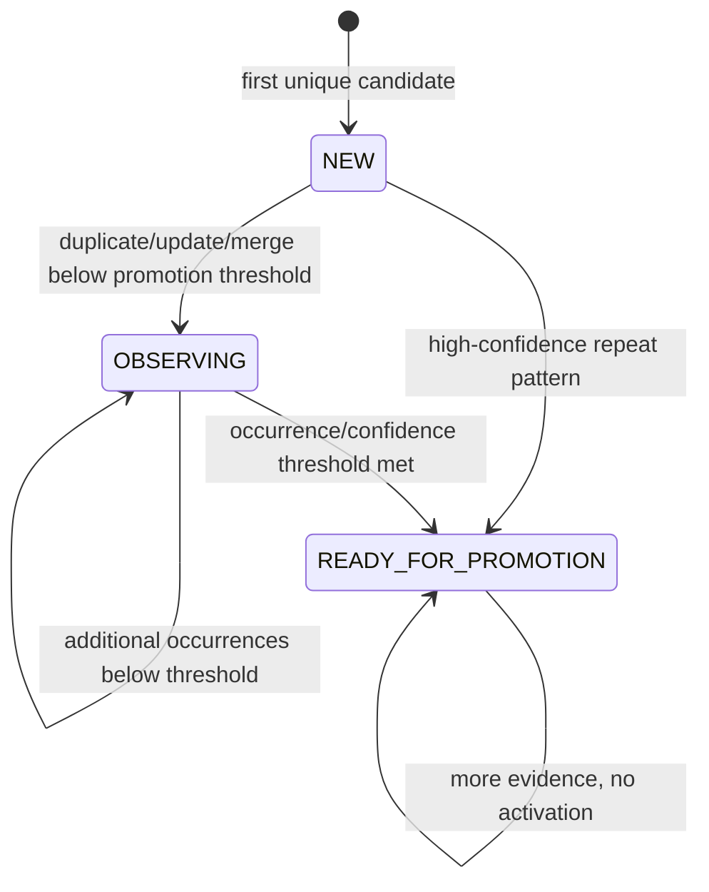

# Phase 8B Design: Procedural Skill Candidates and Deduplication

## 1. Executive Summary

Phase 8B introduces worker-only procedural skill candidate generation and candidate deduplication. It uses structured episodes created by Phase 6B as source material and stores proposed procedural workflows in the existing `skill_candidates` table from Phase 2.

This phase does not promote candidates to active skills, create versioned `SKILL.md` files from candidates, write `skill_versions`, or use HITL approvals. Phase 8A already established versioned procedural skill files; Phase 8B prepares candidate data for Phase 8C approval and promotion without activating anything.

The primary implementation adds:

- `src/memory/procedural_candidates.py` for candidate validation, persistence, status lifecycle helpers, occurrence/confidence updates, and deterministic candidate lookup.
- `src/memory/procedural_dedup.py` for deterministic shortlist retrieval and the `NEW` / `DUPLICATE` / `UPDATE` / `MERGE` decision contract.
- `procedural_candidate_generation` job payload helpers in `src/memory/jobs.py`.
- A real `ProceduralCandidateGenerationJobHandler` registered only for `procedural_candidate_generation`.
- Worker-path enqueue from `EpisodeGenerationJobHandler` after a structured episode is successfully appended.

Key invariant: Phase 8B may write and update `skill_candidates`; it must not create or modify active procedural skills.

## 2. Scope

In scope:

- Generate procedural skill candidates from newly created structured episodes.
- Enqueue `procedural_candidate_generation` jobs from the worker path after `episode_generation` succeeds.
- Define idempotent procedural candidate job payloads.
- Use `skill_candidates` for candidate storage.
- Validate candidate fields and JSON columns.
- Implement deterministic candidate shortlist for deduplication using:
  - trigger description similarity,
  - preferred tools overlap,
  - tags overlap,
  - workflow category match,
  - title/name similarity.
- Use secondary LLM classifier only inside worker/background handler to classify dedup action:
  - `NEW`
  - `DUPLICATE`
  - `UPDATE`
  - `MERGE`
- Update candidate occurrences and confidence conservatively.
- Keep generated candidates in statuses suitable for Phase 8C promotion and approval.
- Read Phase 8A active skill metadata for comparison only.
- Preserve existing procedural API compatibility.
- Preserve data inspector visibility through existing allow-list.

## 3. Out Of Scope

Out of scope:

- Promotion of candidates to active skills.
- Creation of versioned `SKILL.md` files from candidates.
- Writes to `skill_versions` from candidates.
- Writes to `skill_usage_stats` from candidate generation.
- Procedural approval workflow.
- Writes to `procedural_skill_approvals`.
- HITL skill approval endpoints.
- Procedural consolidation.
- Skill promotion handler.
- Episode-derived skill auto-activation.
- Procedural embeddings or vector search.
- Retrieval behavior changes.
- Chat-path secondary LLM calls.
- Schema migrations.
- Frontend changes.

## 4. Current Procedural Memory Assessment

### `src/memory/procedural.py`

After Phase 8A, this file is a compatibility facade:

- `add_procedural_skill()` creates a versioned generated skill through `SkillVersionStore.create_version()`.
- `update_procedural_skill()` creates a new version.
- `delete_procedural_skill()` disables/archive the active version.
- `get_all_procedural_skills()` returns active enabled skills in legacy-compatible shape.
- `match_procedural_skills()` still does keyword matching over active enabled skills.
- `sync_skill_md()` safely renders a compatibility index.
- `sync_skills_from_md()` conservatively imports explicit Markdown catalogs without overwriting user-authored files.

Phase 8B should keep this file unchanged unless a tiny read-only helper is required. Candidate generation must not call `add_procedural_skill()` or `SkillVersionStore.create_version()`.

### `src/memory/skill_files.py`

Phase 8A file helpers provide:

- generated/user namespace safety,
- immutable generated `SKILL.md` writes,
- frontmatter rendering and validation,
- content hashing,
- active skill index rendering.

Phase 8B should not call any file-writing helper from procedural candidate generation.

### `src/memory/skill_store.py`

Phase 8A store provides:

- active skill/version reads,
- version creation,
- rollback,
- disable/archive,
- usage stats updates.

Phase 8B may use only read methods:

- `list_active_versions()`
- `list_versions()`
- `list_legacy_compatible_skills()`

Phase 8B must not call:

- `create_version()`
- `rollback_to_version()`
- `disable_skill()`
- `archive_version()`
- `record_loaded()`
- `record_used()`

### `src/memory/episode_store.py`

Structured episodes are now persisted in `structured_episodes`. Phase 8B should use `StructuredEpisodeRepository.get_by_id()` and `list_by_session()` to load source context for candidate generation.

Phase 8B must preserve legacy episode compatibility and must not modify episode trigger behavior.

### `src/memory/jobs.py`

Current job helpers support semantic extraction, summaries, episode generation, and semantic consolidation. `procedural_candidate_generation` exists as a job type but is still no-op.

Phase 8B adds procedural candidate job helpers following the same style:

- deterministic idempotency key,
- payload builder,
- job spec builder,
- enqueue helper.

### `src/memory/job_handlers.py`

Current registry:

- `semantic_candidate_extraction`: real Phase 7A handler.
- `semantic_consolidation`: real Phase 7C handler.
- `episode_generation`: real Phase 6B handler.
- `summary_generation`: real Phase 5B handler.
- `procedural_candidate_generation`: no-op.
- `procedural_consolidation`: no-op.
- `skill_promotion`: no-op.

Phase 8B replaces only `procedural_candidate_generation` with a real handler. `procedural_consolidation` and `skill_promotion` remain no-op.

### `src/memory/schema.py`

`skill_candidates` already exists:

```sql
CREATE TABLE IF NOT EXISTS skill_candidates (
    id TEXT PRIMARY KEY,
    title TEXT NOT NULL CHECK (title <> ''),
    description TEXT NOT NULL,
    trigger_description TEXT NOT NULL CHECK (trigger_description <> ''),
    workflow_json TEXT NOT NULL,
    preferred_tools_json TEXT NOT NULL,
    tags_json TEXT,
    workflow_category TEXT,
    confidence REAL NOT NULL CHECK (confidence >= 0 AND confidence <= 1),
    occurrences INTEGER NOT NULL DEFAULT 0 CHECK (occurrences >= 0),
    source_episode_ids_json TEXT NOT NULL,
    status TEXT NOT NULL DEFAULT 'NEW'
        CHECK (status IN ('NEW','OBSERVING','READY_FOR_PROMOTION','WAITING_FOR_APPROVAL','PROMOTED','REJECTED')),
    dedup_group_id TEXT,
    source_job_id TEXT,
    created_at TEXT NOT NULL DEFAULT (datetime('now')),
    updated_at TEXT NOT NULL DEFAULT (datetime('now'))
);
```

No migration is needed.

## 5. Procedural Candidate Store Design

Create `src/memory/procedural_candidates.py`.

Responsibilities:

- Define candidate data models.
- Validate candidate writes and updates.
- Serialize/parse JSON fields deterministically.
- Insert candidates into `skill_candidates`.
- Read candidates by ID, source job, session-derived episode references, status, and dedup group.
- Retrieve deterministic shortlist candidates for dedup.
- Apply dedup decisions to candidates.
- Track occurrence count and confidence updates.
- Keep candidates inactive until Phase 8C.

### Public Types

```python
SkillCandidateStatus = Literal[
    "NEW",
    "OBSERVING",
    "READY_FOR_PROMOTION",
    "WAITING_FOR_APPROVAL",
    "PROMOTED",
    "REJECTED",
]

@dataclass(frozen=True)
class SkillWorkflowStep:
    order: int
    instruction: str
    tool_hint: str | None = None

@dataclass(frozen=True)
class SkillCandidateWrite:
    title: str
    description: str
    trigger_description: str
    workflow: list[SkillWorkflowStep] | list[dict[str, Any]]
    preferred_tools: list[str]
    tags: list[str]
    workflow_category: str | None
    confidence: float
    source_episode_ids: list[str]
    status: SkillCandidateStatus = "NEW"
    dedup_group_id: str | None = None
    source_job_id: str | None = None
    id: str | None = None

@dataclass(frozen=True)
class SkillCandidateRecord:
    id: str
    title: str
    description: str
    trigger_description: str
    workflow: list[dict[str, Any]]
    preferred_tools: list[str]
    tags: list[str]
    workflow_category: str | None
    confidence: float
    occurrences: int
    source_episode_ids: list[str]
    status: SkillCandidateStatus
    dedup_group_id: str | None
    source_job_id: str | None
    created_at: str
    updated_at: str
```

### Store API

```python
class ProceduralSkillCandidateStore:
    def add_candidate(write: SkillCandidateWrite) -> SkillCandidateRecord: ...
    def get_by_id(candidate_id: str) -> SkillCandidateRecord | None: ...
    def get_by_source_job_id(source_job_id: str) -> SkillCandidateRecord | None: ...
    def list_by_status(status: SkillCandidateStatus, limit: int = 100) -> list[SkillCandidateRecord]: ...
    def list_recent(limit: int = 100) -> list[SkillCandidateRecord]: ...
    def list_by_dedup_group(dedup_group_id: str) -> list[SkillCandidateRecord]: ...
    def list_for_episode(episode_id: str) -> list[SkillCandidateRecord]: ...
    def find_dedup_shortlist(write: SkillCandidateWrite, limit: int = 10) -> list[SkillCandidateRecord]: ...
    def apply_new(write: SkillCandidateWrite, dedup_group_id: str) -> SkillCandidateRecord: ...
    def apply_duplicate(target: SkillCandidateRecord, incoming: SkillCandidateWrite) -> SkillCandidateRecord: ...
    def apply_update(target: SkillCandidateRecord, incoming: SkillCandidateWrite) -> SkillCandidateRecord: ...
    def apply_merge(targets: list[SkillCandidateRecord], incoming: SkillCandidateWrite) -> SkillCandidateRecord: ...
    def update_status(candidate_id: str, status: SkillCandidateStatus) -> SkillCandidateRecord: ...
```

### Validation Rules

- `title`, `description`, and `trigger_description` must be non-empty.
- `workflow` must contain at least one step.
- Each workflow step must have a positive `order` and non-empty `instruction`.
- `preferred_tools` and `tags` must be lists of strings.
- Empty strings are removed from lists.
- `confidence` must be between `0` and `1`.
- `source_episode_ids` must contain at least one non-empty string.
- `status` must be one of the database-supported values.
- JSON fields must be canonical `TEXT`; do not require SQLite JSON1.
- `source_job_id` idempotency must prevent duplicate candidates from the same job.

## 6. Candidate Schema and Status Lifecycle

Phase 8B uses the existing DB status set:

- `NEW`
- `OBSERVING`
- `READY_FOR_PROMOTION`
- `WAITING_FOR_APPROVAL`
- `PROMOTED`
- `REJECTED`

Phase 8B writes only:

- `NEW`
- `OBSERVING`
- `READY_FOR_PROMOTION`

Phase 8B must not write:

- `WAITING_FOR_APPROVAL`
- `PROMOTED`
- `REJECTED`

Those are Phase 8C approval/promotion states.

Status lifecycle in Phase 8B:



Suggested readiness rule:

- Mark `READY_FOR_PROMOTION` when:
  - `occurrences >= procedural.promotion_occurrence_threshold` from memory config, and
  - `confidence >= procedural.promotion_confidence_threshold`.

If memory config is unavailable, default to Phase 1 values:

- occurrence threshold: `3`
- confidence threshold: `0.90`

## 7. Candidate Generation From Episodes

Candidate generation uses structured episodes as input.

Trigger point:

- After `EpisodeGenerationJobHandler` successfully appends one structured episode, enqueue a `procedural_candidate_generation` job.
- This enqueue happens inside the worker handler path, not chat.
- The enqueue should be best-effort; failure must not cause the already successful episode job to fail unless the episode write itself failed.

Candidate source:

- `structured_episodes.id`
- `title`
- `summary`
- `goals`
- `decisions`
- `artifacts`
- `topics`
- `participants`
- `importance`
- `source_job_id`

Candidate generation rules:

- Use secondary LLM only inside `ProceduralCandidateGenerationJobHandler`.
- Ask the LLM for a candidate procedural workflow only when the episode contains actionable repeated or reusable process evidence.
- If there is no reusable workflow, the handler succeeds with `processed=false` and writes no candidate.
- LLM output is parsed and validated before persistence.
- Dedup must occur before inserting/updating `skill_candidates`.
- Candidate generation must not write `SKILL.md` files.
- Candidate generation must not call `SkillVersionStore.create_version()`.

Recommended LLM output schema:

```json
{
  "candidate": {
    "title": "Deploy Staging",
    "description": "Reusable workflow for deploying a build to staging.",
    "trigger_description": "Use when the user asks to deploy or release to staging.",
    "workflow_category": "deployment",
    "preferred_tools": ["github", "shell"],
    "tags": ["deploy", "staging"],
    "confidence": 0.82,
    "workflow": [
      {"order": 1, "instruction": "Confirm target environment is staging.", "tool_hint": null},
      {"order": 2, "instruction": "Run the deployment command.", "tool_hint": "shell"}
    ]
  }
}
```

No-candidate output:

```json
{
  "candidate": null
}
```

## 8. `procedural_candidate_generation` Job Payload Design

Add to `src/memory/jobs.py`:

- `PHASE_8B_PROCEDURAL_CANDIDATE_PAYLOAD_SCHEMA_VERSION = 1`
- `PROCEDURAL_CANDIDATE_GENERATION_SOURCE = "memory.episode_generation"`
- `PHASE_8B_CREATED_BY = "phase_8b_procedural_candidate_enqueue"`
- `_PROCEDURAL_CANDIDATE_JOB_TYPE = "procedural_candidate_generation"`
- `make_procedural_candidate_generation_idempotency_key()`
- `build_procedural_candidate_generation_payload()`
- `build_procedural_candidate_generation_job_spec()`
- `enqueue_procedural_candidate_generation_job()`

### Payload Shape

```json
{
  "schema_version": 1,
  "source": "memory.episode_generation",
  "session_id": "session-1",
  "models": {
    "primary_provider": "openai",
    "primary_model_name": "gpt-4o-mini",
    "secondary_provider": "openai",
    "secondary_model_name": "gpt-4o-mini"
  },
  "procedural_candidate_generation": {
    "schema_version": 1,
    "source": "structured_episode",
    "source_episode_id": "episode-1",
    "source_episode_ids": ["episode-1"],
    "source_episode_title": "Deploy Staging",
    "source_episode_importance": 0.82,
    "dedup_required": true,
    "create_skill_files": false,
    "promotion_allowed": false
  },
  "created_by": "phase_8b_procedural_candidate_enqueue"
}
```

### Idempotency Key

Format:

```text
memq:v1:procedural_candidate_generation:<session_hash>:<episode_hash>
```

Canonical input:

- payload schema version,
- job type,
- session id,
- source episode ids,
- source episode title hash,
- secondary provider,
- secondary model name.

### Priority

Recommended priority: `80`.

Rationale:

- Lower priority than summary generation (`50`), episode generation (`60`), and semantic consolidation (`70`).
- Procedural candidate creation is useful but should not delay higher-confidence memory maintenance.

## 9. Worker Handler Design

Add `ProceduralCandidateGenerationJobHandler` to `src/memory/job_handlers.py`.

Registration:

```python
registry["procedural_candidate_generation"] = ProceduralCandidateGenerationJobHandler()
```

Keep no-op:

- `procedural_consolidation`
- `skill_promotion`

Responsibilities:

1. Validate payload object and schema version.
2. Load source structured episode(s).
3. Resolve secondary route using `_resolve_secondary_route(payload)` only inside handler.
4. If secondary unavailable:
   - return `success=False`,
   - `retryable=True`,
   - write no candidate.
5. Prompt secondary LLM to produce candidate JSON or `candidate: null`.
6. Parse direct or fenced JSON.
7. Validate candidate write.
8. Build deterministic shortlist via `ProceduralDedupService`.
9. Use secondary LLM classifier to classify `NEW`, `DUPLICATE`, `UPDATE`, or `MERGE` among shortlisted candidates.
10. Apply decision through `ProceduralSkillCandidateStore`.
11. Return structured `JobHandlerResult`.

Handler must not call:

- `add_procedural_skill()`
- `SkillVersionStore.create_version()`
- `write_immutable_skill_file()`
- approval engine functions
- retrieval modules
- embedding helpers

### Handler Result Examples

No candidate:

```json
{
  "handler": "procedural_candidate_generation",
  "job_type": "procedural_candidate_generation",
  "processed": false,
  "phase": "8B",
  "message": "No reusable procedural candidate found",
  "candidate_id": null
}
```

Candidate written:

```json
{
  "handler": "procedural_candidate_generation",
  "job_type": "procedural_candidate_generation",
  "processed": true,
  "phase": "8B",
  "message": "Procedural skill candidate recorded",
  "candidate_id": "skillcand_...",
  "dedup_action": "NEW",
  "status": "NEW",
  "occurrences": 1
}
```

## 10. Candidate Deduplication Design

Create `src/memory/procedural_dedup.py`.

Responsibilities:

- Normalize candidate comparison fields.
- Build deterministic shortlist of existing candidates and active skill versions.
- Compute transparent similarity signals.
- Validate LLM classifier decisions.
- Provide fallback deterministic decision when secondary classifier is unavailable only if safe.

No embeddings are used.

### Public Types

```python
ProceduralDedupAction = Literal["NEW", "DUPLICATE", "UPDATE", "MERGE"]

@dataclass(frozen=True)
class ProceduralDedupInput:
    incoming: SkillCandidateWrite
    source_episode_id: str
    source_job_id: str | None
    llm_route_payload: Mapping[str, Any]

@dataclass(frozen=True)
class ProceduralDedupMatch:
    candidate_id: str
    title: str
    trigger_score: float
    tool_score: float
    tag_score: float
    category_score: float
    title_score: float
    total_score: float
    status: SkillCandidateStatus

@dataclass(frozen=True)
class ProceduralDedupDecision:
    action: ProceduralDedupAction
    target_candidate_id: str | None
    merged_candidate_ids: list[str]
    reason: str
    confidence: float

class ProceduralDedupService:
    def shortlist(incoming: SkillCandidateWrite, limit: int = 10) -> list[ProceduralDedupMatch]: ...
    def classify_with_secondary(route: LLMRouteResult, incoming: SkillCandidateWrite, matches: list[ProceduralDedupMatch]) -> ProceduralDedupDecision: ...
    def decide(input: ProceduralDedupInput, route: LLMRouteResult) -> ProceduralDedupDecision: ...
```

### Deterministic Shortlist Signals

Tokenization:

- lowercase,
- split on non-alphanumeric boundaries,
- remove words shorter than 3 characters,
- remove common stop words,
- no stemming dependency.

Signal scores:

- `trigger_score`: Jaccard similarity of normalized trigger description tokens.
- `title_score`: Jaccard similarity of title/name tokens.
- `tool_score`: overlap ratio between preferred tool sets.
- `tag_score`: overlap ratio between tag sets.
- `category_score`: `1.0` if workflow categories match exactly, else `0.0`.

Weighted score:

```text
total_score =
  0.35 * trigger_score +
  0.25 * title_score +
  0.20 * tool_score +
  0.15 * tag_score +
  0.05 * category_score
```

Shortlist inclusion:

- existing candidate total score >= `0.25`, or
- title score >= `0.50`, or
- trigger score >= `0.45`, or
- category matches and tag/tool overlap exists.

Sort order:

1. total score descending,
2. confidence descending,
3. occurrences descending,
4. created_at ascending,
5. candidate id ascending.

Active skill versions:

- Active Phase 8A skills may be included as read-only comparison records so candidate generation can avoid creating candidates that duplicate already active skills.
- Active skills do not receive updates in Phase 8B.
- If classifier says `DUPLICATE` against an active skill, write no new candidate and return processed=false with a duplicate reason.

## 11. `NEW` / `DUPLICATE` / `UPDATE` / `MERGE` Semantics

### `NEW`

Use when:

- No shortlist match is strong enough, or
- LLM classifier says the incoming workflow is distinct.

Behavior:

- Insert a new `skill_candidates` row.
- `occurrences = 1`.
- `dedup_group_id = candidate.id` or deterministic group id based on normalized title/category.
- `status = NEW` unless readiness thresholds are already met.

### `DUPLICATE`

Use when:

- Incoming candidate expresses the same workflow without adding useful new steps, triggers, tools, or tags.

Behavior:

- Do not insert a new candidate row.
- Increment target candidate `occurrences`.
- Merge source episode id into `source_episode_ids_json`.
- Raise confidence modestly based on evidence.
- Keep status conservative:
  - `NEW -> OBSERVING` after second occurrence if not ready,
  - `OBSERVING -> READY_FOR_PROMOTION` if thresholds are met.

### `UPDATE`

Use when:

- Incoming candidate is the same logical skill but improves or clarifies the existing workflow.

Behavior:

- Update target candidate row.
- Merge workflow steps conservatively.
- Merge preferred tools and tags.
- Merge source episode ids.
- Increment occurrences.
- Increase confidence using bounded update rule.
- Status follows readiness thresholds.

### `MERGE`

Use when:

- Multiple existing candidates represent the same logical procedural skill and the incoming candidate provides a unifying workflow.

Behavior:

- Choose one canonical target candidate.
- Update canonical target with merged title/description/workflow/tools/tags/source episodes.
- Set same `dedup_group_id` on merged candidates.
- Mark non-canonical rows as `OBSERVING` or keep their current non-terminal status; do not delete rows.
- Increment canonical occurrences by incoming occurrence plus merged evidence count.
- Phase 8B does not archive or delete merged candidate rows because there is no archive status in schema.

### Invalid Classifier Action

Behavior:

- Fail closed.
- Return `success=False`, `retryable=True`.
- Write no candidate or update.

## 12. Occurrence and Confidence Update Rules

Occurrence rules:

- New candidate starts at `occurrences = 1`.
- Duplicate increments by `1`.
- Update increments by `1`.
- Merge increments by:

```text
1 + number_of_distinct_merged_source_episode_ids_not_already_on_target
```

Source episode IDs:

- Maintain a sorted unique list in `source_episode_ids_json`.
- Preserve original source episode IDs on every update.

Confidence rule:

```text
new_confidence =
  min(0.99, max(existing_confidence, incoming_confidence) + min(0.05, 0.01 * additional_occurrences))
```

Readiness rule:

```text
READY_FOR_PROMOTION if:
  occurrences >= config.procedural.promotion_occurrence_threshold
  and confidence >= config.procedural.promotion_confidence_threshold
```

Otherwise:

- `NEW` for first occurrence.
- `OBSERVING` for repeated evidence below promotion threshold.
- Preserve `READY_FOR_PROMOTION` once reached.

Status safety:

- Never regress `READY_FOR_PROMOTION` to `OBSERVING`.
- Never modify `WAITING_FOR_APPROVAL`, `PROMOTED`, or `REJECTED` candidates in Phase 8B unless explicitly excluded from shortlist updates.
- Shortlist should exclude `PROMOTED` and `REJECTED` from update targets by default.

## 13. Compatibility With Versioned Skill Store

Phase 8B reads active skills for dedup comparison only.

Allowed:

- `SkillVersionStore.list_active_versions()`
- `SkillVersionStore.list_legacy_compatible_skills()`
- `SkillVersionStore.get_active_version()`

Forbidden in Phase 8B:

- `SkillVersionStore.create_version()`
- `add_procedural_skill()`
- `update_procedural_skill()`
- file writes through `skill_files.py`
- approval linkage writes.

Candidate records should include enough future promotion metadata to create a Phase 8A `SkillVersionWrite` in Phase 8C:

- `title` -> skill `name`
- `description` -> skill description
- `trigger_description` + `tags` -> trigger keywords/frontmatter
- `workflow_json` -> execution steps/workflow section
- `preferred_tools_json` -> frontmatter preferred tools
- `confidence` -> future approval/promotion metadata
- `source_episode_ids_json` -> provenance
- `dedup_group_id` -> candidate grouping

## 14. Failure Handling

### Enqueue Failure After Episode Generation

If `EpisodeGenerationJobHandler` successfully appends a structured episode but procedural candidate job enqueue fails:

- keep episode handler success,
- include a best-effort warning in handler result,
- do not retry the episode job solely because procedural enqueue failed.

### Secondary Unavailable

If secondary route is unavailable in `ProceduralCandidateGenerationJobHandler`:

- return `success=False`,
- `retryable=True`,
- write no candidate.

### Candidate LLM Output Invalid

If candidate generation output is invalid JSON or fails schema validation:

- return `success=False`,
- `retryable=True`,
- write no candidate.

### No Candidate Found

If LLM returns `candidate: null`:

- return `success=True`,
- `processed=False`,
- write no candidate.

### Dedup Classifier Invalid

If classifier action is missing or not one of `NEW`, `DUPLICATE`, `UPDATE`, `MERGE`:

- fail closed,
- return `success=False`,
- `retryable=True`,
- write no candidate or updates.

### Candidate Store Failure

If DB insert/update fails:

- rollback the local transaction,
- return `success=False`,
- `retryable=True`.

### Duplicate Source Job

If `source_job_id` already produced a candidate:

- return existing candidate,
- do not duplicate rows,
- return `success=True`, `processed=False` or `processed=True` with `reused=True`.

## 15. API / Data Inspector Compatibility

No public API changes are required in Phase 8B.

Data inspector:

- `skill_candidates` is already in `ALLOWED_DATA_TABLES`.
- No new allow-list entry is needed.

Optional API endpoint:

- The roadmap allows an optional endpoint to list skill candidates.
- Recommendation: defer public candidate API to Phase 8C or Phase 10 unless tests require it.
- Data inspector is sufficient for Phase 8B observability.

Existing endpoints:

- `/api/skills` remains backed by Phase 8A active skill versions.
- `/api/memory/full` response shape remains unchanged.
- `/api/chat` response shape remains unchanged.

## 16. Test Plan

Add tests:

### `tests/test_phase8b_procedural_candidates_store.py`

- Candidate schema validation.
- Canonical JSON for workflow/tools/tags/source episodes.
- Add/get/list candidates.
- `source_job_id` idempotency.
- Occurrence updates.
- Confidence bounded update.
- Status transitions:
  - `NEW`
  - `OBSERVING`
  - `READY_FOR_PROMOTION`
- No writes to `skill_versions`.
- No writes to `procedural_skill_approvals`.

### `tests/test_phase8b_procedural_dedup.py`

- Deterministic tokenizer.
- Trigger description similarity.
- Preferred tools overlap.
- Tags overlap.
- Workflow category match.
- Title/name similarity.
- Shortlist order is deterministic.
- Active skills are used as read-only comparison records.
- No embeddings are called or imported.
- Invalid action is rejected.
- Classifier validates only `NEW`, `DUPLICATE`, `UPDATE`, `MERGE`.

### `tests/test_phase8b_procedural_jobs.py`

- Payload shape.
- Idempotency key is deterministic.
- Job type is `procedural_candidate_generation`.
- Priority is `80`.
- Duplicate enqueue reuses existing memory job.
- Payload includes `create_skill_files=false` and `promotion_allowed=false`.

### `tests/test_phase8b_procedural_handler.py`

- Handler registered for `procedural_candidate_generation`.
- `procedural_consolidation` remains no-op.
- `skill_promotion` remains no-op.
- Secondary unavailable returns retryable failure and writes no candidate.
- Invalid candidate JSON returns retryable failure and writes no candidate.
- `candidate: null` succeeds with no write.
- Valid candidate with `NEW` writes one `skill_candidates` row.
- Duplicate action increments existing occurrence and writes no new row.
- Update action updates existing candidate.
- Merge action groups candidates without deleting rows.
- Handler does not call `SkillVersionStore.create_version()`.
- Handler does not write generated `SKILL.md`.
- Handler does not write `procedural_skill_approvals`.

### `tests/test_phase8b_episode_to_procedural_enqueue.py`

- Successful `episode_generation` worker handler enqueues `procedural_candidate_generation`.
- Duplicate episode processing reuses existing procedural candidate job.
- Enqueue failure does not fail episode handler.
- No chat-path enqueue or secondary LLM call is introduced.

Regression tests:

```powershell
python -m pytest tests/test_phase8a_skill_files.py tests/test_phase8a_skill_store_versions.py tests/test_phase8a_procedural_compatibility.py tests/test_phase8a_api_skills.py -q
python -m pytest tests/test_phase6b_episode_handler.py tests/test_phase6b_episode_jobs.py tests/test_phase7c_consolidation_handler.py tests/test_phase3b_router_handlers.py -q
python -m pytest tests/test_procedural_memory.py tests/test_long_term_memory.py tests/test_api_server.py tests/test_harness.py -q
```

Run full suite if focused tests pass.

## 17. Risks

### Risk: noisy candidate generation

Candidate generation can produce too many marginal skills.

Mitigation:

- Require structured episode source.
- Permit `candidate: null`.
- Keep candidates in `NEW`/`OBSERVING` unless repeated evidence is strong.
- Use high readiness thresholds from memory config.

### Risk: premature skill activation

Candidate generation might accidentally create active skills.

Mitigation:

- Handler must not call Phase 8A write APIs.
- Tests monkeypatch `SkillVersionStore.create_version()` to fail if called.
- Tests verify no generated files are created.

### Risk: nondeterministic dedup shortlist

Different shortlist order would make tests and classification inconsistent.

Mitigation:

- Use deterministic normalization and sort keys.
- Avoid embeddings and external retrieval.
- Keep scoring formula fixed.

### Risk: LLM classifier overreach

The secondary LLM could invent promotion or approval actions.

Mitigation:

- Prompt requests only `NEW`, `DUPLICATE`, `UPDATE`, or `MERGE`.
- Validate action exactly.
- Ignore any LLM-supplied status outside dedup action.
- Store decides status based on deterministic thresholds.

### Risk: corrupt candidate JSON fields

Mitigation:

- Store uses canonical JSON serialization.
- Parse/validation failures include field names.
- Tests inspect raw DB JSON fields.

### Risk: interaction with active Phase 8A skills

Candidates may duplicate already active skills.

Mitigation:

- Active skills appear in read-only comparison context.
- Duplicate against active skill produces no candidate write.
- No active skill metadata is mutated.

## 18. Acceptance Criteria

Phase 8B is accepted when:

- `src/memory/procedural_candidates.py` exists.
- `src/memory/procedural_dedup.py` exists.
- `procedural_candidate_generation` job payload helpers exist.
- `ProceduralCandidateGenerationJobHandler` is registered.
- `procedural_consolidation` remains no-op.
- `skill_promotion` remains no-op.
- Successful structured episode generation can enqueue a procedural candidate job.
- Candidate generation runs only in the worker path.
- Secondary LLM calls occur only inside the procedural candidate handler.
- Candidate dedup uses deterministic metadata shortlist and no embeddings.
- LLM dedup action is validated as exactly `NEW`, `DUPLICATE`, `UPDATE`, or `MERGE`.
- Candidate writes use only `skill_candidates`.
- No `SKILL.md` files are created from candidates.
- No `skill_versions` rows are written by candidate generation.
- No `procedural_skill_approvals` rows are written.
- Occurrences and confidence update deterministically.
- Candidate readiness reaches `READY_FOR_PROMOTION` only by threshold.
- `/api/skills`, `/api/memory/full`, and chat response shapes remain unchanged.
- Focused and regression tests pass.

## 19. Implementation Checklist

1. Add `src/memory/procedural_candidates.py`.
2. Implement candidate dataclasses and validation.
3. Implement canonical JSON serialization/parsing.
4. Implement candidate repository add/get/list/read helpers.
5. Implement occurrence/confidence/status transition helpers.
6. Implement source-job idempotency.
7. Add `src/memory/procedural_dedup.py`.
8. Implement deterministic tokenizer and scoring.
9. Implement candidate shortlist retrieval.
10. Implement active skill read-only comparison records.
11. Implement dedup decision validation.
12. Add procedural candidate job constants/helpers to `src/memory/jobs.py`.
13. Add enqueue helper for procedural candidate generation.
14. Modify `EpisodeGenerationJobHandler` to enqueue procedural candidate jobs after successful structured episode append.
15. Add `ProceduralCandidateGenerationJobHandler`.
16. Register only `procedural_candidate_generation` as real Phase 8B handler.
17. Keep `procedural_consolidation` and `skill_promotion` no-op.
18. Add focused Phase 8B tests.
19. Run Phase 8A regressions.
20. Run worker/episode regressions.
21. Run full suite if focused tests pass.

## 20. Filesystem Wiring Check Required After Implementation

Before final implementation approval, verify actual files changed on disk. Do not rely only on the UI edited-files list.

Required checks:

- Verify `src/memory/procedural_candidates.py` exists.
- Verify `src/memory/procedural_dedup.py` exists.
- Verify `src/memory/jobs.py` has procedural candidate payload/idempotency/enqueue helpers.
- Verify `src/memory/job_handlers.py` registers `ProceduralCandidateGenerationJobHandler`.
- Verify `summary_generation`, `episode_generation`, `semantic_candidate_extraction`, and `semantic_consolidation` handlers remain registered.
- Verify `procedural_consolidation` remains no-op.
- Verify `skill_promotion` remains no-op.
- Verify `EpisodeGenerationJobHandler` enqueues procedural candidate generation only after successful structured episode append.
- Verify no candidate path calls `SkillVersionStore.create_version()`.
- Verify no candidate path writes generated `SKILL.md` files.
- Verify no writes to `skill_versions`, except Phase 8A tests or existing Phase 8A APIs.
- Verify no writes to `procedural_skill_approvals`.
- Verify no schema/migration/retrieval/frontend/API route files were modified unless explicitly approved.
- Verify no chat-path secondary LLM calls were introduced.
- Verify Phase 8A skill file/store behavior still passes.

## 21. Phase 8B Design Boundary

Phase 8B creates procedural skill candidates, not skills. The output is structured, deduplicated evidence in `skill_candidates` that Phase 8C can later present for approval and promote into versioned `SKILL.md` files. This phase should make the future promotion path easy, but it must not activate or write procedural skills itself.
