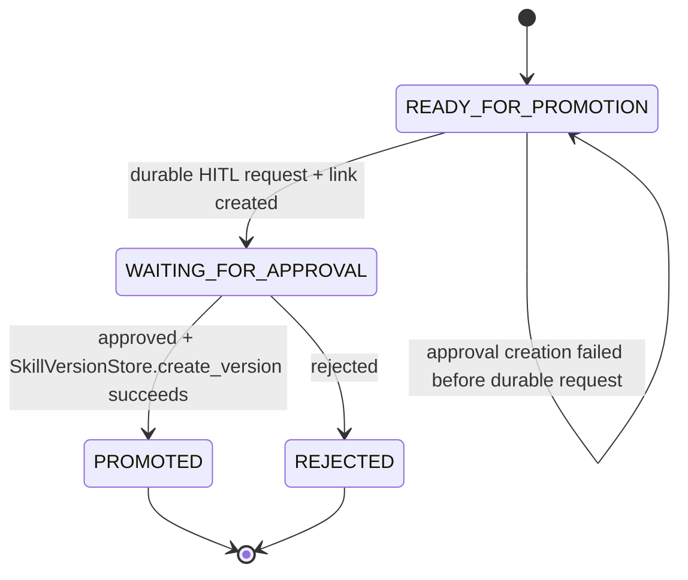

# Phase 8C Design: Procedural Skill Promotion, Approval, Reload, and Usage Stats

## 1. Executive Summary

Phase 8C completes the procedural memory promotion path by moving `READY_FOR_PROMOTION` skill candidates through human approval before creating active, generated, versioned `SKILL.md` files.

The target architecture requires procedural skills to be generated cautiously: a background worker may prepare promotion requests, but no candidate may become an active skill until a human approves it. Phase 8A already established immutable versioned skill files and `SkillVersionStore`. Phase 8B added worker-only candidate generation and deduplication in `skill_candidates`. Phase 8C connects those foundations with the existing HITL approval engine and the existing `procedural_skill_approvals`, `skill_versions`, and `skill_usage_stats` tables.

The implementation should add:

- A `skill_promotion` job payload and enqueue helper in `src/memory/jobs.py`.
- A worker-only `SkillPromotionJobHandler` registered for `skill_promotion`.
- A new procedural approval service/repository boundary for `procedural_skill_approvals`.
- Safe candidate selection that only considers `READY_FOR_PROMOTION`.
- Approval request creation through existing HITL infrastructure.
- Approval decision handling that creates a versioned generated `SKILL.md` only after approval.
- Runtime active-skill reload primitives and load/use statistics.

The most important invariant is simple: Phase 8C must never activate or write a generated skill file before durable human approval.

## 2. Scope

In scope:

- Create idempotent `skill_promotion` job payload helpers.
- Replace `skill_promotion` no-op handling with a worker-only promotion request handler.
- Select bounded batches of `READY_FOR_PROMOTION` candidates.
- Create durable HITL approval requests for candidate promotion.
- Link HITL requests to candidates with `procedural_skill_approvals`.
- Move candidates from `READY_FOR_PROMOTION` to `WAITING_FOR_APPROVAL` only after approval request and linkage persistence succeed.
- Process approval decisions for procedural skill approvals.
- On approval, create a new active skill version through `SkillVersionStore.create_version()`.
- On rejection, mark the candidate `REJECTED`.
- Track `skill_usage_stats` for active skill load/reload and explicit use events.
- Add safe runtime reload primitives without changing chat retrieval behavior.
- Preserve existing `/api/skills`, `/api/approvals`, `/api/memory/full`, and data inspector compatibility.
- Keep `procedural_consolidation` as no-op.
- Add deterministic unit and integration tests.

## 3. Out of Scope

Out of scope:

- Creating skills before approval.
- Promoting candidates that are not `READY_FOR_PROMOTION`.
- Bypassing `SkillVersionStore`.
- Overwriting user-authored skill files.
- Mutating old generated `SKILL.md` versions.
- Procedural retrieval ranking.
- Chat retrieval behavior changes.
- Frontend UI changes.
- New schema migrations.
- Chat-path secondary LLM calls.
- Procedural consolidation.
- Skill candidate generation changes beyond enqueueing promotion jobs if needed.
- LLM-generated skill rewriting during promotion.
- Background worker auto-start changes.

## 4. Current Procedural Pipeline Assessment

### `src/memory/procedural_candidates.py`

Current status:

- Defines `SkillCandidateStatus` with `READY_FOR_PROMOTION`, `WAITING_FOR_APPROVAL`, `PROMOTED`, and `REJECTED`.
- `ProceduralSkillCandidateStore.list_by_status()` returns candidates ordered by confidence, occurrences, creation time, and ID.
- `update_status()` can safely transition candidates to existing schema statuses.
- Candidate generation never writes `skill_versions`, `procedural_skill_approvals`, or `SKILL.md`.

Phase 8C usage:

- Keep candidate generation behavior unchanged.
- Add only minimal helper methods if needed:
  - `list_ready_for_promotion(limit: int)`.
  - `transition_ready_to_waiting(candidate_id: str)`.
  - `transition_waiting_to_promoted(candidate_id: str)`.
  - `transition_waiting_to_rejected(candidate_id: str)`.
- These helpers should enforce legal status transitions instead of allowing arbitrary status jumps in promotion code.

### `src/memory/procedural_dedup.py`

Current status:

- Produces candidate-level dedup decisions only.
- Uses deterministic metadata shortlist plus optional worker-path classifier boundaries.
- Does not use embeddings.
- Does not write active skills.

Phase 8C usage:

- No promotion handler should rerun candidate dedup.
- Promotion selection trusts the current candidate status and metadata.
- Active skill comparison can be read-only when constructing approval previews.

### `src/memory/skill_files.py`

Current status:

- Safely renders and parses generated `SKILL.md`.
- Enforces generated namespace path rules.
- Refuses to overwrite immutable generated version files.
- Separates generated and user-authored skill roots.

Phase 8C usage:

- Do not call file write helpers directly from promotion code.
- Skill file creation must happen only through `SkillVersionStore.create_version()`.

### `src/memory/skill_store.py`

Current status:

- `SkillVersionStore.create_version()` writes generated version files under `.agent/skills/generated/<skill_id>/vNNNN/SKILL.md`.
- Updates create new immutable versions.
- Active version pointer is stored in `skill_versions`.
- `record_loaded()` and `record_used()` update `skill_usage_stats`.
- Legacy-compatible skill reads remain available.

Phase 8C usage:

- Promotion approval handling calls `create_version()` exactly once per approved candidate/approval pair.
- The `SkillVersionWrite` passed for promotion must use:
  - `candidate_id=<candidate.id>`
  - `author="generated"`
  - `approval_required=True`
  - `approval_id=<approval_request_id>`
  - `confidence=<candidate.confidence>`
  - `enabled=True`
  - `activate=True`
- Rollback and disable remain existing Phase 8A behavior.

### `src/memory/procedural.py`

Current status:

- Compatibility facade around `SkillVersionStore`.
- Existing API skill writes already create versioned skills.
- `match_procedural_skills()` returns active enabled skills without procedural ranking changes.

Phase 8C usage:

- Do not route promotions through `add_procedural_skill()`.
- Use `SkillVersionStore.create_version()` directly from approval handling so candidate and approval metadata are preserved.
- Optionally add explicit usage tracking wrappers, but do not alter match results.

### `src/memory/jobs.py`

Current status:

- Contains job constants and builders for semantic, summary, episode, semantic consolidation, and procedural candidate jobs.
- `skill_promotion` exists as a memory job type but has no Phase 8C payload helpers yet.

Phase 8C usage:

- Add `skill_promotion` payload helpers with deterministic idempotency keys.
- Preserve existing job payloads and enqueue behavior.

### `src/memory/job_handlers.py`

Current status:

- `procedural_candidate_generation` is real.
- `procedural_consolidation` is no-op.
- `skill_promotion` is no-op.

Phase 8C usage:

- Register `skill_promotion` to `SkillPromotionJobHandler`.
- Leave `procedural_consolidation` as `NoOpMemoryJobHandler`.
- Keep summary, episode, semantic candidate, and semantic consolidation handlers unchanged.

### `src/hitl/*`

Current status:

- `approval_engine.create_approval_request()` creates idempotent approval requests.
- `approval_engine.process_approval_decision()` accepts `APPROVED` or `REJECTED`.
- `approval_requests` already supports status and idempotency.

Phase 8C usage:

- Reuse generic HITL approval requests.
- Add procedural-specific linkage and post-decision handling outside the generic engine where possible.
- Do not weaken duplicate-decision protection.

### `src/api/server.py`

Current status:

- `/api/skills` routes preserve legacy shape.
- `/api/approvals/{request_id}/decision` currently delegates to graph resume approval handling.
- Data inspector allow-list already includes `skill_candidates`, `skill_versions`, `skill_usage_stats`, and `procedural_skill_approvals`.

Phase 8C usage:

- Preserve existing request and response shapes.
- Add procedural skill approval finalization after a generic approval decision only when the request is linked in `procedural_skill_approvals`.
- Do not expose new frontend requirements.

### `src/startup.py`

Current status:

- Creates generated/user skill directories.
- Does not overwrite existing `.agent/SKILL.md`.

Phase 8C usage:

- Initialize or lazily create active-skill reload registry if needed.
- Do not auto-promote candidates at startup.
- Do not rewrite generated skill versions at startup.

## 5. Promotion Architecture

Phase 8C uses a two-step architecture:

1. Worker promotion request creation.
2. Human approval decision finalization.

The worker step is responsible only for selecting candidates and creating approval requests. It must not create skill versions. The approval decision step is responsible for final activation and must use `SkillVersionStore.create_version()`.

Recommended new module:

```text
src/memory/skill_promotion.py
```

Responsibilities:

- Define promotion payload and approval-link records.
- Select candidates eligible for promotion.
- Create procedural HITL approval requests.
- Insert and read `procedural_skill_approvals` rows.
- Convert a candidate to `SkillVersionWrite`.
- Finalize approved/rejected approval decisions.
- Keep candidate status transitions legal and idempotent.

Recommended new module:

```text
src/memory/skill_reloader.py
```

Responsibilities:

- Load active enabled skill versions into an immutable runtime snapshot.
- Validate referenced generated skill files still exist and parse.
- Record load stats through `SkillVersionStore.record_loaded()`.
- Provide explicit usage recording through `SkillVersionStore.record_used()`.
- Keep the previous snapshot if reload fails.
- Avoid chat retrieval behavior changes.

Primary flow:

```mermaid
sequenceDiagram
  participant Worker as Memory Worker
  participant Handler as SkillPromotionJobHandler
  participant Candidates as ProceduralSkillCandidateStore
  participant HITL as HITL Approval Engine
  participant Link as ProceduralSkillApprovalRepository
  participant API as Approval API
  participant Store as SkillVersionStore
  participant Reload as SkillReloader

  Worker->>Handler: process skill_promotion job
  Handler->>Candidates: list READY_FOR_PROMOTION
  Handler->>HITL: create approval_request
  Handler->>Link: insert PENDING procedural approval link
  Handler->>Candidates: READY_FOR_PROMOTION -> WAITING_FOR_APPROVAL
  Handler-->>Worker: SUCCEEDED, no skill created
  API->>HITL: approve/reject request
  API->>Link: find linked procedural approval
  alt approved
    API->>Store: create_version(candidate, approval_id)
    Store-->>API: active SkillVersionRecord
    API->>Link: PENDING -> APPROVED, set skill_version_id
    API->>Candidates: WAITING_FOR_APPROVAL -> PROMOTED
    API->>Reload: reload active snapshot
  else rejected
    API->>Link: PENDING -> REJECTED
    API->>Candidates: WAITING_FOR_APPROVAL -> REJECTED
  end
```

## 6. `skill_promotion` Job Payload Design

Add helpers in `src/memory/jobs.py`:

```python
PHASE_8C_SKILL_PROMOTION_PAYLOAD_SCHEMA_VERSION = 1
SKILL_PROMOTION_SOURCE = "memory.procedural_promotion"
PHASE_8C_CREATED_BY = "phase_8c_skill_promotion_enqueue"

def make_skill_promotion_idempotency_key(
    *,
    session_id: str,
    candidate_ids: Sequence[str] | None,
    trigger_type: str,
    approval_policy: str = "hitl_required",
) -> str: ...

def build_skill_promotion_payload(
    *,
    session_id: str,
    trigger_type: str,
    candidate_ids: Sequence[str] | None = None,
    max_candidates: int = 10,
    approval_policy: str = "hitl_required",
) -> dict[str, Any]: ...

def build_skill_promotion_job_spec(...) -> MemoryJobSpec: ...
def enqueue_skill_promotion_job(...) -> EnqueueResult: ...
```

Payload shape:

```json
{
  "schema_version": 1,
  "job_type": "skill_promotion",
  "source": "memory.procedural_promotion",
  "created_by": "phase_8c_skill_promotion_enqueue",
  "session_id": "session-or-maintenance-id",
  "skill_promotion": {
    "schema_version": 1,
    "trigger_type": "ready_candidate_threshold",
    "candidate_ids": ["skillcand_..."],
    "max_candidates": 10,
    "approval_policy": "hitl_required",
    "create_skill_files_before_approval": false,
    "activate_after_approval": true,
    "procedural_consolidation_required": false
  }
}
```

Allowed `trigger_type` values:

- `ready_candidate_threshold`
- `manual`
- `maintenance`
- `episode_candidate_ready`

Job behavior:

- Job type: `skill_promotion`.
- Recommended priority: `80`.
- Status on enqueue: `QUEUED`.
- Idempotency:
  - Explicit candidate list: hash sorted candidate IDs plus `approval_policy`.
  - Maintenance selection: hash `trigger_type`, date bucket, and `max_candidates`.
- No model selector is required because Phase 8C promotion should not call an LLM.
- If existing generic job builders require `models`, include selectors for consistency but do not resolve or invoke them.

## 7. Candidate Selection Design

Candidate selection must be conservative and deterministic.

Selection sources:

- Explicit `candidate_ids` in the job payload.
- Otherwise, `ProceduralSkillCandidateStore.list_by_status("READY_FOR_PROMOTION", limit=max_candidates)`.

Eligibility rules:

- Candidate status must be exactly `READY_FOR_PROMOTION`.
- Candidate must have:
  - non-empty title,
  - non-empty description,
  - non-empty trigger description,
  - at least one workflow step,
  - confidence within `0..1`,
  - at least one source episode ID.
- Candidate must not already have a `procedural_skill_approvals` row with status `PENDING`, `APPROVED`, or `MODIFIED`.
- Candidate must not already have a `skill_versions` row for the same `candidate_id`.
- Candidates in `WAITING_FOR_APPROVAL`, `PROMOTED`, or `REJECTED` are skipped.

Ordering:

1. Highest confidence.
2. Highest occurrence count.
3. Oldest `created_at`.
4. Stable candidate ID.

Recommended helper:

```python
def select_candidates_for_skill_promotion(
    *,
    candidate_store: ProceduralSkillCandidateStore,
    approval_repo: ProceduralSkillApprovalRepository,
    version_store: SkillVersionStore,
    candidate_ids: Sequence[str] | None,
    max_candidates: int,
) -> list[SkillCandidateRecord]: ...
```

This helper is pure selection/read behavior. It should not mutate state.

## 8. HITL Approval Design

Phase 8C should use existing HITL approval requests as the durable human decision surface.

Approval request creation:

```python
create_approval_request(
    session_id=session_id,
    tool_name="procedural_skill_promotion",
    tool_args={
        "candidate_id": candidate.id,
        "title": candidate.title,
        "description": candidate.description,
        "trigger_description": candidate.trigger_description,
        "workflow": candidate.workflow,
        "preferred_tools": candidate.preferred_tools,
        "tags": candidate.tags,
        "workflow_category": candidate.workflow_category,
        "confidence": candidate.confidence,
        "occurrences": candidate.occurrences,
        "source_episode_ids": candidate.source_episode_ids,
        "action": "PROMOTE_SKILL"
    },
    reason="Approve generated procedural skill before activation.",
    idempotency_key=f"procedural_skill_promotion:{candidate.id}:{candidate.updated_at}"
)
```

Important details:

- The approval preview must include enough information for a human to evaluate the skill.
- The preview should not require frontend changes.
- The request should be idempotent so a retried worker job reuses the same approval request.
- The candidate should not move to `WAITING_FOR_APPROVAL` until the approval request exists and the procedural linkage row is inserted.

Approval options in Phase 8C:

- `APPROVED`: create a versioned generated skill and mark candidate `PROMOTED`.
- `REJECTED`: mark candidate `REJECTED`.

The `procedural_skill_approvals.status = MODIFIED` state is reserved for a future or optional additive backend path where a reviewer supplies edited skill content. Phase 8C may store `modified_payload_json`, but it should not require a frontend UI.

## 9. `procedural_skill_approvals` Usage

Use the existing table:

```sql
procedural_skill_approvals (
    id TEXT PRIMARY KEY,
    approval_request_id TEXT NOT NULL,
    candidate_id TEXT,
    skill_version_id TEXT,
    action TEXT NOT NULL CHECK (action IN ('PROMOTE_SKILL','MODIFY_SKILL','REJECT_SKILL')),
    status TEXT NOT NULL DEFAULT 'PENDING'
        CHECK (status IN ('PENDING','APPROVED','REJECTED','MODIFIED','CANCELLED')),
    modified_payload_json TEXT,
    created_at TEXT NOT NULL DEFAULT (datetime('now')),
    decided_at TEXT,
    CHECK (candidate_id IS NOT NULL OR skill_version_id IS NOT NULL)
)
```

Recommended record type:

```python
@dataclass(frozen=True)
class ProceduralSkillApprovalRecord:
    id: str
    approval_request_id: str
    candidate_id: str | None
    skill_version_id: str | None
    action: Literal["PROMOTE_SKILL", "MODIFY_SKILL", "REJECT_SKILL"]
    status: Literal["PENDING", "APPROVED", "REJECTED", "MODIFIED", "CANCELLED"]
    modified_payload: dict[str, Any] | None
    created_at: str
    decided_at: str | None
```

Recommended repository API:

```python
class ProceduralSkillApprovalRepository:
    def create_pending_for_candidate(
        self,
        *,
        approval_request_id: str,
        candidate_id: str,
        action: str = "PROMOTE_SKILL",
        proposed_payload: Mapping[str, Any] | None = None,
    ) -> ProceduralSkillApprovalRecord: ...

    def get_by_approval_request_id(self, approval_request_id: str) -> ProceduralSkillApprovalRecord | None: ...
    def get_open_for_candidate(self, candidate_id: str) -> ProceduralSkillApprovalRecord | None: ...
    def list_pending(self, limit: int = 100) -> list[ProceduralSkillApprovalRecord]: ...

    def mark_approved(
        self,
        *,
        approval_request_id: str,
        skill_version_id: str,
    ) -> ProceduralSkillApprovalRecord: ...

    def mark_rejected(self, approval_request_id: str) -> ProceduralSkillApprovalRecord: ...
    def mark_cancelled(self, approval_request_id: str) -> ProceduralSkillApprovalRecord: ...
```

Idempotency:

- `approval_request_id` is unique.
- Creating a duplicate linkage for the same approval request returns the existing row.
- Creating an open approval for a candidate that already has a pending link returns the existing link and does not create a second HITL request.

## 10. Approval Decision Handling

Approval decision handling should be centralized in `src/memory/skill_promotion.py`.

Recommended function:

```python
def process_procedural_skill_approval_decision(
    *,
    approval_request_id: str,
    decision: Literal["APPROVED", "REJECTED"],
    db_path: Path | None = None,
    skill_path: Path | None = None,
    reload_registry: SkillRuntimeReloader | None = None,
) -> ProceduralSkillApprovalDecisionResult: ...
```

Decision behavior:

- If no row exists in `procedural_skill_approvals`, return `handled=False` so existing approval behavior remains compatible.
- If the procedural approval row is already `APPROVED` or `REJECTED`, return the existing result idempotently.
- If decision is `REJECTED`:
  - Mark procedural approval `REJECTED`.
  - Move candidate `WAITING_FOR_APPROVAL -> REJECTED`.
  - Do not create `SKILL.md`.
  - Do not write `skill_versions`.
- If decision is `APPROVED`:
  - Reload linked candidate.
  - Verify candidate status is `WAITING_FOR_APPROVAL`.
  - Build `SkillVersionWrite`.
  - Call `SkillVersionStore.create_version()`.
  - Mark procedural approval `APPROVED` with `skill_version_id`.
  - Move candidate `WAITING_FOR_APPROVAL -> PROMOTED`.
  - Reload active skill snapshot.
  - Record load stats for the active skill version.

API integration:

- Keep `/api/approvals/{request_id}/decision` request shape unchanged.
- Existing graph approval resume behavior should still run for graph-originated approvals.
- After the generic approval decision is accepted, call procedural finalization only if a procedural approval linkage exists.
- The response may add optional metadata, such as `procedural_skill_approval`, without removing existing fields.
- If procedural finalization fails after the generic approval request is approved, return a clear error and leave the candidate `WAITING_FOR_APPROVAL` for retry/recovery.

Recovery:

- Add `resume_approved_skill_promotions(limit: int = 50)` to scan for generic `approval_requests.status = 'APPROVED'` with procedural link `PENDING` and retry finalization.
- This avoids losing approved promotions if API finalization fails midway.

## 11. SkillVersionStore Promotion Flow

Candidate-to-skill conversion must be deterministic.

Mapping:

- `SkillVersionWrite.name`: candidate title.
- `SkillVersionWrite.description`: candidate description.
- `SkillVersionWrite.trigger_keywords`: candidate tags plus normalized trigger summary tokens.
- `SkillVersionWrite.execution_steps`: Markdown or plain text rendered from ordered candidate workflow steps.
- `SkillVersionWrite.preferred_tools`: candidate preferred tools.
- `SkillVersionWrite.tags`: candidate tags plus workflow category if present.
- `SkillVersionWrite.skill_id`: slugified candidate title unless modified payload explicitly supplies a safe generated skill ID.
- `SkillVersionWrite.candidate_id`: candidate ID.
- `SkillVersionWrite.author`: `generated`.
- `SkillVersionWrite.approval_required`: `True`.
- `SkillVersionWrite.approval_id`: HITL approval request ID.
- `SkillVersionWrite.confidence`: candidate confidence.
- `SkillVersionWrite.enabled`: `True`.
- `SkillVersionWrite.activate`: `True`.

Generated file path:

```text
.agent/skills/generated/<skill_id>/vNNNN/SKILL.md
```

Rules:

- Do not write generated files directly.
- Do not write outside `.agent/skills/generated`.
- Do not overwrite existing version files.
- Updates for a logical skill create a new version.
- Existing active generated skill with same `skill_id` is deactivated only when the new approved version is created successfully.
- Existing user-authored files are never inspected as write targets.

Promotion result type:

```python
@dataclass(frozen=True)
class ProceduralSkillApprovalDecisionResult:
    handled: bool
    approval_request_id: str
    candidate_id: str | None
    decision: str
    status: str
    skill_version_id: str | None = None
    reloaded: bool = False
    message: str = ""
```

## 12. Candidate Status Transition Design

Legal transitions in Phase 8C:



Rules:

- `READY_FOR_PROMOTION -> WAITING_FOR_APPROVAL` happens only after:
  - approval request exists,
  - `procedural_skill_approvals` row exists,
  - linkage row status is `PENDING`.
- `WAITING_FOR_APPROVAL -> PROMOTED` happens only after:
  - generic approval request is `APPROVED`,
  - `SkillVersionStore.create_version()` succeeds,
  - `skill_version_id` is written to `procedural_skill_approvals`.
- `WAITING_FOR_APPROVAL -> REJECTED` happens after generic approval request is `REJECTED`.
- `PROMOTED` and `REJECTED` are terminal in Phase 8C.
- Candidate generation and dedup should not update terminal or waiting candidates.

Implementation should prefer explicit transition helper methods so illegal transitions fail closed.

## 13. Runtime Reload Design

Phase 8C supports reload without changing chat retrieval behavior.

Recommended new module:

```python
@dataclass(frozen=True)
class ActiveSkillSnapshot:
    version_id: str
    skill_id: str
    name: str
    description: str
    file_path: str
    content_hash: str
    trigger_keywords: list[str]
    preferred_tools: list[str]
    tags: list[str]
    execution_steps: str

@dataclass(frozen=True)
class SkillRuntimeSnapshot:
    loaded_at: str
    skills: tuple[ActiveSkillSnapshot, ...]

class SkillRuntimeReloader:
    def reload_active_skills(self) -> SkillRuntimeSnapshot: ...
    def get_snapshot(self) -> SkillRuntimeSnapshot: ...
    def record_skill_used(self, skill_id: str) -> SkillUsageStatsRecord | None: ...
```

Reload behavior:

- Read active enabled versions from `SkillVersionStore.list_active_versions()`.
- Verify each `file_path` is inside the generated namespace or is a legacy-compatible generated record.
- Parse `SKILL.md` frontmatter and verify `content_hash`.
- Build an immutable in-memory snapshot.
- Record loaded stats for each loaded active version.
- If reload fails, keep the previous snapshot and return a failure result without changing DB active pointers.
- Do not call LLMs.
- Do not enqueue worker jobs.
- Do not alter chat context assembly or retrieval ranking.

Startup behavior:

- Startup may create a `SkillRuntimeReloader` and perform best-effort initial load.
- Startup must not promote candidates.
- Startup must not create generated skill versions.
- Startup must not overwrite `.agent/SKILL.md`.

Approval behavior:

- After successful promotion, call `reload_active_skills()`.
- Reload failure should be surfaced in the decision result, but it should not delete or rewrite the newly created immutable version.

## 14. `skill_usage_stats` Tracking

Use the existing `skill_usage_stats` table through `SkillVersionStore`.

Load tracking:

- `SkillRuntimeReloader.reload_active_skills()` calls `record_loaded(skill_id, version_id)` once per loaded active version.
- Rollback and disable behavior from Phase 8A already update active version pointers.
- Promotion should trigger reload, which increments `times_loaded`.

Use tracking:

- Add an explicit `record_skill_used(skill_id)` helper that:
  - resolves active version,
  - calls `SkillVersionStore.record_used(skill_id, version_id)`,
  - returns `None` if no active enabled version exists.
- Do not hook usage tracking into chat retrieval/ranking in Phase 8C.
- Existing `match_procedural_skills()` results must remain unchanged.
- Tests may call the explicit usage helper directly.

Rationale:

- Phase 8C prepares accurate usage infrastructure without changing retrieval behavior.
- Phase 9 can decide where usage signals feed adaptive retrieval.

## 15. API / Data Inspector Compatibility

Existing API shapes to preserve:

- `GET /api/skills` returns:
  - `skills`
  - `total_skills`
- `POST /api/skills` request shape remains unchanged.
- `DELETE /api/skills/{skill_name}` route remains available.
- `/api/memory/full` response shape remains unchanged.
- `/api/approvals/{request_id}/decision` accepts the same decision body.

Additive API behavior:

- `/api/approvals/{request_id}/decision` should finalize procedural promotion when the request is linked in `procedural_skill_approvals`.
- The response may include an optional `procedural_skill_approval` object.
- Existing non-procedural approvals must behave as before.

Optional internal endpoints may be added only if needed for tests or operator workflows:

- `POST /api/skills/reload` to trigger active skill reload.
- `GET /api/skills/candidates?status=READY_FOR_PROMOTION` for backend inspection.

If optional endpoints are added:

- They must not be required by the frontend.
- They must not alter existing response fields.
- They must not create skills before approval.

Data inspector:

- `skill_candidates`, `skill_versions`, `skill_usage_stats`, and `procedural_skill_approvals` are already allow-listed.
- Phase 8C should not require data inspector changes unless current allow-list drift is detected.

## 16. Failure Handling

Worker promotion request failures:

- Candidate validation failure:
  - Skip candidate.
  - Leave status `READY_FOR_PROMOTION`.
  - Return processed result with validation error details.
- HITL request creation failure before durable request:
  - Leave or return candidate to `READY_FOR_PROMOTION`.
  - Mark job retryable.
- Procedural linkage insert failure after approval request creation:
  - Retry should reuse approval request by idempotency key.
  - Candidate remains `READY_FOR_PROMOTION` until linkage succeeds.
- Candidate status update failure after linkage:
  - Retry should detect existing link and complete transition to `WAITING_FOR_APPROVAL`.

Approval finalization failures:

- Approval request rejected:
  - Mark link `REJECTED`.
  - Mark candidate `REJECTED`.
  - No generated files.
- Approval request approved, candidate missing:
  - Leave link `PENDING`.
  - Return error for operator repair.
- Approval request approved, candidate not `WAITING_FOR_APPROVAL`:
  - If candidate already `PROMOTED` and link has `skill_version_id`, return idempotent success.
  - If candidate `REJECTED`, return conflict.
  - Otherwise fail closed.
- `SkillVersionStore.create_version()` failure:
  - Keep link `PENDING`.
  - Keep candidate `WAITING_FOR_APPROVAL`.
  - Recovery function may retry.
- Reload failure after skill creation:
  - Keep skill version active in DB.
  - Keep candidate `PROMOTED`.
  - Return `reloaded=False` with error details.

No failure path may:

- Create a skill without approval.
- Delete generated version files.
- Delete user-authored files.
- Mark all candidates rejected.
- Start procedural consolidation.

## 17. Test Plan

Suggested test files:

- `tests/test_phase8c_skill_promotion_payloads.py`
- `tests/test_phase8c_skill_promotion_handler.py`
- `tests/test_phase8c_procedural_approvals.py`
- `tests/test_phase8c_approval_decisions.py`
- `tests/test_phase8c_skill_reload_usage.py`
- `tests/test_phase8c_api_approval_compatibility.py`

Tests to add:

- `skill_promotion` payload builder includes schema version, candidate IDs, trigger type, and approval policy.
- `skill_promotion` idempotency key is deterministic.
- Handler is registered for `skill_promotion`.
- `procedural_consolidation` remains no-op.
- Handler selects only `READY_FOR_PROMOTION`.
- Handler skips `NEW`, `OBSERVING`, `WAITING_FOR_APPROVAL`, `PROMOTED`, and `REJECTED`.
- Handler creates HITL approval request for eligible candidate.
- Handler inserts `procedural_skill_approvals` row.
- Candidate moves to `WAITING_FOR_APPROVAL` only after durable approval request and linkage.
- Duplicate worker run reuses existing approval request and linkage.
- Approval creation failure leaves candidate `READY_FOR_PROMOTION`.
- Approval rejection marks approval row `REJECTED` and candidate `REJECTED`.
- Approval approval calls `SkillVersionStore.create_version()`.
- Approved candidate creates generated file only after approval.
- Approved candidate becomes `PROMOTED`.
- `procedural_skill_approvals.skill_version_id` is set on success.
- Approved promotion records `approval_required=True` and `approval_id`.
- `SkillVersionStore.create_version()` is not bypassed.
- User-authored skill paths are not overwritten.
- Old generated version files are unchanged.
- Reload reads active versions and records `times_loaded`.
- Explicit usage helper records `times_used`.
- Reload failure keeps previous snapshot.
- `/api/approvals/{request_id}/decision` remains compatible for non-procedural approvals.
- `/api/approvals/{request_id}/decision` finalizes procedural approval when linked.
- `/api/skills` shape remains `skills` and `total_skills`.
- `/api/memory/full` shape remains unchanged.
- Data inspector reads `procedural_skill_approvals`, `skill_versions`, and `skill_usage_stats`.
- No chat-path secondary LLM calls.
- No writes to `skill_candidates` except legal status transitions.
- No writes to `skill_versions` before approval.
- No writes to `procedural_skill_approvals` outside promotion/approval paths.

Regression tests to run:

```bash
python -m pytest tests/test_phase8c_skill_promotion_payloads.py tests/test_phase8c_skill_promotion_handler.py tests/test_phase8c_procedural_approvals.py tests/test_phase8c_approval_decisions.py tests/test_phase8c_skill_reload_usage.py tests/test_phase8c_api_approval_compatibility.py -q
python -m pytest tests/test_phase8b_procedural_candidates_store.py tests/test_phase8b_procedural_dedup.py tests/test_phase8b_procedural_jobs.py tests/test_phase8b_procedural_handler.py tests/test_phase8b_episode_to_procedural_enqueue.py -q
python -m pytest tests/test_phase8a_skill_files.py tests/test_phase8a_skill_store_versions.py tests/test_phase8a_procedural_compatibility.py tests/test_phase8a_api_skills.py -q
python -m pytest tests/test_phase3b_router_handlers.py tests/test_phase6b_episode_handler.py tests/test_phase7c_consolidation_handler.py tests/test_api_server.py tests/test_harness.py -q
```

Then run the full suite if focused tests pass.

## 18. Risks

### Risk: Skill created before approval

Mitigation:

- Worker handler only creates HITL request and linkage.
- Approval finalization is the only path allowed to call `SkillVersionStore.create_version()`.
- Tests should patch `SkillVersionStore.create_version()` during worker handler execution and assert it is not called.

### Risk: Duplicate approval requests

Mitigation:

- Use deterministic HITL idempotency keys.
- Enforce `procedural_skill_approvals.approval_request_id` uniqueness.
- Check open approval links before creating new requests.

### Risk: Candidate stuck in waiting status

Mitigation:

- Add recovery for approved generic HITL requests with pending procedural links.
- Keep link `PENDING` until skill version creation succeeds.
- Expose pending links through data inspector.

### Risk: User-authored skill overwrite

Mitigation:

- Write only through `SkillVersionStore`.
- `SkillVersionStore` writes through Phase 8A generated namespace validation.
- Tests create user-authored paths and assert unchanged contents.

### Risk: Reload changes chat behavior

Mitigation:

- Keep reload snapshot separate from existing chat retrieval.
- Do not change `match_procedural_skills()` return behavior.
- Record usage only through explicit helper in Phase 8C.

### Risk: Inconsistent approval and candidate status

Mitigation:

- Use legal transition helpers.
- Update procedural approval and candidate status in narrow transactions where possible.
- Recovery scans reconcile approved generic requests with pending procedural links.

## 19. Acceptance Criteria

Phase 8C is complete when:

- `skill_promotion` jobs are durable, idempotent, and worker-only.
- `SkillPromotionJobHandler` is registered for `skill_promotion`.
- `procedural_consolidation` remains no-op.
- Only `READY_FOR_PROMOTION` candidates enter promotion.
- Promotion request creation writes:
  - generic HITL approval request,
  - `procedural_skill_approvals` linkage row,
  - candidate status `WAITING_FOR_APPROVAL`.
- No `skill_versions` row or generated `SKILL.md` file is created before approval.
- Rejection marks candidate `REJECTED` and creates no skill file.
- Approval creates an active generated skill through `SkillVersionStore.create_version()`.
- Approved promotion marks candidate `PROMOTED`.
- Generated skill files remain under `.agent/skills/generated/<skill_id>/vNNNN/SKILL.md`.
- Old generated versions and user-authored files are never mutated.
- Runtime reload can load active skill versions and record `times_loaded`.
- Explicit usage tracking can record `times_used`.
- Existing API request/response shapes remain compatible.
- Data inspector can read all procedural promotion tables.
- No chat-path secondary LLM calls are introduced.
- Focused Phase 8C tests and Phase 8A/8B regressions pass.

## 20. Implementation Checklist

1. Add `skill_promotion` constants and payload helpers to `src/memory/jobs.py`.
2. Create `src/memory/skill_promotion.py`.
3. Define procedural approval record/result dataclasses.
4. Implement `ProceduralSkillApprovalRepository`.
5. Implement candidate selection helper.
6. Implement approval request creation helper.
7. Implement `process_procedural_skill_approval_decision()`.
8. Implement approved promotion conversion to `SkillVersionWrite`.
9. Implement recovery helper for approved HITL requests with pending procedural links.
10. Create `src/memory/skill_reloader.py`.
11. Implement immutable active-skill snapshot loading.
12. Implement load stats recording during reload.
13. Implement explicit usage stats helper.
14. Update `src/memory/job_handlers.py` with `SkillPromotionJobHandler`.
15. Register `skill_promotion -> SkillPromotionJobHandler`.
16. Confirm `procedural_consolidation -> NoOpMemoryJobHandler`.
17. Integrate procedural approval decision finalization into `src/api/server.py` or a narrow approval route helper.
18. Keep `/api/skills` and `/api/memory/full` response shapes unchanged.
19. Add Phase 8C tests.
20. Run focused and regression tests.
21. Run filesystem wiring check before final summary.

## 21. Filesystem Wiring Check Required After Implementation

Before final implementation approval, verify actual files changed on disk instead of relying on the UI edited-files list.

Required checks:

- Verify `src/memory/skill_promotion.py` exists.
- Verify `src/memory/skill_reloader.py` exists if reload logic is implemented in a separate module.
- Verify `src/memory/jobs.py` contains `skill_promotion` payload, idempotency, job spec, and enqueue helpers.
- Verify `src/memory/job_handlers.py` registers `SkillPromotionJobHandler` for `skill_promotion`.
- Verify `procedural_consolidation` remains `NoOpMemoryJobHandler`.
- Verify `src/memory/procedural_candidates.py` only adds legal transition/read helpers and does not create skills.
- Verify `src/memory/skill_store.py` remains the only promotion path that writes generated `SKILL.md` versions.
- Verify no generated `SKILL.md` is written before approval in tests.
- Verify user-authored skill files are unchanged.
- Verify old generated skill version files are unchanged after promotion/update.
- Verify `procedural_skill_approvals`, `skill_versions`, and `skill_usage_stats` are used.
- Verify `skill_candidates` receives only allowed Phase 8C status transitions.
- Verify no schema/migration/retrieval/frontend files changed unless explicitly justified.
- Verify no chat-path secondary LLM call was added.
- Run:

```bash
git status --short
```

The final implementation summary must report:

- Actual files changed.
- Whether `skill_promotion` is wired.
- Whether `procedural_consolidation` remains no-op.
- Whether approval creates skills only after human approval.
- Whether runtime reload and usage stats are wired without changing retrieval behavior.
- Tests run and results.
- Any deviations from this design.
