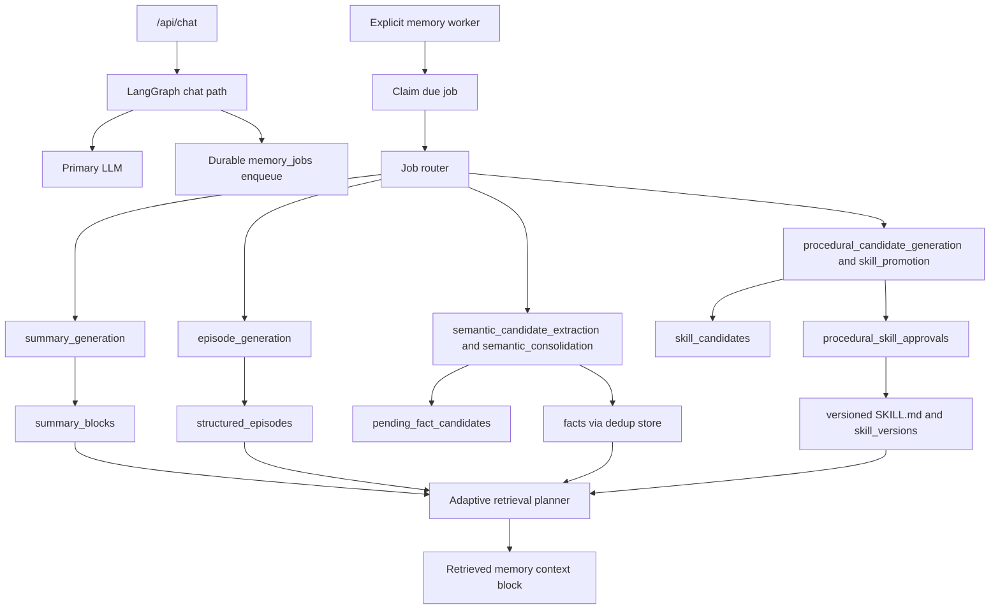

# Phase 11 Design: E2E Hardening and Documentation

## 1. Executive Summary

Phase 11 is the final stabilization phase for the completed memory architecture. It does not add new memory capabilities. It proves that the architecture implemented across Phases 1 through 10 works end to end, remains recoverable under failure, preserves public API compatibility, and is operable by developers and maintainers.

The phase focuses on:

- End-to-end regression coverage across chat, retrieval, queueing, workers, semantic memory, episodic memory, procedural skills, approvals, observability, startup, and frontend smoke paths.
- Documentation that explains the final architecture, operational workflows, failure recovery, testing strategy, and safe maintenance procedures.
- Small corrective fixes only when tests expose a documented production-readiness bug.
- Final filesystem and architecture wiring audits to ensure no phase accidentally regressed key invariants.

Phase 11 should be conservative. It should prefer tests, docs, deterministic validation helpers, and explicit runbooks over behavior changes. Any runtime code change must be justified by a failing hardening test or an observed mismatch with the approved architecture.

## 2. Scope

Phase 11 may include:

- New end-to-end and regression tests.
- New documentation and updates to existing setup, architecture, and operator docs.
- Test fixtures for realistic lifecycle scenarios.
- Read-only validation scripts if useful for local operator checks.
- Small bug fixes discovered by the Phase 11 test matrix.
- Optional documentation of legacy data backfill strategy.
- Optional non-mutating backfill dry-run design or validation tests.
- Final static scans and filesystem wiring checks.

Primary modules to analyze and verify:

- `src/harness/graph.py`
- `src/api/server.py`
- `src/startup.py`
- `src/memory/*`
- `src/hitl/*`
- `frontend/src/*`
- `docs/*`
- `tests/*`
- Existing README or setup docs.
- Current scripts and config files.

Likely new test files:

- `tests/test_phase11_e2e_chat_memory_pipeline.py`
- `tests/test_phase11_e2e_worker_lifecycle.py`
- `tests/test_phase11_e2e_semantic_lifecycle.py`
- `tests/test_phase11_e2e_episodic_lifecycle.py`
- `tests/test_phase11_e2e_procedural_lifecycle.py`
- `tests/test_phase11_e2e_approval_skill_promotion.py`
- `tests/test_phase11_e2e_observability_readonly.py`
- `tests/test_phase11_startup_config_validation.py`
- `tests/test_phase11_api_frontend_regression.py`
- `tests/test_phase11_architecture_wiring.py`

Likely documentation files to add or update:

- `docs/memory-architecture.md`
- `docs/operator-runbook.md`
- `docs/developer-testing.md`
- `docs/memory-failure-recovery.md`
- `docs/api-memory-observability.md`
- `docs/legacy-memory-backfill.md`
- `README.md` or existing setup docs, if present.

## 3. Out of Scope

Phase 11 must not implement:

- New memory features.
- New retrieval policies.
- New semantic, episodic, procedural, or summary behavior.
- New autonomous jobs.
- Automatic worker startup unless already supported by explicit configuration.
- Public debug metadata in `/api/chat`.
- Schema migrations unless a documented implementation blocker proves one is required.
- Core architecture rewrites.
- Retrieval behavior changes except documented bug fixes.
- Chat behavior changes except documented bug fixes.
- Frontend feature work beyond observability smoke and UX hardening.
- Automatic legacy data backfill.

Optional backfill work in this phase is documentation-first. If a script is later added, it must be opt-in, dry-run capable, reversible by backup, and independently reviewed.

## 4. Current System Assessment

The current codebase after Phase 10 contains the approved memory architecture foundations:

- Chat graph orchestration in `src/harness/graph.py`.
- Role-aware model routing in `src/harness/llm_router.py`.
- Durable memory job persistence in `src/memory/jobs.py` and `src/memory/job_repository.py`.
- Explicit worker execution in `src/memory/worker.py`, with no automatic chat-path consumption.
- Router and handler boundaries in `src/memory/job_router.py` and `src/memory/job_handlers.py`.
- Token budgeting primitives in `src/memory/token_budget.py`.
- Immutable summary blocks in `src/memory/summary_blocks.py`.
- Structured episode storage in `src/memory/episode_store.py`.
- Deterministic episode triggers and continuation in `src/memory/episode_detector.py` and `src/memory/episode_continuation.py`.
- Pending semantic candidates in `src/memory/semantic_candidates.py`.
- Dedup-aware permanent semantic writes in `src/memory/semantic_store.py`, `src/memory/semantic_dedup.py`, and `src/memory/embeddings.py`.
- Worker-only semantic consolidation in `src/memory/semantic_consolidation.py`.
- Versioned procedural skill files in `src/memory/skill_files.py` and `src/memory/skill_store.py`.
- Procedural candidates and deduplication in `src/memory/procedural_candidates.py` and `src/memory/procedural_dedup.py`.
- Procedural approval and skill promotion in `src/memory/skill_promotion.py`.
- Runtime skill reload snapshots in `src/memory/skill_reloader.py`.
- Read-only retrieval primitives in `src/memory/retrieval_types.py`, `src/memory/retrieval_ranker.py`, and `src/memory/retrieval_sources.py`.
- Adaptive retrieval planning and prompt assembly in `src/memory/retrieval_planner.py` and `src/memory/context_assembler.py`.
- Observability helpers in `src/memory/observability.py`.
- Additive observability API endpoints in `src/api/server.py`.
- Frontend Memory Ops observability in `frontend/src/components/MemoryObservabilityCockpit.jsx`.

Architecture invariants that Phase 11 must protect:

- Primary LLM is used for user-facing chat only.
- Secondary LLM is used only in worker/background memory handlers.
- Chat may enqueue durable memory jobs after successful turns but must not execute memory LLM work inline.
- Retrieval path must not write memory.
- Worker handlers must not auto-start in normal chat or API startup paths.
- Permanent semantic facts must pass through dedup-aware `SemanticFactStore.add_explicit_fact()`.
- LLM-extracted semantic facts must first land in `pending_fact_candidates`.
- Structured episodes must be written through `StructuredEpisodeRepository`.
- Generated procedural skills must be created only through approval and `SkillVersionStore`.
- User-authored skill files must never be overwritten.
- Observability APIs must be read-only and privacy-safe.
- Existing public API response shapes must remain unchanged.

## 5. End-to-End Test Matrix

| Scenario | Modules | Setup | Action | Expected result |
|---|---|---|---|---|
| Fresh startup | `startup.py`, `db.py`, `db_migrations.py`, skill dirs | Empty temp workspace and DB | Run initialization | DB reaches latest migration, required directories exist, `.agent/SKILL.md` is not overwritten |
| Existing DB startup | `db_migrations.py`, legacy tables | DB with legacy tables and sample rows | Run initialization twice | Migrations are idempotent, legacy rows remain readable |
| Successful chat enqueue | `graph.py`, `jobs.py`, `job_repository.py` | Temp DB, primary model stub | Execute successful chat turn | Chat returns normal shape, `memory_jobs` gets expected queued jobs, no secondary LLM call |
| HITL pending chat | `graph.py`, `hitl/*`, `jobs.py` | Tool/action requiring approval | Execute chat through HITL pending path | No memory jobs are enqueued for pending/rejected turns |
| Retrieval integration | `retrieval_gate.py`, `retrieval_planner.py`, `retrieval_sources.py`, `context_assembler.py`, `graph.py` | Seed summaries, facts, structured episodes, active skills | Ask memory-bearing query | Exactly one `[Retrieved Long-Term Memory]` block is appended, current user appears once, no memory writes |
| Retrieval skip | `retrieval_gate.py`, `graph.py` | Empty or seeded DB | Ask greeting or simple math query | Retrieval remains skipped and no memory context block is appended |
| Retrieval fallback | `graph.py`, legacy wrappers | Monkeypatch planner/retriever/assembler failure | Execute retrieval node | Legacy fallback is used, chat does not fail |
| Worker success | `worker.py`, `job_router.py`, `job_handlers.py`, repositories | Queue a due job with mocked secondary model where needed | Run `process_one_memory_job()` | Job transitions to `SUCCEEDED`, locks clear, result is persisted |
| Worker retry | `worker.py`, `job_repository.py` | Queue a job whose handler returns retryable failure | Run worker step | Job transitions to `RETRYING` with deterministic backoff |
| Worker dead letter | `worker.py`, `job_repository.py` | Queue job near retry limit | Run worker step until exhausted | Original job becomes `DEAD_LETTERED`, `dead_letter_jobs` row exists |
| Worker crash recovery | `job_repository.py`, `worker.py` | Stale `RUNNING` job | Run stale recovery | Job returns to retryable state without duplicate processing |
| Summary lifecycle | `summary_blocks.py`, `jobs.py`, `job_handlers.py`, `graph.py` | Long raw-turn history over threshold | Chat enqueues summary job, worker handles it | Immutable summary block is appended, raw turns remain preserved |
| Episode lifecycle | `episode_detector.py`, `episode_continuation.py`, `episode_store.py`, handlers | Trigger explicit remember/completion/trim signal | Enqueue and process episode job | Structured episode appended once, legacy episodes unaffected |
| Semantic candidate lifecycle | `semantic_candidates.py`, semantic handler | Queue semantic extraction job | Worker processes mocked LLM output | Pending candidates created, `facts` and `MEMORY.md` unchanged |
| Semantic consolidation | `semantic_consolidation.py`, `semantic_store.py`, `semantic_dedup.py` | Pending candidates and structured episodes | Worker processes consolidation job | Candidates transition safely, promoted facts pass through dedup store |
| Procedural candidate lifecycle | `procedural_candidates.py`, `procedural_dedup.py`, handlers | Structured episode completed | Worker runs procedural candidate handler | Candidate row created or dedup-updated, no skill file/version/approval created |
| Skill promotion approval | `skill_promotion.py`, `skill_store.py`, `hitl/*`, API | Candidate `READY_FOR_PROMOTION` | Worker requests approval, API approves | Candidate becomes `PROMOTED`, skill version and generated `SKILL.md` created only after approval |
| Skill rejection | `skill_promotion.py`, API | Candidate waiting for approval | API rejects approval | Candidate becomes `REJECTED`, no skill version or file is created |
| Skill reload | `skill_reloader.py`, `skill_store.py` | Active generated skills | Call reload helper | Snapshot updates and `times_loaded` increments; failure keeps previous snapshot |
| Observability health | `observability.py`, `server.py` | Seed statuses, dead letters, candidates | Call observability endpoints | Counts and statuses are correct, sensitive fields are redacted, no writes occur |
| Frontend smoke | `frontend/src/*` | Mock API responses | Render app and Memory Ops | Panels show health, empty, and error states; no write endpoints are called |
| Backup/restore audit | backup docs or helpers | DB and `.agent/skills` sample | Run documented validation or tests | New DB tables and generated skill files are included in documented backup scope |

## 6. Chat and Retrieval Hardening

Phase 11 should verify that chat remains stable after all memory integrations.

Required invariants:

- `/api/chat` request fields remain backward-compatible.
- `/api/chat` response fields remain backward-compatible.
- Primary LLM routing is used for user-facing chat.
- Secondary LLM resolution is not used inside `node_agent()`, `node_retrieval_gate()`, or chat title generation.
- A successful chat turn may enqueue durable memory jobs, but it must not synchronously execute memory handlers.
- Queue persistence failures must not break an already generated chat response.
- Current user message appears exactly once in graph state and final model input.
- Retrieved memory context, when present, is appended as exactly one system block.
- The retrieved memory block keeps the legacy header `[Retrieved Long-Term Memory]`.
- Simple greeting and simple math retrieval skips continue to work.
- Retrieval planning, retrieval sources, and context assembly do not write memory.
- Retrieval source failures are isolated; global planner/retriever/assembler failure falls back to legacy wrappers.
- Debug metadata is not exposed through `/api/chat`.

Hardening tests should cover:

- Normal chat with no memory available.
- Chat with semantic, episodic, procedural, and summary memory available.
- Chat with retrieval source-level failure.
- Chat with global retrieval planner failure.
- Chat with secondary LLM unavailable.
- Chat with memory job enqueue failure.
- Chat through HITL pending and rejected paths.
- Chat response shape snapshots for existing clients.

Implementation guidance:

- Do not modify `node_agent()`.
- Do not modify retrieval ranking unless a test exposes a documented bug.
- Do not add new state fields unless they are strictly internal and necessary for a bug fix.
- If a chat hardening test fails because of an existing incompatibility, first add the failing test, then apply the smallest fix.

## 7. Memory Job / Worker Hardening

Phase 11 should validate the durable worker architecture under realistic failure and recovery conditions.

Required invariants:

- Memory worker does not auto-start during normal app startup or chat request handling.
- `process_one_memory_job()` remains deterministic and testable.
- `run_memory_worker_loop()` runs only when explicitly invoked by a worker entrypoint or test.
- Job claiming selects due `QUEUED` and `RETRYING` jobs only.
- Job claiming respects priority and due timestamps.
- Running job locks are cleared on success and terminal failure.
- Retry backoff is deterministic under injected time.
- Exhausted failures move to `dead_letter_jobs` and mark original jobs `DEAD_LETTERED`.
- Worker heartbeat writes happen only in explicit worker paths.
- Stale running jobs can be recovered without duplicate permanent writes.
- Unknown and invalid jobs fail safely through retry/dead-letter behavior.

Hardening tests should cover:

- Mixed queue ordering across job types.
- Retry of worker-only handlers with mocked secondary unavailable.
- Dead-letter movement for semantic, episodic, summary, procedural, and promotion jobs.
- Stale recovery after a simulated crash while a candidate is `IN_CONSOLIDATION`.
- Idempotent reprocessing of already completed summary, episode, semantic consolidation, and skill promotion jobs.
- Queue observability after success, retry, stale recovery, and dead letter.

Recommended small cleanup if needed:

- Add docstrings or comments to worker entrypoints clarifying they are explicit-only.
- Add architecture wiring tests that scan startup paths for accidental worker loop calls.

## 8. Semantic Memory Lifecycle Hardening

Phase 11 should prove that explicit facts, implicit candidates, deduplication, embeddings, and consolidation work as one safe lifecycle.

Lifecycle to validate:

1. User chat produces a durable `semantic_candidate_extraction` job.
2. Worker-only semantic extraction creates pending candidates.
3. Pending candidates remain pending until consolidation explicitly claims them.
4. Semantic consolidation selects a bounded batch.
5. Secondary LLM output is parsed only inside the worker handler.
6. Promoted facts are written only through `SemanticFactStore.add_explicit_fact()`.
7. Phase 7B dedup decides `NEW`, `DUPLICATE`, `UPDATE`, or `MERGE`.
8. Embeddings are created or updated only for permanent semantic facts.
9. Dedup events are recorded for permanent write attempts.
10. `MEMORY.md` contains permanent facts only.
11. Candidate statuses transition safely to `PROMOTED`, `DISCARDED`, `DEFERRED`, `FAILED`, or back to `PENDING` on global failure.

Required invariants:

- LLM-extracted facts never directly write to `facts`.
- Candidate extraction never modifies `MEMORY.md`.
- Consolidation never inserts directly into `facts` or `semantic_embeddings`.
- Pending candidates are not bulk-cleared after failure.
- Permanent writes without existing facts produce `NEW` decisions.
- Duplicate and merge behavior does not create duplicate permanent facts.
- Retrieval reads semantic facts without creating embeddings or dedup events.

Hardening tests should cover:

- Explicit `/api/memory/fact` write path with dedup and `MEMORY.md` sync.
- Worker candidate extraction with valid, invalid, empty, and fenced JSON output.
- Consolidation partial success, partial failure, secondary unavailable, and invalid JSON recovery.
- Dedup event accounting for `NEW`, `DUPLICATE`, `UPDATE`, and `MERGE`.
- Retrieval after consolidation without write side effects.

## 9. Episodic Memory Lifecycle Hardening

Phase 11 should validate deterministic episode triggering and structured episode persistence without changing trigger behavior.

Lifecycle to validate:

1. Deterministic trigger detects explicit remember, trim, idle timeout, long conversation, task completed, or workflow finished reason.
2. Detector selects a bounded raw-turn source window.
3. Continuation logic determines `CREATE`, `UPDATE`, `MERGE`, or `SPLIT` deterministically.
4. `episode_generation` job payload carries deterministic action and source metadata.
5. Worker handler invokes secondary LLM only in the handler.
6. Handler ignores LLM-supplied action/trigger/parent fields.
7. Structured episode is appended through `StructuredEpisodeRepository` with `source_job_id` idempotency.
8. Legacy `episodes` FTS behavior remains unchanged.
9. Successful structured episode append may enqueue procedural candidate generation, but enqueue failure does not fail episode generation.

Required invariants:

- Detector and continuation never call LLMs.
- Chat path never calls secondary LLM for episodes.
- Structured episode writes do not backfill or modify legacy episodes.
- Reprocessing the same episode job does not duplicate structured episodes.
- Raw turns are preserved.

Hardening tests should cover:

- All trigger reasons and priority ordering.
- Source window exclusion of already covered spans.
- Continuation routing for conservative create/update/merge/split cases.
- Handler JSON parsing and validation failures.
- No writes to semantic, procedural, skill, or retrieval state from episode handler except the designed procedural job enqueue after successful append.
- API compatibility for `/api/memory/full` and data inspector behavior.

## 10. Procedural Skill Lifecycle Hardening

Phase 11 should validate the complete procedural path from structured episode to candidate, approval, generated skill version, reload snapshot, and usage stats.

Lifecycle to validate:

1. Structured episode append enqueues `procedural_candidate_generation` idempotently.
2. Worker-only candidate handler extracts one candidate or accepts `candidate:null`.
3. Candidate dedup uses deterministic shortlist and worker-only secondary classifier boundary.
4. Candidate store writes only to `skill_candidates` before approval.
5. Candidates reaching threshold become `READY_FOR_PROMOTION`.
6. `skill_promotion` job selects only `READY_FOR_PROMOTION` candidates.
7. Promotion handler creates durable HITL request and `procedural_skill_approvals` linkage.
8. Candidate moves to `WAITING_FOR_APPROVAL` only after durable request and link exist.
9. Approval finalization creates a generated skill only after approval.
10. `SkillVersionStore.create_version()` writes immutable generated `SKILL.md` under `.agent/skills/generated/<skill_id>/vNNNN/SKILL.md`.
11. Rejection creates no skill file or version.
12. Runtime reload updates process-local snapshot and records `times_loaded`.
13. Explicit usage helper records `times_used`, but chat retrieval does not increment usage yet.

Required invariants:

- No generated `SKILL.md` is created before approval.
- No `skill_versions` row is created before approval.
- User-authored skill files are never overwritten.
- Old generated versions are immutable.
- Rollback changes only active version pointers.
- `procedural_consolidation` remains no-op.
- Procedural retrieval reads active enabled versions only and does not record usage.

Hardening tests should cover:

- Candidate lifecycle through `READY_FOR_PROMOTION`, `WAITING_FOR_APPROVAL`, `PROMOTED`, and `REJECTED`.
- Illegal status transitions fail closed.
- Approval request creation failure leaves candidate `READY_FOR_PROMOTION`.
- Skill version creation failure leaves enough state for safe retry or documented repair.
- Reload failure keeps previous snapshot.
- Active skill API response shape remains compatible.
- Generated and user-authored skill namespace isolation.

## 11. Approval and HITL Hardening

Phase 11 should validate that procedural approvals integrate with the existing HITL system without disrupting non-procedural approval flows.

Required invariants:

- Existing approval request and decision API shapes remain unchanged.
- Non-procedural approval decisions preserve existing behavior.
- Procedural approval decisions are detected through `procedural_skill_approvals` linkage.
- Approval finalization is idempotent enough for retry after client/network failure.
- Approved procedural candidates must be `WAITING_FOR_APPROVAL` before promotion.
- Rejected procedural candidates must be `WAITING_FOR_APPROVAL` before rejection.
- Terminal `PROMOTED` and `REJECTED` candidates cannot be modified by Phase 8C paths.
- Approval records capture linked candidate, request, status, and created skill version when applicable.

Hardening tests should cover:

- Existing high-risk tool approval still works.
- Procedural approval request creation and linkage.
- Approval finalization after approval and rejection.
- Duplicate decision submission behavior.
- Missing linkage fallback to existing approval behavior.
- Candidate not found, wrong status, and skill version creation failure cases.

## 12. Observability Hardening

Phase 11 should validate that Phase 10 observability is useful, safe, and read-only.

Required invariants:

- `/api/memory/observability/health` reports required table presence and subsystem health.
- `/api/memory/observability/jobs` supports filters and redacts payloads by default.
- `/api/memory/observability/workers` handles no heartbeat, fresh heartbeat, and stale heartbeat states.
- `/api/memory/observability/dead-letter` summarizes failures without exposing raw payloads.
- `/api/memory/observability/retrieval/trace` is explicit, deterministic, and read-only.
- Retrieval trace uses Phase 9B planner/retriever/assembler without creating chat turns.
- Retrieval trace hides prompt block by default and redacts included prompt block previews.
- Semantic observability reads candidates, dedup events, and consolidation runs without mutating them.
- Procedural observability reads candidates and approvals without creating approvals or promotions.
- Skills observability reads versions and usage stats without calling reload or usage write helpers.
- Frontend panels call only observability endpoints and explicit trace endpoint.

Hardening tests should cover:

- Read-only snapshots before and after every observability endpoint call.
- Redaction of nested secrets, provider credentials, prompts, messages, rationale, scratchpad, reasoning, and chain-of-thought fields.
- Limit clamping and filter behavior.
- Retrieval trace no-write behavior across jobs, candidates, raw turns, embeddings, dedup events, and usage stats.
- Frontend empty, loading, and error states.
- Frontend does not call write endpoints.

## 13. Startup / Config / Environment Checks

Phase 11 should validate startup and configuration behavior across fresh and existing environments.

Required checks:

- Fresh startup creates DB schema through idempotent migrations.
- Existing DB startup preserves legacy tables and new architecture tables.
- Skill directories are created:
  - `.agent/skills/generated`
  - `.agent/skills/user`
- Existing `.agent/SKILL.md` is not overwritten.
- Compatibility skill index is created only when missing.
- Worker loops are not started by startup unless explicit worker entrypoint/config already does so.
- Missing secondary provider credentials do not break chat.
- Missing primary provider credentials preserve offline fallback behavior.
- Environment variables or config values are documented.
- Config validation reports actionable errors without exposing secrets.
- Test DB paths and workspace paths remain isolated.

Recommended documentation:

- Required Python version and install steps.
- Frontend install/build steps.
- Database path and migration behavior.
- Skill directory layout.
- Primary and secondary model configuration.
- Worker invocation examples.
- Observability endpoint examples.
- Backup and restore scope.

Optional validation helper:

- A read-only script such as `scripts/validate_memory_architecture.py` may be designed or added later if useful. It must not mutate DB state, enqueue jobs, run workers, or rewrite files.

## 14. Frontend Smoke and UX Hardening

Phase 11 should verify frontend stability without adding new product features.

Required invariants:

- Existing app routes and panels render.
- Memory Ops tab or observability component renders if wired in Phase 10.
- Observability panels show loading, empty, success, and error states.
- Retrieval trace panel only calls trace endpoint after explicit user action.
- Prompt block is hidden by default.
- No secrets or raw hidden reasoning are rendered.
- Frontend calls no write endpoints from observability panels.
- Existing API client expectations remain compatible.
- Production build succeeds.

Hardening checks:

- Component smoke tests using mocked fetch.
- CSS review for obvious overflow or unreadable observability tables.
- `npm run build`, if frontend tooling is available.
- Backend API tests for response shape consumed by frontend.

## 15. Documentation Plan

Phase 11 should create or update documentation that reflects the final architecture rather than phase-by-phase internals only.

### `docs/memory-architecture.md`

Purpose: canonical architecture overview.

Include:

- System goals and non-goals.
- Primary versus secondary LLM role separation.
- Chat path sequence.
- Durable memory job queue sequence.
- Worker router and handler boundaries.
- Short-term summaries and raw turn preservation.
- Structured episodic memory lifecycle.
- Semantic candidate, dedup, embedding, and consolidation lifecycle.
- Procedural candidate, approval, versioned skill, reload, and usage lifecycle.
- Retrieval planning and context assembly lifecycle.
- Observability boundaries.
- Schema overview and table ownership.
- Compatibility notes for legacy `episodes`, `facts`, `skills`, `raw_turns`, and `MEMORY.md`.

Suggested Mermaid diagram:



### `docs/operator-runbook.md`

Purpose: operational instructions.

Include:

- Starting backend and frontend.
- Initializing the system.
- Running the explicit memory worker.
- Checking health endpoints.
- Inspecting jobs, workers, and dead letters.
- Running retrieval trace safely.
- Handling secondary model outage.
- Recovering stale jobs.
- Reviewing pending semantic candidates and consolidation runs.
- Reviewing procedural candidates and approvals.
- Reloading skill snapshots safely.
- Backup and restore checklist.
- Incident response playbooks.

### `docs/developer-testing.md`

Purpose: test commands and fixture guidance.

Include:

- Focused phase test commands.
- Full suite command.
- Frontend build command.
- Test DB isolation pattern.
- Mocking primary and secondary LLM routes.
- Worker deterministic time injection.
- Approval lifecycle fixture pattern.
- Filesystem checks for skill files.
- Static scans for forbidden writes or LLM calls.

### `docs/api-memory-observability.md`

Purpose: operator-facing API reference for Phase 10 endpoints.

Include:

- Endpoint list.
- Query parameters and request bodies.
- Example responses with redacted values.
- Privacy and redaction rules.
- Read-only guarantees.
- How to interpret health states.

### `docs/memory-failure-recovery.md`

Purpose: failure-mode response guide.

Include:

- Queue retry and dead-letter handling.
- Stale worker recovery.
- Secondary LLM outage.
- Invalid LLM JSON output.
- Partial semantic consolidation failure.
- Approval linkage mismatch.
- Skill reload failure.
- Corrupt generated skill file.
- Retrieval source failure.
- DB locked/unavailable.

### `docs/legacy-memory-backfill.md`

Purpose: document optional backfill strategy without performing it automatically.

Include:

- Legacy table inventory.
- New architecture targets.
- What can be backfilled safely.
- What should remain legacy-only.
- Dry-run report format.
- Backup requirement before mutation.
- Reversibility expectations.
- Why automatic backfill is out of scope for Phase 11 implementation unless separately approved.

## 16. Operator Runbook Plan

The runbook should be procedural and copy-paste friendly while avoiding secrets.

Minimum operator workflows:

1. Start the API server.
2. Start the frontend dev server or production frontend.
3. Initialize a fresh workspace.
4. Run DB migrations explicitly if needed.
5. Run one memory worker step for diagnosis.
6. Run the continuous worker loop explicitly.
7. Check memory health.
8. Inspect queued, retrying, failed, and dead-letter jobs.
9. Inspect worker heartbeats and stale workers.
10. Run retrieval trace for a query.
11. Confirm no prompt block is exposed unless explicitly requested.
12. Review semantic candidates and consolidation runs.
13. Review procedural candidates and approvals.
14. Approve or reject procedural skill promotion.
15. Reload active skill snapshot.
16. Inspect skill usage stats.
17. Back up DB and `.agent/skills`.
18. Restore DB and `.agent/skills`.
19. Recover from secondary model outage.
20. Recover from worker crash.
21. Triage dead-letter jobs.
22. Disable or roll back a generated skill.

The runbook should clearly state which operations are read-only, which are existing admin writes, and which require backups.

## 17. Failure Recovery Plan

| Failure | Expected behavior | Recovery design | Tests |
|---|---|---|---|
| Secondary LLM unavailable | Chat still succeeds; worker jobs retry | Restore credentials/provider or let retries exhaust to dead letter | Chat with secondary unavailable, worker retry |
| Primary LLM unavailable | Offline fallback remains available | Operator fixes primary config | API/chat fallback regression |
| Worker crash mid-job | Job remains `RUNNING` until stale recovery | Run stale recovery before next worker pass | Stale recovery E2E |
| Dead-letter spike | Health becomes degraded | Inspect redacted dead letters, fix cause, optionally requeue by future admin process | Health degraded test |
| Invalid LLM JSON | Handler returns retryable failure; claimed candidates recover | Fix prompt/model issue and retry | Summary/episode/semantic/procedural handler invalid JSON tests |
| Semantic consolidation partial failure | Candidate-specific failures are isolated | Failed candidates remain inspectable; unreferenced become deferred or pending per design | Partial failure E2E |
| Dedup classifier invalid action | Permanent write fails closed | Review logs/events; no duplicate fact inserted | Dedup invalid action regression |
| Approval request created but linkage missing | Non-procedural fallback behavior remains | Manual DB inspection; no skill is promoted without link | Approval compatibility test |
| Skill version creation fails after approval | Candidate remains recoverable or failure documented | Fix file/DB issue and resume approved promotions | Resume approval hardening test |
| Skill reload fails | Previous snapshot remains active | Fix invalid generated skill file, reload again | Reload failure test |
| User-authored skill conflict | Generated writer refuses user path | Use generated namespace only | Skill file path validation |
| Retrieval source failure | Other sources still return; global failure falls back | Inspect retrieval trace errors | Source failure integration test |
| DB locked/unavailable | Chat response should not fail after response generation; worker retries or fails safely | Release lock, rerun worker, inspect health | DB locked simulation where feasible |
| Observability payload contains secrets | Values are redacted/truncated | Fix redaction rule before release | Nested redaction tests |

## 18. Regression Test Plan

Focused Phase 11 command:

```powershell
python -m pytest tests/test_phase11_e2e_chat_memory_pipeline.py tests/test_phase11_e2e_worker_lifecycle.py tests/test_phase11_e2e_semantic_lifecycle.py tests/test_phase11_e2e_episodic_lifecycle.py tests/test_phase11_e2e_procedural_lifecycle.py tests/test_phase11_e2e_approval_skill_promotion.py tests/test_phase11_e2e_observability_readonly.py tests/test_phase11_startup_config_validation.py tests/test_phase11_api_frontend_regression.py tests/test_phase11_architecture_wiring.py -q
```

Core memory regression command:

```powershell
python -m pytest tests/test_phase3a_memory_jobs.py tests/test_phase3a_graph_enqueue.py tests/test_phase3b_worker_repository.py tests/test_phase3b_worker_step.py tests/test_phase3b_router_handlers.py tests/test_phase5b_graph_short_term.py tests/test_phase5b_summary_job_handler.py tests/test_phase6b_episode_handler.py tests/test_phase7c_consolidation_handler.py tests/test_phase8c_skill_promotion_handler.py tests/test_phase9b_graph_retrieval_integration.py tests/test_phase10_memory_observability_api.py -q
```

API and frontend regression command:

```powershell
python -m pytest tests/test_api_server.py tests/test_frontend_api.py tests/test_p2_frontend_smoke.py tests/test_p3_frontend.py tests/test_phase10_frontend_observability.py -q
```

Retrieval regression command:

```powershell
python -m pytest tests/test_phase9a_retrieval_types.py tests/test_phase9a_retrieval_ranker.py tests/test_phase9a_retrieval_sources_bundle.py tests/test_phase9b_retrieval_planner.py tests/test_phase9b_context_assembler.py tests/test_phase9b_retrieval_fallback.py tests/test_phase9b_retrieval_budgeting.py -q
```

Semantic lifecycle regression command:

```powershell
python -m pytest tests/test_phase7a_semantic_store.py tests/test_phase7a_semantic_candidates.py tests/test_phase7a_semantic_handler.py tests/test_phase7b_embeddings.py tests/test_phase7b_semantic_dedup.py tests/test_phase7b_semantic_store_dedup.py tests/test_phase7c_consolidation_repository.py tests/test_phase7c_consolidation_recovery.py -q
```

Procedural lifecycle regression command:

```powershell
python -m pytest tests/test_phase8a_skill_files.py tests/test_phase8a_skill_store_versions.py tests/test_phase8a_procedural_compatibility.py tests/test_phase8b_procedural_candidates_store.py tests/test_phase8b_procedural_dedup.py tests/test_phase8b_procedural_handler.py tests/test_phase8c_approval_decisions.py tests/test_phase8c_skill_reload_usage.py -q
```

Final full-suite command:

```powershell
python -m pytest -q
```

Frontend build command, if frontend dependencies are installed:

```powershell
npm run build
```

Static architecture scan command:

```powershell
rg -n "resolve_secondary_llm|get_secondary_llm|\.invoke\(" src/harness/graph.py src/memory/retrieval_planner.py src/memory/context_assembler.py src/memory/retrieval_sources.py src/api/server.py
```

Static write scan command:

```powershell
rg -n "INSERT|UPDATE|DELETE|commit\(|enqueue_|create_version|create_approval_request|add_explicit_fact|record_used|reload_active_skills" src/memory/retrieval_planner.py src/memory/context_assembler.py src/memory/retrieval_sources.py src/memory/observability.py
```

Expected scan interpretation:

- Retrieval planner and context assembler should have no LLM calls and no writes.
- Retrieval sources should not create embeddings, update usage stats, or write memory.
- Observability helper should have no SQL writes and no mutating repository calls.
- `src/api/server.py` may contain existing write routes; Phase 11 should verify observability routes do not call mutating helpers.

## 19. Risks

Risk: Phase 11 grows into a feature phase.

Mitigation:

- Treat every code change as a bug fix requiring a failing test and a short justification.
- Keep new work centered on tests, docs, and read-only validation.

Risk: E2E tests become slow or flaky.

Mitigation:

- Use deterministic fake primary and secondary LLMs.
- Use temporary DBs and temp skill roots.
- Use injected timestamps for worker and stale recovery behavior.
- Avoid sleeps; simulate time with explicit `now` values.

Risk: Tests accidentally rely on implementation details too tightly.

Mitigation:

- Assert architecture invariants and public behavior first.
- Use direct module tests only for explicit repository or handler contracts.

Risk: Observability leaks sensitive information.

Mitigation:

- Add nested redaction tests for secrets, prompts, messages, rationale, scratchpad, reasoning, and chain-of-thought fields.
- Keep prompt block hidden by default in retrieval trace.

Risk: Optional backfill corrupts data.

Mitigation:

- Do not run automatic backfill in Phase 11.
- Document dry-run-first strategy and backup requirements.
- Keep legacy tables readable.

Risk: Skill file tests mutate user workspace state.

Mitigation:

- Use temp directories for `.agent/skills` tests.
- Assert user-authored file contents before and after operations.

Risk: Hidden worker auto-start slips into startup.

Mitigation:

- Add architecture wiring tests and static scans for worker loop calls from startup, API, and graph paths.

Risk: Final docs drift from code.

Mitigation:

- Include doc checks in Phase 11 review.
- Prefer concise architecture docs with links to code modules and operational commands.

## 20. Acceptance Criteria

Phase 11 is accepted when:

- End-to-end tests cover chat, retrieval, memory jobs, worker execution, summaries, episodes, semantic candidates, semantic consolidation, procedural candidates, skill promotion, approvals, observability, startup, and frontend smoke paths.
- Full memory lifecycle works from chat turn through queued background processing to retrieval-visible memory.
- Assistant remains responsive when secondary LLM is unavailable.
- Queue retry, dead-letter, heartbeat, and stale recovery behavior is validated.
- Retrieval remains deterministic, token-bounded, read-only, and backward-compatible.
- `/api/chat` response shape is unchanged.
- Existing API response shapes remain unchanged.
- Observability endpoints are read-only and privacy-safe.
- Frontend observability panels render without calling write endpoints.
- Startup initializes DB and skill directories without overwriting user-authored files.
- No worker auto-start is introduced.
- No schema migration is added unless a blocker is documented and reviewed.
- No new autonomous jobs are introduced.
- Generated skill files are never created before approval.
- User-authored skill files are never overwritten.
- Operational docs and runbooks exist and match current behavior.
- Backup and restore scope includes the SQLite DB and `.agent/skills` tree.
- Final static scans show no forbidden LLM calls, writes, or debug exposure in restricted paths.
- Full test suite passes, or any unrelated failure is clearly documented with evidence.

## 21. Implementation Checklist

1. Read this design, Phase 9B design, Phase 10 design, and the final roadmap before implementation.
2. Inventory current changed files with `git status --short`.
3. Add E2E fixtures for temp DB, temp skill root, fake primary LLM, fake secondary LLM, deterministic time, and API client.
4. Add chat memory pipeline E2E tests.
5. Add retrieval integration and fallback E2E tests.
6. Add worker lifecycle E2E tests for success, retry, dead letter, heartbeat, and stale recovery.
7. Add summary lifecycle E2E tests.
8. Add episodic lifecycle E2E tests.
9. Add semantic candidate, dedup, and consolidation lifecycle E2E tests.
10. Add procedural candidate, approval, skill version, reload, and usage lifecycle E2E tests.
11. Add observability read-only and redaction E2E tests.
12. Add startup/config validation tests.
13. Add API response compatibility snapshot tests where gaps remain.
14. Add frontend observability smoke tests if gaps remain.
15. Run focused tests and document failures.
16. For any failing architecture invariant, add the smallest bug fix needed.
17. Do not batch unrelated fixes with hardening tests.
18. Create or update `docs/memory-architecture.md`.
19. Create or update `docs/operator-runbook.md`.
20. Create or update `docs/developer-testing.md`.
21. Create or update `docs/api-memory-observability.md`.
22. Create or update `docs/memory-failure-recovery.md`.
23. Create or update `docs/legacy-memory-backfill.md` as documentation-only unless separately approved.
24. Update `README.md` or setup docs with links to the new docs.
25. Run full backend test suite.
26. Run frontend build and smoke tests when dependencies are available.
27. Run static architecture scans.
28. Run final filesystem wiring check.
29. Summarize all code changes, docs changes, tests, and any remaining risks.

## 22. Filesystem Wiring Check Required After Implementation

Before Phase 11 approval, verify actual filesystem state, not only the UI edited-files list.

Required checks:

- Run `git status --short` and list every changed file.
- Confirm most Phase 11 changes are tests and docs.
- If runtime code changed, confirm each change has a failing hardening test or documented bug rationale.
- Verify `src/harness/graph.py` has no unintended changes to `node_agent()` or chat response behavior.
- Verify `node_retrieval_gate()` still preserves greeting/math skip behavior and appends at most one retrieved memory block.
- Verify `src/api/server.py` keeps `/api/chat`, `/api/memory`, `/api/memory/full`, `/api/skills`, `/api/approvals`, `/api/data/*`, and `/api/models` response shapes unchanged.
- Verify observability routes remain additive and read-only.
- Verify `src/memory/observability.py` has no SQL writes and no mutating repository calls.
- Verify `src/memory/retrieval_planner.py`, `src/memory/context_assembler.py`, and `src/memory/retrieval_sources.py` have no LLM calls and no memory writes.
- Verify retrieval code does not call embedding upsert helpers, semantic dedup writes, `SemanticFactStore.add_explicit_fact()`, `SkillVersionStore.record_used()`, or `reload_active_skills()`.
- Verify worker/job modules were not changed except documented hardening bug fixes.
- Verify schema and migration files were not changed unless a blocker was documented and approved.
- Verify semantic, episodic, and procedural store modules were not changed except documented hardening bug fixes.
- Verify no new autonomous jobs were added.
- Verify no worker auto-start was added to startup, API, graph, or frontend paths.
- Verify generated skills remain under `.agent/skills/generated/<skill_id>/vNNNN/SKILL.md`.
- Verify user-authored skill files are not modified by tests or startup.
- Verify no raw prompts, hidden reasoning, scratchpads, chain-of-thought, secrets, API keys, provider credentials, tokens, or passwords are exposed in observability APIs or frontend.
- Verify docs reference current module names and commands.
- Verify all newly created docs use the final architecture terminology consistently.

Suggested commands:

```powershell
git status --short
rg -n "run_memory_worker_loop|process_one_memory_job" src/startup.py src/api/server.py src/harness/graph.py
rg -n "resolve_secondary_llm|get_secondary_llm|\.invoke\(" src/harness/graph.py src/memory/retrieval_planner.py src/memory/context_assembler.py src/memory/retrieval_sources.py src/api/server.py
rg -n "INSERT|UPDATE|DELETE|commit\(|enqueue_|create_version|create_approval_request|add_explicit_fact|record_used|reload_active_skills" src/memory/retrieval_planner.py src/memory/context_assembler.py src/memory/retrieval_sources.py src/memory/observability.py
rg -n "api_key|secret|token|authorization|password|credential|chain_of_thought|scratchpad|reasoning" src/api/server.py src/memory/observability.py frontend/src
python -m pytest -q
```

Expected outcome:

- Changed files are limited to Phase 11 tests, docs, and any narrowly justified bug fixes.
- No chat, retrieval, worker, schema, or memory write behavior changes are introduced without an explicit bug-fix rationale.
- All tests pass or unrelated failures are documented with evidence.
- Documentation and runbooks are sufficient for a maintainer to operate, diagnose, test, back up, and restore the completed memory architecture.
